---
# https://vitepress.dev/reference/default-theme-home-page
layout: home

hero:
  name: "Hiwonder Docs"
  text: "A VitePress Site"
  tagline: My great project tagline
  image:
    src: /WonderCom.png
    alt: 幻尔科技
  actions:
    - theme: brand
      text: Markdown Examples
      link: /markdown-examples
    - theme: alt
      text: API Examples
      link: /api-examples

features:
  - title: 专注内容
    details: 只需 Markdown 即可轻松创建美观的文档站点。
    icon:
      src: /qdee iot.png
  - title: Feature B
    details: Lorem ipsum dolor sit amet, consectetur adipiscing elit
    icon:
      src: /Tankbot-V1.5.png
  - title: Feature C
    details: Lorem ipsum dolor sit amet, consectetur adipiscing elit
    icon:
      src: /Wonderbit.png
---
<!-- //我现在想在这下面列出一个产品清单 -->

  <aside class="product-toc">
    <h2 style="margin-top: 0;">产品清单</h2>
    <ul>
      <li>
        <strong><a href="#raspberry-pi">Raspberry Pi</a></strong>
        <ul style="padding-left: 16px;">
          <li><a href="#raspberry-pi-robotics">Robotics</a></li>
          <li><a href="#raspberry-pi-board">Board</a></li>
        </ul>
      </li>
      <li>
        <strong><a href="#jetson-series">Jetson Series</a></strong>
        <ul style="padding-left: 16px;">
          <li><a href="#jetson-robotics">Robotics</a></li>
          <li><a href="#jetson-board">Board</a></li>
        </ul>
      </li>
      <li>
        <strong><a href="#esp32-arduino-series">ESP32 &amp; Arduino Series</a></strong>
        <ul style="padding-left: 16px;">
          <li><a href="#esp32-arduino-robotics">Robotics</a></li>
        </ul>
      </li>
      <li>
        <strong><a href="#microbit-series">microbit Series</a></strong>
        <ul style="padding-left: 16px;">
          <li><a href="#microbit-robotics">Robotics</a></li>
        </ul>
      </li>
      <li>
        <strong><a href="#scratch-series">Scratch Series</a></strong>
        <ul style="padding-left: 16px;">
          <li><a href="#scratch-robotics">Robotics</a></li>
        </ul>
      </li>
      <li>
        <strong><a href="#controller">Controller</a></strong>
        <ul style="padding-left: 16px;">
          <li><a href="#ros-controller">ROS Controller</a></li>
          <li><a href="#servo-controller">Servo Controller</a></li>
        </ul>
      </li>
      <li>
        <strong><a href="#accessories">Accessories</a></strong>
        <ul style="padding-left: 16px;">
          <li><a href="#vehicle-chassis">Vehicle Chassis</a></li>
          <li><a href="#camera-lidar">Camera/Lidar</a></li>
          <li><a href="#sensor">Sensor</a></li>
        </ul>
      </li>
    </ul>
  </aside>

  

<h1 id="raspberry-pi">Raspberry Pi</h1>

<h2 id="raspberry-pi-robotics">Robotics</h2>

    

        

            <a target="_blank" href="https://wiki.hiwonder.com/projects/ArmPi_mini/en/latest/" style="display: block; text-decoration: none;">
                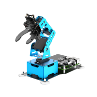
                

                    ArmPi mini
                

            </a>
        

        

            <a target="_blank" href="https://wiki.hiwonder.com/projects/uHandPi/en/latest/" style="display: block; text-decoration: none;">
                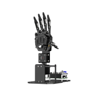
                

                    uHandPi
                

            </a>
        

        

            <a target="_blank" href="https://wiki.hiwonder.com/projects/TurboPi/en/advanced/" style="display: block; text-decoration: none;">
                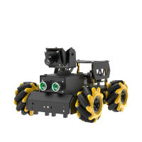
                

                    TurboPi
                

            </a>
        

        

            <a target="_blank" href="https://wiki.hiwonder.com/projects/MasterPi/en/latest/" style="display: block; text-decoration: none;">
                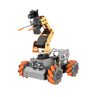
                

                    MasterPi
                

            </a>
        

        

            <a target="_blank" href="https://wiki.hiwonder.com/projects/ArmPi_FPV/en/latest/" style="display: block; text-decoration: none;">
                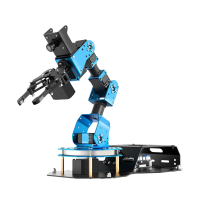
                

                    ArmPi FPV
                

            </a>
        

        

            <a target="_blank" href="https://wiki.hiwonder.com/projects/ArmPi_Pro/en/latest/" style="display: block; text-decoration: none;">
                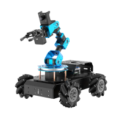
                

                    ArmPi Pro
                

            </a>
        

        

            <a target="_blank" href="https://wiki.hiwonder.com/projects/MentorPi-T1/en/latest/" style="display: block; text-decoration: none;">
                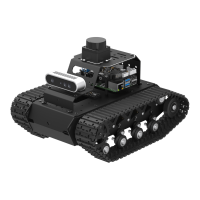
                

                    MentorPi T1
                

            </a>
        

        

            <a target="_blank" href="https://wiki.hiwonder.com/projects/MentorPi/en/latest/" style="display: block; text-decoration: none;">
                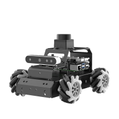
                

                    MentorPi M1 & A1
                

            </a>
        

        

            <a target="_blank" href="https://wiki.hiwonder.com/projects/SpiderPi/en/latest/" style="display: block; text-decoration: none;">
                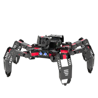
                

                    SpiderPi
                

            </a>
        

        

            <a target="_blank" href="https://wiki.hiwonder.com/projects/SpiderPi_Pro/en/latest/" style="display: block; text-decoration: none;">
                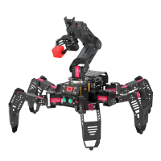
                

                    SpiderPi Pro
                

            </a>
        

        

            <a target="_blank" href="https://wiki.hiwonder.com/projects/TonyPi_Pro/en/latest/" style="display: block; text-decoration: none;">
                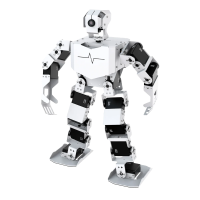
                

                    TonyPi & TonyPi Pro
                

            </a>
        

        

            <a target="_blank" href="https://wiki.hiwonder.com/projects/PuppyPi/en/latest/" style="display: block; text-decoration: none;">
                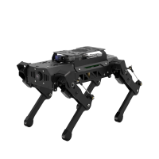
                

                    PuppyPi
                

            </a>
        

        

            <a target="_blank" href="https://wiki.hiwonder.com/projects/LanderPi/en/latest/" style="display: block; text-decoration: none;">
                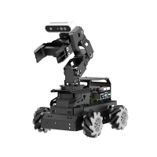
                

                    LanderPi
                

            </a>
        

        

            <a target="_blank" href="https://wiki.hiwonder.com/projects/ArmPi-Ultra/en/latest/" style="display: block; text-decoration: none;">
                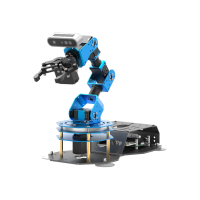
                

                    ArmPi Ultra
                

            </a>
        

    

<h2 id="raspberry-pi-board">Board</h2>

    

        

            <a target="_blank" href="https://wiki.hiwonder.com/projects/Raspberry-Pi-5-Controller/en/latest/" style="display: block; text-decoration: none;">
                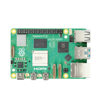
                

                    Raspberry Pi 5
                

            </a>
        

        

            <a target="_blank" href="https://wiki.hiwonder.com/projects/Raspberry-Pi-5-Expansion-Board/en/latest/" style="display: block; text-decoration: none;">
                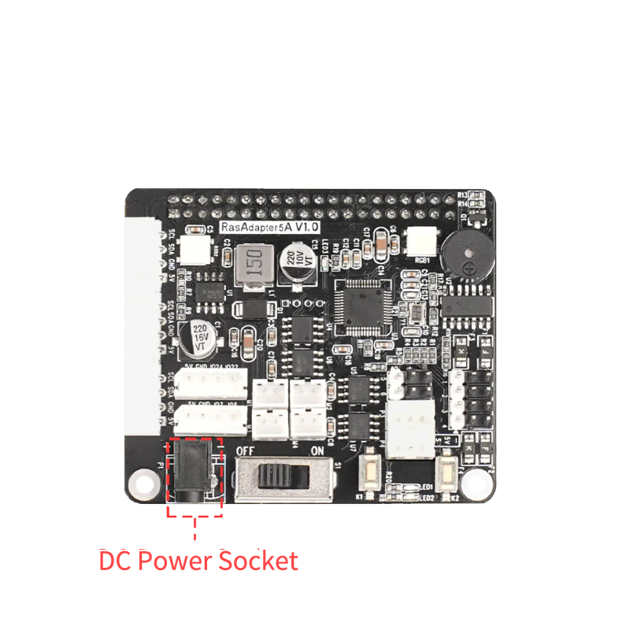
                

                    Raspberry Pi 5 Expansion Board
                

            </a>
        

    

---

<h1 id="jetson-series">Jetson Series</h1>

<h2 id="jetson-robotics">Robotics</h2>

    

        

            <a target="_blank" href="https://wiki.hiwonder.com/projects/ROSPug/en/latest/" style="display: block; text-decoration: none;">
                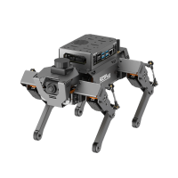
                

                    ROSPug
                

            </a>
        

        

            <a target="_blank" href="https://wiki.hiwonder.com/projects/JetAuto/en/jetauto-orin-nano/" style="display: block; text-decoration: none;">
                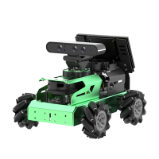
                

                    JetAuto & JetAuto Pro
                

            </a>
        

        

            <a target="_blank" href="https://wiki.hiwonder.com/projects/JetAcker/en/jetacker-orin-nano/" style="display: block; text-decoration: none;">
                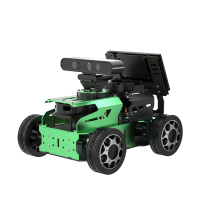
                

                    JetAcker
                

            </a>
        

        

            <a target="_blank" href="https://wiki.hiwonder.com/projects/JetArm/en/jetarm-orin-nano/" style="display: block; text-decoration: none;">
                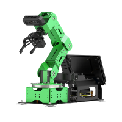
                

                    JetArm & JetArm Pro
                

            </a>
        

        

            <a target="_blank" href="https://wiki.hiwonder.com/projects/JetRover/en/jetson-orin-nano/" style="display: block; text-decoration: none;">
                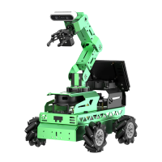
                

                    JetRover
                

            </a>
        

    

<h2 id="jetson-board">Board</h2>

    

        

            <a target="_blank" href="https://wiki.hiwonder.com/projects/Jetson-Orin-Nano/en/latest/" style="display: block; text-decoration: none;">
                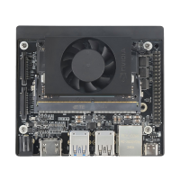
                

                    Jetson Orin Nano
                

            </a>
        

    

---

<h1 id="esp32-arduino-series">ESP32 &amp; Arduino Series</h1>

<h2 id="esp32-arduino-robotics">Robotics</h2>

    

        

            <a target="_blank" href="https://wiki.hiwonder.com/projects/H5S/en/latest/" style="display: block; text-decoration: none;">
                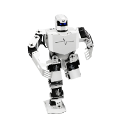
                

                    H5S
                

            </a>
        

        

            <a target="_blank" href="https://wiki.hiwonder.com/projects/MaxArm/en/latest/" style="display: block; text-decoration: none;">
                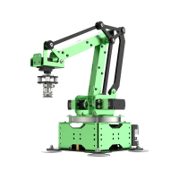
                

                    MaxArm
                

            </a>
        

        

            <a target="_blank" href="https://wiki.hiwonder.com/projects/uHand_UNO/en/latest/" style="display: block; text-decoration: none;">
                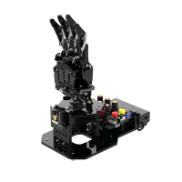
                

                    uHand UNO
                

            </a>
        

        

            <a target="_blank" href="https://wiki.hiwonder.com/projects/miniAuto/en/latest/" style="display: block; text-decoration: none;">
                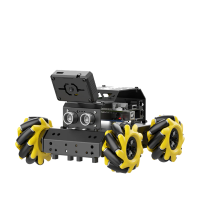
                

                    miniAuto
                

            </a>
        

        

            <a target="_blank" href="https://wiki.hiwonder.com/projects/miniArm/en/latest/" style="display: block; text-decoration: none;">
                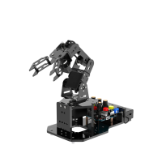
                

                    miniArm
                

            </a>
        

        

            <a target="_blank" href="https://wiki.hiwonder.com/projects/miniHexa/en/latest/" style="display: block; text-decoration: none;">
                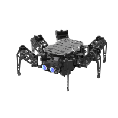
                

                    miniHexa
                

            </a>
        

        

            <a target="_blank" href="https://wiki.hiwonder.com/projects/Spiderbot/en/latest/" style="display: block; text-decoration: none;">
                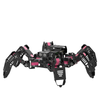
                

                    Spiderbot
                

            </a>
        

        

            <a target="_blank" href="https://wiki.hiwonder.com/projects/Tonybot/en/latest/" style="display: block; text-decoration: none;">
                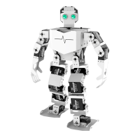
                

                    Tonybot
                

            </a>
        

        

            <a target="_blank" href="https://wiki.hiwonder.com/projects/MechDog/en/latest/" style="display: block; text-decoration: none;">
                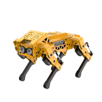
                

                    MechDog & MechDog Pro
                

            </a>
        

        

            <a target="_blank" href="https://wiki.hiwonder.com/projects/LeArm_AI/en/latest/" style="display: block; text-decoration: none;">
                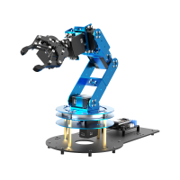
                

                    LeArm AI
                

            </a>
        

    

---

<h1 id="microbit-series">microbit Series</h1>

<h2 id="microbit-robotics">Robotics</h2>

    

        

            <a target="_blank" href="https://wiki.hiwonder.com/projects/Nexbit/en/latest/" style="display: block; text-decoration: none;">
                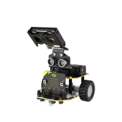
                

                    Nexbit
                

            </a>
        

        

            <a target="_blank" href="https://wiki.hiwonder.com/projects/AiHand/en/latest/" style="display: block; text-decoration: none;">
                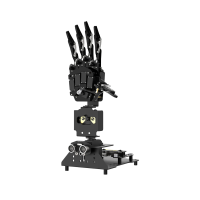
                

                    AiHand
                

            </a>
        

        

            <a target="_blank" href="https://wiki.hiwonder.com/projects/IoT_Smart_House/en/latest/" style="display: block; text-decoration: none;">
                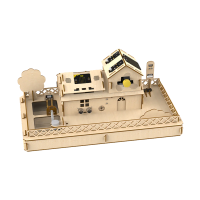
                

                    IoT Smart House
                

            </a>
        

        

            <a target="_blank" href="https://wiki.hiwonder.com/projects/Qtruck/en/latest/" style="display: block; text-decoration: none;">
                
                

                    Qtruck
                

            </a>
        

    

---

<h1 id="scratch-series">Scratch Series</h1>

<h2 id="scratch-robotics">Robotics</h2>

    

        

            <a target="_blank" href="https://wiki.hiwonder.com/projects/AiNova/en/latest/" style="display: block; text-decoration: none;">
                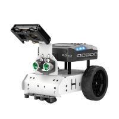
                

                    AiNova
                

            </a>
        

    

---

<h1 id="controller">Controller</h1>

<h2 id="ros-controller">ROS Controller</h2>

    

        

            <a target="_blank" href="https://wiki.hiwonder.com/projects/Raspberry-Pi-5-Controller/en/latest/" style="display: block; text-decoration: none;">
                
                

                    Raspberry Pi 5
                

            </a>
        

        

            <a target="_blank" href="https://wiki.hiwonder.com/projects/Raspberry-Pi-5-Expansion-Board/en/latest/" style="display: block; text-decoration: none;">
                
                

                    Raspberry Pi 5 Expansion Board
                

            </a>
        

        

            <a target="_blank" href="https://wiki.hiwonder.com/projects/ROS-Robot-Control-Board/en/latest/" style="display: block; text-decoration: none;">
                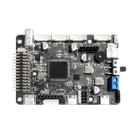
                

                    ROS Robot Control Board
                

            </a>
        

        

            <a target="_blank" href="https://wiki.hiwonder.com/projects/Jetson-Orin-Nano/en/latest/" style="display: block; text-decoration: none;">
                
                

                    Jetson Orin Nano
                

            </a>
        

    

<h2 id="servo-controller">Servo Controller</h2>

    

        

            <a target="_blank" href="https://wiki.hiwonder.com/projects/6-Channel-Servo-Tester/en/latest/" style="display: block; text-decoration: none;">
                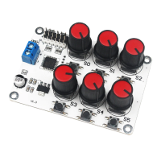
                

                    6 Channel Servo Tester
                

            </a>
        

        

            <a target="_blank" href="https://wiki.hiwonder.com/projects/16-Channel-Servo-Controller/en/latest/" style="display: block; text-decoration: none;">
                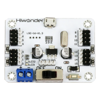
                

                    16 Channel Servo Controller
                

            </a>
        

        

            <a target="_blank" href="https://wiki.hiwonder.com/projects/24-Channel-Servo-Controller/en/latest/" style="display: block; text-decoration: none;">
                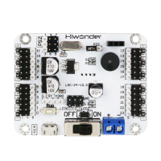
                

                    24 Channel Servo Controller
                

            </a>
        

        

            <a target="_blank" href="https://wiki.hiwonder.com/projects/32-Channel-Servo-Controller/en/latest/" style="display: block; text-decoration: none;">
                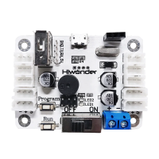
                

                    32 Channel Servo Controller
                

            </a>
        

    

---

<h1 id="accessories">Accessories</h1>

<h2 id="vehicle-chassis">Vehicle Chassis</h2>

    

        

            <a target="_blank" href="https://wiki.hiwonder.com/projects/Black-Mecanum-Wheel-Chassis/en/latest/" style="display: block; text-decoration: none;">
                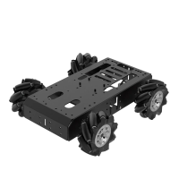
                

                    Black Mecanum-Wheel Chassis
                

            </a>
        

        

            <a target="_blank" href="https://wiki.hiwonder.com/projects/Ackermann-Chassis/en/latest/" style="display: block; text-decoration: none;">
                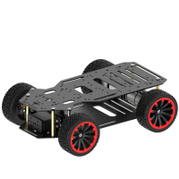
                

                    Ackerman Chassis
                

            </a>
        

    

<h2 id="camera-lidar">Camera/Lidar</h2>

    

        

            <a target="_blank" href="https://wiki.hiwonder.com/projects/WonderMV/en/latest/" style="display: block; text-decoration: none;">
                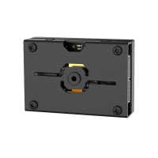
                

                    WonderMV
                

            </a>
        

        

            <a target="_blank" href="https://wiki.hiwonder.com/projects/ESP32-S3/en/latest/index.html" style="display: block; text-decoration: none;">
                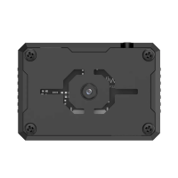
                

                    ESP32-S3
                

            </a>
        

        

            <a target="_blank" href="https://wiki.hiwonder.com/projects/CanMV-K230/en/latest/" style="display: block; text-decoration: none;">
                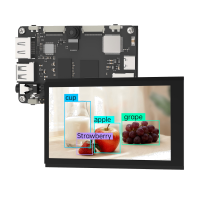
                

                    CanMV K230
                

            </a>
        

        

            <a target="_blank" href="https://wiki.hiwonder.com/projects/Aurora930-Pro/en/latest/" style="display: block; text-decoration: none;">
                
                

                    Aurora930 Pro
                

            </a>
        

    

<h2 id="sensor">Sensor</h2>

    

        

            <a target="_blank" href="https://wiki.hiwonder.com/projects/WonderEcho/en/latest/" style="display: block; text-decoration: none;">
                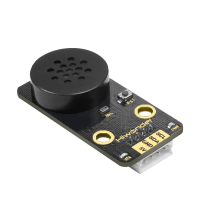
                

                    WonderEcho
                

            </a>
        

        

            <a target="_blank" href="https://wiki.hiwonder.com/projects/8-ch-Line-Follower/en/latest/" style="display: block; text-decoration: none;">
                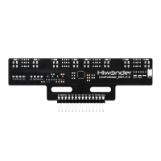
                

                    8-Channel IR Line Follower Sensor
                

            </a>
        

        

            <a target="_blank" href="https://wiki.hiwonder.com/projects/IMU-Module/en/latest/" style="display: block; text-decoration: none;">
                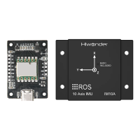
                

                    IMU Module
                

            </a>
        

        

            <a target="_blank" href="https://wiki.hiwonder.com/projects/GPS-Module/en/latest/" style="display: block; text-decoration: none;">
                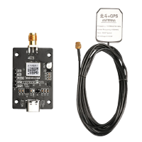
                

                    GPS Module
                

            </a>
        

        

            <a target="_blank" href="https://wiki.hiwonder.com/projects/Raindrop-Sensor/en/latest/" style="display: block; text-decoration: none;">
                
                

                    Raindrop Sensor
                

            </a>
        

        

            <a target="_blank" href="https://wiki.hiwonder.com/projects/Qdee-Ultrasonic-Sensor/en/latest/" style="display: block; text-decoration: none;">
                
                

                    Qdee Ultrasonic Sensor
                

            </a>
        

        

            <a target="_blank" href="https://wiki.hiwonder.com/projects/Acceleration-Sensor/en/latest/" style="display: block; text-decoration: none;">
                
                

                    Acceleration Sensor
                

            </a>
        

        

            <a target="_blank" href="https://wiki.hiwonder.com/projects/Glowing-Ultrasonic-Sensor/en/latest/" style="display: block; text-decoration: none;">
                
                

                    Glowing Ultrasonic Sensor
                

            </a>
        

        

            <a target="_blank" href="https://wiki.hiwonder.com/projects/Color-Sensor/en/latest/" style="display: block; text-decoration: none;">
                
                

                    Color Sensor
                

            </a>
        

        

            <a target="_blank" href="https://wiki.hiwonder.com/projects/Sound-Sensor/en/latest/" style="display: block; text-decoration: none;">
                
                

                    Sound Sensor
                

            </a>
        

        

            <a target="_blank" href="https://wiki.hiwonder.com/projects/Touch-Sensor/en/latest/" style="display: block; text-decoration: none;">
                
                

                    Touch Sensor
                

            </a>
        

        

            <a target="_blank" href="https://wiki.hiwonder.com/projects/Digital-Tube-Module/en/latest/" style="display: block; text-decoration: none;">
                
                

                    Digital Tube Module
                

            </a>
        

        

            <a target="_blank" href="https://wiki.hiwonder.com/projects/Fan-Module-White/en/latest/" style="display: block; text-decoration: none;">
                
                

                    Fan Module (White)
                

            </a>
        
        
        

            <a target="_blank" href="https://wiki.hiwonder.com/projects/Light-Sensor-White/en/latest/" style="display: block; text-decoration: none;">
                
                

                    Light Sensor (White)
                

            </a>
        

        

            <a target="_blank" href="https://wiki.hiwonder.com/projects/LED-Dot-Matrix-Sensor/en/latest/" style="display: block; text-decoration: none;">
                
                

                    LED Dot Matrix Sensor
                

            </a>
        

        

            <a target="_blank" href="https://wiki.hiwonder.com/projects/Knob-Module/en/latest/" style="display: block; text-decoration: none;">
                
                

                    Knob Module
                

            </a>
        

        

            <a target="_blank" href="https://wiki.hiwonder.com/projects/MP3-Module/en/latest/" style="display: block; text-decoration: none;">
                
                

                    MP3 Module
                

            </a>
        

        

            <a target="_blank" href="https://wiki.hiwonder.com/projects/OLED-Display-Module/en/latest/" style="display: block; text-decoration: none;">
                
                

                    OLED Display Module
                

            </a>
        

        

            <a target="_blank" href="https://wiki.hiwonder.com/projects/Infrared-Obstacle-Avoidance-Sensor/en/latest/" style="display: block; text-decoration: none;">
                
                

                    Infrared Obstacle Avoidance Sensor
                

            </a>
        

        

            <a target="_blank" href="https://wiki.hiwonder.com/projects/RGB-Module/en/latest/" style="display: block; text-decoration: none;">
                
                

                    RGB Module
                

            </a>
        

        

            <a target="_blank" href="https://wiki.hiwonder.com/projects/Soil-Sensor/en/latest/" style="display: block; text-decoration: none;">
                
                

                    Soil Sensor
                

            </a>
        

        

            <a target="_blank" href="https://wiki.hiwonder.com/projects/Ultrasonic-Module-White/en/latest/" style="display: block; text-decoration: none;">
                
                

                    Ultrasonic Module (White)
                

            </a>
        

        

            <a target="_blank" href="https://wiki.hiwonder.com/projects/Ultrasonic-Sensor-Black/en/latest/" style="display: block; text-decoration: none;">
                
                

                    Ultrasonic Sensor (Black)
                

            </a>
        

        

            <a target="_blank" href="https://wiki.hiwonder.com/projects/Water-Pump/en/latest/" style="display: block; text-decoration: none;">
                
                

                    Water Pump
                

            </a>
        

    

  

