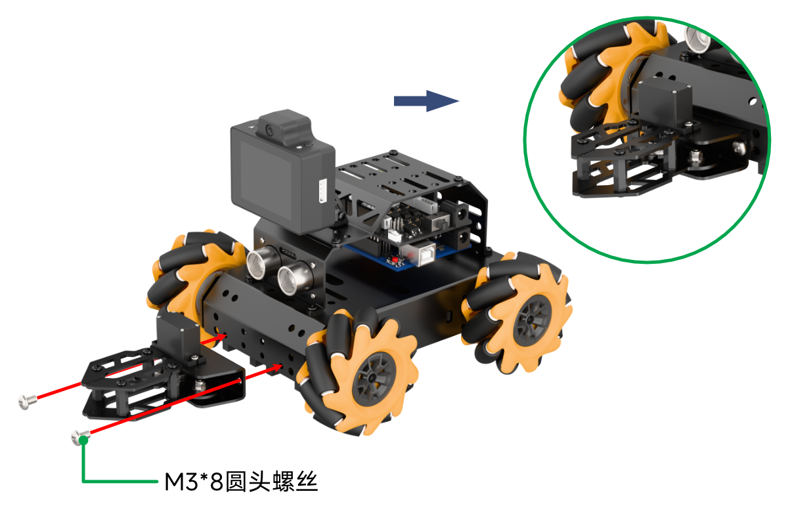
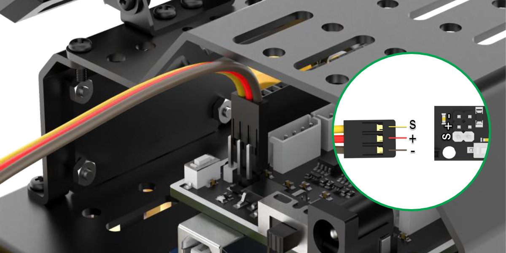
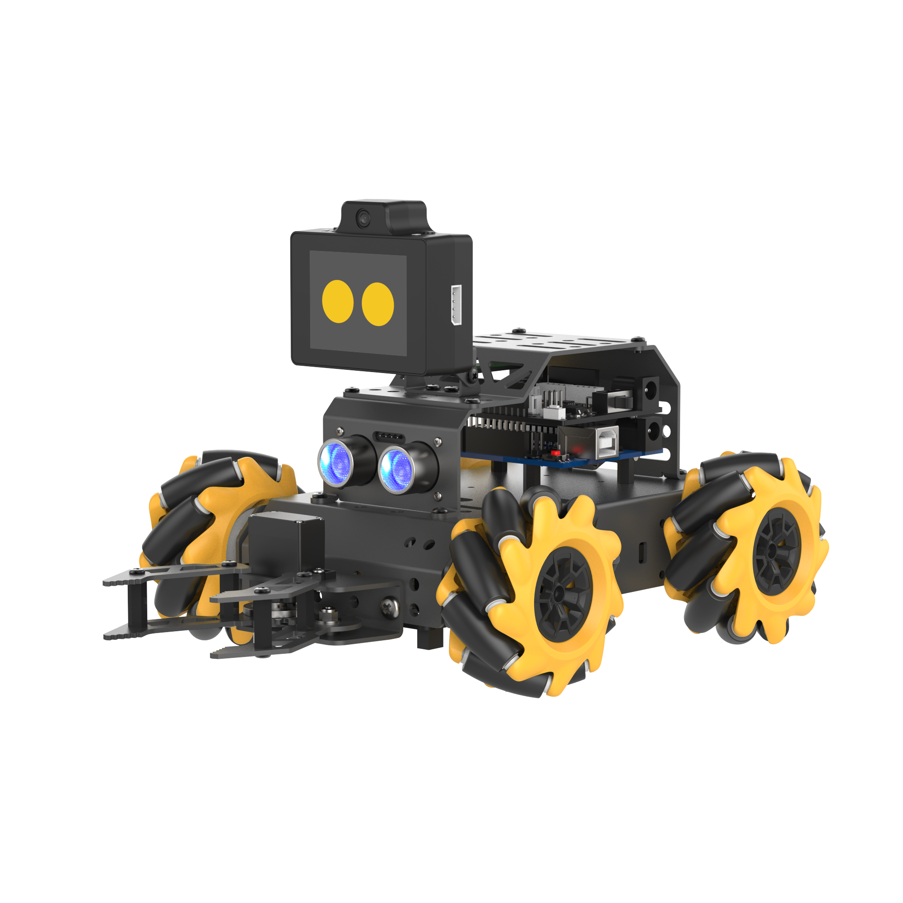
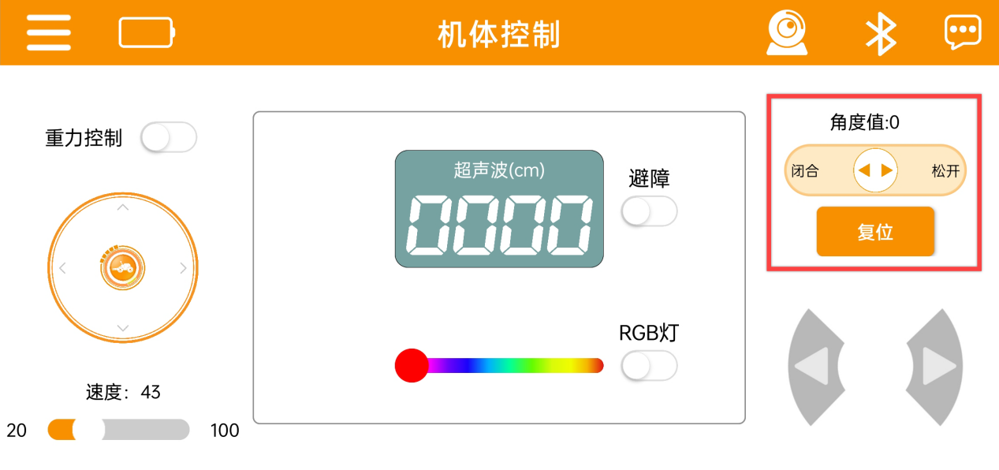
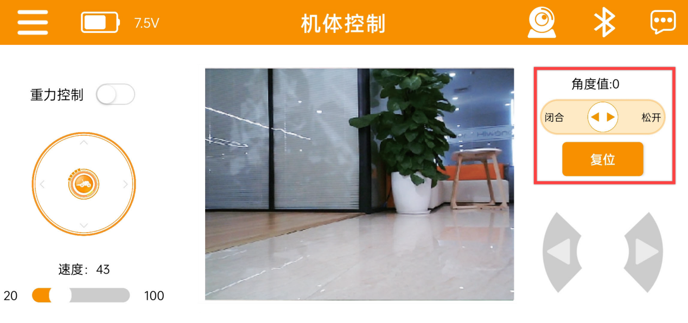
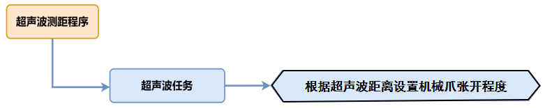
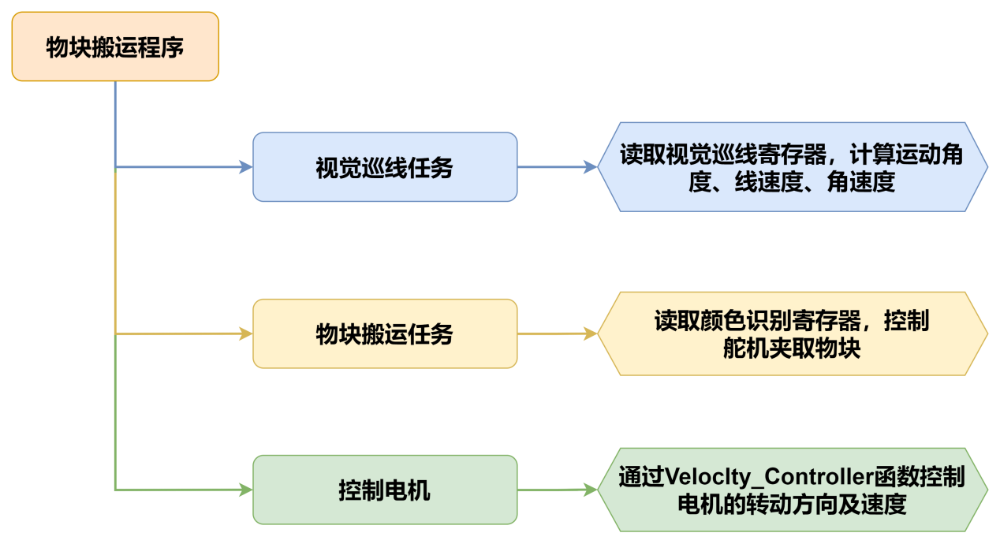
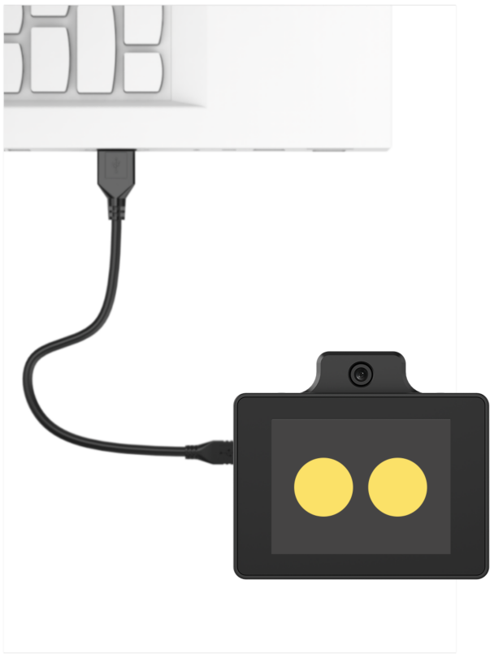
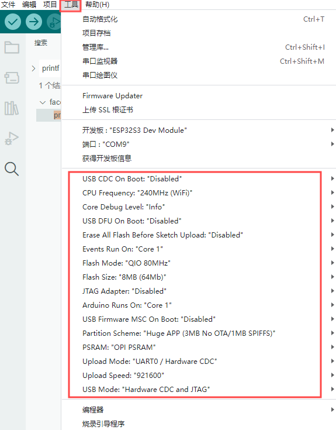
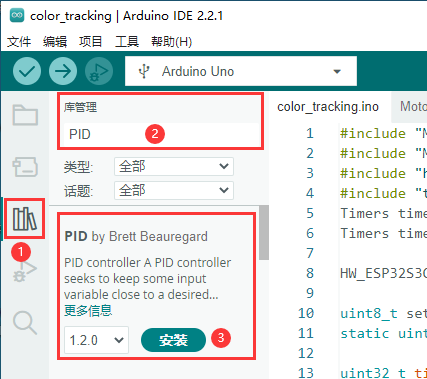

# 10. 机械爪扩展项目

## 10.1 miniAuto AI机械爪组装教程

<p class="step">Step1</p>



<p class="step">接线图</p>



<p class="step">组装效果图</p>



## 10.2 机械爪APP控制说明

**请参照“4.APP使用说明”安装手机APP，并连接miniAuto。**

1)  设备与APP连接成功后，可通过界面右侧的舵机控制按钮，控制机械爪的开、合。

    

2)  其图标说明如下所示：

<table>
<colgroup>
<col style="width: 50%" />
<col style="width: 50%" />
</colgroup>
<tbody>
<tr>
<td style="text-align: center;">图标</td>
<td style="text-align: center;">功能描述</td>
</tr>
<tr>
<td style="text-align: center;"></td>
<td style="text-align: center;">控制机械爪开合<br />
（角度范围：0~60°，0°闭合、60°张开）</td>
</tr>
<tr>
<td style="text-align: center;"></td>
<td style="text-align: center;">控制机械爪回归初始姿态（0°）</td>
</tr>
</tbody>
</table>


3)  同理，图传界面下的机械爪控制与此相同（图传界面的进入可参考“**2.手机APP遥控**”内容）



若无法实现上述功能，请参照机械爪组装教程重新组装。

## 10.3 声波控爪开合说明

本节通过发光超声波模块检测障碍物距离，同时控制机械爪张开闭合。

### 10.3.1 实现流程图



### 10.3.2 超声波传感器


本节课用的是可发光的超声波测距模块，模块采用 IIC 通信接口，能通过 IIC通信进行读取超声波传感器测量的距离。

传感器测距时模块会自动发送 8 个 40khz 的方波，然后检测是否有信号返回； 如果有信号返回，便输出一个高电平，高电平持续的时间就是超声波从发射到返回的时间。

具体公式为：测试距离=(高电平时间\*声速(340M/S))/2。

### 10.3.3 程序下载

> [!NOTE]
>
> - **下载程序前需先将蓝牙模块取下，否则会因串口冲突导致程序下载失败。**
>
> - **接入Type-B下载线时请将电池盒开关拨到“OFF”挡，避免下载线误碰到扩展板的电源引脚，造成短路。**
>

1)  找到并打开本节同目录下的**“02 程序文件\声波控爪开合程序\ultrasonic_claw\ultrasonic_claw.ino”**程序文件。

    

    将Arduino通过UNO数据线（Type-B）连接至电脑。点击**“选择开发板”**选项，软件会自动检测当前Arduino串口，点击进行连接。

    

2)  点击，将程序下载至Arduino中，等待下载完成即可。

    


### 10.3.4 实现效果

打开小车电源后，小车上的发光超声波模块会根据所测障碍物的距离，控制舵机转动角度，舵机搭载在miniAuto机械爪上，舵机的转动会带动机械爪实现张开闭合的效果。

### 10.3.5 程序简要分析

* **导入库文件**

```cpp
#include "Ultrasound.h"
#include <Servo.h>
```

导入本玩法所需要的控制发光超声波的自定义库文件以及舵机控制库文件。

* **定义变量及创建对象**

首先创建了一个超声波类对象用于获取距离数据、舵机对象用于控制机械爪，定义了舵机、蜂鸣器连接到arduino主控上的引脚信息。之后定义了舵机运动角度、测距距离。

```cpp
Servo myServo;
Ultrasound ultrasound;            ///< 实例化超声波类
const static uint8_t servoPin = 5;
const static uint8_t buzzerPin = 3;

int angle = 90;
uint16_t distance = 0;
uint32_t previousTime = 0;
```

* **初始化设置**

在`setup()`函数中，主要是串口进行初始化，将其通信的波特率设置为9600。随后初始化舵机的连接，将angle的取值作为舵机的转动角度参数传给舵机，舵机转动，带动机械爪闭合。

```cpp
void setup() {
  // put your setup code here, to run once:
  Serial.begin(9600);
  myServo.attach(servoPin);
  myServo.write(angle);
}
```

* **主函数**

在主函数中循环调用超声波任务函数，用于实现“超声波检测”中的功能。

```cpp
void loop() {
  // put your main code here, to run repeatedly:
  ultrasonic_distance();
  Servo_control();
}
```

接着调用舵机控制函数`Servo_control()`。

* **超声波检测**

1. `ultrasonic_distance()`函数，它是用于实现测距并改变灯光的颜色。

```cpp
void ultrasonic_distance(){
  uint8_t s;
  distance = ultrasound.Filter();                                           ///< 获得滤波器输出值
  Serial.print("Distance: ");Serial.print(distance);Serial.println(" mm");///< 获取并且串口打印距离，单位mm

```

2. 距离大于0且小于等于80mm时，发光超声波为呼吸灯模式，以0.1s的速度显示红色。

```cpp
  if (distance > 0 && distance <= 80){
      ultrasound.Breathing(1, 0, 0, 1, 0, 0);                             ///< 呼吸灯模式，周期0.1s，颜色红色
  }
   
```

3. 当距离大于80mm且小于180mm时，发光超声波为红色灯光渐变显示，距离越大则颜色越淡。

```cpp
  else if (distance > 80 && distance <= 180){
      s = map(distance,80,180,0,255);
      ultrasound.Color((255-s), 0, 0, (255-s), 0, 0);                     ///< 红色渐变
  }
```

4. 当距离大于180mm且小于320mm时，发光超声波为蓝色灯光渐变显示，距离越大则颜色越蓝。

```cpp
   else if (distance > 180 && distance <= 320){
      s = map(distance,180,320,0,255);
      ultrasound.Color(0, 0, s, 0, 0, s);                                 ///< 蓝色渐变
  }
```

5. 当距离大于320mm且小于500mm时，发光超声波为绿色灯光渐变显示，距离越大则颜色越绿。

```cpp
   else if (distance > 320 && distance <= 500){
      s = map(distance,320,500,0,255);
      ultrasound.Color(0, s, 255-s, 0, s, 255-s);                         ///< 绿色渐变
  }
```

6. 当距离大于500mm时，发光超声波的灯光的颜色固定为绿色。

```cpp
  else if (distance > 500){
      ultrasound.Color(0, 255, 0, 0, 255, 0);                             ///< 绿色
  }
```

* **舵机控制函数**

```cpp
void Servo_control(void)
{
  if(distance >= 500) distance = 500;
  angle = map(distance, 0,500,0,80);
  myServo.write(angle+90);
}
```

我们首先使用if判断，将距离的有效值最大值限制到500mm，原因在于我们会在后面使用了`map`函数，将当前的距离(有效取值范围：0-500)映射到舵机转动角度参数（有效取值范围：0-80）。

`distance`大于500，会出现映射超界的情况，得出一个无效的`angle`参数。

得到angle后，我们将其写入舵机，舵机的转动会带动机械爪的张开闭合。与障碍物距离越近时，机械爪越闭合，反之越张开。

### 10.3.6 常见问题解答

问：代码上传后超声波测出的距离一直为0。

答：请检查您是否将4pin线连接至正确的IIC接口。

问：超声波测出的距离有时准确，有时不准确。

答：请使用光滑平整的物品进行测距，同时应避免长时间近距离探测障碍物。

## 10.4 物块搬运说明

本节通过小车搭载WonderLLM视觉模块，实现识别红色的宽线，随线段进行移动，若识别到绿色物块则进行搬运。

### 10.4.1 实现流程图



### 10.4.2 WonderLLM视觉模块


WonderLLM模块内置高性能ESP32S3芯片，通过编程可实现颜色识别、人脸检测等功能。该模块配备了IIC接口，可便捷地与各类主控设备进行数据交互，为智能视觉应用提供高效的解决方案。

### 10.4.3 程序下载

* **WonderLLM视觉模块程序下载**

1)  将Type-C数据线一端连接 WonderLLM上方接口连接电脑的USB接口。

    

2)  打开本文档同路径下的“**物体搬运程序文件\WonderLLM视觉巡线程序\LineTracking\LineTracking.ino**”程序文件。

    

3)  接着选择“**ESP32S3 Dev Module**”开发板。

    

4)  点击菜单栏的“工具”，按照下图选择相应的ESP32S3的开发板配置。

    

5)  最后点击将代码下载至WonderLLM内，等待烧录完成即可。

    

    

* **Arduino UNO程序下载**

> [!NOTE]
>
> - **下载程序前需先将蓝牙模块取下，否则会因串口冲突导致程序下载失败。**
>
> - **接入Type-B下载线时请将电池盒开关拨到“OFF”挡，避免下载线误碰到扩展板的电源引脚，造成短路。**
>

1)  找到并打开本节同目录下的**“02 程序文件\物体搬运程序文件\物体搬运Arduino程序\clear_roadblock\clear_roadblock.ino”**程序文件。

    

2)  将Arduino通过UNO数据线（Type-B）连接至电脑。

3)  点击左侧的库管理，导入PID库文件（**如果已安装，可跳过此步骤**）。

    

4)  点击**“选择开发板”**选项，软件会自动检测当前Arduino串口，点击进行连接。

    

5)  点击，将程序下载至Arduino中，等待下载完成即可。

    


### 10.4.4 实现效果

打开小车电源后，小车将会识别红色线路进行巡线，若在巡线过程中识别到绿色色块，则对色块进行搬运。

### 10.4.5 程序简要分析

* **导入库文件**

导入玩法所需的定时器、追踪动作、舵机控制库、电机和ESP32-S3视觉模块通信头文件。

```cpp
#include "MultiTimer.h"
#include "Motor.h"
#include "hw_esp32s3cam_ctl.h"
#include "Tracking_Calculation.h"
#include "Ultrasound.h"
#include <Servo.h>
```

* **定义引脚及创建对象**

首先定义了定时器对象，舵机、视觉模块的对象实例，以及定义了舵机引脚，并将巡线颜色设置为红色，需要搬运的颜色为绿色物块，接着定义了坐标点变量和用于控制机体运动线速度、运动角速度、运动角度的变量。

```cpp
Timers timer1;
Timers timer2;
Timers timer3;
Timers timer4;

Servo myServo;
HW_ESP32S3CAM hw_cam;
Ultrasound ultrasound;  

/* 引脚定义 */
const static uint8_t servoPin = 5;

const static uint8_t target_point = 80;


static uint16_t set_angle = 0;
static int8_t set_rot = 0;
static int8_t set_speed = 0;

static uint8_t time_count = 0;
```

丢线校准参数是用于记录色块位置，以便在丢线时做判断处理，巡线坐标参数用于存储线路的坐标值，障碍物坐标参数是用于存储物块的坐标。

```cpp
/* 丢线时校准参数 */
static uint8_t first_calibration_data;
static uint8_t second_calibration_data;

/* 巡线坐标参数 */
static uint8_t first_block_data[DATA_ARRAY_COUNT];
static uint8_t second_block_data[DATA_ARRAY_COUNT];

/* 障碍物坐标参数 */
static uint8_t roadblock_first_block_data[DATA_ARRAY_COUNT];
static uint8_t roadblock_second_block_data[DATA_ARRAY_COUNT];
```

* **初始化设置**

1)  在`setup()`函数中，主要是对相关的硬件设备进行初始化。首先是串口，将其通信的波特率设置为115200。

```cpp
void setup() {
  Serial.begin(115200);
```

2)  对各个模块进行初始化操作，定时器timer1开始以20ms的时间单次计时。

（1）`ticksFuncSet(ticksGetFunc)`：将系统预设的获取当前系统时间的函数`ticksGetFunc`绑定到`platFormTicksFunction`函数中，后续我们将以调用`platFormTicksFunction`函数的方式获取当前系统时间。

（2）`Motors_Initialize()`：初始化电机

（3）`hw_cam.begin()`：初始化ESP32-S3视觉模块

（4）`Controller_Init()`：初始化机体运动控制参数的运算单元

（5）`myServo.attach(servoPin)`：初始化PWM舵机

（6）`set_servo(60+90)`：将舵机的角度设置为150

（7）`ultrasound.Color(0,0,0,0,0,0)`：关闭发光超声波的灯光

（8）`timerStart(&timer1, 60000, timerPIDCalculateCallBack, "60ms cycle PID calculate")`：定时器1开始工作，60ms后触发并调用回调函数`timerPIDCalculateCallBack`，将"60ms cycle PID calculate"作为参数传入回调函数。

```cpp
void setup() {
  Serial.begin(115200);
  ticksFuncSet(ticksGetFunc);
  Motors_Initialize();
  hw_cam.begin();
  Calculation_Init();
  myServo.attach(servoPin);
  set_servo(60+90);
  delay(500);
  ultrasound.Color(0,0,0,0,0,0);
  timerStart(&timer1, 60000, timerPIDCalculateCallBack, "60ms cycle PID calculate");
}
```

* **循环调用子函数**

初始化完成后，进入`loop`主函数，依次循环调用`timersTaskRunning`函数，遍历处理定时器列表中各个已经到达触发时间的定时器并执行中断函数；

随后，调用`Velocity_Controller(set_angle, set_speed, set_rot, SIMULATE_PWM_CONTROL)`函数控制机体运动速度。

```cpp
void loop() {
  /* 定时器任务运行 */
  timersTaskRunning();
  /* 软件PWM驱动电机进行姿态调整 */
  Velocity_Controller(set_angle, set_speed, set_rot, SIMULATE_PWM_CONTROL);
}
```

* **定时器回调函数timerPIDCalculateCallBack**

该函数用于判断小车是否检查到目标颜色位置（通过`Linepatrol_Data_Receive`函数读取视觉模块视觉巡线功能寄存器数据），再对x轴的偏移量进行计算。

```cpp
void timerPIDCalculateCallBack(Timers *ptimer, const void *userdata)
{
  int bias_average;
  /* 寻线坐标参数获取 */
  hw_cam.Region1_Red_Block_Detection(first_block_data, sizeof(first_block_data));
  hw_cam.Region2_Red_Block_Detection(second_block_data, sizeof(second_block_data));

  /* 障碍物坐标参数获取 */
  hw_cam.Region1_Green_Block_Detection(roadblock_first_block_data, sizeof(roadblock_first_block_data));
  hw_cam.Region2_Green_Block_Detection(roadblock_second_block_data, sizeof(roadblock_second_block_data));
  
  /* 计算x轴偏移均值 */
  bias_average = (first_block_data[0] + second_block_data[0]) / 2;

```

对识别到的颜色进行判断，如果若只识别到线路，那么就进行巡线，将巡线的坐标保存到变量内。

```cpp
  if(first_block_data[0] != 0 && second_block_data[0] != 0 && 
     roadblock_first_block_data[0] == 0 && roadblock_second_block_data[0] == 0) 
  {
    set_speed = 50;
    Position_Control(&bias_average, &set_rot, &target_point);
    timerStart(ptimer, 60000, timerPIDCalculateCallBack, userdata);
    first_calibration_data = first_block_data[0];   /* 记录色块位置，丢线时做判断处理 */
    second_calibration_data = second_block_data[0];
  }
```

如果识别到障碍物就停止巡线，接着启动定时器2执行物块搬运任务。

```cpp
  else if(roadblock_first_block_data[0] != 0)   /* 若看到障碍物就停止巡线 */
  {
    timerStop(ptimer);
    timerStart(&timer2, 100000, timerMovingRoadblockCallBack, "100ms cycle moving_roadblock");
  }
```

若当前处于搬运状态下，会使小车偏离线路，此时就需要进行位置矫正，使小车回到线路上。

```cpp
  /* 若偏离程度过大，开启丢线位置矫正定时器回调，关闭PID计算定时器回调 */
  else if(first_block_data[0] == 0 || second_block_data[0] == 0)  
  {
    set_speed = 0;
    set_rot = 0;
    timerStop(ptimer);
    timerStart(&timer3, 60000, timerPositionCalibrationCallBack, "60ms cycle position calibration");
  }
```

* **定时器监视函数timersTaskRunning**

定时器列表默认以链表的结构进行设计，我们只需要通过两个指针（pTimerList、entry），就可以实现对定时器列表的遍历和增删成员操作。

可以看到，每一个定时器到达触发时间后，定时器列表就会将其视作失效，从列表中移除，因此，如果想要某个定时器反复工作，需要（在回调函数中）嵌套/多次 调用`timerStart`函数。

```cpp
int timersTaskRunning(void)
{
  Timers *entry = pTimerList;
  for (; entry; entry = entry->next)
  {
    if (platFormTicksFunction() < entry->deadline)
    {
      return (int)(entry->deadline - platFormTicksFunction());
    }
    pTimerList = entry->next;
    if(entry->timersCallBack)
    {
      entry->timersCallBack(entry, entry->userdata);
    }
  }
  return 1;
}
```

* **丢线回调函数timerPositionCalibrationCallBack**

通过`Linepatrol_Data_Receive`函数获取视觉模块识别到的颜色信息。

```cpp
void timerPositionCalibrationCallBack(Timers *ptimer, const void *userdata)
{
  hw_cam.Region1_Red_Block_Detection(first_block_data, sizeof(first_block_data));
  hw_cam.Region2_Red_Block_Detection(second_block_data, sizeof(second_block_data));
```

若识别到红色，那么就重新启动定时器timer1,继续进行巡线。

```cpp
  if(first_block_data[0] != 0 && second_block_data[0] != 0)
  {
    timerStop(ptimer);
    timerStart(&timer1, 60000, timerPIDCalculateCallBack, userdata);
  }
```

否则就执行丢线任务，对保存的色块位置进行判断，从而设置相应的线速度、角速度、运动角度，最后再重新启动丢线任务，直到重新识别到线路。

```cpp
  else
  {
    if(first_calibration_data >= 80 || second_calibration_data >= 80)
    {
      set_angle = 0;
      set_speed = 40;
      set_rot = -15;
    }
    else if(first_calibration_data < 80 || second_calibration_data < 80)
    {
      set_angle = 0;
      set_speed = 40;
      set_rot = 15;
    }
    timerStart(ptimer, 60000, timerPositionCalibrationCallBack, userdata);

  }
```

* **电机初始化函数**

该函数用来初始化电机引脚，通过在for循环来调用`pinMode`函数将电机IO口工作模式设置为输出模式。并通过调用`Velocity_Controller`函数来设置小车为静止状态。

```cpp
void Motors_Initialize(void)
{
  for(uint8_t i = 0; i < 4; i++)
  {
    pinMode(motordirectionPin[i], OUTPUT);
    pinMode(motorpwmPin[i], OUTPUT);
  }
  Velocity_Controller( 0, 0, 0, SIMULATE_PWM_CONTROL);
}
```

* **机体速度控制函数**

该函数用于设置小车各轮速度，通过对小车麦克纳姆轮进行运动学分析来解算出各个轮子的速度，进而将解算后的速度变量作为`Motors_Set`函数的入口参数来设置电机转速对整体车身运动进行调整，运动学分析请参考相关资料进行学习。

```cpp
void Velocity_Controller(uint16_t angle, uint8_t velocity,int8_t rot, uint8_t mode)
{
  int16_t velocity_0, velocity_1, velocity_2, velocity_3;
  /* 速度因子 */
  float speed = 1;                                               
  /* 设定初始方向 */
  angle += 90;                                                 
  float rad = angle * PI / 180;
  if (rot == 0) speed = 1;
  else speed = 0.5; 
  velocity *= invSqrt(2);
  velocity_0 = (velocity * sin(rad) - velocity * cos(rad)) * speed + rot * speed;
  velocity_1 = (velocity * sin(rad) + velocity * cos(rad)) * speed - rot * speed;
  velocity_2 = (velocity * sin(rad) - velocity * cos(rad)) * speed - rot * speed;
  velocity_3 = (velocity * sin(rad) + velocity * cos(rad)) * speed + rot * speed;
 
```

* **电机设置函数**

该函数根据传入参数的值来调整小车各个轮子的转速以及方向。在`for`循环中，首先根据解算后的结果对小车的转向进行调整，其次通过`map`函数将解算数值从0~100映射到pwm_min~255的范围，最后通过`digitalWrite`和`analogWrite`函数设置电机转向和转速。

```cpp
/* TImer1定时器PWM输出 */
static void Motors_Set(int16_t Motor_0, int16_t Motor_1, int16_t Motor_2, int16_t Motor_3)
{
  int16_t pwm_set[4];
  int16_t motors[4] = { Motor_0, Motor_1, Motor_2, Motor_3};
  /* 前进 左边轮子需置1 右边轮子需置0 */
  bool direction[4] = { 1, 0, 0, 1};                            
  for(uint8_t i; i < 4; ++i)
  {
    if(motors[i] < 0) direction[i] = !direction[i];
    else direction[i] = direction[i];

    if(motors[i] == 0) pwm_set[i] = 0;
    else pwm_set[i] = map(abs(motors[i]), 0, 100, 0, 255);

    digitalWrite(motordirectionPin[i], direction[i]); 
    analogWrite(motorpwmPin[i], pwm_set[i]); 
  }
}
```

### 10.4.6 常见问题解答

问：代码上传后，无法识别出颜色。

答：请检查您是否将4PIN线连接至正确的IIC接口。

问：摄像头识别到的颜色不准确或误识别。

答：请尽量减少背景杂色，可以使用单色背景或背景较为简单的环境。