# 11. 体感手套扩展项目

## 11.1 体感手套介绍及佩戴方法

体感手套是由五个电位器组成，通过蓝牙模块和设备可以进行通信。

### 11.1.1 体感手套结构说明

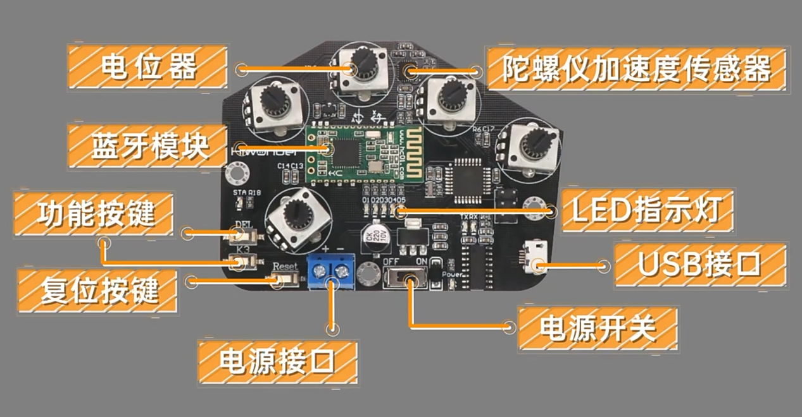

1)  **电位器**：体感手套背面有五个电位器，它是控制uHand UNO手掌开合的关键部件。

2)  **陀螺仪加速度传感器（MPU6050）**:它可以获得体感手套在x、y、z三轴方向的加速度及倾斜角度。我们可以通过旋转体感手套来控制uHand UNO手掌来进行更多的操作

3)  **蓝牙模块**：主要作用是体感手套同uHand UNO之间进行通信。

4)  **功能按键**：两个按键对应功能如下:

（1）**DEL**：清除蓝牙连接的历史记录。

（2）**K3**：切换体感手套的控制模式。

5)  **复位按键（Reset）**:重启体感手套。

6)  **LED指示灯**：显示体感手套的控制模式。

7)  **USB接口**：用于连接PC端进行调试及下载程序。

8)  **电源接口**：连接锂电池给手套供电，标准电压为7.4V。

### 11.1.2 体感手套佩戴教学

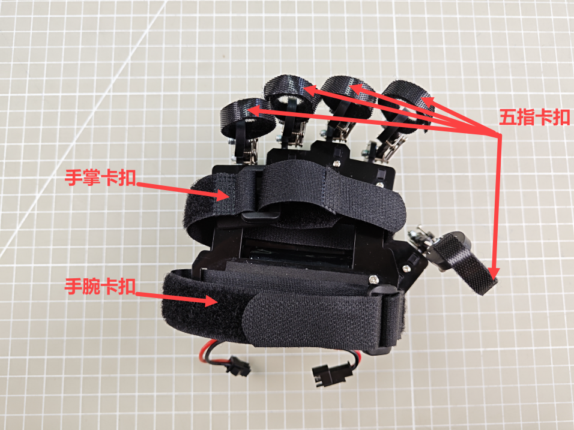

**将所有卡扣打开，先将卡扣固定在五指最后一个指关节处，再将手掌卡扣与手腕卡扣分别固定在手掌心及手腕处，最终的固定效果如下（详细可参考本文档同路径下的视频）：**


<p style="text-align:center">正面穿戴效果</p>

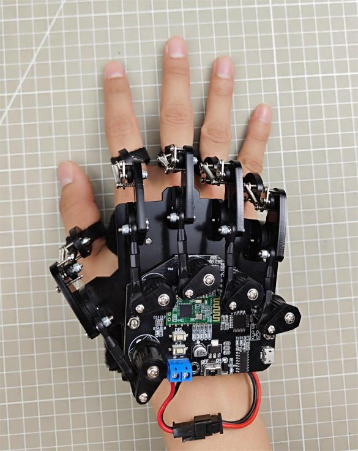

<p style="text-align:center">反面穿戴效果</p>

## 11.2 体感手套连接及控制

通过体感手套的电位器及IMU控制miniAuto前进、后退、顺时针旋转、逆时针旋转。

### 11.2.1 程序下载

* **miniAuto端程序下载**

> [!NOTE]
>
> **下载程序前需先将蓝牙模块取下，否则会因串口冲突导致下载失败。**

1)  找到本节同目录下的miniAuto端程序并打开**“02 程序文件\miniAuto程序\glove_receiveglove_receive.ino”**程序文件。

    

2)  将Arduino通过UNO数据线（Type-B）连接至电脑。

3)  点击**“选择开发板”**选项，软件会自动检测当前Arduino串口，点击进行连接。

    

4)  点击，将程序下载至Arduino中，等待下载完成即可。

    


* **体感手套端程序下载（选看）**

由于体感手套在出厂时已将程序下载好，因此此部分内容仅做了解即可。

1)  找到本节同目录下的手套程序并打开**“02 程序文件\9.2 体感手套程序\lehandlehand.ino”**程序文件。

    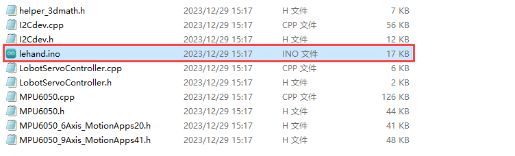

2)  使用数据线（Micro USB接口）连接体感手套与电脑。

    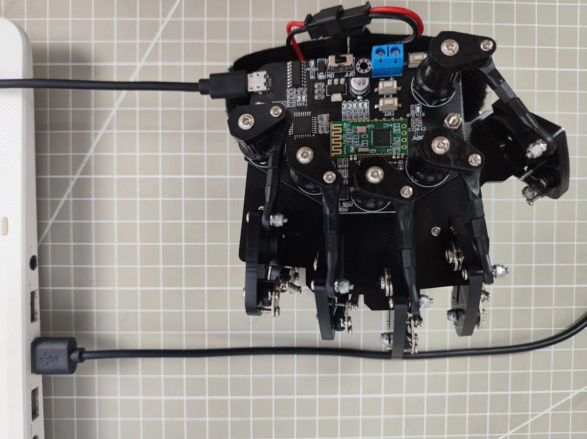

3)  点击**“选择开发板”**选项，软件会自动检测当前Arduino串口，点击进行连接。

    

4)  点击，将程序下载至Arduino中，等待下载完成即可。

    


### 11.2.2 设备配对方法

1)  首先打开被控制设备的电源开关，且确保被控制设备已插入连接蓝牙模块。

2)  将体感手套佩戴在右手，将手心朝下并紧握拳。接着打开手套开关，此时模式指示灯全亮。


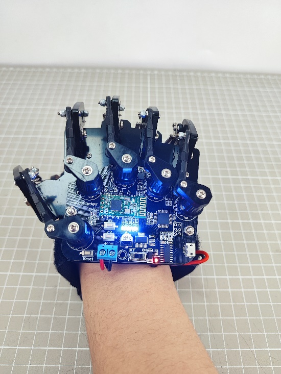

3)  待模式指示灯熄灭后，再张开手指，模式指示灯会再亮一次，这样就完成了手套的初始化。**（每次重启手套必须要做的过程）**

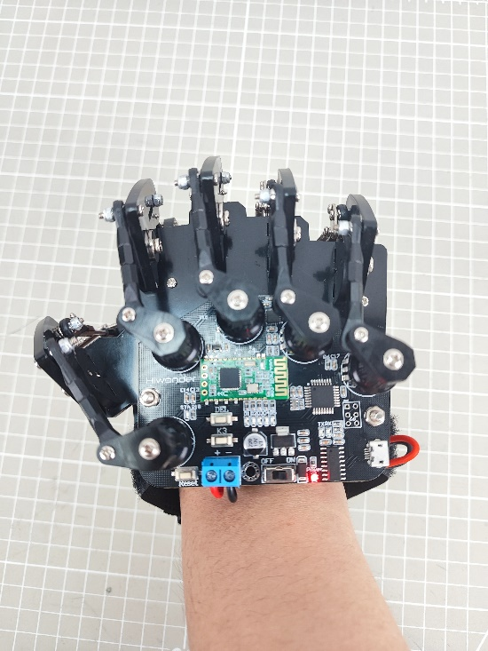

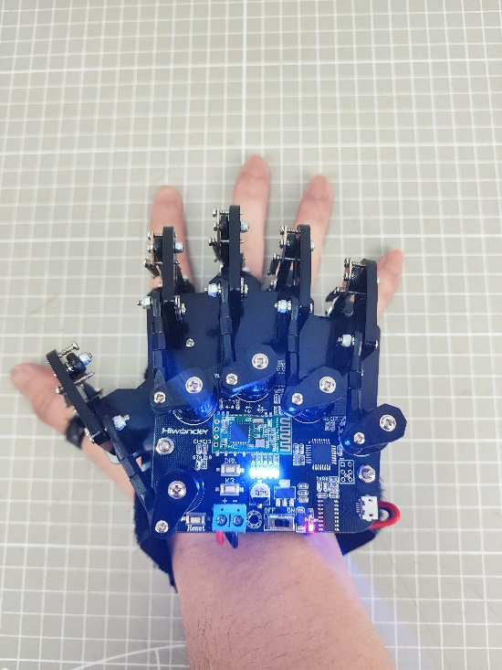

4)  按下**“DEL”**按键，即可清除蓝牙连接的历史记录。

5)  清除完成后**“STA”**指示灯开始闪烁，体感手套会自动连接至设备。当连接成功，**“STA”**指示灯常亮。

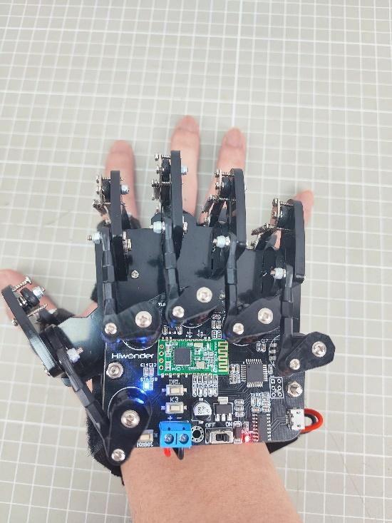

### 11.2.3 控制模式切换

用户通过体感手套开发板上的“**K3**”按键来切换控制模式，LED（D1-D5）会反馈

当前所选模式，**当2 个（D1、D2）LED灯亮起即为控制miniAuto模式。**


### 11.2.4 操作说明及实现效果

当体感手套与miniAuto连接完成后，可通过手套上的电位器及IMU控制miniAuto移动。具体的控制可见下表：

<table border="1">
  <tr>
    <th>初始手势</th>
    <th>手势描述（以人为第一视角）</th>
    <th>手势图片</th>
    <th>小车底盘反馈动作（以小车底盘为第一视角）</th>
  </tr>
  <tr>
    <td rowspan="4">握拳</td>
    <td>手背朝上</td>
    <td></td>
    <td>前进</td>
  </tr>
  <tr>
    <td>手心朝上</td>
    <td>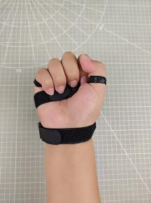</td>
    <td>后退</td>
  </tr>
  <tr>
    <td>手腕顺时针旋转，即手心朝向正左方。</td>
    <td>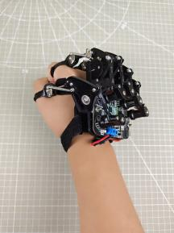</td>
    <td>原地顺时针转动</td>
  </tr>
  <tr>
    <td>手腕逆时针旋转，即手心朝向正右方。</td>
    <td>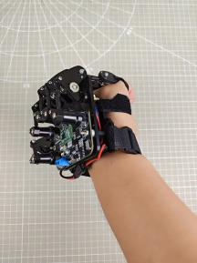</td>
    <td>原地逆时针转动</td>
  </tr>
  <tr>
    <td colspan="2">张开手掌</td>
    <td>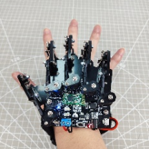</td>
    <td>停止</td>
  </tr>
</table>


### 11.2.5 程序简要分析

* **miniAuto程序分析**

1. 导入库文件

导入本玩法所需要的RGB控制库文件。

```cpp
#include <Arduino.h>
#include "FastLED.h"
```

2. 定义引脚及创建对象

（1）定义了用于连接硬件的Arduino引脚，主要是一个RGB灯引脚和电机引脚。

```cpp
const static uint8_t ledPin = 2;
const static uint8_t pwm_min = 50;
const static uint8_t motorpwmPin[4] = { 10, 9, 6, 11} ;
const static uint8_t motordirectionPin[4] = { 12, 8, 7, 13};
```

（2）创建了一个RGB灯对象，用于控制RGB灯。

```cpp
static CRGB rgbs[1];
```

（3）声明任务函数，用于执行不同的控制任务。`Motor_Init`函数用于初始化电机，`receive_handlder`函数用于接收蓝牙数据，`Derection_Control`函数用于处理蓝牙数据并控制小车，`Rgb_Show`函数用于控制RGB灯的颜色，`Velocity_Controller`函数用于控制小车的速度，`Motors_Set`函数用于控制电机。

```cpp
void Motor_Init(void);
void receive_handlder(void);
void Derection_Control(void);
void Rgb_Show(uint8_t rValue,uint8_t gValue,uint8_t bValue);
void Velocity_Controller(uint16_t angle, uint8_t velocity,int8_t rot);
void Motors_Set(int8_t Motor_0, int8_t Motor_1, int8_t Motor_2, int8_t Motor_3);

```

3. 初始化设置

（1）在`setup()`函数中，主要是对相关的硬件设备进行初始化。首先是串口，将其通信的波特率设置为9600以及读取数据超时时间为500ms。

```cpp
void setup() {
  Serial.begin(9600);
  Serial.setTimeout(500);              ///< 设置串行端口读取数据的超时时间
  FastLED.addLeds<WS2812, ledPin, RGB>(rgbs, 1);
  Rgb_Show(255,255,255);
  Motor_Init();
}
```

（2）使用`FastLED`库初始化扩展板上的RGB灯，并将其连接到`ledPin`引脚。通过`Rgb_Show(255, 255, 255)`设置RGB颜色为白色并显示。

```cpp
  FastLED.addLeds<WS2812, ledPin, RGB>(rgbs, 1);
  Rgb_Show(255,255,255);
```

（3）对miniAuto的4个电机进行初始化，绑定对应的引脚。

```cpp
  Motor_Init();
```

4. 蓝牙控制

蓝牙任务函数`receive_handlder`主要是接收蓝牙信号，`Derection_Control`函数是根据蓝牙接收到的数据，控制miniAuto移动。

（1）首先程序通过`Serial.read()`函数读取手套传输的数据，存储在rx变量内。

```cpp
void receive_handlder() {
  static uint8_t step = 0;
  static uint8_t head_count = 0;
  static uint8_t data_count = 0;
  while (Serial.available() > 0)
  {
    char rx = Serial.read();
```

（2）首先对接收到的数据进行分析，若识别到帧头则跳转到接收。

```cpp
    switch(step)
    {
      case 0: //帧头
        if(rx == FRAME_HEADER)
        {
          head_count++;
          if(head_count > 1)
          {
            step++;
            head_count = 0;
          }
        }else{
          head_count = 0;
        }
        break;
```

（3）case 1用于保存接收到的数据数量。

```cpp
      case 1: //接收数
        if(rx > 0 || rx < 128)
        {
          rec_oj.rec_num = rx;
          step++;
        }else{
          step = 0;
        }
        break;
```

（4）case 2是存储接收到的功能号。

```cpp
      case 2: //功能号
        if(rx > 0)
        {
          rec_oj.func = rx;
          step++;
        }else{
          step = 0;
        }
        break;
```

（5）case 3用于存储接收到的数据，并对数据进行处理，当`data_count`长度大于接收到的蓝牙数据长度-2时，就将接收到的数据存储在`result_oj`内。

```cpp
      case 3:
        rec_oj.buf[data_count] = rx;
        data_count++;
        if(data_count > rec_oj.rec_num - 2)
        {
          resule_oj.rec_num = rec_oj.rec_num;
          resule_oj.func = rec_oj.func;
          memcpy(resule_oj.buf , rec_oj.buf , rec_oj.rec_num -2);
          data_count = 0;
          step = 0;
        }
        break;
```

6.  最后通过`Derection_Control`函数对存储的数据进行处理，从而控制miniAuto移动。

```cpp
void Derection_Control() {
  if(resule_oj.buf[0] == 0 && resule_oj.buf[1] == 0)
    Velocity_Controller( 0, 0, 0);
  if(resule_oj.buf[0] == 100 && resule_oj.buf[1] == 100)
    Velocity_Controller( 0, 100, 0);
  if(resule_oj.buf[0] == -100 && resule_oj.buf[1] == 100)
    Velocity_Controller( 90, 100, 0);
  if(resule_oj.buf[0] == 100 && resule_oj.buf[1] == -100)
    Velocity_Controller( 270, 100, 0); 
  if(resule_oj.buf[0] == -100 && resule_oj.buf[1] == -100)
    Velocity_Controller( 180, 100, 0);
}
```

* **体感手套程序分析**

1.导入库文件

导入本玩法所需要软串口库、机器人控制信号库、MPU6050库以及IIC库文件。

```cpp
#include <SoftwareSerial.h> //软串口库
#include "LobotServoController.h" //机器人控制信号库
#include "MPU6050.h" //MPU6050库
#include "Wire.h" //IIC库
```

2. 定义引脚及创建对象

首先将体感手套蓝牙模块的RX、TX引脚设置为11和12，接着将体感手套上五个手指电位器的范围限制在0~255，设置机械手掌的舵机位置为1500，方便后续进行映射处理。

（1）将电位器校准标志位设置为True，初始化蓝牙通讯串口以及创建机器人控制对象。

```cpp
// 蓝牙TX、RX引脚
#define BTH_RX 11
#define BTH_TX 12

// 创建变位器最小值和最大值存储
float min_list[5] = {0, 0, 0, 0, 0};
float max_list[5] = {255, 255, 255, 255, 255};
// 各个手指读取到的数据变量
float sampling[5] = {0, 0, 0, 0, 0}; 
// 手指相关舵机变量
float data[5] = {1500, 1500, 1500, 1500, 1500};
uint16_t ServePwm[5] = {1500, 1500, 1500, 1500, 1500};
uint16_t ServoPwmSet[5] = {1500, 1500, 1500, 1500, 1500};
// 电位器校准标志位
bool turn_on = true;

// 蓝牙通讯串口初始化
SoftwareSerial Bth(BTH_RX, BTH_TX);
// 机器人控制对象
LobotServoController lsc(Bth);
```

（2）接着定义映射函数，它接受五个浮点数参数：`in`, `left_in`, `right_in`, `left_out`, 和 `right_out`。该函数将输入值 `in` 从 `left_in `到 `right_in `的范围映射到` left_out` 到 `right_out` 的范围，并且可将映射后的值返回。

```cpp
// 浮点数映射函数
float float_map(float in, float left_in, float right_in, float left_out, float right_out)
{
  return (in - left_in) * (right_out - left_out) / (right_in - left_in) + left_out;
}
```

（3）声明MPU6050相关变量，如ax, ay, az是用于存储加速度计的原始数据。MPU6050是一款常用的六轴运动跟踪传感器，它包括3轴陀螺仪和3轴加速度计。

（4）其中`gx`,`gy`,` gz`是用于存储陀螺仪的原始数据；`ax0`, `ay0`, `az0`是加速度计数据的校准后的值；`gx0`, `gy0`, `gz0`是陀螺仪数据的校准后的值等。

（5）除此之外还有加速度校准的一些相关变量，这些变量是用来进行传感器数据校准的。在读取原始数据后，会从中减去这些偏移量，以得到更准确的结果。

```cpp
// MPU6050相关变量
MPU6050 accelgyro;
int16_t ax, ay, az;
int16_t gx, gy, gz;
float ax0, ay0, az0;
float gx0, gy0, gz0;
float ax1, ay1, az1;
float gx1, gy1, gz1;

// 加速度校准变量
int ax_offset, ay_offset, az_offset, gx_offset, gy_offset, gz_offset;

```

3. 初始化设置

（1）程序将串口波特率设置为9600，功能按键K3和体感手套上的电位器被设置为输入模式，将体感手套上D1~D5的LED灯设置为输出模式。

```cpp
void setup() {
  // put your setup code here, to run once:
  Serial.begin(9600);
  //功能按键初始化
  pinMode(7, INPUT_PULLUP);
  //各手指电位器配置
  pinMode(A0, INPUT);
  pinMode(A1, INPUT);
  pinMode(A2, INPUT);
  pinMode(A3, INPUT);
  pinMode(A6, INPUT);
  //LED 灯配置
  pinMode(2, OUTPUT);
  pinMode(3, OUTPUT);
  pinMode(4, OUTPUT);
  pinMode(5, OUTPUT);
  pinMode(6, OUTPUT);
```

（2）接着初始化蓝牙串口通信，并设置了波特率为9600。发送两条AT指令给蓝牙模块：一条是将蓝牙设置为主模式，另一条是软重启蓝牙模块。确保蓝牙模块可在正确的模式下启动。

（3）MPU6050的配置中首先初始化了I2C通信，并设置了I2C的时钟频率。初始化MPU6050传感器后，设置了角速度和加速度的量程。

（4）读取了当前的加速度和角速度数据，用于后续的校准。最后，它将读取到的数据存储在对应的偏移量变量中，这些偏移量将在后续的数据读取中用于校准。

```cpp
  //蓝牙配置
  Bth.begin(9600);
  Bth.print("AT+ROLE=M");  //蓝牙配置为主模式
  delay(100);
  Bth.print("AT+RESET");  //软重启蓝牙模块
  delay(250);

  //MPU6050 配置
  Wire.begin();
  Wire.setClock(20000);
  accelgyro.initialize();
  accelgyro.setFullScaleGyroRange(3); //设定角速度量程
  accelgyro.setFullScaleAccelRange(1); //设定加速度量程
  delay(200);
  accelgyro.getMotion6(&ax, &ay, &az, &gx, &gy, &gz);  //获取当前各轴数据以校准
  ax_offset = ax;  //X轴加速度校准数据
  ay_offset = ay;  //Y轴加速度校准数据
  az_offset = az - 8192;  //Z轴加速度校准数据
  gx_offset = gx; //X轴角速度校准数据
  gy_offset = gy; //Y轴角速度校准数据
  gz_offset = gz; //Z轴角速度校准数据
}
```

4. 获取数据

这里是对手指弯曲的角度数据进行获取，主要是通过主函数中定义的`finger`函数来实现的。

（1）首先定义`timer_sampling`和`timer_init`两个静态变量，它们的值在函数调用之间是保持不变的。`init_step`变量是用于跟踪初始化步骤。`sampling[]`和`data[]`则是用于存储读取的传感器数据的数组。`min_list[] `和 `max_list[]` 可能是用于存储每个手指的最小和最大测量值的数组。

（2）通过for循环读取手指的传感器数据。对于每个手指，代码读取模拟值，在将其加到一个累积值上后除以2来获得平均值，这样做是为了减少偶然的读数错误或异常值的影响。

（3）然后，使用`float_map`函数将平均值映射到机械手掌对应舵机脉宽500-2500的范围内，最后将限制映射后的值在500和2500之间。

```cpp
//获取各个手指电位器数据
void finger() {
  static uint32_t timer_sampling;
  static uint32_t timer_init;
  static uint8_t init_step = 0;
  if (timer_sampling <= millis())
  {
    for (int i = 14; i <= 18; i++)
    {
      if (i < 18)
        sampling[i - 14] += analogRead(i); //读取各个手指的数据
      else
        sampling[i - 14] += analogRead(A6);  //读取小拇指的数据， 因为IIC 用了 A4,A5 口，所以不能从A0 开始连续读取
      sampling[i - 14] = sampling[i - 14] / 2.0; //取上次和本次测量值的均值
      data[i - 14 ] = float_map( sampling[i - 14],min_list[i - 14], max_list[i - 14], 2500, 500); //将测量值映射到500-2500， 握紧手时为500， 张开时为2500
      data[i - 14] = data[i - 14] > 2500 ? 2500 : data[i - 14];  // 限制最大值为2500
      data[i - 14] = data[i - 14] < 500 ? 500 : data[ i - 14];   //限制最小值为500
    }
    //timer_sampling = millis() + 10;
  }
```

（4）接着通过if判断条件函数，对手套进行初始化操作。

```cpp
  if (turn_on && timer_init < millis())
  {
    switch (init_step)
    {
      case 0:
        digitalWrite(2, LOW);
        digitalWrite(3, LOW);
        digitalWrite(4, LOW);
        digitalWrite(5, LOW);
        digitalWrite(6, LOW);
        timer_init = millis() + 20;
        init_step++;
        break;
      case 1:
        digitalWrite(2, HIGH);
        digitalWrite(3, HIGH);
        digitalWrite(4, HIGH);
        digitalWrite(5, HIGH);
        digitalWrite(6, HIGH);
        timer_init = millis() + 200;
        init_step++;
        break;
```

（5）由于体感手套还可以通过转动手腕来控制机械手掌的云台转动，因此这里还需要获取体感手套上MPU6050的数据并实时更新。

（6）首先声明静态变量`timer_u`，用于存储从上次函数调用以来的时间。使用判断语句if 检查是否已经过去了足够的时间，如果是，则执行判断语句内的代码。使用`accelgyro.getMotion6`语句从MPU6050传感器中获取原始的加速度和角速度数据。

```
//更新倾角传感器数据
void update_mpu6050()
{
  static uint32_t timer_u;
  if (timer_u < millis())
  {
    // put your main code here, to run repeatedly:
    timer_u = millis() + 20;
    accelgyro.getMotion6(&ax, &ay, &az, &gx, &gy, &gz);
```

（7）接下来的三组滤波公式（如`ax0 = ((float)(ax)) * 0.3 + ax0 * 0.7`）是对原始数据进行滤波，用于减少噪声。

（8）加速度数据被转换为相对于重力加速度的倍数，通过减去一个偏移量（ax_offset、ay_offset等）并除以常亮8192.0来完成的。

```
    ax0 = ((float)(ax)) * 0.3 + ax0 * 0.7;  //对读取到的值进行滤波
    ay0 = ((float)(ay)) * 0.3 + ay0 * 0.7;
    az0 = ((float)(az)) * 0.3 + az0 * 0.7;
    ax1 = (ax0 - ax_offset) /  8192.0;  // 校正，并转为重力加速度的倍数
    ay1 = (ay0 - ay_offset) /  8192.0;
    az1 = (az0 - az_offset) /  8192.0;

    gx0 = ((float)(gx)) * 0.3 + gx0 * 0.7;  //对读取到的角速度的值进行滤波
    gy0 = ((float)(gy)) * 0.3 + gy0 * 0.7;
    gz0 = ((float)(gz)) * 0.3 + gz0 * 0.7;
    gx1 = (gx0 - gx_offset);  //校正角速度
    gy1 = (gy0 - gy_offset);
    gz1 = (gz0 - gz_offset);
```

（9）使用atan2函数和校正后的加速度数据来计算X和Y轴的倾角。倾角是以弧度表示的，然后被转换为度。此外，还使用了互补滤波器来平滑倾角的读数。互补滤波器结合了陀螺仪和加速度计的数据来得到更准确的倾角读数。

```
    //互补计算x轴倾角
    radianX = atan2(ay1, az1);
    radianX = radianX * 180.0 / 3.1415926;
    float radian_temp = (float)(gx1) / 16.4 * 0.02;
    radianX_last = 0.8 * (radianX_last + radian_temp) + (-radianX) * 0.2;

    //互补计算y轴倾角
    radianY = atan2(ax1, az1);
    radianY = radianY * 180.0 / 3.1415926;
    radian_temp = (float)(gy1) / 16.4 * 0.01;
    radianY_last = 0.8 * (radianY_last + radian_temp) + (-radianY) * 0.2;
  }
}
```

5. 控制小车

（1）首先对变量进行了定义和初始化，接着通过 `millis()` 函数来实现非阻塞延时。

```
//run2,控制小车
void run2()
{
  static uint32_t timer;
  static uint32_t step;
  static uint8_t count = 0;
  int act = 0;
  static int last_act;
  if (timer > millis())
    return;
  timer = millis() + 100;
```

（2）根据获取到的Y轴角度，来发送对应的小车控制指令，从而实现前进、后退、顺时针旋转、逆时针旋转。

```
  if (data[2] < 600 && (radianY_last < -30 && radianY_last > -90))
  {
    car_control(100, -100);
  }
  else if (data[2] < 600  && (radianY_last > 30 && radianY_last < 90))
  {
   car_control(-100, 100); 
  }
  else if (data[2] < 600 && abs(radianY_last) < 30 )
  {
    car_control(100, 100);
  }
  else if (data[2] < 600 && (radianY_last < -130 ||  radianY_last > 130 ))
  {
   car_control(-100, -100); 
  }
  else
    car_control(0, 0); 
}
```
