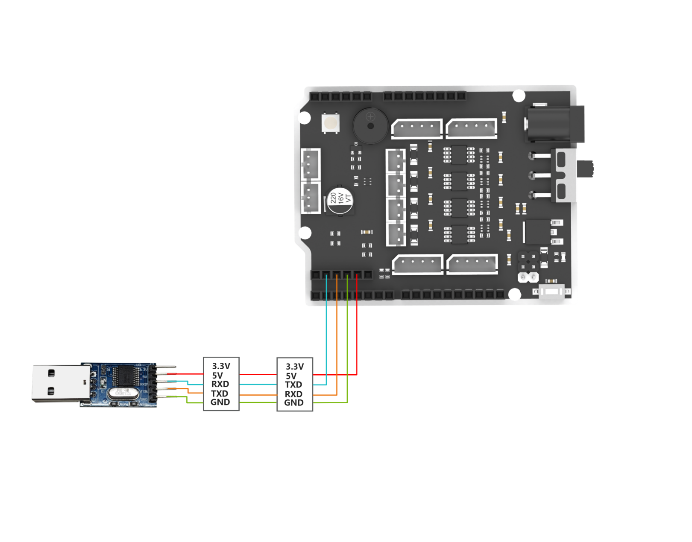
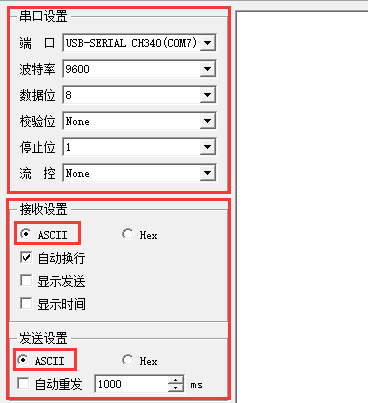
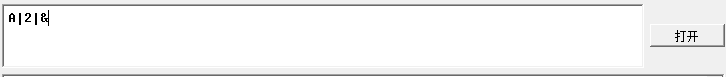
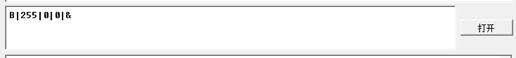
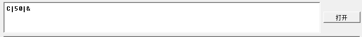
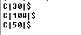
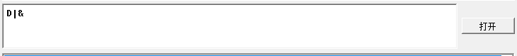
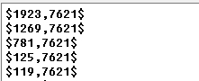
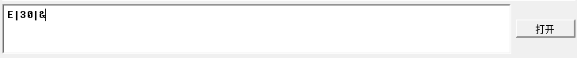
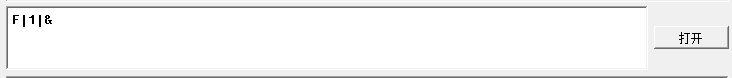

# 12. 串口通信实操课程

## 12.1 设备主从通讯原理

本节旨在为用户介绍关于miniAuto在与不同设备（如STM32、51单片机、Arduino、树莓派等）通信时的主从关系的详细信息，理解miniAuto是如何作为从机与其他设备进行通信的，以及其他设备如何作为主机控制miniAuto。

本章中miniAuto都是作为从机设备，通过UART串口与其他设备进行信息传输。

### 12.1.1 主从关系

在主从机控制系统中，miniAuto作为从机设备，其他单片机等设备作为主机。

* **miniAuto作为从机的功能**

1)  接收解析主机发送的信号：

等待串口信号，若串口有数据接收到，则根据通讯协议解析串口数据，可以根据数据信息调用对应的函数功能。

2)  根据接收数据调用miniAuto的功能：

当解析出信号时，就需要调用对应的miniAuto本设备功能，如滑杆控制、RGB灯颜色调节、速度调节等。

3)  数据封装与反馈：

当接收到读取命令时，则需要调用对应的读取函数后，将读取到的数据根据通讯协议封装为数据包，并发送给主机设备。

* **其他设备作为主机**

1)  指令封装与发送：

    主机需要将控制指令和数据根据通讯协议封装为数据包，发送给设备。

2)  控制协调：

主机设备需管理好整个系统的协同工作，确保miniAuto和其他设备之间的通信和操作无冲突，保持良好的工作状态。

3)  数据接收：

主机读取舵机状态时，在发送读取指令后，需要接收miniAuto发送的状态信息数据，确保数据的完整性和正确性，并解析数据包，提取其中的有用信息。

### 12.1.2 硬件连接

以miniAuto接入PC为例：

将USB转接器的TXD、RXD、GND通过杜邦线分别连接至miniAuto上接口3的IO32、IO33、GND，再将USB转接器接入电脑即可。（**温馨提示：可以不接5V，但一定要接GND**）

> [!NOTE]
>
> * **主机设备与miniAuto的供电电源可以不同，但在连接时必须要共地，才可以提供稳定的通讯电平。**
>
> * **设备在接线时要注意UART串口的TX、RX引脚要交叉接线，否则不可通讯。**

### 12.1.3 数据传输格式

miniAuto的UART串口数据发送格式默认为：

| 波特率 | 9600 |
| :----: | :--: |
| 数据位 |  8   |
| 校验位 | None |
| 停止位 |  1   |

### 12.1.4 通信协议

主机发给miniAuto的命令格式为：以功能码开头，中间用“\|”号隔开，最后以“&”结尾。（具体格式详见下一小节的介绍）

## 12.2 PC串口控制

**本文通过PC串口依次实现了miniAuto的滑杆控制、RGB灯颜色调节、速度调节、超声波和电池电量查询、舵机控制、避障功能开关。**

### 12.2.1 实现原理

> [!NOTE]
>
> **本节内容需要在下载了miniAuto从机端程序的基础上实现，请先下载本文档同路径下的“miniAuto从机端程序”。**

1)  miniAuto与TTL进行串行连接后接入PC机进行串口通信，实现串口控制miniAuto,其UART串口数据发送格式默认为：

| 波特率 | 9600 |
| :----: | :--: |
| 数据位 |  8   |
| 校验位 | None |
| 停止位 |  1   |

2)  通信协议：

下面我们对协议指令包的格式进行说明，协议指令包格式如下：以功能码开头，中间用“\|”号隔开，最后以“&”结尾。

### 12.2.2 准备工作

1)  首先需要在本节内容同路径下**“03 串口调试助手工具”**内找到串口工具。

    

2)  打开串口调试工具后，请确保串口传输助手的波特率设置为9600、校验位为NONE、数据位为8、停止位为1，并勾选以ASCII发送，配置如下图所示：

### 12.2.3 功能实现

通过发送协议指令来进行控制miniAuto：

1)  指令名：滑杆控制

①功能码：A

②子功能码：

| 子功能码 | 子功能名 | 命令数据 |
| -------- | -------- | -------- |
| 0        | 左移     | 无       |
| 1        | 左斜向前 | 无       |
| 2        | 前进     | 无       |
| 3        | 右斜向前 | 无       |
| 4        | 右移     | 无       |
| 5        | 右斜向后 | 无       |
| 6        | 后移     | 无       |
| 7        | 左斜向后 | 无       |
| 8        | 停止     | 无       |
| 9        | 原地左转 | 无       |
| 10       | 原地右转 | 无       |

命令数据：根据子功能选择相应的命令数据输入，若不需填写命令数据，留空即可。

举例：以发送命令数据“A\|2\|&”为例，该命令是用于打开miniAuto的前进功能。

2)  指令名：RGB颜色调节

①功能码：B

②参数数据：

| 参数 | 物理含义      | 取值范围 |
| ---- | ------------- | -------- |
| r    | RGB灯红光光强 | 0-255    |
| g    | RGB灯绿光光强 | 0-255    |
| b    | RGB灯蓝光光强 | 0-255    |

说明：本指令的三个参数，在下达本功能指令时需要全部输入，输入顺序：r-g-b。

命令数据：请确保每一个参数的取值都在有效范围之内，输入数据为整数。

举例：以发送命令数据“B\|255\|0\|0\|&”为例，该命令是用于让RGB灯亮红光。

3)  指令名：速度调节

①功能码：C

②参数数据：

| 参数 | 物理含义     | 取值范围 |
| ---- | ------------ | -------- |
| x    | 直线运动速度 | 10-100   |

说明：1.该命令用于控制miniAuto的运动。

2.该命令执行之后，小车不会立刻按照此速度开始运动，此时设置的速度会写入小车内部，等待小车下一次开启运动时，才会按照此速度运动。

命令数据：请确保每一个参数的取值都在有效范围之内，输入数据为整数。

举例：以命令数据“C\|50\|&”为例，该命令让miniAuto以50的直线速度前进。

指令发送出去后，miniAuto收到指令之后会重新发送回来作为回应。

4)  指令名：超声波数据和电池电量数据查询

①功能码：D

②参数：无参数

举例：以发送命令数据“D\|&”为例，该命令是获取miniAuto的超声波检测的距离和电池剩余电量。

数据发送后miniAuto会返回请求数据，返回的数据格式为：“\$x,y\$”，其中x

就是我们需要获取的距离数据（单位：mm），y就是我们需要获取的电池容量(单位：mv)。

5)  指令名：舵机控制：

功能码：E

参数：

| 参数 | 物理含义            | 取值范围 |
| ---- | ------------------- | -------- |
| x    | Minauto舵机旋转角度 | 0-60     |

> [!NOTE]
>
> * **该命令用于控制舵机旋转，从而带动机械爪张开闭合。**
>
> * **为了放置舵机带动机械爪运动时不会碰撞机体，影响演示效果，我们此处对于舵机运动角度的输入做了一定的优化，舵机最佳的运动参数在0-60间。**

命令数据：舵机转动角越小，机械爪越收拢，反之越张开。

举例：以发送命令数据“E\|30\|&”为例，该命令是让舵机以30°转动

6)  指令名：避障功能开关

功能码：F

> [!NOTE]
>
> * **该命令用于开关miniAuto的避障功能。**
>
> * **开启避障功能之后，小车默认会开始直线运动，此时的运动速度是不受速度调节指令控制的。**

参数：

<table style="width:100%;">
<colgroup>
<col style="width: 15%" />
<col style="width: 51%" />
<col style="width: 33%" />
</colgroup>
<tbody>
<tr>
<td>参数</td>
<td>物理含义</td>
<td>取值范围</td>
</tr>
<tr>
<td>x</td>
<td>避障功能开关标志位</td>
<td>
0：关闭避障

1：开启避障
</td>
</tr>
</tbody>
</table>

举例：以发送命令数据“F\|1\|&”为例，该命令用于打开小车避障功能。

