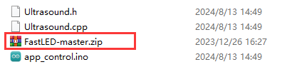
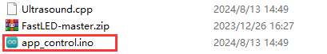

# 3. 出厂程序下载说明

## 3.1 准备工作及注意事项

根据**“1.教程资料\2.Arduino环境搭建\2.2 Arduino IDE使用说明**”课程，将本节同目录下“**出厂程序\app_control**”中的.zip库文件压缩包导入Arduino IDE中（**若在前面的课程中已导入FastLED-master.zip库文件，则可跳过此步骤**）。

## 3.2 程序下载

> [!NOTE]
>
> - **下载程序前需先将蓝牙模块取下，否则会因串口冲突导致程序下载失败。**
>
> - **接入Type-B下载线时请将电池盒开关拨到“OFF”挡，避免下载线误碰到扩展板的电源引脚，造成短路。**
>

1)  找到并打开本节同目录下的**“app_control\app_control.ino”**程序文件。

2)  将Arduino通过UNO数据线（Type-B）连接至电脑。

3)  点击**“选择开发板”**选项，软件会自动检测当前Arduino串口，点击进行连接。

4)  点击，将程序下载至Arduino中，等待下载完成即可。

