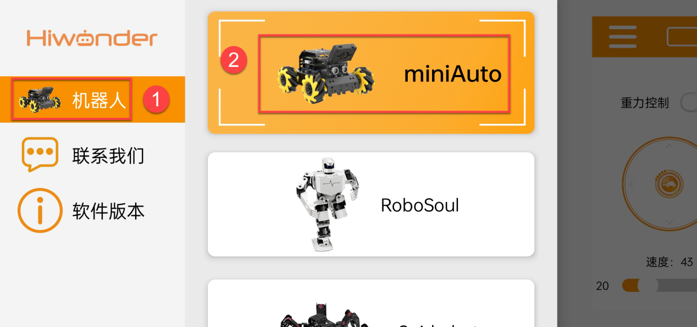
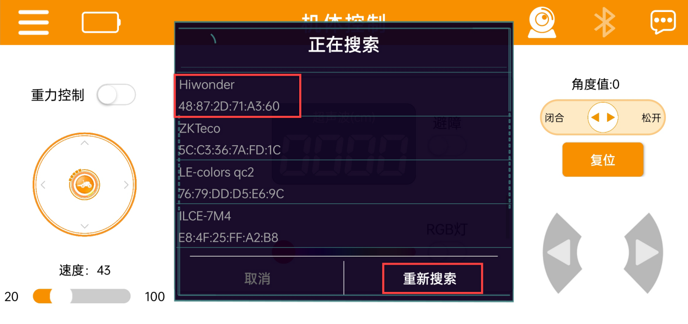
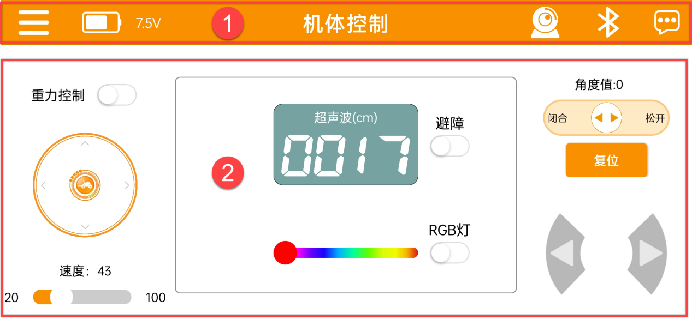
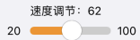
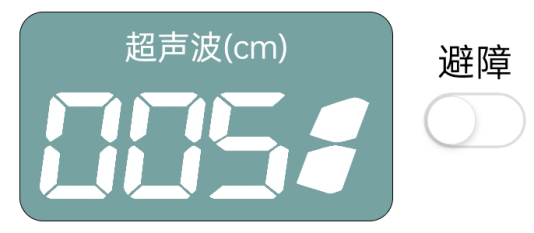
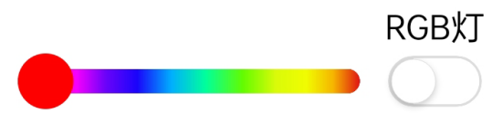
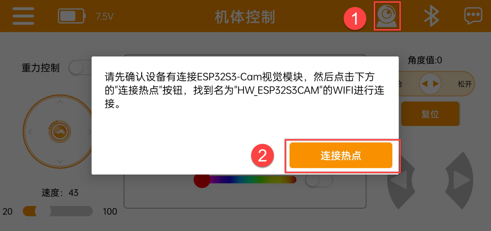
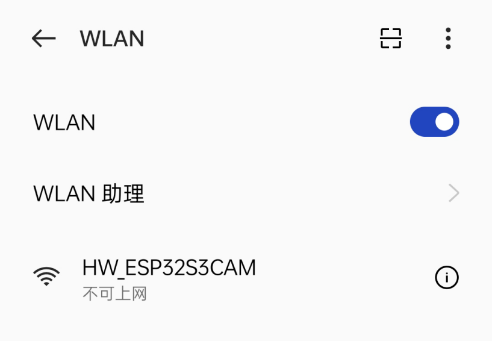
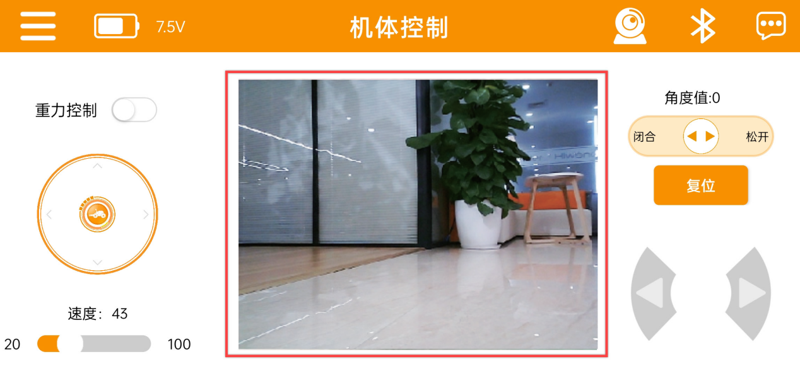

# 4. APP使用说明 

## 4.1 手机APP安装

苹果用户：直接在App Store搜索**“Wonderbot”**，下载即可。

安卓用户：可在本节同目录找到**“Wonderbot”**安装包或者扫描下方二维码，将其安装到手机。

## 4.2 手机APP连接

> [!NOTE]
>
> * **APP使用前，请先在手机设置中开启蓝牙与定位服务。**
>
> * **请通过APP内的蓝牙按钮与设备进行配对连接，请勿在手机设置里通过密钥的形式进行配对。**

1)  将小车开机，打开手机APP“**Wonderbot**”，点击左上角的图标选择机器人类型，在此处选择“**miniAuto**”。

    

2. 选择后，进入玩法界面，点击右上角闪烁的图标，并在蓝牙列表中找到**“Hiwonder”，**然后点击连接。

   

   > [!NOTE]
   >
   > **若未看到“Hiwonder”的名称，请点击“重新搜索”来查找设备。**

3)  连接成功后，右上角蓝牙图标将保持长亮，同时左侧将显示电池电量。

    

## 4.3 功能介绍

### 4.3.1 运动控制

通过按钮可控制miniAuto的运动。该界面分为了两部分，如下所示：

1.  菜单栏

| 图标 | 功能描述 |
|:--:|:--:|
|  | 返回主界面选择机器人类型 |
|  | 实时显示当前的电池电量 |
|  | 打开图像回传功能 |
|  | 蓝牙连接 |
|  | 更多信息 |

2.  控制区

| 图标 | 功能描述 |
|:--:|:--:|
|  | 开启/关闭重力控制模式 |
|  | 拖动摇杆可控制小车朝各个方向平移 |
|  | 调节小车的移动速度 |
|  | 显示超声波探测距离,点击避障按钮，开启超声波避障 |
|  | 调节超声波RGB彩灯颜色 |
|  | （豪华版功能）控制机械爪开合 |
|  | （豪华版功能）控制机械爪回归初始姿态 |
|  | 控制小车左右转 |

### 4.3.2 图像回传

1)  点击右上角的图标可查看实时图像回传。首先点击“连接热点”。

    

2)  在手机Wi-Fi设置中找到“**HW**\_**ESP32S3CAM**”，点击连接。

    

3)  返回APP界面，进入图传模式，即可查看当前的实时图传画面。

    
