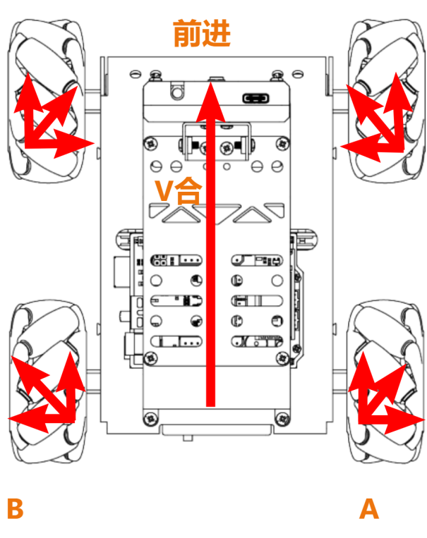
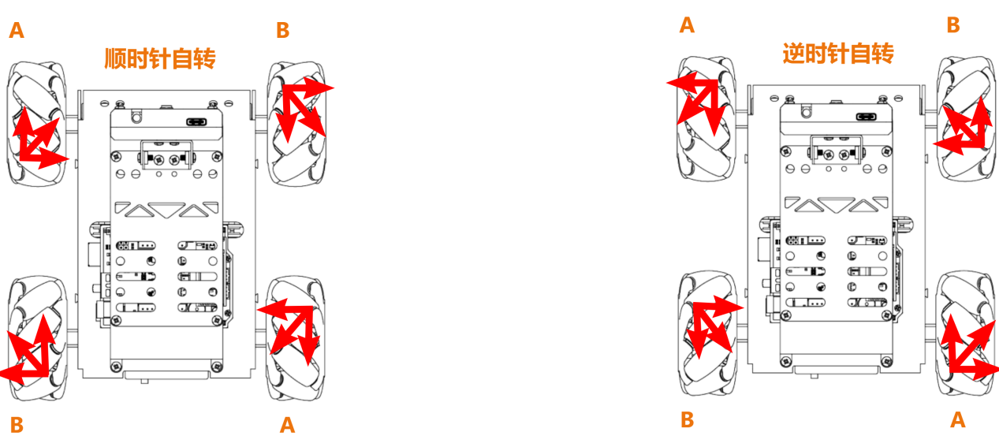
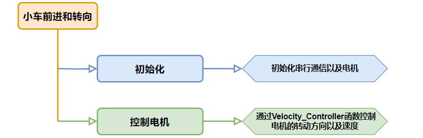
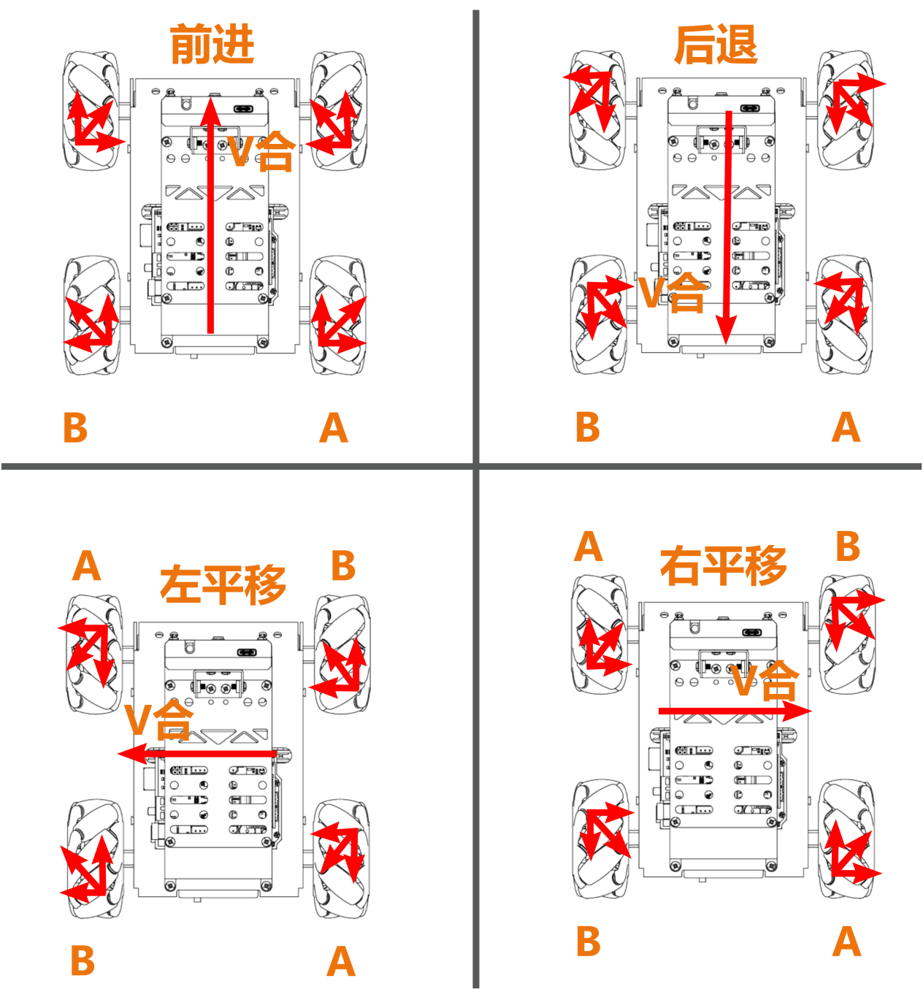
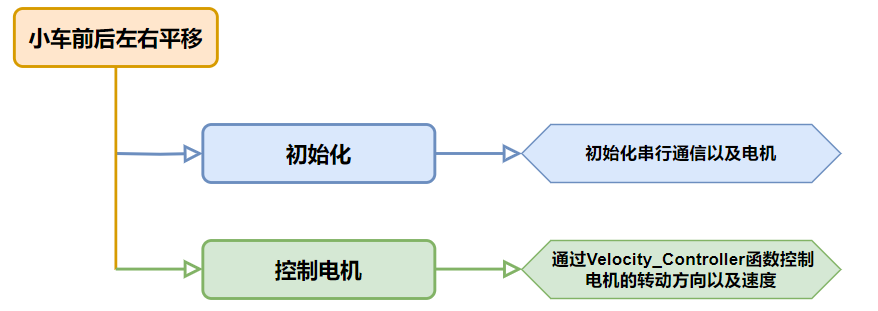
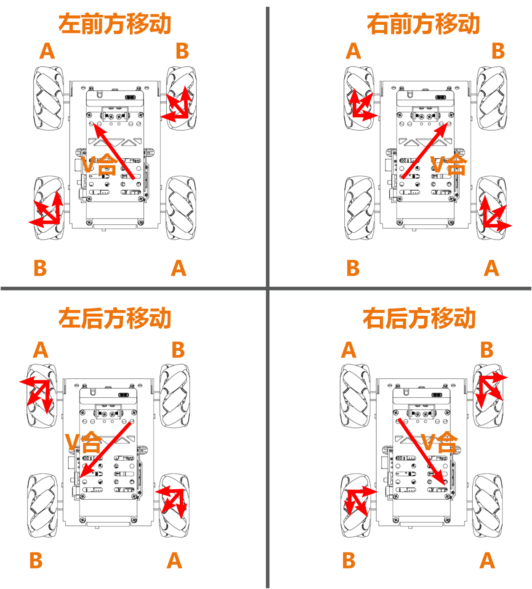
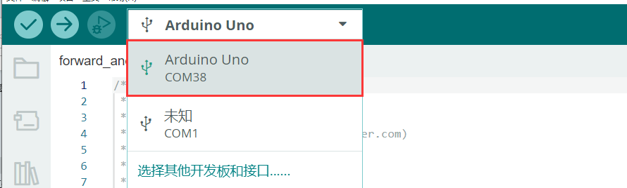
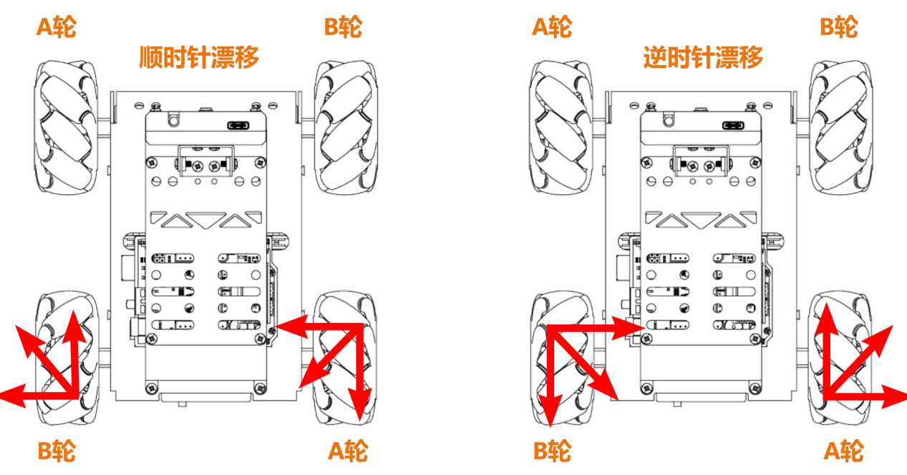
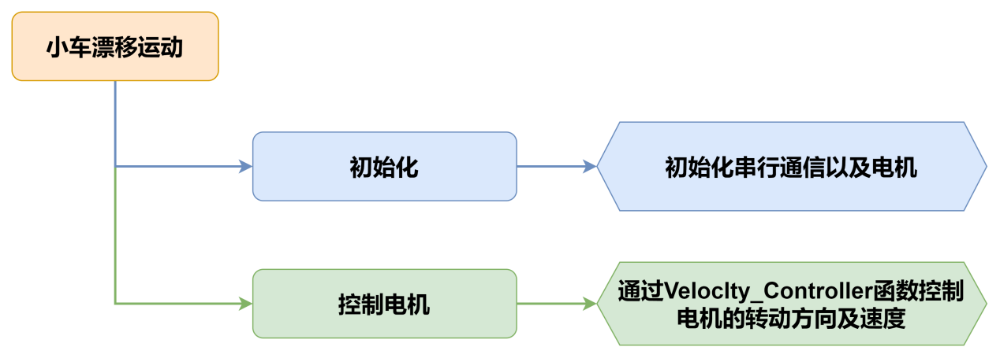

# 5.运动控制基础课程

## 5.1 小车运动库文件分析

本节介绍了麦轮小车运动控制的编程实现，涵盖了电机初始化、速度控制以及转向、平移功能，用户可对相关的库文件进行了解。

### 5.1.1 程序运行效果

小车先直行，然后依次向左、向后、向右平移，再原地转、漂移后停止。

### 5.1.2 库函数简要分析

* **电机初始化函数Motor_Init()**

该函数用来初始化电机引脚，通过在for循环来调用`pinMode`函数将电机I/O口工作模式设置为输出模式，并通过调用`Velocity_Controller`函数来设置小车为静止状态。

```cpp
 /* 电机初始化函数 */
void Motor_Init(void){
  for(uint8_t i = 0; i < 4; i++){
 pinMode(motordirectionPin[i], OUTPUT);
  }
  Velocity_Controller( 0, 0, 0, 0);
}
```

* **电机设置函数Motors_Set()**

该函数根据传入参数的值来调整小车各个轮子的转速以及方向。在for循环中，首先根据解算后的结果对小车的转向进行调整，其次通过map函数将解算数值从**<u>0~100</u>**映射到**<u>10~255</u>**的范围，最后通过`digitalWrite`和`analogWrite`函数设置电机转向和转速。

```cpp
/**
 * @brief PWM与轮子转向设置函数
 * @param Motor_x作为PWM与电机转向的控制数值。根据麦克纳姆轮的运动学分析求得。
 * @retval None
 */
void Motors_Set(int8_t Motor_0, int8_t Motor_1, int8_t Motor_2, int8_t Motor_3) {
  int8_t pwm_set[4];
  int8_t motors[4] = { Motor_0, Motor_1, Motor_2, Motor_3};
  bool direction[4] = { 1, 0, 0, 1};///< 前进 左1 右0
  for(uint8_t i; i < 4; ++i) {
 if(motors[i] < 0) direction[i] = !direction[i];
 else direction[i] = direction[i];

 if(motors[i] == 0) pwm_set[i] = 0;
 else pwm_set[i] = map(abs(motors[i]), 0, 100, pwm_min, 255);

 digitalWrite(motordirectionPin[i], direction[i]); 
 analogWrite(motorpwmPin[i], pwm_set[i]); 
  }
}

```

* **电机速度控制函数Velocity_Controller()** 

这个函数，包含四个参数：方向、速度、自转速度和是否开启漂移。函数内部计算每个电机的速度并调用 `Motors_Set` 函数来设置电机的PWM值和方向。函数中使用了三角函数来计算基于方向的电机速度。此外，还考虑了自转速度和漂移功能的影响。

```cpp
void Velocity_Controller(uint16_t angle, uint8_t velocity,int8_t rot,bool drift) {
  int8_t velocity_0, velocity_1, velocity_2, velocity_3;
  float speed = 1;
  angle += 90;
  float rad = angle * PI / 180;
  if (rot == 0) speed = 1;///< 速度因子
  else speed = 0.5; 
  velocity /= sqrt(2);
  if (drift) {
 velocity_0 = (velocity * sin(rad) - velocity * cos(rad)) * speed;
 velocity_1 = (velocity * sin(rad) + velocity * cos(rad)) * speed;
 velocity_2 = (velocity * sin(rad) - velocity * cos(rad)) * speed - rot * speed * 2;
 velocity_3 = (velocity * sin(rad) + velocity * cos(rad)) * speed + rot * speed * 2;
  } else {
 velocity_0 = (velocity * sin(rad) - velocity * cos(rad)) * speed + rot * speed;
 velocity_1 = (velocity * sin(rad) + velocity * cos(rad)) * speed - rot * speed;
 velocity_2 = (velocity * sin(rad) - velocity * cos(rad)) * speed - rot * speed;
 velocity_3 = (velocity * sin(rad) + velocity * cos(rad)) * speed + rot * speed;
  }
  Motors_Set(velocity_0, velocity_1, velocity_2, velocity_3);
}
```

## 5.2 小车前进和转向

本节通过控制M1~M4四个电机的转动方向来控制小车前进和左右转动。

### 5.2.1 运动原理

根据麦克纳姆轮的特性，小车前进时，四个轮子都必须正转；当小车左边的轮子反转，右边的轮子正转时，小车会原地逆时针旋转；当小车左边的轮子正转，右边的轮子反转时，小车会原地顺时针旋转。如以下受力分析图：





根据物理运动学知识可知，大小相等，方向相反的力可以互相抵消，假设A轮和B轮正转的速度一样快，那么A轮分解出向右的力和B轮分解出向左的力刚好互相抵消，合力方向向前，根据牛顿第二运动定律（F=ma）可知，加速度方向向前，则最终合速度“V合”方向也向前，其他方向的速度解析也是以同样的思路来推导。

### 5.2.2 实现流程



<p id ="5.2.3"></p>

### 5.2.3 程序下载

> [!NOTE]
>
> **下载程序前需先将蓝牙模块取下，否则会因串口冲突导致程序下载失败。**

1)  在本文档同路径**"02 程序文件/小车前进和转向程序"**下找到“**forward_and_back/forward_and_back.ino”**程序文件。

 

2)  将Arduino通过UNO数据线（Type-B）连接至电脑。

3)  点击**“选择开发板”**选项，软件会自动检测当前Arduino的串口，点击进行连接。

 

4)  点击，将程序下载至Arduino中，等待下载完成即可。

 


### 5.2.4 实现效果

程序下载完成后，将小车开机，小车将前进1S-\>左转1S-\>右转1S。

### 5.2.5 程序分析

* **定义引脚及创建对象**

1)  定义`motorpwmPin`数组，存储4个电机的PWM控制引脚号；定义`motordirectionPin`数组，用于存储4个电机的方向控制引脚号。

```cpp
#include <Arduino.h>

const static uint8_t pwm_min = 50;
const static uint8_t motorpwmPin[4] = { 10, 9, 6, 11};///< 控制轮子速度引脚
const static uint8_t motordirectionPin[4] = { 12, 8, 7, 13}; ///< 控制轮子方向引脚

```

2)  声明了三个函数原型，`Motor_Init`电机初始化、`Velocity_Controller`速度控制、`Motors_Set`设置电机速度。

```cpp
void Motor_Init(void);
void Velocity_Controller(uint16_t angle, uint8_t velocity,int8_t rot,bool drift);
void Motors_Set(int8_t Motor_0, int8_t Motor_1, int8_t Motor_2, int8_t Motor_3);

```

* **setup()初始化及运动控制**

1. 初始化串行通信，设置串行通信读取数据超时时间为500ms；调用`Motor_Int()`函数初始化电机。

```cpp
void setup() {
  Serial.begin(9600);
  // 设置串行端口读取数据的超时时间
  Serial.setTimeout(500);
  Motor_Init();                     ///< 电机初始化
```

2. 调用`Velocity_Controller`函数，设置电机以直行模式运行，速度为100，然后等待1秒。

```cpp
  Velocity_Controller(0,100,0,0);   ///< 直行
  delay(1000);
```

3. 调用`Velocity_Controller`函数，设置电机以原地左转模式运行，旋转速度为100，然后等待1秒。

```cpp
  Velocity_Controller(0, 0,100,0);  ///< 原地左转
  delay(1000);
```

4. 调用`Velocity_Controller`函数，设置电机以原地右转模式运行，旋转速度为-100，然后等待1秒。

```cpp
  Velocity_Controller(0, 0,-100,0); ///< 原地右转
  delay(1000); 
```

5. 调用`Velocity_Controller`函数，设置电机静止。

```cpp
  Velocity_Controller(0,0,0,0);     ///< 静止  
}
```

* **Motor_Init()电机初始化函数**

初始化了电机的方向引脚为输出模式，调用`Velocity_Controller`函数，设置电机静止。

```cpp
void Motor_Init(void){
  for(uint8_t i = 0; i < 4; i++){
    pinMode(motordirectionPin[i], OUTPUT);
  }
  Velocity_Controller( 0, 0, 0, 0);
}
```

* **Velocity_Controller（）速度控制函数**

1. 初始化4个电机的速度值为整形，设置速度因子为1，将angle设为90°用于修正机器人方向，接着将angle从度转换为弧度。  

```cpp
void Velocity_Controller(uint16_t angle, uint8_t velocity,int8_t rot,bool drift) {
  int8_t velocity_0, velocity_1, velocity_2, velocity_3;
  float speed = 1;
  angle += 90;
  float rad = angle * PI / 180;
```

2. 判断rot是否为0，若为0，则设置speed为1,否则设置speed为0.5。

```cpp
  if (rot == 0) speed = 1;///< 速度因子
  else speed = 0.5; 
```

3)  减小速度值。

```cpp
  velocity /= sqrt(2);
```

4)  根据drift的值计算4个电机的速度。

```cpp
  if (drift) {
    velocity_0 = (velocity * sin(rad) - velocity * cos(rad)) * speed;
    velocity_1 = (velocity * sin(rad) + velocity * cos(rad)) * speed;
    velocity_2 = (velocity * sin(rad) - velocity * cos(rad)) * speed - rot * speed * 2;
    velocity_3 = (velocity * sin(rad) + velocity * cos(rad)) * speed + rot * speed * 2;
  } else {
    velocity_0 = (velocity * sin(rad) - velocity * cos(rad)) * speed + rot * speed;
    velocity_1 = (velocity * sin(rad) + velocity * cos(rad)) * speed - rot * speed;
    velocity_2 = (velocity * sin(rad) - velocity * cos(rad)) * speed - rot * speed;
    velocity_3 = (velocity * sin(rad) + velocity * cos(rad)) * speed + rot * speed;
  }
```

5)  使用计算得到的4个电机的速度值设置电机。

```cpp
  Motors_Set(velocity_0, velocity_1, velocity_2, velocity_3);
}
```

* **Motors_Set电机速度函数**

1)  定义存储PWM值、电机速度值、电机方向的数组。

```cpp
void Motors_Set(int8_t Motor_0, int8_t Motor_1, int8_t Motor_2, int8_t Motor_3) {
  int8_t pwm_set[4];
  int8_t motors[4] = { Motor_0, Motor_1, Motor_2, Motor_3};
  bool direction[4] = { 1, 0, 0, 1};///< 前进 左1 右0
```

2)  遍历4个电机，并根据电机速度值确定电机方向。

```cpp
  for(uint8_t i; i < 4; ++i) {
    if(motors[i] < 0) direction[i] = !direction[i];
    else direction[i] = direction[i];

    if(motors[i] == 0) pwm_set[i] = 0;
    else pwm_set[i] = map(abs(motors[i]), 0, 100, pwm_min, 255);

    digitalWrite(motordirectionPin[i], direction[i]); 
    analogWrite(motorpwmPin[i], pwm_set[i]); 
  }
}
```

### 5.2.6 功能延伸

**程序默认前进和转向的速度是100，我们可以将小车的速度调慢一点，这里把速度修改为50**，具体的修改步骤如下：

1)  将`setup()`函数中`Velocity_Controller()`函数中的速度与自转速度参数修改为50即可。

```cpp
void setup() {
  Serial.begin(9600);
  // 设置串行端口读取数据的超时时间
  Serial.setTimeout(500);
  Motor_Init();                     ///< 电机初始化
  Velocity_Controller(0,50,0,0);   ///< 直行
  delay(1000);
  Velocity_Controller(0, 0,50,0);  ///< 原地左转
  delay(1000);
  Velocity_Controller(0, 0,-50,0); ///< 原地右转
  delay(1000); 
  Velocity_Controller(0,0,0,0);     ///< 静止  
}

```

2)  参照“[5.2.3 程序下载](#_5-2-3-程序下载)”将程序下载，再次开机即可查看修改该后的效果。

> [!NOTE]
>
> **直行速度与转弯速度调整范围是“-100~100”，直行速度为正数时小车前进，为负数时小车后退；转弯速度为正数时小车逆时针自转，为负数时小车顺时针自转。**

## 5.3 小车前后左右平移

本节通过控制M1~M4四个电机的转动方向来控制小车前后左右平移。

### 5.3.1 运动原理

根据麦克纳姆轮的特性，当小车轮子全部正转时，小车前进；当小车轮子全部反转时，小车后退；当A轮全部反转，B轮正转时，小车左平移；当B轮全部反转，A轮正转时，小车右平移。小车前后左右的运动受力分析图如下：



根据物理运动学知识可知，大小相等，方向相反的力可以互相抵消，假设A轮和B轮正转的速度一样快，那么A轮分解出向右的力和B轮分解出向左的力刚好互相抵消，合力方向向前，根据牛顿第二运动定律（**F=ma**）可知，加速度方向向前，则最终合速度方向“**V合**”也向前。其他方向的速度解析也是以同样的思路来推导。

### 5.3.2 实现流程



### 5.3.3 程序下载

> [!NOTE]
>
> **下载程序前需先将蓝牙模块取下，否则会因串口冲突导致程序下载失败。**

1)  在本文档同路径**"02 程序文件\小车前后左右平移程序"**下找到“**left_and_right/left_and_right.ino”**程序文件。

 

2)  将Arduino通过UNO数据线（Type-B）连接至电脑。

3)  点击**“选择开发板”**选项，软件会自动检测当前Arduino的串口，点击进行连接。


4)  点击，将程序下载至Arduino中，等待下载完成即可。

 


### 5.3.4 实现效果

程序下载完成后，将小车开机，小车将前进1S-\>后退1S-\>向左平移1S-\>向右平移1S。

### 5.3.5 程序分析

* **定义引脚及创建对象**

1)  定义`motorpwmPin`数组，存储4个电机的PWM控制引脚号；定义`motordirectionPin`数组，用于存储4个电机的方向控制引脚号。

```cpp
#include <Arduino.h>

const static uint8_t pwm_min = 50;
const static uint8_t motorpwmPin[4] = { 10, 9, 6, 11};            ///< 控制轮子速度引脚
const static uint8_t motordirectionPin[4] = { 12, 8, 7, 13};       ///< 控制轮子方向引脚

```

2)  声明了三个函数原型，`Motor_Init`电机初始化、`Velocity_Controller`速度控制、`Motors_Set`设置电机速度。

```cpp
void Motor_Init(void);
void Velocity_Controller(uint16_t angle, uint8_t velocity,int8_t rot,bool drift);
void Motors_Set(int8_t Motor_0, int8_t Motor_1, int8_t Motor_2, int8_t Motor_3);
```

* **setup()初始化及运动控制**

1)  初始化串行通信，设置串行通信读取数据超时时间为500ms；调用`Motor_Int()`函数初始化电机。

```cpp
void setup() {
  Serial.begin(9600);
  // 设置串行端口读取数据的超时时间
  Serial.setTimeout(500);
  Motor_Init();                     ///< 电机初始化
```

2)  调用`Velocity_Controller`函数，设置电机以前进模式运行，速度为100，然后等待1秒。

```cpp
  Velocity_Controller(0,100,0,0);  ///< 前进
  delay(1000);
```

3)  调用`Velocity_Controller`函数，设置电机以后退模式运行，速度为100，然后等待1秒。

```cpp
  Velocity_Controller(180,100,0,0);  ///< 后退
  delay(1000);
```

4)  调用`Velocity_Controller`函数，设置电机以原地左平移模式运行，速度为100，然后等待1秒。

```cpp
  Velocity_Controller(90,100,0,0);  ///< 左移
  delay(1000);
```

5)  调用`Velocity_Controller`函数，设置电机以原地右平移模式运行，速度为100，然后等待1秒。

```cpp
  Velocity_Controller(270,100,0,0); ///< 右移
  delay(1000); 
```

6)  调用`Velocity_Controller`函数，设置电机静止。

```cpp
  Velocity_Controller(0,0,0,0);     ///< 静止   
}
```

* **Motor_Init()电机初始化函数**

初始化了电机的方向引脚为输出模式，调用`Velocity_Controller`函数，设置电机静止。

```
void Motor_Init(void){
  for(uint8_t i = 0; i < 4; i++){
    pinMode(motordirectionPin[i], OUTPUT);
  }
  Velocity_Controller( 0, 0, 0, 0);
}
```

*  **Velocity_Controller（）速度控制函数**

1. 初始化4个电机的速度值为整形，设置速度因子为1，将angle设为90°用于修正机器人方向，接着将angle从度转换为弧度。  

```cpp
void Velocity_Controller(uint16_t angle, uint8_t velocity,int8_t rot,bool drift) {
  int8_t velocity_0, velocity_1, velocity_2, velocity_3;
  float speed = 1;
  angle += 90;
  float rad = angle * PI / 180;
```

2. 判断rot是否为0，若为0，则设置speed为1,否则设置speed为0.5。

```cpp
  if (rot == 0) speed = 1;///< 速度因子
  else speed = 0.5; 
```

3)  减小速度值。

```cpp
  velocity /= sqrt(2);
```

4)  根据`drift`的值计算4个电机的速度。

```cpp
  if (drift) {
    velocity_0 = (velocity * sin(rad) - velocity * cos(rad)) * speed;
    velocity_1 = (velocity * sin(rad) + velocity * cos(rad)) * speed;
    velocity_2 = (velocity * sin(rad) - velocity * cos(rad)) * speed - rot * speed * 2;
    velocity_3 = (velocity * sin(rad) + velocity * cos(rad)) * speed + rot * speed * 2;
  } else {
    velocity_0 = (velocity * sin(rad) - velocity * cos(rad)) * speed + rot * speed;
    velocity_1 = (velocity * sin(rad) + velocity * cos(rad)) * speed - rot * speed;
    velocity_2 = (velocity * sin(rad) - velocity * cos(rad)) * speed - rot * speed;
    velocity_3 = (velocity * sin(rad) + velocity * cos(rad)) * speed + rot * speed;
  }
```

5)  使用计算得到的4个电机的速度值设置电机。

```cpp
  Motors_Set(velocity_0, velocity_1, velocity_2, velocity_3);
}
```

*  **Motors_Set电机速度函数**

1)  定义存储PWM值、电机速度值、电机方向的数组。

```
void Motors_Set(int8_t Motor_0, int8_t Motor_1, int8_t Motor_2, int8_t Motor_3) {
  int8_t pwm_set[4];
  int8_t motors[4] = { Motor_0, Motor_1, Motor_2, Motor_3};
  bool direction[4] = { 1, 0, 0, 1};///< 前进 左1 右0
```

2)  遍历4个电机，并根据电机速度值确定电机方向。

```cpp
  for(uint8_t i; i < 4; ++i) {
    if(motors[i] < 0) direction[i] = !direction[i];
    else direction[i] = direction[i];

    if(motors[i] == 0) pwm_set[i] = 0;
    else pwm_set[i] = map(abs(motors[i]), 0, 100, pwm_min, 255);

    digitalWrite(motordirectionPin[i], direction[i]); 
    analogWrite(motorpwmPin[i], pwm_set[i]); 
  }
}
```

## 5.4 小车斜向运动

### 5.4.1 本节原理

根据麦克纳姆轮的特性，当小车A轮不动，B轮正转时，小车朝左前方移动；B轮反转时，小车朝右后方移动。当小车B轮不动，A轮正转时，小车朝右前方移动；A轮反转时，小车朝左后方移动。小车斜向移动受力分析图如下：



### 5.4.2 实现流程


### 5.4.3 程序下载

> [!NOTE]
>
> **下载程序前需先将蓝牙模块取下，否则会因串口冲突导致程序下载失败。**

1)  在本文档同路径**"02 程序文件\小车斜向运动程序"**下找到“**slant/slant.ino”**程序文件。

 

2)  将Arduino通过UNO数据线（Type-B）连接至电脑。

3)  点击**“选择开发板”**选项，软件会自动检测当前Arduino的串口，点击进行连接。



4)  点击，将程序下载至Arduino中，等待下载完成即可。

 


### 5.4.4 实现效果

程序下载完成后，将小车开机，小车将向左前方移动1S-\>向右后方移动1S-\>向右前方移动1S-\>向左后方移动1S。

### 5.4.5 程序分析

* **定义引脚及创建对象**

1)  定义`motorpwmPin`数组，存储4个电机的PWM控制引脚号；定义`motordirectionPin`数组，用于存储4个电机的方向控制引脚号。

```cpp
#include <Arduino.h>

const static uint8_t pwm_min = 50;
const static uint8_t motorpwmPin[4] = { 10, 9, 6, 11};            ///< 控制轮子速度引脚
const static uint8_t motordirectionPin[4] = { 12, 8, 7, 13};       ///< 控制轮子方向引脚

```

2)  声明了三个函数原型，`Motor_Init`电机初始化、`Velocity_Controller`速度控制、`Motors_Set`设置电机速度。

```cpp
void Motor_Init(void);
void Velocity_Controller(uint16_t angle, uint8_t velocity,int8_t rot,bool drift);
void Motors_Set(int8_t Motor_0, int8_t Motor_1, int8_t Motor_2, int8_t Motor_3);
```

* **setup()初始化及运动控制**

1)  初始化串行通信，设置串行通信读取数据超时时间为500ms；调用`Motor_Int()`函数初始化电机。

```cpp
void setup() {
  Serial.begin(9600);
  // 设置串行端口读取数据的超时时间
  Serial.setTimeout(500);
  Motor_Init();                     ///< 电机初始化
```

2)  调用`Velocity_Controller`函数，设置电机以左前方移动模式运行，速度为100，然后等待1秒。

```cpp
  Velocity_Controller(45,100,0,0);  ///< 左前方移动
  delay(1000);
```

3)  调用`Velocity_Controller`函数，设置电机以右后方移动模式运行，速度为100，然后等待1秒。

```cpp
  Velocity_Controller(225,100,0,0); ///< 右后方移动
  delay(1000);
```

4)  调用`Velocity_Controller`函数，设置电机以右前方移动模式运行，速度为100，然后等待1秒。

```cpp
  Velocity_Controller(315,100,0,0); ///< 右前方移动
  delay(1000);
```

5)  调用`Velocity_Controller`函数，设置电机以左后方移动模式运行，速度为100，然后等待1秒。

```cpp
  Velocity_Controller(135,100,0,0); ///< 左后方移动
  delay(1000);
```

6)  调用`Velocity_Controller`函数，设置电机静止。

```cpp
  Velocity_Controller(0,0,0,0);     ///< 静止   
}
```

* **Motor_Init()电机初始化函数**

初始化了电机的方向引脚为输出模式，调用`Velocity_Controller`函数，设置电机静止。

```cpp
void Motor_Init(void){
  for(uint8_t i = 0; i < 4; i++){
    pinMode(motordirectionPin[i], OUTPUT);
  }
  Velocity_Controller( 0, 0, 0, 0);
}
```

* **Velocity_Controller（）速度控制函数**

1. 初始化4个电机的速度值为整形，设置速度因子为1，将angle设为90°用于修正机器人方向，接着将angle从度转换为弧度。 

```cpp
void Velocity_Controller(uint16_t angle, uint8_t velocity,int8_t rot,bool drift) {
  int8_t velocity_0, velocity_1, velocity_2, velocity_3;
  float speed = 1;
  angle += 90;
  float rad = angle * PI / 180;
```

2. 判断rot是否为0，若为0，则设置speed为1,否则设置speed为0.5。

```cpp
  if (rot == 0) speed = 1;///< 速度因子
  else speed = 0.5; 
```

3)  减小速度值。

```cpp
  velocity /= sqrt(2);
```

4)  根据`drift`的值计算4个电机的速度。

```cpp
  if (drift) {
    velocity_0 = (velocity * sin(rad) - velocity * cos(rad)) * speed;
    velocity_1 = (velocity * sin(rad) + velocity * cos(rad)) * speed;
    velocity_2 = (velocity * sin(rad) - velocity * cos(rad)) * speed - rot * speed * 2;
    velocity_3 = (velocity * sin(rad) + velocity * cos(rad)) * speed + rot * speed * 2;
  } else {
    velocity_0 = (velocity * sin(rad) - velocity * cos(rad)) * speed + rot * speed;
    velocity_1 = (velocity * sin(rad) + velocity * cos(rad)) * speed - rot * speed;
    velocity_2 = (velocity * sin(rad) - velocity * cos(rad)) * speed - rot * speed;
    velocity_3 = (velocity * sin(rad) + velocity * cos(rad)) * speed + rot * speed;
  }
```

5)  使用计算得到的4个电机的速度值设置电机。

```cpp
  Motors_Set(velocity_0, velocity_1, velocity_2, velocity_3);
}
```

* **Motors_Set电机速度函数**

1)  定义存储PWM值、电机速度值、电机方向的数组。

```cpp
void Motors_Set(int8_t Motor_0, int8_t Motor_1, int8_t Motor_2, int8_t Motor_3) {
  int8_t pwm_set[4];
  int8_t motors[4] = { Motor_0, Motor_1, Motor_2, Motor_3};
  bool direction[4] = { 1, 0, 0, 1};///< 前进 左1 右0
```

2)  遍历4个电机，并根据电机速度值确定电机方向。

```cpp
  for(uint8_t i; i < 4; ++i) {
    if(motors[i] < 0) direction[i] = !direction[i];
    else direction[i] = direction[i];

    if(motors[i] == 0) pwm_set[i] = 0;
    else pwm_set[i] = map(abs(motors[i]), 0, 100, pwm_min, 255);

    digitalWrite(motordirectionPin[i], direction[i]); 
    analogWrite(motorpwmPin[i], pwm_set[i]); 
  }
}
```

## 5.5 小车漂移运动

### 5.5.1 本节原理

根据麦克纳姆轮的特性，前面轮子不动时，后面A轮正转，B轮反转，小车逆时针漂移；后面B轮正转，A轮反转，小车顺时针漂移。小车漂移的受力分析图如下：



根据物理运动学知识可知，大小相等，方向相反的力可以互相抵消，以逆时针漂移为例，假设A轮和B轮转动的速度一样快，那么A轮分解出向上的力和B轮分解出向下的力刚好互相抵消，合力方向向右。

根据牛顿第二运动定律**（F=ma）**可知，加速度方向向右，则最终合速度方向也向右，而前轮不动，则会产生漂移。顺时针漂移也是同样的思路推导。

### 5.5.2 实现流程



<p id ="5.5.3"></p>

### 5.5.3 程序下载{#p5-5-3}

> [!NOTE]
>
> **下载程序前需先将蓝牙模块取下，否则会因串口冲突导致程序下载失败。**

1)  在本文同路径**"02 程序文件\小车漂移运动程序"**下找到“**drift/drift.ino”**程序文件。

 

2)  将Arduino通过UNO数据线（Type-B）连接至电脑。

3)  点击**“选择开发板”**选项，软件会自动检测当前Arduino的串口，点击进行连接。


4)  点击，将程序下载至Arduino中，等待下载完成即可。


### 5.5.4 实现效果

程序下载完成后，将小车开机，小车将原地漂移。

### 5.5.5 程序分析

* **定义引脚及创建对象**

1)  定义`motorpwmPin`数组，存储4个电机的PWM控制引脚号；定义`motordirectionPin`数组，用于存储4个电机的方向控制引脚号。

```cpp
#include <Arduino.h>

const static uint8_t pwm_min = 50;
const static uint8_t motorpwmPin[4] = { 10, 9, 6, 11};            ///< 控制轮子速度引脚
const static uint8_t motordirectionPin[4] = { 12, 8, 7, 13};       ///< 控制轮子方向引脚
```

2)  声明了三个函数原型，`Motor_Init`电机初始化、`Velocity_Controller`速度控制、`Motors_Set`设置电机速度。

```cpp
void Motor_Init(void);
void Velocity_Controller(uint16_t angle, uint8_t velocity,int8_t rot,bool drift);
void Motors_Set(int8_t Motor_0, int8_t Motor_1, int8_t Motor_2, int8_t Motor_3);
```

* **setup()初始化及运动控制**

1)  初始化串行通信，设置串行通信读取数据超时时间为500ms；调用`Motor_Int()`函数初始化电机。

```cpp
void setup() {
  Serial.begin(9600);
  // 设置串行端口读取数据的超时时间
  Serial.setTimeout(500);
  Motor_Init();                     ///< 电机初始化
```

2)  调用`Velocity_Controller`函数，设置电机以漂移模式运行，速度为100，然后等待1秒。

```cpp
  Velocity_Controller(0,0,60,true);  ///< 漂移到物块的对面
  delay(3000);  //转半圈的时间
```

3)  调用`Velocity_Controller`函数，设置电机静止。

```cpp
  Velocity_Controller(0,0,0,0);     ///< 静止   
```

* **Motor_Init()电机初始化函数**

初始化了电机的方向引脚为输出模式，调用`Velocity_Controller`函数，设置电机静止。

```cpp
void Motor_Init(void){
  for(uint8_t i = 0; i < 4; i++){
    pinMode(motordirectionPin[i], OUTPUT);
  }
  Velocity_Controller( 0, 0, 0, 0);
}
```

* **Velocity_Controller（）速度控制函数**

1)  初始化4个电机的速度值为整形，设置速度因子为1，将angle设为90°用于修正机器人方向，接着将angle从度转换为弧度。  

```cpp
void Velocity_Controller(uint16_t angle, uint8_t velocity,int8_t rot,bool drift) {
  int8_t velocity_0, velocity_1, velocity_2, velocity_3;
  float speed = 1;
  angle += 90;
  float rad = angle * PI / 180;
```

2)  判断rot是否为0，若为0，则设置speed为1,否则设置speed为0.5。

```cpp
  if (rot == 0) speed = 1;///< 速度因子
  else speed = 0.5; 
```

3)  减小速度值。

```cpp
  velocity /= sqrt(2);
```

4)  根据drift的值计算4个电机的速度。

```cpp
  if (drift) {
    velocity_0 = (velocity * sin(rad) - velocity * cos(rad)) * speed;
    velocity_1 = (velocity * sin(rad) + velocity * cos(rad)) * speed;
    velocity_2 = (velocity * sin(rad) - velocity * cos(rad)) * speed - rot * speed * 2;
    velocity_3 = (velocity * sin(rad) + velocity * cos(rad)) * speed + rot * speed * 2;
  } else {
    velocity_0 = (velocity * sin(rad) - velocity * cos(rad)) * speed + rot * speed;
    velocity_1 = (velocity * sin(rad) + velocity * cos(rad)) * speed - rot * speed;
    velocity_2 = (velocity * sin(rad) - velocity * cos(rad)) * speed - rot * speed;
    velocity_3 = (velocity * sin(rad) + velocity * cos(rad)) * speed + rot * speed;
  }
```

5)  使用计算得到的4个电机的速度值设置电机。

```cpp
  Motors_Set(velocity_0, velocity_1, velocity_2, velocity_3);
}
```

* **Motors_Set电机速度函数**

1)  定义存储PWM值、电机速度值、电机方向的数组。

```cpp
void Motors_Set(int8_t Motor_0, int8_t Motor_1, int8_t Motor_2, int8_t Motor_3) {
  int8_t pwm_set[4];
  int8_t motors[4] = { Motor_0, Motor_1, Motor_2, Motor_3};
  bool direction[4] = { 1, 0, 0, 1};///< 前进 左1 右0
```

2)  遍历4个电机，并根据电机速度值确定电机方向。

```cpp
  for(uint8_t i; i < 4; ++i) {
    if(motors[i] < 0) direction[i] = !direction[i];
    else direction[i] = direction[i];

    if(motors[i] == 0) pwm_set[i] = 0;
    else pwm_set[i] = map(abs(motors[i]), 0, 100, pwm_min, 255);

    digitalWrite(motordirectionPin[i], direction[i]); 
    analogWrite(motorpwmPin[i], pwm_set[i]); 
  }
}
```

### 5.5.6 功能延伸

**程序默认是原地漂移，我们这里将程序修改为原地自转**，具体的修改步骤如下：

1)  将`setup()`函数中`Velocity_Controller()`函数中drift参数修改为0即可。

```cpp
  Velocity_Controller(0,0,60,0);
```

2)  参照“[5.5.3程序下载](#p5-5-3)”将程序下载，再次开机即可查看修改后的效果。