# 6. 二次开发项目课程

## 6.1 二次开发库文件介绍

为方便程序调用，会用到了一些库文件。其中包含Arduino官方库文件“**Servo、tone**”和我们自定义的库文件“**Ultrasound、FastLED**”。

本节会对课程所用到的自定义库文件及主要程序进行说明（其中FastLED库已封装，本文将不再对它做分析）。

### 6.1.1 超声波库文件（Ultrasound）

Ultrasound是控制发光超声波模块发送、读取信息、设置模块上RGB灯的颜色以及获取测量距离的库函数。在后续的声波测距、声波抓球玩法中需要调用该函数，来实现检测距离及控制模块灯颜色变化的功能。

下面就其中几个使用频率较高的函数来进行说明。

* **成员函数（Ultrasound::Color）**

```c
void Ultrasound::Color(uint8_t r1, uint8_t g1, uint8_t b1, uint8_t r2, uint8_t g2, uint8_t b2)
{
  uint8_t RGB[6]; 
  uint8_t value = RGB_WORK_SIMPLE_MODE;
  
  wireWriteDataArray(ULTRASOUND_I2C_ADDR, RGB_WORK_MODE,&value,1);
  RGB[0] = r1;RGB[1] = g1;RGB[2] = b1;//RGB1
  RGB[3] = r2;RGB[4] = g2;RGB[5] = b2;//RGB2
  wireWriteDataArray(ULTRASOUND_I2C_ADDR, RGB1_R,RGB,6);
}
```

这是一个Ultrasound类的其中一个成员函数，主要是用于控制发光超声波模块上RGB灯的颜色。它接收六个参数，分别是r1、g1、b1和r2、b2、g2，分别代表发光超声波模块上左右两个RGB灯的红绿蓝三色。该函数的相关描述可参考下表：

<table>
<colgroup>
<col style="width: 24%" />
<col style="width: 31%" />
<col style="width: 18%" />
<col style="width: 25%" />
</colgroup>
<tbody>
<tr>
<td colspan="4" style="text-align: center;"><strong>Ultrasound::Color()</strong></td>
</tr>
<tr>
<td style="text-align: center;">函数描述</td>
<td colspan="3" style="text-align: center;">控制发光超声波的RGB灯颜色</td>
</tr>
<tr>
<td style="text-align: center;">参数列表</td>
<td style="text-align: left;">r1、g1、b1、r2、g2、b2</td>
<td style="text-align: center;">返回值</td>
<td style="text-align: center;">无</td>
</tr>
<tr>
<td style="text-align: center;">使用说明</td>
<td colspan="3" style="text-align: center;"><ol type="1">
<li><p>Ultrasound ul;（创建发光超声波对象）</p></li>
<li><p>ul.Color(0,0,255,0,0,255);</p></li>
</ol></td>
</tr>
</tbody>
</table>

在函数中使用`wireWriteDataArray`来向发光超声波传感器的I2C地址写入数据。它向地址ULTRASOUND_I2C_ADDR写入一个字节的数据，该数据是RGB_WORK_SIMPLE_MODE的值。

然后将前面传入的两种颜色（RGB1和RGB2）的值分别赋给RGB数组的前六个元素。最后再次使用`wireWriteDataArray`函数，将前面设置的两种颜色的RGB值通过I2C协议发送给超声波传感器。

* **成员函数（Ultrasound::GetDistance）**

这是一个Ultrasound类的其中一个成员函数，用于从发光超声波模块获取距离数据。

代码使用`wireReadDataArray`的函数从超声波传感器的I2C地址读取数据。从地址`ULTRASOUND_I2C_ADDR`的偏移量0处开始，读取2个字节的数据，并将这些数据存储在distance变量中，即获取到超声波模块的距离数据。

```cpp
//获取超声波测得的距离单位mm
u16 Ultrasound::GetDistance()
{
  u16 distance;
  wireReadDataArray(ULTRASOUND_I2C_ADDR, 0,(uint8_t *)&distance,2);
  return distance;
}
```

<table>
<colgroup>
<col style="width: 24%" />
<col style="width: 31%" />
<col style="width: 18%" />
<col style="width: 25%" />
</colgroup>
<tbody>
<tr>
<td colspan="4" style="text-align: center;"><strong>Ultrasound::GetDistance()</strong></td>
</tr>
<tr>
<td style="text-align: center;">函数描述</td>
<td colspan="3" style="text-align: center;">直接获取发光超声波模块的测量距离</td>
</tr>
<tr>
<td style="text-align: center;">参数列表</td>
<td style="text-align: center;">无</td>
<td style="text-align: center;">返回值</td>
<td style="text-align: center;">返回u16类型的距离测量值</td>
</tr>
<tr>
<td style="text-align: center;">使用说明</td>
<td colspan="3" style="text-align: center;"><ol type="1">
<li><p>Ultrasound ul;（创建发光超声波对象）</p></li>
<li><p>ul.GetDistance();(返回直接测量的的距离值，有干扰)</p></li>
</ol></td>
</tr>
</tbody>
</table>
* **成员函数（Filter）**

1)  Filter一个Ultrasound类的其中一个成员函数，用于在`GetDistance`函数获取的数据之后对其进行滤波，减少干扰，获得一个更加平滑的平均值。

2)  首先程序定义了滤波器的大小为3，用于存储最近读取的三个超声波测值。声明了一个静态整数数组`filter_buf`，其大小为FILTER_N + 1（即4）。

3)  从`GetDistance`读取一个新的测值，并将其存储在`filter_buf`数组的最后一个位置。当数据累积到一定数量时，将`filter_buf`数组中的所有数据左移一位（丢弃最低位的数据），并将所有数据累加到`filter_sum`变量中，便于计算所有存储数据的总和。

4)  最后，函数返回计算得到的平均值。这个平均值是通过将累加的总和除以滤波器的长度来计算的，结果被强制转换为整数类型并返回。

```cpp
/* 递推平均滤波法*/
int Filter() {
  int i;
  int filter_sum = 0;
  filter_buf[FILTER_N] = ultrasound.GetDistance();///< 读取超声波测值
  for(i = 0; i < FILTER_N; i++) {
    filter_buf[i] = filter_buf[i + 1];///< 所有数据左移，低位仍掉
    filter_sum += filter_buf[i];
  }
  return (int)(filter_sum / FILTER_N);
}
```

<table>
<colgroup>
<col style="width: 24%" />
<col style="width: 31%" />
<col style="width: 18%" />
<col style="width: 25%" />
</colgroup>
<tbody>
<tr>
<td colspan="4" style="text-align: center;"><strong>Ultrasound::Filter()</strong></td>
</tr>
<tr>
<td style="text-align: center;">函数描述</td>
<td colspan="3" style="text-align: center;">获取滤波后的测量值</td>
</tr>
<tr>
<td style="text-align: center;">参数列表</td>
<td style="text-align: center;">无</td>
<td style="text-align: center;">返回值</td>
<td style="text-align: center;">返回int类型的滤波后的距离测量值</td>
</tr>
<tr>
<td style="text-align: center;">使用说明</td>
<td colspan="3" style="text-align: center;"><ol type="1">
<li><p>Ultrasound ul;（创建发光超声波对象）</p></li>
<li><p>ul.Filter();（返回滤波后的数值，去除干扰）</p></li>
</ol></td>
</tr>
</tbody>
</table>

## 6.2 点亮RGB说明

本节通过读取Arduino扩展板上的板载按键状态，来控制RGB灯的颜色。

### 6.2.1 实现流程图

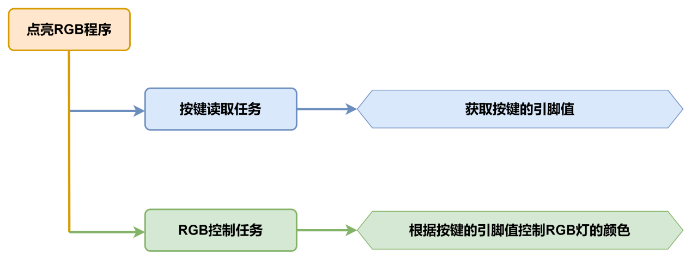

### 6.2.2 板载RGB灯

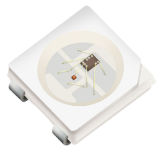

板载RGB灯使用的是RGB LED灯珠，灯珠的RGB三色可单独设置显示亮度，能够实现多彩混合的显示效果。

### 6.2.3 程序下载

> [!NOTE]
>
> - **下载程序前需先将蓝牙模块取下，否则会因串口冲突导致程序下载失败。**
>
> - **接入Type-B下载线时请将电池盒开关拨到“OFF”挡，避免下载线误碰到扩展板的电源引脚，容易造成短路。**
>

1)  在本文档同路径下找到“**02 程序文件\点亮RGB程序**\\**rgb_test\rgb_test.ino”**程序文件。

    

2)  将Arduino通过UNO数据线（Type-B）连接至电脑。

3)  点击**“选择开发板”**选项，软件会自动检测当前Arduino串口，点击进行连接。

    

4)  点击，将程序下载至Arduino中，等待下载完成即可。

    


### 6.2.4 实现效果

打开小车电源后，Arduino扩展板上的RGB彩灯为红色，按下扩展板上的KEY1按键时，RGB彩灯会从红色变为白色，松开按键后则变回红色。

### 6.2.5 程序简要分析

* **导入库文件**

```cpp
#include "FastLED.h"
```

导入本玩法所需要的RGB控制库。

* **定义引脚及创建对象**

1)  定义了一个RGB灯引脚以及按键引脚。

```cpp
const static uint8_t ledPin = 2;
const static uint8_t keyPin = 3;

static CRGB rgbs[1];
```

2)  创建了RGB灯对象，同时还创建了一个用于储存按键状态的变量。

```cpp
static CRGB rgbs[1];

bool keyState;          ///< 按键状态检测
```

* **初始化设置**

1)  在`setup()`函数中，主要是对相关的硬件设备进行初始化。首先是串口，将其通信的波特率设置为9600。

```cpp
void setup() {
  Serial.begin(9600);        // 初始化串口通信
```

2)  将按键引脚配置为输入IO，上电后的引脚值默认为低电平。使用FastLED库初始化扩展板上的RGB灯，并将其连接到ledPin引脚。通过调用`Rgb_Show(255,255,255)`函数设置RGB颜色为白色。

```cpp
  pinMode(keyPin, INPUT);
  FastLED.addLeds<WS2812, ledPin, GRB>(rgbs, 1);
  Rgb_Show(255,255,255);

}
```

* **主程序**

在`loop()`函数中，首先通过`analogRead()`函数读取按键的引脚值，再判断按键引脚值并控制RGB灯的颜色。如果读取到的按键引脚值为0（低电平，表示按键被按下），则控制RGB灯的颜色为白色。若读取到的引脚值为1（高电平，按键未被按下），则控制RGB灯的颜色为红色。

```cpp
void loop() {
  keyState = analogRead(keyPin);
  if(keyState) Rgb_Show(255,0,0);
  else Rgb_Show(255,255,255);
  delay(100);
}
```

* **RGB控制函数**

在`Rgb_Show()`控制函数中，通过传递的三个参数来设置RGB灯的颜色，`rValue`对应的是红色，`gValue`对应的是绿色，`bValue`则对应的是蓝色。R、G、B三种颜色的取值范围是0-255，最后通过`FastLED.show()`函数显示颜色。

```cpp
 /**
 * @brief 设置RGB灯的颜色
 * @param rValue;gValue;bValue;
 * @arg 三个入口参数取值分别为:0~255;
 * @retval None
 * @note (255,0,0)红色 (0,255,0)绿色 (0,0,255)蓝色 (255,255,255)白色
 */
void Rgb_Show(uint8_t rValue,uint8_t gValue,uint8_t bValue) {
  rgbs[0].r = rValue;
  rgbs[0].g = gValue;
  rgbs[0].b = bValue;
  FastLED.show();
}
```

### 6.2.6 功能延伸

这里以修改RGB彩灯的颜色为例来进行说明，从原来的红色修改为绿色。具体修改内容可参考下面步骤：

1. 找到主程序中控制RGB颜色的函数`Rgb_show()`，函数的三个参数分别对应着红色、绿色、蓝色。

```cpp
  if(keyState) Rgb_Show(255,0,0);
```

2. 将原先红色的值改为0，再将绿色的值改为255，即可将RGB灯的颜色更改为绿色。

```cpp
  if(keyState) Rgb_Show(0,255,0);
```

关于RGB颜色表，可前往链接进行查询：[<u>https://www.bchrt.com/tools/rgbcolor/</u>](https://www.bchrt.com/tools/rgbcolor/)

### 6.2.7 常见问题解答

问：代码上传失败。

答：请检查您是否有将蓝牙模块连接至小车上，若有请取出蓝牙模块后再进行下载。

## 6.3 音乐播放说明

本节介绍通过读取Arduino扩展板上的板载按键状态，控制音乐的播放。

### 6.3.1 实现流程图

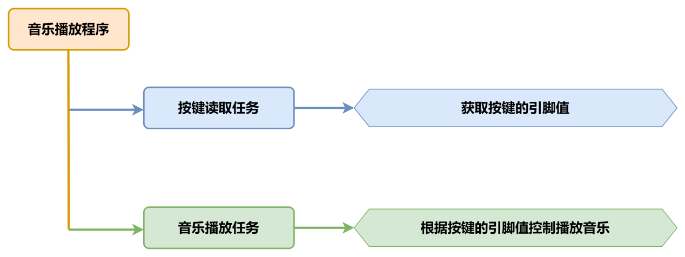

### 6.3.2 板载蜂鸣器

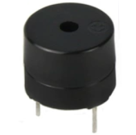

板载蜂鸣器使用的是5V蜂鸣器，通过控制输出PWM信号的频率，即可控制蜂鸣器发出不同声调的声音。

### 6.3.3 程序下载

> [!NOTE]
>
> - **下载程序前需先将蓝牙模块取下，否则会因串口冲突导致程序下载失败。**
>
> - **接入Type-B下载线时请将电池盒开关拨到“OFF”挡，避免下载线误碰到扩展板的电源引脚，造成短路。**
>

1)  在本文档同路径下找到“**02 程序文件\音乐播放程序\buzzer_test\buzzer_test.ino”**程序文件。

    

2)  将Arduino通过UNO数据线（Type-B）连接至电脑。

3)  点击**“选择开发板”**选项，软件会自动检测当前Arduino串口，点击进行连接。

    

4)  点击，将程序下载至Arduino中，等待下载完成即可。

    


### 6.3.4 实现效果

打开小车电源后，按下Arduino扩展板上的KEY1按键后，会控制蜂鸣器发出一段音乐。

### 6.3.5 程序简要分析

* **导入库文件**

```cpp
#include "tone.h"
```

导入本玩法所需要的tone音调库。

* **定义引脚及创建对象**

1)  首先对蜂鸣器播放音乐的音调进行了定义。

```cpp
/* 超级玛丽 */
static int song[98] = {
  NOTE_E4, NOTE_E4, NOTE_E4, NOTE_C4, NOTE_E4, NOTE_G4, NOTE_G3,
  NOTE_C4, NOTE_G3, NOTE_E3, NOTE_A3, NOTE_B3, NOTE_AS3, NOTE_A3, NOTE_G3, NOTE_E4, NOTE_G4, NOTE_A4, NOTE_F4, NOTE_G4, NOTE_E4, NOTE_C4, NOTE_D4, NOTE_B3,
  NOTE_C4, NOTE_G3, NOTE_E3, NOTE_A3, NOTE_B3, NOTE_AS3, NOTE_A3, NOTE_G3, NOTE_E4, NOTE_G4, NOTE_A4, NOTE_F4, NOTE_G4, NOTE_E4, NOTE_C4, NOTE_D4, NOTE_B3,
  NOTE_G4, NOTE_FS4, NOTE_E4, NOTE_DS4, NOTE_E4, NOTE_GS3, NOTE_A3, NOTE_C4, NOTE_A3, NOTE_C4, NOTE_D4, NOTE_G4, NOTE_FS4, NOTE_E4, NOTE_DS4, NOTE_E4, NOTE_C5, NOTE_C5, NOTE_C5,
  NOTE_G4, NOTE_FS4, NOTE_E4, NOTE_DS4, NOTE_E4, NOTE_GS3, NOTE_A3, NOTE_C4, NOTE_A3, NOTE_C4, NOTE_D4, NOTE_DS4, NOTE_D4, NOTE_C4,
  NOTE_C4, NOTE_C4, NOTE_C4, NOTE_C4, NOTE_D4, NOTE_E4, NOTE_C4, NOTE_A3, NOTE_G3, NOTE_C4, NOTE_C4, NOTE_C4, NOTE_C4, NOTE_D4, NOTE_E4,
  NOTE_C4, NOTE_C4, NOTE_C4, NOTE_C4, NOTE_D4, NOTE_E4, NOTE_C4, NOTE_A3, NOTE_G3
  };
```

2. 然后定义了音乐的节拍，每个音调的节拍对应着这个音调的相对持续时间，我们在程序中以一秒一个节拍作为歌曲播放节奏。

```cpp
static int noteDurations[98] = {
  8,4,4,8,4,2,2,
  3,3,3,4,4,8,4,8,8,8,4,8,4,3,8,8,3,
  3,3,3,4,4,8,4,8,8,8,4,8,4,3,8,8,2,
  8,8,8,4,4,8,8,4,8,8,3,8,8,8,4,4,4,8,2,
  8,8,8,4,4,8,8,4,8,8,3,3,3,1,
  8,4,4,8,4,8,4,8,2,8,4,4,8,4,1,
  8,4,4,8,4,8,4,8,2
};
```

3. 对蜂鸣器以及按键引脚进行了定义，同时创建了两个变量，`keyState`用于储存按键的状态，`playMusic`用作判断是否播放音乐。

```
const static uint8_t buzzerPin = 3;    ///< 按键状态检测
const static uint8_t keyPin = A3;
bool keyState;                              ///< 按键状态检测
bool taskStart = 0;
```

* **初始化设置**

1)  在`setup()`函数中，主要是对相关的硬件设备进行初始化。首先是串口，将其通信的波特率设置为9600，并设置读取数据超时时间为500ms。

```
void setup() {
  pinMode(keyPin, INPUT);
  Serial.begin(9600);
  // 设置串行端口读取数据的超时时间
  Serial.setTimeout(500);
}
```

2)  将按键引脚配置为输入IO，上电后的引脚值默认为低电平。

```
  pinMode(keyPin, INPUT);
  Serial.begin(9600);
```

* **主程序**

在`loop()`函数中，首先通过`analogRead()`函数读取按键的引脚值，再判断按键引脚值并控制RGB灯的颜色。如果读取到的按键引脚值为0（低电平，表示按键被按下），则调用`tune_task()`函数控制蜂鸣器播放音乐。

```cpp
void loop() {
  keyState = analogRead(keyPin);  //检测按键状态
  if (!keyState) taskStart = 1;
  if (taskStart)
  {
    tune_task();    // 播放音乐
    taskStart = 0;
  }
}
```

* **音乐播放函数**

1)  循环遍历每一个获取音调和对应的节拍（播放持续时间），首先将节拍换算成对应的播放持续时间；之后将配置信息传至蜂鸣器开始播放。
2)  为了播放的真实效果，每个音调播放完成后需要好有一定时间停顿，我们默认每个音调的停顿间隔=1.3\*播放持续时间。

```cpp
void tune_task(void) {
  for (int thisNote = 0; thisNote <98; thisNote++)
  {
    int noteDuration = 1000/noteDurations[thisNote];
    // 计算每个节拍的时间，以一个节拍一秒为例，四分之一拍就是1000/4毫秒，八分之一拍就是1000/8毫秒
    tone(buzzerPin, song[thisNote],noteDuration);
    int pauseBetweenNotes = noteDuration * 1.10; 
    //每个音符间的停顿间隔，以该音符的130%为佳
    delay(pauseBetweenNotes);
    noTone(buzzerPin);
  }
}
```

### 6.3.6 功能延伸

1. 如果想要修改播放的音乐，可以通过修改蜂鸣器的音调以及节拍来实现。

```cpp
/* 超级玛丽 */
static int song[98] = {
  NOTE_E4, NOTE_E4, NOTE_E4, NOTE_C4, NOTE_E4, NOTE_G4, NOTE_G3,
  NOTE_C4, NOTE_G3, NOTE_E3, NOTE_A3, NOTE_B3, NOTE_AS3, NOTE_A3, NOTE_G3, NOTE_E4, NOTE_G4, NOTE_A4, NOTE_F4, NOTE_G4, NOTE_E4, NOTE_C4, NOTE_D4, NOTE_B3,
  NOTE_C4, NOTE_G3, NOTE_E3, NOTE_A3, NOTE_B3, NOTE_AS3, NOTE_A3, NOTE_G3, NOTE_E4, NOTE_G4, NOTE_A4, NOTE_F4, NOTE_G4, NOTE_E4, NOTE_C4, NOTE_D4, NOTE_B3,
  NOTE_G4, NOTE_FS4, NOTE_E4, NOTE_DS4, NOTE_E4, NOTE_GS3, NOTE_A3, NOTE_C4, NOTE_A3, NOTE_C4, NOTE_D4, NOTE_G4, NOTE_FS4, NOTE_E4, NOTE_DS4, NOTE_E4, NOTE_C5, NOTE_C5, NOTE_C5,
  NOTE_G4, NOTE_FS4, NOTE_E4, NOTE_DS4, NOTE_E4, NOTE_GS3, NOTE_A3, NOTE_C4, NOTE_A3, NOTE_C4, NOTE_D4, NOTE_DS4, NOTE_D4, NOTE_C4,
  NOTE_C4, NOTE_C4, NOTE_C4, NOTE_C4, NOTE_D4, NOTE_E4, NOTE_C4, NOTE_A3, NOTE_G3, NOTE_C4, NOTE_C4, NOTE_C4, NOTE_C4, NOTE_D4, NOTE_E4,
  NOTE_C4, NOTE_C4, NOTE_C4, NOTE_C4, NOTE_D4, NOTE_E4, NOTE_C4, NOTE_A3, NOTE_G3
  };

/* 节拍 */
static int noteDurations[98] = {
  8,4,4,8,4,2,2,
  3,3,3,4,4,8,4,8,8,8,4,8,4,3,8,8,3,
  3,3,3,4,4,8,4,8,8,8,4,8,4,3,8,8,2,
  8,8,8,4,4,8,8,4,8,8,3,8,8,8,4,4,4,8,2,
  8,8,8,4,4,8,8,4,8,8,3,3,3,1,
  8,4,4,8,4,8,4,8,2,8,4,4,8,4,1,
  8,4,4,8,4,8,4,8,2
};

```

2)  具体音调与频率的对照表可参考下图，节拍则需要参照实际乐谱进行修改。

    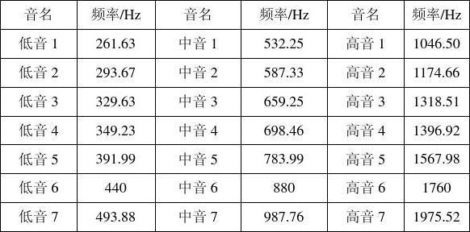

### 6.3.7 常见问题解答

问：代码上传失败。

答：请检查您是否有将蓝牙模块连接至小车上，若有请取出蓝牙模块后再进行下载。

## 6.4 超声波测距说明

本节通过发光超声波模块检测障碍物距离，同时控制超声波模块灯的颜色变化。

### 6.4.1 实现流程图

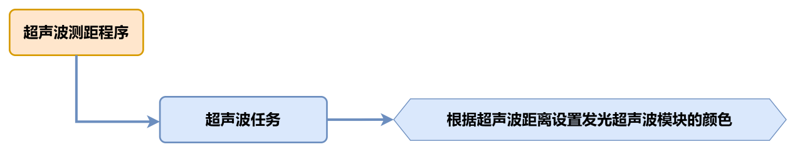

### 6.4.2 超声波传感器

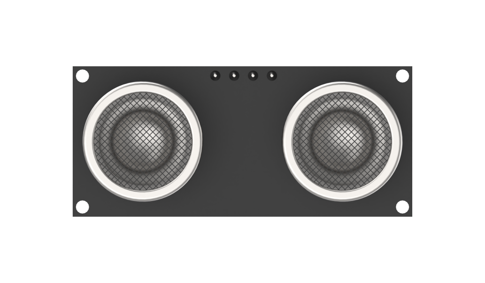

本节课用的是可发光的超声波测距模块，模块采用 IIC 通信接口，能通过 IIC通信进行读取超声波传感器测量的距离。

传感器测距时模块会自动发送 8 个 40khz 的方波，然后检测是否有信号返回； 如果有信号返回，便输出一个高电平，高电平持续的时间就是超声波从发射到返回的时间。

具体公式为：测试距离=(高电平时间\*声速(340M/S))/2。

### 6.4.3 程序下载

> [!NOTE]
>
> - **下载程序前需先将蓝牙模块取下，否则会因串口冲突导致程序下载失败。**
>
> - **接入Type-B下载线时请将电池盒开关拨到“OFF”挡，避免下载线误碰到扩展板的电源引脚，造成短路。**
>

1)  找到并打开本节同目录下的**“02 程序文件\超声波测距程序\ultrasonic_test\\ultrasonic_test.ino”**程序文件。

    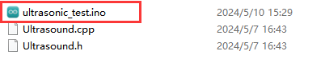

2)  将Arduino通过UNO数据线（Type-B）连接至电脑。点击“**选择开发板**”选项，软件会自动检测当前Arduino串口，点击进行连接。

    

3)  点击，将程序下载至Arduino中，等待下载完成即可。

    


### 6.4.4 实现效果

打开小车电源后，小车上的发光超声波模块会根据所测障碍物的距离，改变发光超声波的颜色。

将障碍物正对超声波模块并移动障碍物使其缓慢靠近。

1.  当**距离\>80mm时**，发光超声波模块上RGB灯模式为红色呼吸灯模式；

2.  当**80mm\>距离\>180mm**时，发光超声波模块上RGB灯为红色渐变模式；

3.  当**180mm\>距离\>320mm**时，发光超声波模块上RGB灯为蓝色渐变模式；

4.  当**320mm\>距离\>500mm**时，发光超声波模块上RGB灯为绿色渐变模式；

5.  当**距离\>500mm**时，发光超声波模块上RGB灯为绿色常亮模式；

### 6.4.5 程序简要分析

* **导入库文件**

```cpp
#include "Ultrasound.h"
```

导入本玩法所需要的控制发光超声波的库文件。

*  **定义变量及创建对象**

首先定义了滤波法数组的容量，以及滤波数据储存变量，接着创建了一个超声波类对象，用于获取距离数据。

```cpp
#define FILTER_N 3                ///< 滤波法数组容量

int Filter_Value;
int filter_buf[FILTER_N + 1];

Ultrasound ultrasound;            ///< 实例化超声波类
```

* **初始化设置**

在`setup()`函数中，主要是串口进行初始化，将其通信的波特率设置为9600。

```cpp
void setup() {
  // put your setup code here, to run once:
  Serial.begin(9600);
}

```

* **主函数**

在主函数中循环调用超声波任务函数，用于实现“超声波检测”中的功能。

```cpp
void loop() {
  // put your main code here, to run repeatedly:
  ultrasonic_distance();
}
```

* **超声波检测**

1. `ultrasonic_distance()`函数，它是用于实现测距并改变灯光的颜色。

```cpp
int ultrasonic_distance(){
  uint8_t s;
  uint16_t distance = Filter();///< 获得滤波器输出值
  Serial.print("Distance: ");///< 获取并且串口打印距离，单位mm
  Serial.print(distance);
  Serial.println(" mm");
```

2. 距离大于0且小于等于80mm时，发光超声波为呼吸灯模式，以0.1s的速度显示红色。

```cpp
  if (distance > 0 && distance <= 80){
      ultrasound.Breathing(1, 0, 0, 1, 0, 0);///< 呼吸灯模式，周期0.1s，颜色红色
  }
```

3. 当距离大于80mm且小于180mm时，发光超声波为红色灯光渐变显示，距离越大则颜色越淡。

```cpp
  else if (distance > 80 && distance <= 180){
      s = map(distance,80,180,0,255);
      ultrasound.Color((255-s), 0, 0, (255-s), 0, 0);///< 红色渐变
  }
```

4. 当距离大于180mm且小于320mm时，发光超声波为蓝色灯光渐变显示，距离越大则颜色越蓝。

```
   else if (distance > 180 && distance <= 320){
      s = map(distance,180,320,0,255);
      ultrasound.Color(0, 0, s, 0, 0, s);///< 蓝色渐变
  }
```

5. 当距离大于320mm且小于500mm时，发光超声波为绿色灯光渐变显示，距离越大则颜色越绿。

```
   else if (distance > 320 && distance <= 500){
      s = map(distance,320,500,0,255);
      ultrasound.Color(0, s, 255-s, 0, s, 255-s);///< 绿色渐变
  }
```

6. 当距离大于500mm时，发光超声波的灯光的颜色固定为绿色。

```
  else if (distance > 500){
      ultrasound.Color(0, 255, 0, 0, 255, 0);///< 绿色
  }
```

### 6.4.6 功能延伸

**这里以修改RGB彩灯渐变时的颜色为例来进行说明，将距离大于80且小于180mm的超声波颜色，从原来的渐变的红色修改为黄色。**具体修改内容可参考下面步骤：

1. 找到程序中控制RGB彩灯随距离变化的映射代码。这里是通过`map`函数设置颜色RGB元素中的R根据s的变化而变化w，`map(distance,80,180,0,255)`是将障碍物的距离distance映射到R元素上。

```
      ultrasound.Color((255-s), 0, 0, (255-s), 0, 0);///< 红色渐变
```

2. 将原先G元素的值更改为与A元素的值相同，需要注意颜色的颜色元素的范围是0~255。然后重新下载程序。这样当障碍物距离在检测范围内时，RGB灯显示出来的渐变色为黄色。

```
      ultrasound.Color((255-s), 0, 0, (255-s), 0, 0);///< 黄色渐变
```

关于RGB颜色表，可前往链接进行查询：[https://www.bchrt.com/tools/rgbcolor/](https://www.bchrt.com/tools/rgbcolor/)

### 6.4.7 常见问题解答

问：超声波测出的距离有时准确，有时不准确。

答：请使用光滑平整的物品进行测距，同时应避免长时间近距离探测障碍物。

## 6.5 超声波跟随说明

本节通过发光超声波模块检测障碍物距离，同时操控小车进行前后移动。

### 6.5.1 实现流程图

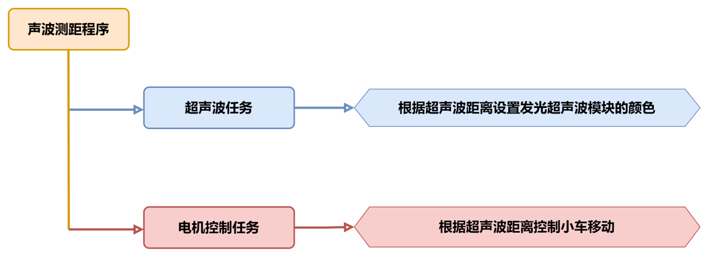

### 6.5.2 超声波传感器


本节课用的是可发光的超声波测距模块，模块采用 IIC 通信接口，能通过 IIC通信进行读取超声波传感器测量的距离。

传感器测距时模块会自动发送 8 个 40khz 的方波，然后检测是否有信号返回； 如果有信号返回，便输出一个高电平，高电平持续的时间就是超声波从发射到返回的时间。

具体公式为：测试距离=(高电平时间\*声速(340M/S))/2。

<p id ="6.5.3"></p>

### 6.5.3 程序下载

> [!NOTE]
>
> - **下载程序前需先将蓝牙模块取下，否则会因串口冲突导致程序下载失败。**
>
> - **接入Type-B下载线时请将电池盒开关拨到“OFF”挡，避免下载线误碰到扩展板的电源引脚，造成短路。**
>

1)  找到并打开本节同目录下的**“02 程序文件\超声波跟随程序\ultrasonic_following\\ultrasonic_following.ino”**程序文件。

    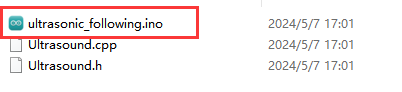

2)  将Arduino通过UNO数据线（Type-B）连接至电脑。点击“**选择开发板**”选项，软件会自动检测当前Arduino串口，点击进行连接。

    

3)  点击，将程序下载至Arduino中，等待下载完成即可。

    


### 6.5.4 实现效果

打开小车电源，小车会根据超声波所测障碍物的距离，改变发光超声波的颜色，并控制小车进行前进或者后退。

将障碍物正对超声波模块并移动障碍物使其缓慢靠近。

1. 超声波灯光颜色变化效果：

（1）当**距离\>80mm时**，发光超声波模块上RGB灯模式为红色呼吸灯模式；

（2）当**80mm\>距离\>180mm**时，发光超声波模块上RGB灯为红色渐变模式；

（3）当**180mm\>距离\>320mm**时，发光超声波模块上RGB灯为蓝色渐变模式；

（4）当**320mm\>距离\>500mm**时，发光超声波模块上RGB灯为绿色渐变模式；

（5）当**距离\>500mm**时，发光超声波模块上RGB灯为绿色常亮模式；

2.  小车控制效果：

（1）当**距离\<200mm时**，控制小车向后移动；

（2）当**300mm\>距离\>=200mm**时，控制小车停止移动；

（3）当**700mm\>距离\>=300mm**时，控制小车向前移动；

（4）当**700mm\<距离**时，控制小车停止移动；

### 6.5.5 程序简要分析

* **导入库文件**

```cpp
#include "Ultrasound.h"
```

导入本玩法所需要的控制发光超声波的库文件。

* **定义变量及创建对象**

首先创建了一个超声波类，用于获取距离数据，接着创建了`pwm_min`变量，用于存储pwm的最小映射值，然后创建了一个数组对数字电机引脚进行了定义,最后创建了dis变量，用于储存超声波距离的值。

```cpp
Ultrasound ultrasound;  //实例化超声波类

const static uint8_t pwm_min = 50;
const static uint8_t motorpwmPin[4] = { 10, 9, 6, 11} ;
const static uint8_t motordirectionPin[4] = { 12, 8, 7, 13};

uint16_t dis;
```

* **初始化设置**

在`setup()`函数中，主要是串口进行初始化，将其通信的波特率设置为9600，接着调用了`Motor_Init()`函数绑定电机并对电机进行初始化。

```cpp
void setup() {
  Serial.begin(9600);
  Motor_Init();
}
```

* **主函数**

在主函数中循环调用超声波任务函数，用于获取距离数据以及设置发光超声波的颜色，通过对所测得的数据，进行判断后再对小车进行控制。

```cpp
void loop() {
  ultrasonic_distance();
  dis = ultrasonic_distance();
  if(dis >=700) Velocity_Controller( 0, 0, 0, 0);
  if(dis >= 300 && dis < 700) Velocity_Controller( 0,50, 0, 0);
  if(dis >= 200 && dis < 300) Velocity_Controller( 0, 0, 0, 0);
  if(dis < 200) Velocity_Controller( 180, 50, 0, 0); 
}
```

* **超声波检测**

1. 调用`loop`主函数中的超声波任务函数`ultrasonic_distance()`，它是用于实现测距并改变灯光的颜色。

```cpp
uint16_t ultrasonic_distance(){
  uint8_t s;
  uint16_t distance = Filter();         // 获得滤波器输出值
  Serial.print("Distance: ");Serial.print(distance);Serial.println(" mm"); //获取并且串口打印距离，单位mm

```

2. 距离大于0且小于等于80mm时，发光超声波为呼吸灯模式，以0.1s的速度显示红色。

```cpp
  if (distance > 0 && distance <= 80){
      ultrasound.Breathing(1, 0, 0, 1, 0, 0);       //呼吸灯模式，周期0.1s，颜色红色
   }
```

3. 当距离大于80mm且小于180mm时，发光超声波为红色灯光渐变显示，距离越大则颜色越淡。

```cpp
  else if (distance > 80 && distance <= 180){
      s = map(distance,80,180,0,255);
      ultrasound.Color((255-s), 0, 0, (255-s), 0, 0); //红色渐变
   }
```

4. 当距离大于180mm且小于320mm时，发光超声波为蓝 色灯光渐变显示，距离越大则颜色越蓝。

```cpp
   else if (distance > 180 && distance <= 320){
      s = map(distance,180,320,0,255);
      ultrasound.Color(0, 0, s, 0, 0, s);            //蓝色渐变
   }
```

5. 当距离大于320mm且小于500mm时，发光超声波为绿色灯光渐变显示，距离越大则颜色越绿。

```cpp
   else if (distance > 320 && distance <= 500){
      s = map(distance,320,500,0,255);
      ultrasound.Color(0, s, 255-s, 0, s, 255-s);            //绿色渐变
   }
```

6. 当距离大于500mm时，发光超声波的灯光的颜色固定为绿色。

```cpp
  else if (distance > 500){
      ultrasound.Color(0, 255, 0, 0, 255, 0);        //绿色
   }
```

* **速度控制函数**

在速度控制函数中，根据麦克纳姆轮的运动学分析进行计算各个电机的控制数值，`angle`参数用于设置小车的运动方向（车头的方向为0度，逆时针为正方向），`velocity`参数用于控制小车的速度，`rot`参数用于控制小车的自转方向（大于0为逆时针旋转，小于0为顺时针旋转），`drift`参数用于控制小车是否开启漂移功能。

```
/**
 * @brief 速度控制函数
 * @param angle   用于控制小车的运动方向，小车以车头为0度方向，逆时针为正方向。
 *                取值为0~359
 * @param velocity   用于控制小车速度，取值为0~100。
 * @param rot     用于控制小车的自转速度，取值为-100~100，若大于0小车有一个逆
 *                 时针的自转速度，若小于0则有一个顺时针的自转速度。
 * @param drift   用于决定小车是否开启漂移功能，取值为0或1，若为0则开启，反之关闭。
 * @retval None
 */
void Velocity_Controller(uint16_t angle, uint8_t velocity,int8_t rot,bool drift) {
  int8_t velocity_0, velocity_1, velocity_2, velocity_3;
  float speed = 1;
  angle += 90;
  float rad = angle * PI / 180;
  if (rot == 0) speed = 1;///< 速度因子
  else speed = 0.5; 
  velocity /= sqrt(2);
  if (drift) {
    velocity_0 = (velocity * sin(rad) - velocity * cos(rad)) * speed;
    velocity_1 = (velocity * sin(rad) + velocity * cos(rad)) * speed;
    velocity_2 = (velocity * sin(rad) - velocity * cos(rad)) * speed - rot * speed * 2;
    velocity_3 = (velocity * sin(rad) + velocity * cos(rad)) * speed + rot * speed * 2;
  } else {
    velocity_0 = (velocity * sin(rad) - velocity * cos(rad)) * speed + rot * speed;
    velocity_1 = (velocity * sin(rad) + velocity * cos(rad)) * speed - rot * speed;
    velocity_2 = (velocity * sin(rad) - velocity * cos(rad)) * speed - rot * speed;
    velocity_3 = (velocity * sin(rad) + velocity * cos(rad)) * speed + rot * speed;
  }
  Motors_Set(velocity_0, velocity_1, velocity_2, velocity_3);
}
```

* **电机控制函数**

通过速度控制函数中计算所得的各个电机的控制数值，对各个电机进行pwm控制。motors数组用于将各个电机的速度值映射为pwm值，`pwm_set`数组用于控制给各个电机输出的pwm值。

```cpp
/**
 * @brief PWM与轮子转向设置函数
 * @param Motor_x   作为PWM与电机转向的控制数值。根据麦克纳姆轮的运动学分析求得。
 * @retval None
 */
void Motors_Set(int8_t Motor_0, int8_t Motor_1, int8_t Motor_2, int8_t Motor_3) {
  int8_t pwm_set[4];
  int8_t motors[4] = { Motor_0, Motor_1, Motor_2, Motor_3};
  bool direction[4] = { 1, 0, 0, 1};///< 前进 左1 右0
  for(uint8_t i; i < 4; ++i) {
    if(motors[i] < 0) direction[i] = !direction[i];
    else direction[i] = direction[i];

    if(motors[i] == 0) pwm_set[i] = 0;
    else pwm_set[i] = map(abs(motors[i]), 0, 100, pwm_min, 255);

    digitalWrite(motordirectionPin[i], direction[i]); 
    analogWrite(motorpwmPin[i], pwm_set[i]); 
  }
}
```

### 6.5.6 功能延伸

这里以修改超声波跟随后退的阈值为例，将原先的200mm修改为100mm。

1. 找到代码中识别到距离小于200mm时，控制小车进行后退的代码，将原先的200mm修改为100mm。

```cpp
void loop() {
  ultrasonic_distance();
  dis = ultrasonic_distance();
  if(dis >=700) Velocity_Controller( 0, 0, 0, 0);
  if(dis >= 300 && dis < 700) Velocity_Controller( 0,50, 0, 0);
  if(dis >= 200 && dis < 300) Velocity_Controller( 0, 0, 0, 0);
  if(dis < 100) Velocity_Controller( 180, 50, 0, 0); 
}
```

2)  修改完成后，参照“[6.5.3程序下载](#_6-5-3-程序下载)”重新下载程序即可。

### 6.5.7 常见问题解答

问：超声波测出的距离有时准确，有时不准确。

答：请使用光滑平整的物品进行测距，同时应避免长时间近距离探测障碍物。

## 6.6 超声波避障说明

本节通过发光超声波模块检测障碍物距离，同时操控小车向右转向进行避障。

### 6.6.1 实现流程图

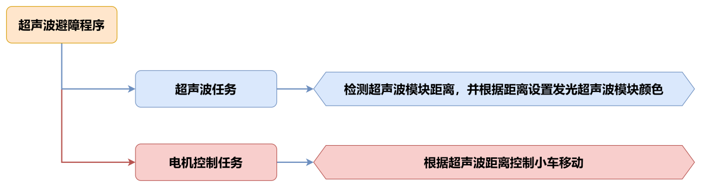

### 6.6.2 超声波传感器


本节课用的是可发光的超声波测距模块，模块采用 IIC 通信接口，能通过 IIC通信进行读取超声波传感器测量的距离。

传感器测距时模块会自动发送 8 个 40khz 的方波，然后检测是否有信号返回； 如果有信号返回，便输出一个高电平，高电平持续的时间就是超声波从发射到返回的时间。

具体公式为：测试距离=(高电平时间\*声速(340M/S))/2。

<p id ="6.6.3"></p>

### 6.6.3 程序下载

> [!NOTE]
>
> - **下载程序前需先将蓝牙模块取下，否则会因串口冲突导致程序下载失败。**
>
> - **接入Type-B下载线时请将电池盒开关拨到“OFF”挡，避免下载线误碰到扩展板的电源引脚，造成短路。**
>

1)  找到并打开本节同目录下的**“02 程序文件\超声波避障程序\ultrasonic_avoid\\ultrasonic_avoid.ino”**程序文件。

    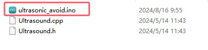

2)  将Arduino通过UNO数据线（Type-B）连接至电脑。点击“**选择开发板**”选项，软件会自动检测当前Arduino串口，点击进行连接。

    

3)  点击，将程序下载至Arduino中，等待下载完成即可。

    


### 6.6.4 实现效果

打开小车电源，检测到板载按键被按下后，小车会以100的速度向前移动，同时小车会根据超声波所测障碍物的距离，改变发光超声波的颜色，并控制小车进行转向。

将障碍物正对超声波模块并移动障碍物使其缓慢靠近。

1. 超声波灯光颜色变化效果：

（1）当**距离\>80mm时**，发光超声波模块上RGB灯模式为红色呼吸灯模式；

（2）当8**0mm\>距离\>180mm**时，发光超声波模块上RGB灯为红色渐变模式；

（3）当18**0mm\>距离\>320mm**时，发光超声波模块上RGB灯为蓝色渐变模式；

（4）当32**0mm\>距离\>500mm**时，发光超声波模块上RGB灯为绿色渐变模式；

（5）当**距离\>500mm**时，发光超声波模块上RGB灯为绿色常亮模式；

2.  小车控制效果：

（1）当**距离\>=300mm时**，控制小车向前移动；

（2）当**距离\<300mm时**，控制小车右进行转向；

### 6.6.5 程序简要分析

* **导入库文件**

```cpp
#include "Ultrasound.h"
```

导入本玩法所需要的控制发光超声波的库文件。

* **定义变量及创建对象**

首先创建了一个超声波类，用于获取距离数据，接着创建了`pwm_min`变量，用于存储pwm的最小映射值，然后创建了一个数组对数字电机引脚进行了定义,最后创建了dis变量，用于储存超声波距离的值。

```cpp
Ultrasound ultrasound;  ///< 实例化超声波类

const static uint8_t keyPin = 3;
const static uint8_t pwm_min = 50;
const static uint8_t motorpwmPin[4] = { 10, 9, 6, 11} ;
const static uint8_t motordirectionPin[4] = { 12, 8, 7, 13};
```

* **初始化设置**

在setup()函数中，主要是串口进行初始化，将其通信的波特率设置为9600，接着调用了`Motor_Init()`函数绑定电机并对电机进行初始化。

```cpp
void setup() {
  Serial.begin(9600);
  pinMode(keyPin, INPUT);
  Motor_Init();
}
```

* **主函数**

在主函数中按键被按下后，进入到超声波避障玩法功能中，循环调用超声波任务函数，用于获取距离数据以及设置发光超声波的颜色，通过对所测得的数据，进行判断后再对小车进行控制。

```cpp
void loop() {
  keyState = analogRead(keyPin);
  if(!keyState) taskStart = 1;
  if(taskStart) {
    ultrasonic_distance();
    dis = ultrasonic_distance();
    Velocity_Controller( 0, 100, 0, 0);
    while(dis < 300) {
      dis = ultrasonic_distance();
      Velocity_Controller( 0, 0, -100, 0);
    }  
  }
}
```

* **超声波检测**

1. 调用loop主函数中的超声波任务函数`ultrasonic_distance()`，它是用于实现测距并改变灯光的颜色。

```cpp
uint16_t ultrasonic_distance(){
  uint8_t s;
  uint16_t distance = Filter();                                               ///< 获得滤波器输出值
  Serial.print("Distance: ");Serial.print(distance);Serial.println(" mm"); ///< 获取并且串口打印距离，单位mm
```

2. 距离大于0且小于等于80mm时，发光超声波为呼吸灯模式，以0.1s的速度显示红色。

```cpp
  if (distance > 0 && distance <= 80){
      ultrasound.Breathing(1, 0, 0, 1, 0, 0);                                 ///< 呼吸灯模式，周期0.1s，颜色红色
   }
```

3. 当距离大于80mm且小于180mm时，发光超声波为红色灯光渐变显示，距离越大则颜色越淡。

```cpp
  else if (distance > 80 && distance <= 180){
      s = map(distance,80,180,0,255);
      ultrasound.Color((255-s), 0, 0, (255-s), 0, 0);                         ///< 红色渐变
   }
```

4. 当距离大于180mm且小于320mm时，发光超声波为蓝色灯光渐变显示，距离越大则颜色越蓝。

```cpp
   else if (distance > 180 && distance <= 320){
      s = map(distance,180,320,0,255);
      ultrasound.Color(0, 0, s, 0, 0, s);                                     ///< 蓝色渐变
   }
```

5. 当距离大于320mm且小于500mm时，发光超声波为绿色灯光渐变显示，距离越大则颜色越绿。

```cpp
   else if (distance > 320 && distance <= 500){
      s = map(distance,320,500,0,255);
      ultrasound.Color(0, s, 255-s, 0, s, 255-s);                             ///< 绿色渐变
   }
```

6. 当距离大于500mm时，发光超声波的灯光的颜色固定为绿色。

```
  else if (distance > 500){
      ultrasound.Color(0, 255, 0, 0, 255, 0);                                 ///< 绿色
   }
```

* **速度控制函数**

在速度控制函数中，根据麦克纳姆轮的运动学分析进行计算各个电机的控制数值，angle参数用于设置小车的运动方向（车头的方向为0度，逆时针为正方向），`velocity`参数用于控制小车的速度，rot参数用于控制小车的自转方向（大于0为逆时针旋转，小于0为顺时针旋转），drift参数用于控制小车是否开启漂移功能。

```cpp
/**
 * @brief 速度控制函数
 * @param angle   用于控制小车的运动方向，小车以车头为0度方向，逆时针为正方向。
 *                取值为0~359
 * @param velocity   用于控制小车速度，取值为0~100。
 * @param rot     用于控制小车的自转速度，取值为-100~100，若大于0小车有一个逆
 *                 时针的自转速度，若小于0则有一个顺时针的自转速度。
 * @param drift   用于决定小车是否开启漂移功能，取值为0或1，若为0则开启，反之关闭。
 * @retval None
 */
void Velocity_Controller(uint16_t angle, uint8_t velocity,int8_t rot,bool drift) {
  int8_t velocity_0, velocity_1, velocity_2, velocity_3;
  float speed = 1;
  angle += 90;
  float rad = angle * PI / 180;
  if (rot == 0) speed = 1;///< 速度因子
  else speed = 0.5; 
  velocity /= sqrt(2);
  if (drift) {
    velocity_0 = (velocity * sin(rad) - velocity * cos(rad)) * speed;
    velocity_1 = (velocity * sin(rad) + velocity * cos(rad)) * speed;
    velocity_2 = (velocity * sin(rad) - velocity * cos(rad)) * speed - rot * speed * 2;
    velocity_3 = (velocity * sin(rad) + velocity * cos(rad)) * speed + rot * speed * 2;
  } else {
    velocity_0 = (velocity * sin(rad) - velocity * cos(rad)) * speed + rot * speed;
    velocity_1 = (velocity * sin(rad) + velocity * cos(rad)) * speed - rot * speed;
    velocity_2 = (velocity * sin(rad) - velocity * cos(rad)) * speed - rot * speed;
    velocity_3 = (velocity * sin(rad) + velocity * cos(rad)) * speed + rot * speed;
  }
  Motors_Set(velocity_0, velocity_1, velocity_2, velocity_3);
}
```

* **电机控制函数**

通过速度控制函数中计算所得的各个电机的控制数值，对各个电机进行pwm控制。motors数组用于将各个电机的速度值映射为pwm值，`pwm_set`数组用于控制给各个电机输出的pwm值。

```cpp
/**
 * @brief PWM与轮子转向设置函数
 * @param Motor_x   作为PWM与电机转向的控制数值。根据麦克纳姆轮的运动学分析求得。
 * @retval None
 */
void Motors_Set(int8_t Motor_0, int8_t Motor_1, int8_t Motor_2, int8_t Motor_3) {
  int8_t pwm_set[4];
  int8_t motors[4] = { Motor_0, Motor_1, Motor_2, Motor_3};
  bool direction[4] = { 1, 0, 0, 1};///< 前进 左1 右0
  for(uint8_t i; i < 4; ++i) {
    if(motors[i] < 0) direction[i] = !direction[i];
    else direction[i] = direction[i];

    if(motors[i] == 0) pwm_set[i] = 0;
    else pwm_set[i] = map(abs(motors[i]), 0, 100, pwm_min, 255);

    digitalWrite(motordirectionPin[i], direction[i]); 
    analogWrite(motorpwmPin[i], pwm_set[i]); 
  }
}

```

### 6.6.6 功能延伸

这里以修改小车转向的方向为例来进行说明，将遇到障碍物向右转，修改为向左转。具体修改内容可参考下面步骤：

1. 找到程序中控制小车转向的代码。这里是通过`Velocity_Controller()`函数来控制小车以100的速度顺时针向右旋转（小于0为顺时针旋转，大于0则为逆时针旋转）。

```cpp
      Velocity_Controller( 0, 0, -100, 0);
```

2. 将原先-100的值更改为100，此时小车就会以100的速度逆时针旋向左旋转了。

```cpp
      Velocity_Controller( 0, 0, 100, 0);
```

### 6.6.7 常见问题解答

问：代码上传后超声波测出的距离一直为0。

答：请检查您是否将4pin线连接至正确的IIC接口。

问：超声波测出的距离有时准确，有时不准确。

答：请使用光滑平整的物品进行测距，同时应避免长时间近距离探测障碍物。

## 6.7 智能巡线说明

本节通过四路巡线传感器识别黑色的线路，再控制小车跟随线路移动。

### 6.7.1 实现流程图

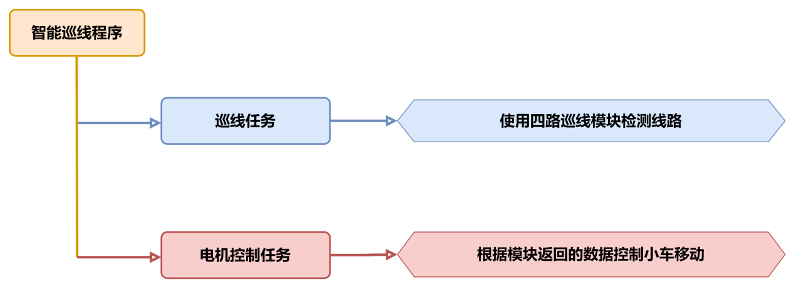

### 6.7.2 四路巡线传感器


本节课用的是四路巡线模块，模块采用 IIC 通信接口，能通过 IIC通信进行读取传感器探头上的数据。

传感器有四个探头，每个探头都有一个红外发射器和一个红外接收器，白色对红外反射强，黑色对红外反射弱，由此可以判断是否识别到路线。

### 6.7.3 程序下载

> [!NOTE]
>
> - **下载程序前需先将蓝牙模块取下，否则会因串口冲突导致程序下载失败。**
>
> - **接入Type-B下载线时请将电池盒开关拨到“OFF”挡，避免下载线误碰到扩展板的电源引脚，造成短路。**
>

1)  找到并打开本节同目录下的**“02 程序文件\智能巡线程序\tracking_test\\tracking_test.ino”**程序文件。

    

2)  将Arduino通过UNO数据线（Type-B）连接至电脑。点击“**选择开发板**”选项，软件会自动检测当前Arduino串口，点击进行连接。

    

3)  点击，将程序下载至Arduino中，等待下载完成即可。

    


### 6.7.4 实现效果

先将小车放置在黑色线路上，打开小车电源，检测到板载按键被按下后，小车会进入到巡线程序中。当小车识别到黑色线时，会跟随黑线进行移动，若未识别到黑线则会进行后退，直到重新识别到黑线。

> [!NOTE]
>
> **在开始巡线程序前，请先将小车放置在黑线上，否则小车会一直后退。**

### 6.7.5 程序简要分析

* **导入库文件**

```cpp
#include <Wire.h>
#include "FastLED.h"
```

导入本玩法所需要的IIC通信、RGB灯库文件。

* **定义变量及创建对象**

1. 首先定义了四路巡线传感器的IIC通讯地址，接着定义了板载RGB灯引脚、板载按键引脚、以及电机的引脚。

```cpp
#define LINE_FOLLOWER_I2C_ADDR 0x78 /* 巡线传感器的iic地址 */

const static uint8_t ledPin = 2;
const static uint8_t keyPin = 3;
const static uint8_t pwm_min = 50;
const static uint8_t motorpwmPin[4] = { 10, 9, 6, 11 };
const static uint8_t motordirectionPin[4] = { 12, 8, 7, 13 };
const static uint8_t TRACKING = 4;
```

2. 创建了RGB灯控制对象，modestate变量用于设置小车的执行模式，本程序用的是巡线模式。

```
static CRGB rgbs[1];
static uint8_t modestate = TRACKING;
```

* **初始化设置**

1. 在`setup()`函数中，主要是串口进行初始化，将其通信的波特率设置为9600，接着将按键引脚配置为输入模式，使用FastLED库初始化扩展板上的RGB灯，并将其连接到ledPin引脚。通过`Rgb_Show(255,255,255)`设置RGB灯的颜色为白色。

```cpp
void setup() {
  /* 配置通信 */
  Serial.begin(9600);

  pinMode(keyPin, INPUT);
  FastLED.addLeds<WS2812, ledPin, GRB>(rgbs, 1);
  Rgb_Show(255, 255, 255);

  Wire.begin();
  Motor_Init();
}
```

2. 通过`Wire.begin()`初始化IIC通讯，调用`Motor_Init()`绑定并初始化电机引脚。

```cpp
  Wire.begin();
  Motor_Init();
```

* **主函数**

在主函数中检测到按键被按下后，将循环调用`Sensor_Receive()`函数获取四路巡线传感器的值，进行判断后再对小车进行控制。接着调用`Task_Dispatcher()`函数执行巡线追踪任务。

```cpp
void loop() {
  keyState = analogRead(keyPin);
  if (!keyState) taskStart = 1;
  if (taskStart) {
    Sensor_Receive();
    Task_Dispatcher();
  }
}
```

* **获取传感器数据**

通过`WireReadDataByte()`函数向传感器获取当前的路线数据，rec_data数组第0-3位对应的是四路巡线传感器上Sensor1-4探头的值。若获取到的值为0表示未识别到黑线，获取到的值为1则表示识别到黑线，最后将值保存在数组`rec_data`中。

```cpp
/* 获取传感器数据 */
void Sensor_Receive(void) {
  WireReadDataByte(1, data);
  rec_data[0] = data & 0x01;
  rec_data[1] = (data >> 1) & 0x01;
  rec_data[2] = (data >> 2) & 0x01;
  rec_data[3] = (data >> 3) & 0x01;
}
```

* **任务调度函数**

在任务调度函数中，将会执行设置好的对应任务，通过modestate变量的值来执行相应的任务。

```cpp
/* 任务调度 */
void Task_Dispatcher() {
  switch (modestate) {
    case TRACKING:
      Tracking_Line_Task();
      break;
  }
}
```

* **巡线追踪任务**

1. 首先调用`Rgb_Show(255,0,0)`函数将板载RGB设置为红色，对接收到的传感器数据进行判断，若Sensor2、Sensor3探头同时识别到黑线，则控制小车向前直行。

```cpp
void Tracking_Line_Task(void) {
  Rgb_Show(255, 0, 0);
  if (rec_data[1] == 1 && rec_data[2] == 1) {
    Velocity_Controller(0, 80, 0, 0);
  }
```

2. 如果Sensor2探头识别到黑线而Sensor3探头未识别到黑线，此时将控制小车向左偏65°前进。若Sensor3识别到黑线，而Sensor2未识别到，则向右偏65°进行移动。

```cpp
  if (rec_data[1] == 1 && rec_data[2] == 0) {
    Velocity_Controller(0, 80, 65, 0);
  }
  if (rec_data[1] == 0 && rec_data[2] == 1) {
    Velocity_Controller(0, 80, -65, 0);
  }
```

3. 当Sensor2和Sensor3都未识别到黑线时，控制小车进行后退。

```cpp
  while (rec_data[1] == 0 && rec_data[2] == 0) {
    Sensor_Receive();
    Velocity_Controller(0, 0, 0, 0);
  }
```

* **速度控制函数**

在速度控制函数中，根据麦克纳姆轮的运动学分析进行计算各个电机的控制数值，angle参数用于设置小车的运动方向（车头的方向为0度，逆时针为正方向），velocity参数用于控制小车的速度，rot参数用于控制小车的自转方向（大于0为逆时针旋转，小于0为顺时针旋转），drift参数用于控制小车是否开启漂移功能。

```cpp
void Velocity_Controller(uint16_t angle, uint8_t velocity, int8_t rot, bool drift) {
  int8_t velocity_0, velocity_1, velocity_2, velocity_3;
  float speed = 1;
  angle += 90;
  float rad = angle * PI / 180;
  if (rot == 0) speed = 1;  ///< 速度因子
  else speed = 0.5;
  velocity /= sqrt(2);
  if (drift) {
    velocity_0 = (velocity * sin(rad) - velocity * cos(rad)) * speed;
    velocity_1 = (velocity * sin(rad) + velocity * cos(rad)) * speed;
    velocity_2 = (velocity * sin(rad) - velocity * cos(rad)) * speed - rot * speed * 2;
    velocity_3 = (velocity * sin(rad) + velocity * cos(rad)) * speed + rot * speed * 2;
  } else {
    velocity_0 = (velocity * sin(rad) - velocity * cos(rad)) * speed + rot * speed;
    velocity_1 = (velocity * sin(rad) + velocity * cos(rad)) * speed - rot * speed;
    velocity_2 = (velocity * sin(rad) - velocity * cos(rad)) * speed - rot * speed;
    velocity_3 = (velocity * sin(rad) + velocity * cos(rad)) * speed + rot * speed;
  }
  Motors_Set(velocity_0, velocity_1, velocity_2, velocity_3);
}
```

* **电机控制函数**

通过速度控制函数中计算所得的各个电机的控制数值，对各个电机进行pwm控制。motors数组用于将各个电机的速度值映射为pwm值，`pwm_set`数组用于控制给各个电机输出的pwm值。

```cpp
/**
 * @brief PWM与轮子转向设置函数
 * @param Motor_x   作为PWM与电机转向的控制数值。根据麦克纳姆轮的运动学分析求得。
 * @retval None
 */
void Motors_Set(int8_t Motor_0, int8_t Motor_1, int8_t Motor_2, int8_t Motor_3) {
  int8_t pwm_set[4];
  int8_t motors[4] = { Motor_0, Motor_1, Motor_2, Motor_3 };
  bool direction[4] = { 1, 0, 0, 1 };  ///< 前进 左1 右0
  for (uint8_t i; i < 4; ++i) {
    if (motors[i] < 0) direction[i] = !direction[i];
    else direction[i] = direction[i];

    if (motors[i] == 0) pwm_set[i] = 0;
    else pwm_set[i] = map(abs(motors[i]), 0, 100, pwm_min, 255);

    digitalWrite(motordirectionPin[i], direction[i]);
    analogWrite(motorpwmPin[i], pwm_set[i]);
  }
}
```

### 6.7.6 功能延伸

1)  如果巡线传感器识别不到黑色线路，那么就需要对巡线传感器的电位器进行调节，巡线传感器上的旋钮顺时针扭动会增加识别的距离，逆时针扭动则会缩短识别的距离。

2)  需要将巡线传感器调节至识别到黑线，传感器上的LED灯会熄灭，识别不到黑线会亮起为止。

3)  这里我们将旋钮逆时针扭动，缩短识别的距离，调节好之后就可以正常进行巡线了。

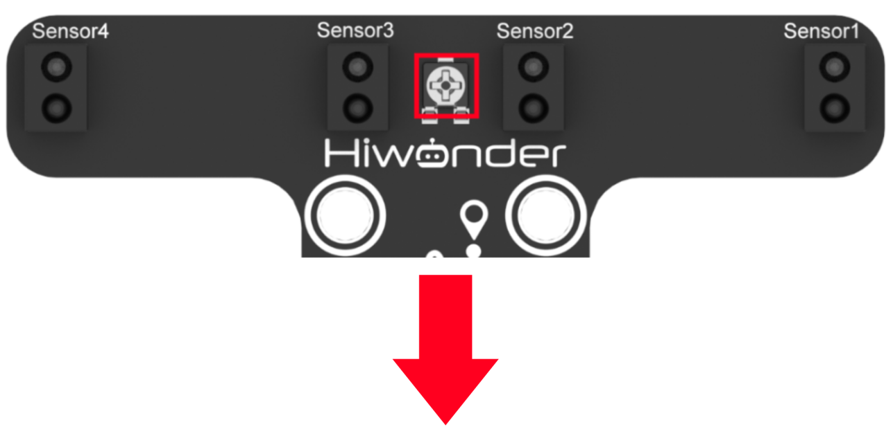

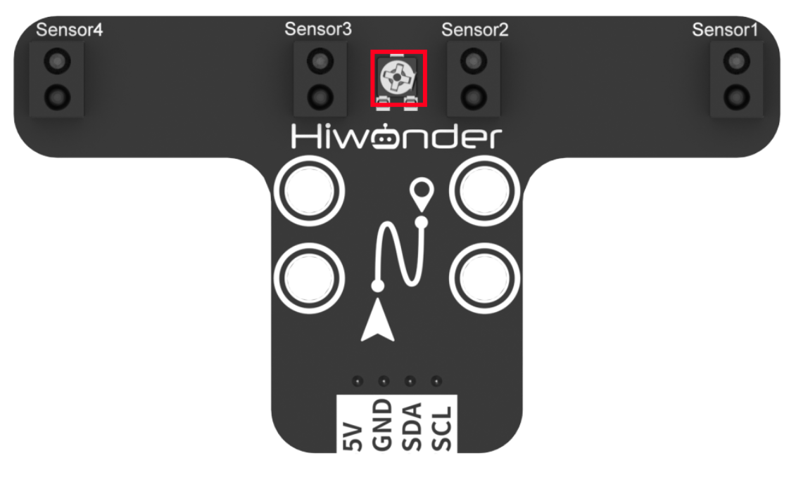

### 6.7.7 常见问题解答

问1：代码上传后小车一直进行后退。

答：请在运行代码前先将小车放置在黑线上方。

问2：四路巡线传感器的识别不准确。

答：请将四路巡线传感器上的电位器调整至合适位置。

## 6.8 行人检测说明

本节通过四路巡线传感器识别黑色的线路，控制小车跟随线路移动，若在巡线中超声波检测到有行人在线路上，则控制小车进行规避。

### 6.8.1 实现流程图

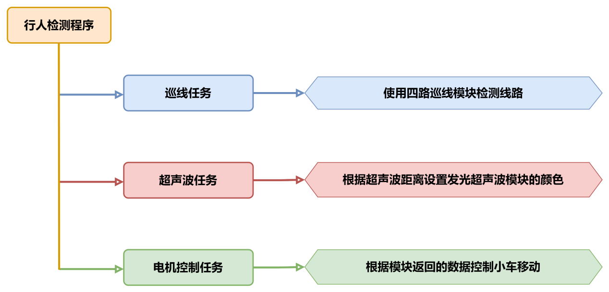

### 6.8.2 模块介绍

1)  四路巡线模块

    四路巡线模块采用 IIC 通信接口，能通过 IIC通信进行读取传感器探头上的数据；

    

该模块有四个探头，每个探头都有一个红外发射器和一个红外接收器，白色对红外反射强，黑色对红外反射弱，由此可以判断是否识别到路线。

2)  超声波模块

超声波模块采用 IIC 通信接口，能通过 IIC通信进行读取超声波传感器测量的距离。 同时超声波探头位置集成两个 RGB 灯，不仅能调节灯光亮度，还可以通过对红(R)、 绿(G)、蓝(B)三个颜色通道的变化以及它们相互之间的叠加，实现多彩颜色变化。


测距时模块会自动发送 8 个 40khz 的方波，然后检测是否有信号返回；如果有信号返回，便输出一个高电平，高电平持续的时间就是超声波从发射到返回的时间。

### 6.8.3 程序下载

> [!NOTE]
>
> - **下载程序前需先将蓝牙模块取下，否则会因串口冲突导致程序下载失败。**
>
> - **接入Type-B下载线时请将电池盒开关拨到“OFF”挡，避免下载线误碰到扩展板的电源引脚，造成短路。**
>

1)  找到并打开本节同目录下的**“02 程序文件\行人检测程序\tracking_avoid\\tracking_avoid.ino”**程序文件。

    

2)  将Arduino通过UNO数据线（Type-B）连接至电脑。点击“**选择开发板**”选项，软件会自动检测当前Arduino串口，点击进行连接。

    

3)  点击，将程序下载至Arduino中，等待下载完成即可。

    


### 6.8.4 实现效果

先将小车放置在黑色线路上，按键被按下后，小车会进入到巡线程序中。

当小车识别到黑色线时，会跟随黑线进行移动，若未识别到黑线则会进行后退，直到重新识别到黑线。在巡线的过程中如果超声波检测到前方有行人，则控制小车停止运行。

> [!NOTE]
>
> **在开始巡线程序前，请先将小车放置在黑线上，否则小车会一直后退。**

### 6.8.5 程序简要分析

* **导入库文件**

```cpp
#include <Wire.h>
#include "Ultrasound.h"
#include "FastLED.h"
```

导入本玩法所需要的IIC通信、RGB灯、发光超声波库文件。

* **定义变量及创建对象**

1. 首先定义了四路巡线传感器的IIC通讯地址，以及滤波算法的容量大小，接着创建了一个超声波对象。

```
#define LINE_FOLLOWER_I2C_ADDR 0x78/* 寻线传感器的iic地址 */ 
#define FILTER_N 3                //递推平均滤波法

Ultrasound ultrasound;  //实例化超声波类
```

2. 定义了板载RGB灯引脚、板载按键引脚、以及电机的引脚，TRACKING变量用于表示巡线模式，AVOID是检测到行人所需进入的模式。

```
const static uint8_t ledPin = 2;
const static uint8_t keyPin = 3;
const static uint8_t buzzerPin = 3;
const static uint8_t pwm_min = 50;
const static uint8_t motorpwmPin[4] = { 10, 9, 6, 11} ;
const static uint8_t motordirectionPin[4] = { 12, 8, 7, 13};
const static uint8_t TRACKING = 4;
const static uint8_t AVOID = 6;
```

3. 创建了RGB灯控制对象，`modestate`变量用于设置小车的执行模式，默认为巡线模式。

```
static CRGB rgbs[1];
static uint8_t modestate = TRACKING;
```

* **初始化设置**

1. 在`setup()`函数中，主要是串口进行初始化，将其通信的波特率设置为9600，接着将按键引脚配置为输入模式，使用FastLED库初始化扩展板上的RGB灯，并将其连接到ledPin引脚。通过`Rgb_Show(255,255,255)`设置RGB灯的颜色为白色。

```
void setup(){
  /* 配置通信 */
  Serial.begin(9600);

  pinMode(keyPin, INPUT);
  FastLED.addLeds<WS2812, ledPin, GRB>(rgbs, 1);
  Rgb_Show(255,255,255);
  
  Wire.begin();
  Motor_Init();
  
}
```

2. 通过`Wire.begin()`初始化IIC通讯，调用`Motor_Init()`绑定并初始化电机引脚。

```
  Wire.begin();
  Motor_Init();
```

* **主函数**

在主函数中检测到按键被按下后，将循环调用`Sensor_Receive()`函数获取四路巡线传感器的值，用于检测黑线。再通过`ultrasonic_distance()`函数获取超声波的距离，用于检测是否有识别到行人。最后进行判断对小车进行控制。接着调用`Task_Dispatcher()`函数执行相应任务。

```
void loop(){
  keyState = analogRead(keyPin);
  if(!keyState) taskStart = 1;
  if(taskStart) {
    Sensor_Receive();
    ultrasonic_distance();
    dis = ultrasonic_distance();
    Task_Dispatcher();
  }
```

* **获取传感器数据**

通过`WireReadDataByte()`函数向传感器获取当前的路线数据，`rec_data`数组第0-3位对应的是四路巡线传感器上Sensor1-4探头的值。若获取到的值为0表示未识别到黑线，获取到的值为1则表示识别到黑线，最后将值保存在数组`rec_data`中。

```
void Sensor_Receive(void){
  WireReadDataByte(1,data);
  rec_data[0] = data & 0x01;
  rec_data[1] = (data>>1) & 0x01;
  rec_data[2] = (data>>2) & 0x01;
  rec_data[3] = (data>>3) & 0x01;
}
```

* **任务调度函数**

在任务调度函数中，将会执行设置好的对应任务，通过modestate变量的值来执行相应的任务，默认处在巡线模式中。若超声波检测到行人则进入到行人检测任务中，直到未识别到行人才重新进入巡线模式。

```
/* 任务调度 */
void Task_Dispatcher(){
	switch(modestate){
		case TRACKING:
			Tracking_Line_Task();
			break;
		case AVOID:
			Avoid_Task();
			break;
	}
}
```

* **巡线追踪任务**

1. 首先调用`Rgb_Show(255,0,0)`函数将板载RGB设置为红色，对接收到的传感器数据进行判断，若Sensor2、Sensor3探头同时识别到黑线，则控制小车向前直行。

```
void Tracking_Line_Task(void){
  Rgb_Show(255,0,0);   
  if(rec_data[1] == 1 && rec_data[2] == 1){
    Velocity_Controller(0, 80, 0, 0);
  }
```

2. 如果Sensor2探头识别到黑线而Sensor3探头未识别到黑线，此时将控制小车向左偏65°前进。若Sensor3识别到黑线，而Sensor2未识别到，则向右偏65°进行移动。

```
 if(rec_data[1] == 1 && rec_data[2] == 0){
    Velocity_Controller(0, 80, 65, 0);
  }
 if(rec_data[1] == 0 && rec_data[2] == 1){
    Velocity_Controller(0, 80, -65, 0);
  }
```

3. 当Sensor2和Sensor3都未识别到黑线时，控制小车进行后退。

```cpp
 while(rec_data[1] == 0 && rec_data[2] == 0){
    Sensor_Receive();
    Velocity_Controller(180, 80, 0, 0);
  }
```

* **行人检测任务**

当检测到行人后，首先通过`Velocity_Controller(0, 0, 0, 0)`函数控制小车停止运行，调用`Rgb_Show(0,255,0)`使扩展板上的RGB灯亮绿色，再通过`tone(buzzerPin, 1000)`使蜂鸣器以1000Hz的频率进行鸣响。等待行人离开后，切换回巡线追踪模式，同时关闭蜂鸣器鸣响。

```cpp
/* 行人检测任务 */
void Avoid_Task(void){
  Velocity_Controller(0, 0, 0, 0);
  Rgb_Show(0,255,0);
  tone(buzzerPin, 1000);
  if(dis > 80) {
    modestate = TRACKING;
    noTone(buzzerPin);
  }
}
```

* **速度控制函数**

在速度控制函数中，根据麦克纳姆轮的运动学分析进行计算各个电机的控制数值，`angle`参数用于设置小车的运动方向（车头的方向为0度，逆时针为正方向），`velocity`参数用于控制小车的速度，`rot`参数用于控制小车的自转方向（大于0为逆时针旋转，小于0为顺时针旋转），`drift`参数用于控制小车是否开启漂移功能。

```cpp
void Velocity_Controller(uint16_t angle, uint8_t velocity,int8_t rot,bool drift) {
  int8_t velocity_0, velocity_1, velocity_2, velocity_3;
  float speed = 1;
  angle += 90;
  float rad = angle * PI / 180;
  if (rot == 0) speed = 1;///< 速度因子
  else speed = 0.5; 
  velocity /= sqrt(2);
  if (drift) {
    velocity_0 = (velocity * sin(rad) - velocity * cos(rad)) * speed;
    velocity_1 = (velocity * sin(rad) + velocity * cos(rad)) * speed;
    velocity_2 = (velocity * sin(rad) - velocity * cos(rad)) * speed - rot * speed * 2;
    velocity_3 = (velocity * sin(rad) + velocity * cos(rad)) * speed + rot * speed * 2;
  } else {
    velocity_0 = (velocity * sin(rad) - velocity * cos(rad)) * speed + rot * speed;
    velocity_1 = (velocity * sin(rad) + velocity * cos(rad)) * speed - rot * speed;
    velocity_2 = (velocity * sin(rad) - velocity * cos(rad)) * speed - rot * speed;
    velocity_3 = (velocity * sin(rad) + velocity * cos(rad)) * speed + rot * speed;
  }
  Motors_Set(velocity_0, velocity_1, velocity_2, velocity_3);
}
```

* **电机控制函数**

通过速度控制函数中计算所得的各个电机的控制数值，对各个电机进行pwm控制。`motors`数组用于将各个电机的速度值映射为pwm值，`pwm_set`数组用于控制给各个电机输出的pwm值。

```cpp
/**
 * @brief PWM与轮子转向设置函数
 * @param Motor_x   作为PWM与电机转向的控制数值。根据麦克纳姆轮的运动学分析求得。
 * @retval None
 */
void Motors_Set(int8_t Motor_0, int8_t Motor_1, int8_t Motor_2, int8_t Motor_3) {
  int8_t pwm_set[4];
  int8_t motors[4] = { Motor_0, Motor_1, Motor_2, Motor_3};
  bool direction[4] = { 1, 0, 0, 1};///< 前进 左1 右0
  for(uint8_t i; i < 4; ++i) {
    if(motors[i] < 0) direction[i] = !direction[i];
    else direction[i] = direction[i];

    if(motors[i] == 0) pwm_set[i] = 0;
    else pwm_set[i] = map(abs(motors[i]), 0, 100, pwm_min, 255);

    digitalWrite(motordirectionPin[i], direction[i]); 
    analogWrite(motorpwmPin[i], pwm_set[i]); 
  }
}
```

### 6.8.6 常见问题解答

问1：代码上传后小车一直进行后退。

答：请在运行代码前先将小车放置在黑线上方。

问2：四路巡线传感器的识别不准确。

答：请将四路巡线传感器上的电位器调整至合适位置。

## 6.9 十字路口判断说明 

本节通过四路巡线传感器识别黑色的线路，再控制小车跟随线路移动，若遇到十字路口则控制小车停止运行。

### 6.9.1 实现流程图


### 6.9.2 四路巡线传感器

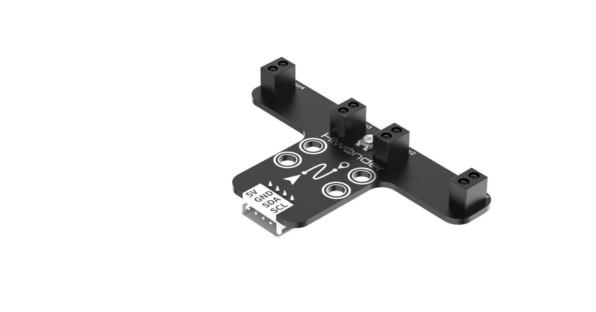

本节课用的是四路巡线模块，模块采用 IIC 通信接口，能通过 IIC通信进行读取传感器探头上的数据。

传感器有四个探头，每个探头都有一个红外发射器和一个红外接收器，白色对红外反射强，黑色对红外反射弱，由此可以判断是否识别到路线。

<p id ="6.9.3"></p>

### 6.9.3 程序下载

> [!NOTE]
>
> - **下载程序前需先将蓝牙模块取下，否则会因串口冲突导致程序下载失败。**
>
> - **接入Type-B下载线时请将电池盒开关拨到“OFF”挡，避免下载线误碰到扩展板的电源引脚，造成短路。**
>

1)  找到并打开本节同目录下的**“02 程序文件\十字路口判断程序\tracking_crossroads\tracking_crossroads.ino”**程序文件。

    

2)  将Arduino通过UNO数据线（Type-B）连接至电脑。

    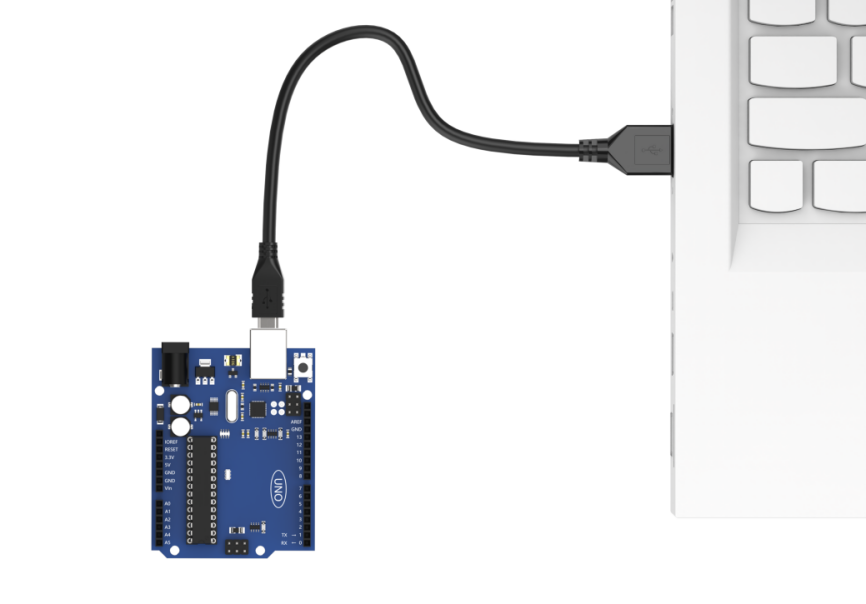

3)  点击“**选择开发板**”选项，软件会自动检测当前Arduino串口，点击进行连接。

    

4)  点击，将程序下载至Arduino中，等待下载完成即可。

    


### 6.9.4 实现效果

先将小车放置在黑色线路上，打开小车电源，检测到板载按键被按下后，小车会进入到巡线程序中。当小车识别到黑色线时，会跟随黑线进行移动，若未识别到黑线则会进行后退，直到重新识别到黑线。

> [!NOTE]
>
> **在开始巡线程序前，请先将小车放置在黑线上，否则小车会一直后退。**

### 6.9.5 程序简要分析

* **导入库文件**

```
#include <Wire.h>
#include "FastLED.h"
```

导入本玩法所需要的IIC通信、RGB灯库文件。

* **定义变量及创建对象**

1. 首先定义了四路巡线传感器的IIC通讯地址，接着定义了板载RGB灯引脚、板载按键引脚、以及电机的引脚。

```
#define LINE_FOLLOWER_I2C_ADDR 0x78 /* 巡线传感器的iic地址 */

const static uint8_t ledPin = 2;
const static uint8_t keyPin = 3;
const static uint8_t pwm_min = 50;
const static uint8_t motorpwmPin[4] = { 10, 9, 6, 11 };
const static uint8_t motordirectionPin[4] = { 12, 8, 7, 13 };
const static uint8_t TRACKING = 4;
const static uint8_t INTERSECTION_DETECTION = 5;
```

2)  创建了RGB灯控制对象，modestate变量用于设置小车的执行模式，默认为巡线模式。

```
static CRGB rgbs[1];
static uint8_t modestate = TRACKING;
```

* **初始化设置**

1. 在`setup()`函数中，主要是串口进行初始化，将其通信的波特率设置为9600，接着将按键引脚配置为输入模式，使用FastLED库初始化扩展板上的RGB灯，并将其连接到ledPin引脚。通过`Rgb_Show(255,255,255)`设置RGB灯的颜色为白色。

```
void setup() {
  /* 配置通信 */
  Serial.begin(9600);

  pinMode(keyPin, INPUT);
  FastLED.addLeds<WS2812, ledPin, GRB>(rgbs, 1);
  Rgb_Show(255, 255, 255);

  Wire.begin();
  Motor_Init();
}
```

2. 通过`Wire.begin()`初始化IIC通讯，调用`Motor_Init()`绑定并初始化电机引脚。

```
  Wire.begin();
  Motor_Init();
```

* **主函数**

在主函数中检测到按键被按下后，将循环调用`Sensor_Receive()`函数获取四路巡线传感器的值，进行判断后再对小车进行控制。接着调用`Task_Dispatcher()`函数执行任务调度执行相应的模式。

```
void loop() {
  keyState = analogRead(keyPin);
  if (!keyState) taskStart = 1;
  if (taskStart) {
    Sensor_Receive();
    Task_Dispatcher();
  }
}
```

* **获取传感器数据**

通过`WireReadDataByte()`函数向传感器获取当前的路线数据，`rec_data`数组第0-3位对应的是四路巡线传感器上Sensor1-4探头的值。若获取到的值为0表示未识别到黑线，获取到的值为1则表示识别到黑线，最后将值保存在数组`rec_data`中。

```
/* 获取传感器数据 */
void Sensor_Receive(void) {
  WireReadDataByte(1, data);
  rec_data[0] = data & 0x01;
  rec_data[1] = (data >> 1) & 0x01;
  rec_data[2] = (data >> 2) & 0x01;
  rec_data[3] = (data >> 3) & 0x01;
}
```

* **任务调度函数**

在任务调度函数中，将会执行设置好的对应任务，通过`modestate`变量的值来执行相应的任务，默认处在巡线模式中。若识别到十字路口则进入到十字路口检测任务中。

```
/* 任务调度 */
void Task_Dispatcher() {
  switch (modestate) {
    case TRACKING:
      Tracking_Line_Task();
      break;
    case INTERSECTION_DETECTION:
			Intersection_Detection_Task();
			break;
  }
}
```

* **巡线追踪任务**

1. 首先调用`Rgb_Show(255,0,0)`函数将板载RGB设置为红色，对接收到的传感器数据进行判断，若Sensor2、Sensor3探头同时识别到黑线，则控制小车向前直行。

```
void Tracking_Line_Task(void) {
  Rgb_Show(255, 0, 0);
  if (rec_data[1] == 1 && rec_data[2] == 1) {
    Velocity_Controller(0, 80, 0, 0);
  }
```

2. 如果Sensor2探头识别到黑线而Sensor3探头未识别到黑线，此时将控制小车向左偏65°前进。若Sensor3识别到黑线，而Sensor2未识别到，则向右偏65°进行移动。

```
  if (rec_data[1] == 1 && rec_data[2] == 0) {
    Velocity_Controller(0, 80, 65, 0);
  }
  if (rec_data[1] == 0 && rec_data[2] == 1) {
    Velocity_Controller(0, 80, -65, 0);
  }
```

3. 当Sensor2和Sensor3都未识别到黑线时，控制小车进行后退。

```
  while (rec_data[1] == 0 && rec_data[2] == 0) {
    Sensor_Receive();
    Velocity_Controller(0, 0, 0, 0);
  }
```

4. 若Sensor0和Sensor3都识别到到黑线时，则表示当前处于十字路口，进入到十字路口检测任务。

```
  if(rec_data[0] == 1 && rec_data[3] == 1){     //0没识别到黑线 1识别到黑线
    modestate = INTERSECTION_DETECTION;    
  }
```

* **速度控制函数**

在速度控制函数中，根据麦克纳姆轮的运动学分析进行计算各个电机的控制数值，`angle`参数用于设置小车的运动方向（车头的方向为0度，逆时针为正方向），`velocity`参数用于控制小车的速度，`rot`参数用于控制小车的自转方向（大于0为逆时针旋转，小于0为顺时针旋转），drift参数用于控制小车是否开启漂移功能。

```
/**
 * @brief 速度控制函数
 * @param angle   用于控制小车的运动方向，小车以车头为0度方向，逆时针为正方向。
 *                取值为0~359
 * @param velocity   用于控制小车速度，取值为0~100。
 * @param rot     用于控制小车的自转速度，取值为-100~100，若大于0小车有一个逆
 *                 时针的自转速度，若小于0则有一个顺时针的自转速度。
 * @param drift   用于决定小车是否开启漂移功能，取值为0或1，若为0则开启，反之关闭。
 * @retval None
 */
void Velocity_Controller(uint16_t angle, uint8_t velocity, int8_t rot, bool drift) {
  int8_t velocity_0, velocity_1, velocity_2, velocity_3;
  float speed = 1;
  angle += 90;
  float rad = angle * PI / 180;
  if (rot == 0) speed = 1;  ///< 速度因子
  else speed = 0.5;
  velocity /= sqrt(2);
  if (drift) {
    velocity_0 = (velocity * sin(rad) - velocity * cos(rad)) * speed;
    velocity_1 = (velocity * sin(rad) + velocity * cos(rad)) * speed;
    velocity_2 = (velocity * sin(rad) - velocity * cos(rad)) * speed - rot * speed * 2;
    velocity_3 = (velocity * sin(rad) + velocity * cos(rad)) * speed + rot * speed * 2;
  } else {
    velocity_0 = (velocity * sin(rad) - velocity * cos(rad)) * speed + rot * speed;
    velocity_1 = (velocity * sin(rad) + velocity * cos(rad)) * speed - rot * speed;
    velocity_2 = (velocity * sin(rad) - velocity * cos(rad)) * speed - rot * speed;
    velocity_3 = (velocity * sin(rad) + velocity * cos(rad)) * speed + rot * speed;
  }
  Motors_Set(velocity_0, velocity_1, velocity_2, velocity_3);
}
```

* **电机控制函数**

通过速度控制函数中计算所得的各个电机的控制数值，对各个电机进行pwm控制。`motors`数组用于将各个电机的速度值映射为pwm值，`pwm_set`数组用于控制给各个电机输出的pwm值。

```
/**
 * @brief PWM与轮子转向设置函数
 * @param Motor_x   作为PWM与电机转向的控制数值。根据麦克纳姆轮的运动学分析求得。
 * @retval None
 */
void Motors_Set(int8_t Motor_0, int8_t Motor_1, int8_t Motor_2, int8_t Motor_3) {
  int8_t pwm_set[4];
  int8_t motors[4] = { Motor_0, Motor_1, Motor_2, Motor_3 };
  bool direction[4] = { 1, 0, 0, 1 };  ///< 前进 左1 右0
  for (uint8_t i; i < 4; ++i) {
    if (motors[i] < 0) direction[i] = !direction[i];
    else direction[i] = direction[i];

    if (motors[i] == 0) pwm_set[i] = 0;
    else pwm_set[i] = map(abs(motors[i]), 0, 100, pwm_min, 255);

    digitalWrite(motordirectionPin[i], direction[i]);
    analogWrite(motorpwmPin[i], pwm_set[i]);
  }
}
```

### 6.9.6 功能延伸

这里以修改检测到十字路口后，控制小车向左转为例。

1. 找到代码中的十字路口检测任务函数，将原来的识别到十字路口停止2秒钟，修改为向左转0.5秒。

```
  Velocity_Controller(0, 0, 65, 0);
  delay(500);
```

2)  修改完成后，参照“[6.9.3 程序下载](#_6-9-3-程序下载)”重新下载程序即可。

### 6.9.7 常见问题解答

问1：代码上传后小车一直进行后退。

答：请在运行代码前先将小车放置在黑线上方。

问2：四路巡线传感器的识别不准确。

答：请将四路巡线传感器上的电位器调整至合适位置。

## 6.10 APP控制说明

本节主要讲解miniAuto的控制程序功能实现，通过对手机APP的功能玩法进行分析，让用户加深对miniAuto底层实现的了解。

### 6.10.1 实现流程图

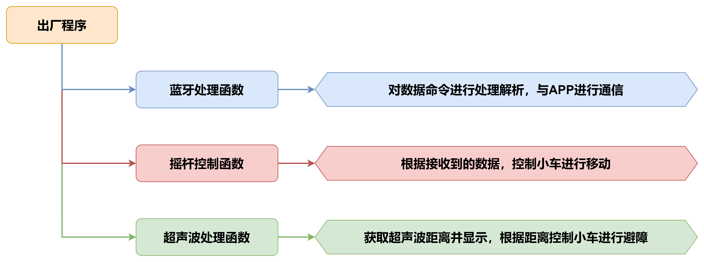

### 6.10.2 程序下载

> [!NOTE]
>
> - **下载程序前需先将蓝牙模块取下，否则会因串口冲突导致程序下载失败。**
>
> - **接入Type-B下载线时请将电池盒开关拨到“OFF”挡，避免下载线误碰到扩展板的电源引脚，造成短路。**
>

1)  找到并打开本节同目录下的**“02 程序文件\APP控制程序\app_control\app_control.ino”**程序文件。

    

2)  将Arduino通过UNO数据线（Type-B）连接至电脑。

    

3)  点击“选择开发板”选项，软件会自动检测当前Arduino串口，点击进行连接。

    

4)  点击，将程序下载至Arduino中，等待下载完成即可。

    


### 6.10.3 程序运行效果

该程序玩法的功能，可前往“**4.APP遥控\4.2 APP使用说明**”下查看。

### 6.10.4 程序简要分析

* **导入库文件**

导入本玩法所需的RGB灯、舵机控制、超声波库文件。

```
#include <Arduino.h>
#include "FastLED.h"
#include <Servo.h>
#include "Ultrasound.h"
```

* **定义变量及创建对象**

1)  首先创建了蜂鸣器警报、功能模式、电压状态标志位，接着对小车控制变量进行了定义。在APP控制中可以设置小车的移动速度，通过`speed_update`变量更新线速度，从而达到速度控制的效果。

```
static VoltageWarning g_warning = WARNING_OFF; 
static CarMode g_mode = MODE_NULL; 
static ReadVoltageState g_read = READ_VOLTAGE_ON; 

static uint8_t g_state = 8;         /* 接收的APP子指令 */
static uint8_t avoid_flag = 0;      /* 避障模式开关标志位 */
static uint8_t rot_flag = 0;         /* 转向标志位 */
static uint8_t beep_count = 0;      /* 蜂鸣器鸣响次数 */

static int car_derection = 0;       /* 设置小车移动的角度 */
static int8_t car_rot = 0;          /* 设置小车角速度 */
static uint8_t speed_data = 0;      /* 设置小车线速度 */
static uint8_t speed_update = 50;   /* APP更新的线速度 */

/* 电压监测相关参数 */
static float voltage;
static int voltage_send;
static int last_voltage_send;
static int real_voltage_send;
static int error_voltage;
```

2. 接着定义了板载RGB灯引脚、板载按键引脚、以及电机的引脚。

```
const static uint8_t ledPin = 2;
const static uint8_t buzzerPin = 3;
const static uint8_t servoPin = 5;
const static uint8_t motorpwmPin[4] = { 10, 9, 6, 11} ;
const static uint8_t motordirectionPin[4] = { 12, 8, 7, 13};
```

3. 对PWM的频率以及周期进行了定义，用于控制电机。接着定于了用于控制非阻塞延时的变量，用于在不阻塞程序运行的情况下，实现延时功能。最后定义了用于存放舵机角度及超声波距离的变量。

```
const static int pwmFrequency = 500;                /* PWM频率，单位是赫兹 */
const static int period = 10000000 / pwmFrequency;  /* PWM周期，单位是微秒 */
const static uint32_t interval_us = 20000;          /* 微秒计数时间间隔 用于非阻塞延时 */
const static uint32_t interval_ms = 1000;           /* 毫秒计数时间间隔 用于非阻塞延时 */

static uint32_t previousTime_us = 0;          /* 上一次的微秒计数时间间隔 用于非阻塞延时 */
static uint32_t previousTime_ms = 0;          /* 上一次的毫秒计数时间间隔 用于非阻塞延时 */ 

static int increase_angle = 0;                   /* 设置舵机角度 */
static int default_angle = 90;
static uint16_t distance = 0;                 /* 超声波距离 */
```

* **初始化设置**

1. 在setup()函数中，主要是串口进行初始化，将其通信的波特率设置为9600，接着使用FastLED库初始化扩展板上的RGB灯，并将其连接到ledPin引脚。通过`myservo.attach()`函数绑定舵机引脚，并对舵机角度进行设置。随后调用`tone()`函数控制蜂鸣器鸣响一声。

```
void setup() {
  Serial.begin(9600);
  FastLED.addLeds<WS2812, ledPin, RGB>(rgbs, 1);
  Motor_Init();
  pinMode(servoPin, OUTPUT);
  myservo.attach(servoPin);                   /* 绑定舵机指定引脚 */
  myservo.write(default_angle + increase_angle);                 /* 写入舵机角度 */
  tone(buzzerPin, 1200);                      /* 输出音调信号的函数,频率为1200 */ 
  delay(100);
  noTone(buzzerPin);
```

2. 最后读取ADC引脚电压，通过计算得出当前的电池电压值，将其存储到变量中用于后续蜂鸣器警报检测。

```
  voltage_send = analogRead(A3)*0.02989*1000;   /* 电压计算 */ 
  last_voltage_send = voltage_send;
  real_voltage_send = voltage_send;
}
```

* **主函数**

在主函数中循环运行`Velocity_Controller()`函数来更新小车当前的运动状态。调用了`Task_Dispatcher()`函数解析蓝牙数据，用于开启不同的玩法功能。最后通过`Voltage_Detection()`函数检测当前的电池电压，从而实现低电压蜂鸣器警报功能。

```
void loop() {
  Velocity_Controller(car_derection, speed_data, car_rot);
  Task_Dispatcher();
  if(g_read == READ_VOLTAGE_ON)
  {
    Voltage_Detection();
  }
}
```

* **获取超声波数据**

通过`WireReadDataByte()`函数向传感器获取当前的超声波距离，通过递推平均滤波法，将低位丢弃其余数据左移，最后返回一个距离数据的平均值。

```
int Ultrasound::Filter() {
  int i;
  int filter_sum = 0;
  filter_buf[FILTER_N] = GetDistance();/* 读取超声波测值 */
  for(i = 0; i < FILTER_N; i++) {
    filter_buf[i] = filter_buf[i + 1];/* 所有数据左移，低位仍掉 */
    filter_sum += filter_buf[i];
  }
  return (int)(filter_sum / FILTER_N);
}
```

* **任务调度函数**

1. 在任务调度函数中，主要实现的是蓝牙数据解析，以及功能切换。这里根据协议对蓝牙数据进行处理，获取传输给主控板的功能号及数据。

```
/* 任务调度 */
void Task_Dispatcher(void) 
{
  uint8_t index = 0;
  while (Serial.available() > 0) 
  {
    String cmd = Serial.readStringUntil('$');

    while (cmd.indexOf('|') != -1) 
    {
      rec_data[index] = cmd.substring(0, cmd.indexOf('|'));  /* 提取从开始到第一个逗号之前的子字符串 */
      cmd = cmd.substring(cmd.indexOf('|') + 1);             /* 更新字符串，去掉已提取的子字符串和逗号 */
      index++;      /* 更新索引 */
    }
    charArray = rec_data[0].c_str();      /* 转成C字符串形式 */
```

2. 通过对功能号进行解析，实现不同功能的切换，分别包含了摇杆&重力控制、发光超声波RGB灯控制、速度控制、舵机控制、超声波数据发送、避障玩法控制。

```
    if(strcmp(charArray, "A") == 0 && avoid_flag == 0)  /* 命令判断  */ 
    {
        g_mode = MODE_ROCKERANDGRAVITY;
    }
    if(strcmp(charArray, "B") == 0 && avoid_flag == 0) 
    {
      g_mode = MODE_RGB_ADJUST;
    }
    if(strcmp(charArray, "C") == 0 && avoid_flag == 0) 
    {
      g_mode = MODE_SPEED_CONTROL;
    }
    if(strcmp(charArray, "E") == 0 && avoid_flag == 0) 
    {
      g_mode = MODE_SERVO_CONTROL;
    }
    if(strcmp(charArray, "D") == 0) 
    {
      g_mode = MODE_ULTRASOUND_SEND;
    } 
    if(strcmp(charArray, "F") == 0) 
    {
      g_mode = MODE_AVOID;
      avoid_flag = 1;
      g_state = atoi(rec_data[1].c_str());
    }    
  }
```

3. 根据不同的功能模式，切换对应的功能玩法，这里以摇杆&重力控制为例。切换至该功能玩法后，首先会执行对应的功能实现函数，然后将当前的功能模式清除，以便下一个功能的接收。

```
  if(g_mode == MODE_ROCKERANDGRAVITY)
  {
    Rockerandgravity_Task();
    g_mode = MODE_NULL;
  }
```

* **摇杆控制任务**

在摇杆控制中，首先是解析并获取了蓝牙发送的命令数据，再根据命令数据设置小车运动的角度、角速度、线速度，从而控制小车进行移动。

```
void Rockerandgravity_Task(void) 
{
  g_state = atoi(rec_data[1].c_str());
  // Serial.println(g_state);
  switch (g_state) 
  {
    case 0: 
      car_derection = 90;
      // car_rot = 0;
      speed_data = speed_update;
      break;
    case 1: 
      car_derection = 45;
      // car_rot = 0;
      speed_data = speed_update;
      break;  
    case 2: 
      car_derection = 0;
      // car_rot = 0;
      speed_data = speed_update;
      break;  
```

* **超声波RGB调节函数**

通过解析蓝牙命令中的三个参数来设置RGB灯的颜色，`atoi()`函数是用于将字符串数据转换成int类型数据，`r_data`对应的是红色，`g_data`对应的是绿色，`b_data`则对应的是蓝色。R、G、B三种颜色的取值范围是0-255，最后通过`ultrasound.Color()`函数显示颜色。

```
void Rgb_Task(void) 
{
  uint8_t r_data,g_data,b_data;
  r_data = (uint8_t)atoi(rec_data[1].c_str());  
  g_data = (uint8_t)atoi(rec_data[2].c_str());
  b_data = (uint8_t)atoi(rec_data[3].c_str());
  ultrasound.Color(r_data,g_data,b_data,r_data,g_data,b_data);
}
```

* **电压监测函数**

该函数主要是通过ADC读取电源电压，再对电压值进行判断，如果当前电压值\<=7000mV，那么就使蜂鸣器进行鸣响，以达到低电压警报的效果。

```
void Voltage_Detection(void)
{
  uint32_t currentTime_ms;
  currentTime_ms = millis();
  voltage = analogRead(A3)*0.02989;   /* 电压计算 */
  if(real_voltage_send <= 7000) 
  {
    if(g_warning != WARNING_RGB)
    {
      g_warning = WARNING_BEEP;
    }
  }
  if(g_warning == WARNING_BEEP)
  {
    if(currentTime_ms - previousTime_ms <= interval_ms/2)
    {
      tone(buzzerPin, 800);  /* 电压小于7V蜂鸣器警报 */
    }
    else if (currentTime_ms - previousTime_ms > interval_ms/2 && currentTime_ms - previousTime_ms < interval_ms)
    {
      noTone(buzzerPin); 
    }
  }
```

* **机械爪控制函数**

通过对蓝牙数据进行解析，获取APP传输的舵机角度，通过`atoi()`函数转换为int类型数据，再通过`myservo.write()`函数写入角度，即可控制舵机转动至相应的位置，达到控制机械爪的效果。

```
void Servo_Data_Receive(void)
{
  increase_angle = atoi(rec_data[1].c_str());
  myservo.write(default_angle + increase_angle);
}
```

* **避障功能函数**

在避障功能玩法中，首先需要获取发光超声波的距离，若当前距离\<400mm时，就将角速度设置为100，控制小车原地旋转避开障碍物。若识别到障碍物距离\>=500时，那么就控制小车以60的速度直行。

```
void Aovid(void)
{
  distance = ultrasound.Filter();
  if(g_state == 1)
  {
    if(distance < 400)
    {
      car_derection = 0;
      car_rot = 100;
      speed_data = 0;
    }
    if(distance >= 500)
    {
      car_derection = 0;
      car_rot = 0;
      speed_data = 50;
    }
  }
  else if(g_state == 0)
  {
    car_derection = 0;
    car_rot = 0;
    speed_data = 0;
    g_mode = NULL;
    avoid_flag = 0;
  }
}
```

* **速度控制函数**

在速度控制函数中，根据麦克纳姆轮的运动学分析进行计算各个电机的控制数值，`angle`参数用于设置小车的运动方向（车头的方向为0度，逆时针为正方向），`velocity`参数用于控制小车的速度，`rot`参数用于控制小车的自转方向（大于0为逆时针旋转，小于0为顺时针旋转），drift参数用于控制小车是否开启漂移功能。

```
/**
 * @brief 速度控制函数
 * @param angle   用于控制小车的运动方向，小车以车头为0度方向，逆时针为正方向。
 *                取值为0~359
 * @param velocity   用于控制小车速度，取值为0~100。
 * @param rot     用于控制小车的自转速度，取值为-100~100，若大于0小车有一个逆
 *                 时针的自转速度，若小于0则有一个顺时针的自转速度。
 * @param drift   用于决定小车是否开启漂移功能，取值为0或1，若为0则开启，反之关闭。
 * @retval None
 */
void Velocity_Controller(uint16_t angle, uint8_t velocity,int8_t rot) 
{
  int8_t velocity_0, velocity_1, velocity_2, velocity_3;
  float speed = 1;
  angle += 90;
  float rad = angle * PI / 180;
  if (rot == 0) speed = 1;///< 速度因子
  else speed = 0.5; 
  velocity /= sqrt(2);
  velocity_0 = (velocity * sin(rad) - velocity * cos(rad)) * speed + rot * speed;
  velocity_1 = (velocity * sin(rad) + velocity * cos(rad)) * speed - rot * speed;
  velocity_2 = (velocity * sin(rad) - velocity * cos(rad)) * speed - rot * speed;
  velocity_3 = (velocity * sin(rad) + velocity * cos(rad)) * speed + rot * speed;
  Motors_Set(velocity_0 + 10, velocity_1, velocity_2, velocity_3);
}
```

* **电机控制函数**

通过速度控制函数中计算所得的各个电机的控制数值，对各个电机进行pwm控制。`motors`数组用于将各个电机的速度值映射为pwm值，`pwm_set`数组用于控制给各个电机输出的pwm值。

```
/**
 * @brief PWM与轮子转向设置函数
 * @param Motor_x   作为PWM与电机转向的控制数值。根据麦克纳姆轮的运动学分析求得。
 * @retval None
 */
void Motors_Set(int8_t Motor_0, int8_t Motor_1, int8_t Motor_2, int8_t Motor_3) 
{
  int8_t pwm_set[4];
  int8_t motors[4] = { Motor_0, Motor_1, Motor_2, Motor_3};
  bool direction[4] = { 1, 0, 0, 1};///< 前进 左1 右0
  for(uint8_t i; i < 4; ++i) 
  {
    if(motors[i] < 0) direction[i] = !direction[i];
    else direction[i] = direction[i];

    if(motors[i] == 0) pwm_set[i] = 0;
    else pwm_set[i] = abs(motors[i]);

    digitalWrite(motordirectionPin[i], direction[i]); 
    PWM_Out(motorpwmPin[i], pwm_set[i]);
  }
}

```