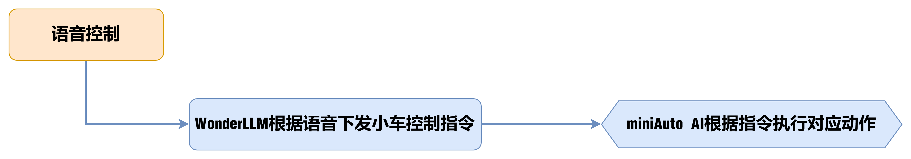
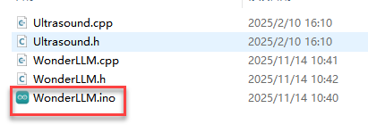
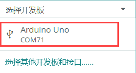
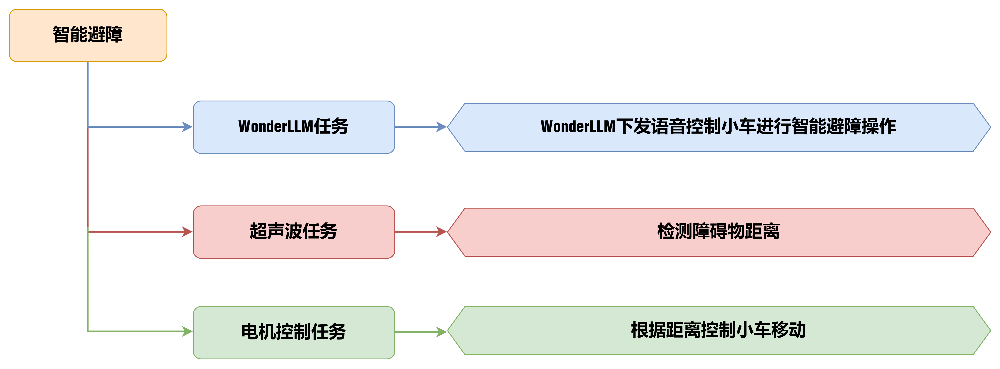
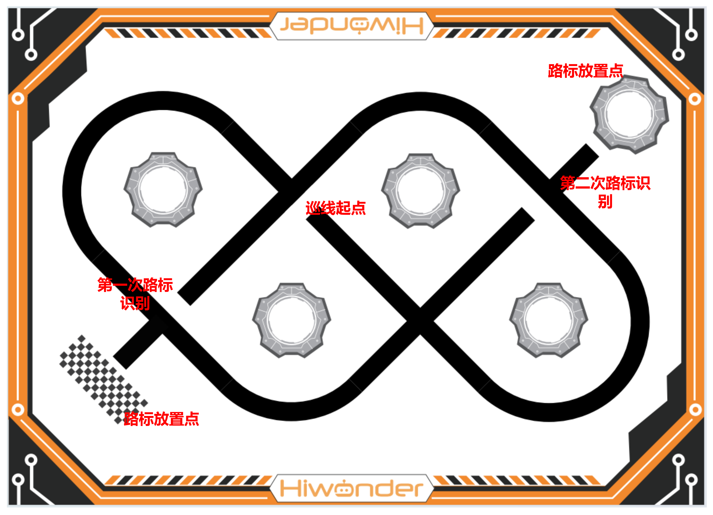
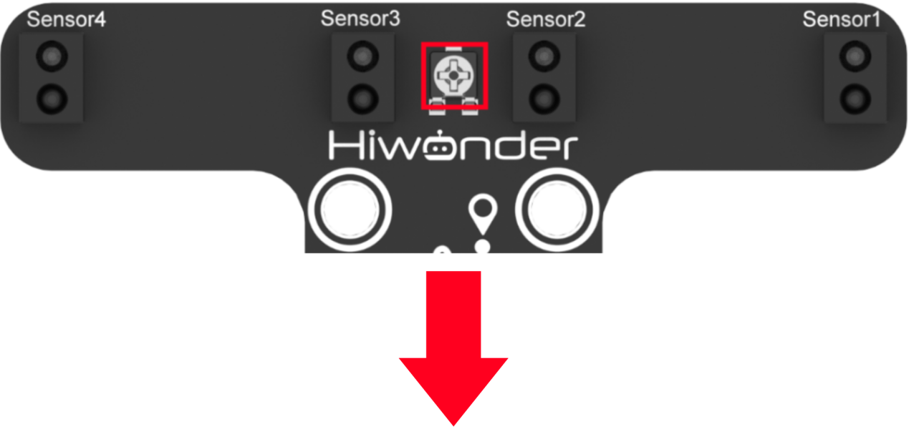
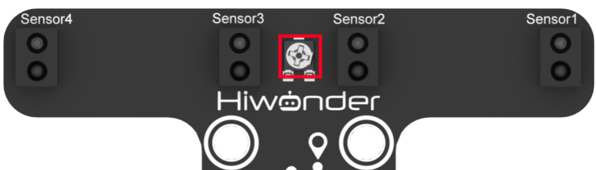
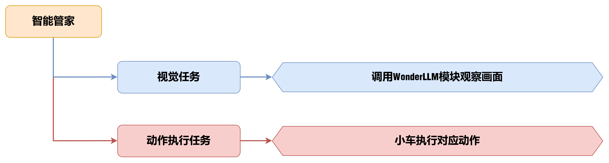

# 8. AI大模型应用课程

## 8.1 WonderLLM大模型模块安装


<p id ="anther7.1.3"></p>


## 8.2 WonderLLM大模型模块模式说明

WonderMind模块支持两种工作模式,分别是离线模式和在线模式,两种模式的功能不同,需要烧录对应的固件。**本章内容使用的工作模式是在线模式**。

> [!NOTE]
>
> **WonderLLM大模型模块出厂烧录的是在线模式的固件，若在学习本章前烧录了离线模式的程序，请前往”7. AI大模型基础课程->7.10 固件下载“重新下载固件。**

### 8.2.1 离线模式

在离线模式中,模块通过内置的摄像头模块进行图像采集,利用ESP32-S3微控制器对图像数据进行处理,能够实现图像回传、颜色识别、人脸识别、视觉巡线等功能,并且可以通过多种通信协议传输数据。

想要了解更多离线模式玩法，请前往**”9.AI大模型离线课程“**学习。

### 8.2.2 在线模式

在线模式支持AI大模型语音交互,采用口令模式唤醒,用户需要说出唤醒词来唤醒WonderLLM,激活后才可以进行人机交互。默认唤醒关键词为"**小幻小幻**"，如需更换唤醒词，请前往**”7.AI大模型基础课程->7.9 唤醒词修改“**。

模块识别到唤醒词后,蜂鸣器将会鸣响一声,随后即可开始与用户交互。模块支持中英文任一语种交流,并会根据用户发言,自行识别语种并切换。若1分钟内无识别到语音,则会进入休眠模式,再次使用需要重新唤醒。

## 8.3 语音控制

### 8.3.1 项目介绍

本节通过WonderLLM视觉模块，语音控制miniAuto执行相关指令。

### 8.3.2 实现流程图




###  8.3.3 程序下载

>[!note]
>
>* **下载程序前需先将蓝牙模块取下，否则会因串口冲突导致程序下载失败。**
>* **接入Type-B下载线时请将电池盒开关拨到“OFF”挡，避免下载线误碰到扩展板的电源引脚，造成短路。**

1. 找到并打开**“02 程序文件\WonderLLM\WonderLLM.ino”**。

   

2. 将Arduino通过UNO数据线（Type-B）连接至电脑。点击**“选择开发板”**选项，软件会自动检测当前Arduino串口，点击进行连接。

   

3. 点击左侧的库管理，导入PID库文件（**如果已安装，可跳过此步骤**）。

   

3. 点击，将程序下载至Arduino中，等待下载完成即可。

   

   

### 8.3.4 实现效果

通过WonderLLM视觉模块，可以语音控制miniAuto AI的蜂鸣器鸣响，miniAuto AI爪子张合，RGB颜色变化，前进后退，左右转，左右平移，模式切换，获取超声波距离。

| 序号 | MCP工具名称    | 说明                                                         | 调用示例                                                     |
| ---- | -------------- | ------------------------------------------------------------ | ------------------------------------------------------------ |
| 1    | 蜂鸣器控制     | 控制平衡小车的蜂鸣器时调用这个工具。'buzzer'是蜂鸣器响的次数 | 控制蜂鸣器响2声                                              |
| 2    | 移动控制       | 控制小车移动时调用这个工具。move参数为移动方向，可移动的方向包括前进后退，左转右转，左平移右平移，time参数为运动时间，单位是厘米(cm)，正数前进，负数后退。 | 小车前进5秒钟                                                |
| 5    | RGB灯控制      | 设置左右RGB灯颜色。lr,lg,lb是左灯RGB, rr,rg,rb是右灯RGB, 范围0-255 | ①控制左侧RGB灯亮纯绿色 ②控制两侧RGB灯红光亮度0，绿光亮度255， |
| 4    | 模式控制       | 切换平衡小车的模式时调用这个工具。'distance'只在避障模式下使用。可切换的模式包括：'avoid', 'line_patrol','normal'。 | 切换为智能避障模式，避障距离设置为20cm。                     |
| 5    | 获取超声波距离 | 获取超声波的距离时调用这个工具。 'distance'单位为厘米\","    | 获取超声波距离                                               |
| 6    | 机械爪控制     | "控制小车爪子夹取时调用这个工具。servo参数控制爪子,包括：'action', 'clamping', 'lay_down','open','close',count是爪子开合的次数。\"," | 机械爪动两下                                                 |

### 8.3.5 程序分析

以下分析的程序路径为：**“02 程序文件/WonderLLM/WonderLLM.ino”**

* **导入库文件**

导入玩法所需的舵机控制库，IIC通信库，超声波模块控制库，以及WonderLLM模块的通讯库文件。

```cpp
#include <Arduino.h>
#include "FastLED.h"
#include <Servo.h>
#include <Wire.h> 
#include "Ultrasound.h"
#include "WonderLLM.h"
```

* **定义全局变量及引脚**

1. 分别定义了状态标志变量，运动控制变量，时间控制变量，电压检测变量。

```cpp
typedef enum {
  NEXT_ACTION_NONE,      
  NEXT_ACTION_START_LINE_PATROL  
} NextAction;


static NextAction next_action_on_move_finish = NEXT_ACTION_NONE;

bool is_moving = false;             // 标志位，表示当前是否正在执行移动指令
unsigned long move_start_time = 0;   // 移动开始的时间戳 (millis)
unsigned long move_duration_ms = 0;    // 需要移动的总时长 (毫秒)


static uint8_t avoid_flag = 0;      /* 避障模式开关标志位 */
static uint8_t line_patrol_flag = 0;/* 巡线模式开关标志位 */
static uint8_t normal_flag = 0;     /* 正常模式开关标志位 */
static uint8_t move_flag  = 0;            /* 移动标志位 */

static uint8_t rot_flag = 0;         /* 转向标志位 */
static uint8_t beep_count = 0;      /* 蜂鸣器鸣响次数 */

static int car_derection = 0;       /* 设置小车移动的角度 */
static int8_t car_rot = 0;          /* 设置小车角速度 */
static uint8_t speed_data = 0;      /* 设置小车线速度 */

static unsigned long last_poll_millis = 0;
#define POLL_INTERVAL_MS         100
#define RX_BUFFER_SIZE           128
#define LINE_FOLLOWER_I2C_ADDR 0x78 /* 巡线传感器的iic地址 */
```

2. 分别定义了LED指示灯引脚，蜂鸣器控制引脚，舵机控制引脚以及电机速度和方向的控制引脚。

```cpp
const static uint8_t ledPin = 2;
const static uint8_t buzzerPin = 3;
const static uint8_t servoPin = 5;
const static uint8_t motorpwmPin[4] = { 10, 9, 6, 11} ;
const static uint8_t motordirectionPin[4] = { 12, 8, 7, 13};
```

* **非阻塞控制状态机**

包括蜂鸣器状态控制以及舵机状态控制。

```cpp
// 非阻塞蜂鸣器状态
bool is_beeping = false;
int beep_times_left = 0;
unsigned long beep_next_change_time = 0;
bool beep_state_is_on = false; // 当前是否在发声

// 非阻塞舵机状态
bool is_servo_acting = false;
int servo_actions_left = 0;
unsigned long servo_next_change_time = 0;
bool servo_state_is_open = false; // 当前是否是张开状态
```

* **硬件初始化**

对串口，RGB灯，舵机，电机，WonderLLM模块以及蜂鸣器进行初始化。

```cpp
void setup() {
  Serial.begin(115200);
  FastLED.addLeds<WS2812, ledPin, RGB>(rgbs, 1);
  Motor_Init();
  pinMode(servoPin, OUTPUT);
  myservo.attach(servoPin);                   /* 绑定舵机指定引脚 */
  myservo.write(default_angle + increase_angle);                 /* 写入舵机角度 */
  delay(2000);                               /* 等待WonderLLM开机*/ 
  WonderLLM_Init();                          
  tone(buzzerPin, 1200);                      /* 输出音调信号的函数,频率为1200 */ 
  delay(100);
  noTone(buzzerPin);

}
```

* **主循环loop()**

在主循环中不断轮询和处理来自WonderLLM的指令。

```cpp
void loop() {
  // 在主循环中不断轮询和处理来自WonderLLM的指令
  WonderLLM_Poll_And_Process();
  updateCarMove();
  Aovid(); 
  Tracking_Line_Task();
  if ( !is_servo_acting) {
    Velocity_Controller(car_derection, speed_data, car_rot);
  }

}
```

* **速度控制函数**

在速度控制函数中，根据麦克纳姆轮的运动学分析进行计算各个电机的控制数值，angle参数用于设置小车的运动方向（车头的方向为0度，逆时针为正方向），`velocity`参数用于控制小车的速度，`rot`参数用于控制小车的自转方向（大于0为逆时针旋转，小于0为顺时针旋转）。

```
/**
 * @brief 速度控制函数
 * @param angle   用于控制小车的运动方向，小车以车头为0度方向，逆时针为正方向。
 *                取值为0~359
 * @param velocity   用于控制小车速度，取值为0~100。
 * @param rot     用于控制小车的自转速度，取值为-100~100，若大于0小车有一个逆
 *                 时针的自转速度，若小于0则有一个顺时针的自转速度。
 * @param drift   用于决定小车是否开启漂移功能，取值为0或1，若为0则开启，反之关闭。
 * @retval None
 */
void Velocity_Controller(uint16_t angle, uint8_t velocity,int8_t rot) 
{
  int8_t velocity_0, velocity_1, velocity_2, velocity_3;
  float speed = 1;
  angle += 90;
  float rad = angle * PI / 180;
  if (rot == 0) speed = 1;///< 速度因子
  else speed = 0.5; 
  velocity /= sqrt(2);
  velocity_0 = (velocity * sin(rad) - velocity * cos(rad)) * speed + rot * speed;
  velocity_1 = (velocity * sin(rad) + velocity * cos(rad)) * speed - rot * speed;
  velocity_2 = (velocity * sin(rad) - velocity * cos(rad)) * speed - rot * speed;
  velocity_3 = (velocity * sin(rad) + velocity * cos(rad)) * speed + rot * speed;
  Motors_Set(velocity_0, velocity_1, velocity_2, velocity_3);
}
```

* **电机控制函数**

通过速度控制函数中计算所得的各个电机的控制数值，对各个电机进行pwm控制。`motors`数组用于将各个电机的速度值映射为pwm值。

```
void Motors_Set(int8_t Motor_0, int8_t Motor_1, int8_t Motor_2, int8_t Motor_3) 
{
  int8_t motors[4] = { Motor_0, Motor_1, Motor_2, Motor_3 };
  bool direction[4] = { 1, 0, 0, 1 };

  // 修复了循环变量未初始化的bug
  for(uint8_t i = 0; i < 4; ++i) 
  {
    if(motors[i] < 0) {
      direction[i] = !direction[i];
    }

    digitalWrite(motordirectionPin[i], direction[i]); 
    
    // 调用新的多通道软件PWM函数
    PWM_Out_MultiChannel(i, motorpwmPin[i], abs(motors[i]));
  }
}
```

* **循环接收指令**

每隔一段时间才检查一次上位机是否有新指令。

```
void WonderLLM_Poll_And_Process(void) {
  if (millis() - last_poll_millis < POLL_INTERVAL_MS) {
    return;
  }
  last_poll_millis = millis();
```

定义接收缓冲区，用于存放接收到的 JSON 数据。

```
  char rx_buffer[RX_BUFFER_SIZE];
  uint16_t received_len = 0;
```

通过 IIC 接口调用 `receive_frame()`， 从WonderLLM模块读取数据帧。

```
  if (receive_frame(rx_buffer, RX_BUFFER_SIZE, &received_len)) {
```

确保接收数据是有效的字符串（结尾加 `\0`）,并调用 `parse_command_manual()` 解析 JSON 命令并执行动作。

```cpp
    if (received_len > 1) {
      rx_buffer[received_len] = '\0'; // 确保是有效的C字符串
      parse_command_manual(rx_buffer);
    }
  }
```

* **手动解析JSON指令**

用户对WonderLLM模块说出语音指令，WonderLLM模块转换为JSON。

1. 查找 buzzer 字段并把后面的数字当作次数 `atoi()`，调用 `beep()`函数驱动蜂鸣器鸣响。

```cpp
  strcpy_P(keyword_buffer, KEY_BUZZER);
  if (strstr(json_str, keyword_buffer)) {
    char* p = strstr(json_str, keyword_buffer);
    if (p != NULL) {
      p += strlen_P(KEY_BUZZER); 
      int beep_count = atoi(p);
      beep(1500, beep_count, 100, 100); 
      WonderLLM_Send_Action_Finish();
      return; 
    }
  }
```

2. 解析移动方向字符串move与运行时间time（秒），调用 `startMoveCar()` 函数启动移动。

```cpp
  strcpy_P(keyword_buffer, KEY_MOVE); // 使用字符串字面量更清晰
  char time_key_buffer[10];
  strcpy_P(time_key_buffer, KEY_TIME);
  
  if (strstr(json_str, keyword_buffer) && strstr(json_str, time_key_buffer)) {
    char* move_p = strstr(json_str, keyword_buffer);
    char* time_p = strstr(json_str, time_key_buffer);

    if (move_p != NULL && time_p != NULL) {
      // 解析方向
      move_p += strlen(keyword_buffer); // 跳过 "move":"
      char* end_quote = strchr(move_p, '"');
      char direction_buffer[20] = {0};
      if (end_quote != NULL) {
        int len = end_quote - move_p;
        if (len > 0 && len < 20) {
          strncpy(direction_buffer, move_p, len);
        }
      }
      // 解析时间
      time_p += strlen(time_key_buffer); // 跳过 "time":
      int move_time_sec = atoi(time_p);
      unsigned long move_time_ms = move_time_sec * 1000;

      if (strlen(direction_buffer) > 0 && move_time_ms > 0) {
        startMoveCar(direction_buffer, move_time_ms, 50);
        return;
      }
    }
  }
```

3. 解析状态获取指令。

```cpp
  // --- 解析: 获取状态 ("status_name") ---
  strcpy_P(keyword_buffer, KEY_STATUS);
  if (strstr(json_str, keyword_buffer)) {
    char* status_p = strstr(json_str, keyword_buffer);
    if (status_p != NULL ) {
      status_p += strlen(keyword_buffer) + 1; // 跳过 "status_name":"
      char* end_quote = strchr(status_p, '"');
      if (end_quote != NULL) {
        *end_quote = '\0'; 
        getStatus(status_p); 
        *end_quote = '"'; 
        return;
      }
    }
  }
```

4. 解析舵机动作，调用 `myservo.write()`函数并通过控制舵机角度来实现机械爪张合以及物品抓取。

```cpp
   // --- 解析: 舵机 (寻找 "servo":) ---
  else if (strstr(json_str, "\"servo\":")) {
    is_servo_acting = true;
    char* servo_p = strstr(json_str, "\"servo\":\"");
    if (servo_p != NULL) {
      // 解析动作
      servo_p += 9; // 跳过 "servo":"
      char* end_quote = strchr(servo_p, '"');
      char action_buffer[20] = {0};
      if (end_quote != NULL) {
        int len = end_quote - servo_p;
        if (len > 0 && len < 20) {
          strncpy(action_buffer, servo_p, len);
        }
      }

      // 解析次数 
      int count = 1;
      char* count_p = strstr(json_str, "\"count\":");
      if (count_p) {
        count_p += 8; // 跳过 "count":
        count = atoi(count_p);
      }

      const int SERVO_OPEN_ANGLE = 150;
      const int SERVO_CLOSE_ANGLE = 90;
      const int SERVO_CLAMP_ANGLE = 100;

      
      if (strstr(action_buffer, "open") || strstr(action_buffer, "lay_down") ) {
        myservo.write(SERVO_OPEN_ANGLE);
        
      } else if (strstr(action_buffer, "close")) {
        myservo.write(SERVO_CLOSE_ANGLE);
      }else if (strstr(action_buffer, "action")) {
        for (int i = 0; i < count; i++) {
          myservo.write(SERVO_OPEN_ANGLE);
          delay(500); 
          myservo.write(SERVO_CLOSE_ANGLE);
          delay(500); 
      }}else if (strstr(action_buffer, "clamping") ) {
          myservo.write(SERVO_OPEN_ANGLE);
          delay(500); 
          myservo.write(SERVO_CLAMP_ANGLE);
          delay(500); 
      }

      WonderLLM_Send_Action  // --- 解析: 舵机 ("servo") ---
 
  strcpy_P(keyword_buffer, KEY_SERVO);
  if (strstr(json_str, keyword_buffer)) {
    is_servo_acting = true;
    char* servo_p = strstr(json_str, keyword_buffer);
    servo_p += strlen_P(KEY_SERVO);
    char* end_quote = strchr(servo_p, '"');
    char action_buffer[20] = {0};
    if (end_quote != NULL) {
      int len = end_quote - servo_p;
      if (len > 0 && len < 20) {
        strncpy(action_buffer, servo_p, len);

        int count = 1;
        strcpy_P(keyword_buffer, KEY_SERVO_COUNT);
        char* count_p = strstr(json_str, keyword_buffer);
        if (count_p) {
          count_p += strlen_P(KEY_SERVO_COUNT);
          count = atoi(count_p);
        }

        const int SERVO_OPEN_ANGLE = 150;
        const int SERVO_CLOSE_ANGLE = 95;
        const int SERVO_CLAMP_ANGLE = 105;

        strcpy_P(keyword_buffer, SERVO_ACTION_OPEN);
        bool isOpen = strcmp(action_buffer, keyword_buffer) == 0;
        strcpy_P(keyword_buffer, SERVO_ACTION_LAY_DOWN);
        bool isLayDown = strcmp(action_buffer, keyword_buffer) == 0;
        strcpy_P(keyword_buffer, SERVO_ACTION_CLOSE);
        bool isClose = strcmp(action_buffer, keyword_buffer) == 0;
        strcpy_P(keyword_buffer, SERVO_ACTION_ACTION);
        bool isAction = strcmp(action_buffer, keyword_buffer) == 0;
        strcpy_P(keyword_buffer, SERVO_ACTION_CLAMPING);
        bool isClamping = strcmp(action_buffer, keyword_buffer) == 0;
        
        if (isOpen || isLayDown) {
          myservo.write(SERVO_OPEN_ANGLE);
        } else if (isClose) {
          myservo.write(SERVO_CLOSE_ANGLE);
        } else if (isAction) {
          for (int i = 0; i < count; i++) {
            myservo.write(SERVO_OPEN_ANGLE);
            delay(500); 
            myservo.write(SERVO_CLOSE_ANGLE);
            delay(500); 
          }
        } else if (isClamping) {
          myservo.write(SERVO_OPEN_ANGLE);
          delay(500); 
          myservo.write(SERVO_CLAMP_ANGLE);
          delay(500); 
        }
        
        WonderLLM_Send_Action_Finish(); 
        is_servo_acting = false;
        return;
      }
    }
  }_Finish(); 
      is_servo_acting = false;
      return;
    }
  }
```

5. 解析RGB灯颜色切换,当解析到与RGB灯光有关指令时，调用`ultrasound.Color()`函数控制左右灯光颜色变化。

```cpp
  // --- 解析: RGB灯 ("lr") ---
  strcpy_P(keyword_buffer, KEY_RGB_LR);
  if (strstr(json_str, keyword_buffer)) { 
    uint8_t lr = 0, lg = 0, lb = 0;
    uint8_t rr = 0, rg = 0, rb = 0;
    char* p;
    if ((p = strstr(json_str, "\"lr\":"))) lr = atoi(p + 5);
    if ((p = strstr(json_str, "\"lg\":"))) lg = atoi(p + 5);
    if ((p = strstr(json_str, "\"lb\":"))) lb = atoi(p + 5);
    if ((p = strstr(json_str, "\"rr\":"))) rr = atoi(p + 5);
    if ((p = strstr(json_str, "\"rg\":"))) rg = atoi(p + 5);
    if ((p = strstr(json_str, "\"rb\":"))) rb = atoi(p + 5);
    ultrasound.Color(rr, rg, rb,lr, lg, lb);
    WonderLLM_Send_Action_Finish();
    return;
  } 
```

6. 解析模式切换

解析智能避障模式并解析避障距离distance。

```
          // --- 切换模式的逻辑 ---
          if (strstr(action_buffer, "avoid")) {
            avoid_flag = 1;
            line_patrol_flag = 0;
            normal_flag = 0;
            
            strcpy_P(keyword_buffer, KEY_MODE_DISTANCE);
            char* distance_p = strstr(json_str, keyword_buffer);
            if (distance_p) {
              distance_p += strlen_P(KEY_MODE_DISTANCE);
              avoid_distance = atoi(distance_p) * 10;
            }
```

解析智能巡线模式，并解析超声波模块避障距离distance。

```
          } else if (strstr(action_buffer, "line_patrol")) {
            avoid_flag = 0;
            line_patrol_flag = 1;
            normal_flag = 0;

            strcpy_P(keyword_buffer, KEY_MODE_DISTANCE);
            char* distance_p = strstr(json_str, keyword_buffer);
            if (distance_p) {
              distance_p += strlen_P(KEY_MODE_DISTANCE);
              avoid_distance = atoi(distance_p) * 10;
            }
```

解析普通模式。

```
          } else if (strstr(action_buffer, "normal")) {
            avoid_flag = 0;
            line_patrol_flag = 0;
            normal_flag = 1;
            ultrasound.Color(0, 0, 225, 0, 0, 225);
          }
```

7. 解析视觉指令

```cpp
  strcpy_P(keyword_buffer, KEY_VISION);
  if (strstr(json_str, keyword_buffer)) {
    char* vision_p = strstr(json_str, keyword_buffer);
    if (vision_p != NULL) {
      vision_p += strlen_P(KEY_VISION);
      char* end_quote = strchr(vision_p, '"');
      char direction_buffer[20] = {0}; // 增加缓冲区大小
      if (end_quote != NULL) {
        int len = end_quote - vision_p;
        if (len > 0 && len < 20) {
          strncpy(direction_buffer, vision_p, len);
        }
      }
```

在进行智能巡线时，当检测到白线，会打开摄像头识别转向路标，发出转向命令，并调用`startMoveCar`函数控制机器人进行转向运动。

```
       // --- 解析: 方向指令 (vision) ---
  else if (strstr(json_str, "\"vision\":\"")) {
    char* vision_p = strstr(json_str, "\"vision\":\"");
    if (vision_p != NULL) {
      // 1. 解析方向字符串
      vision_p += 10; // 跳过 "vision":"
      char* end_quote = strchr(vision_p, '"');
      char direction_buffer[20] = {0};
      if (end_quote != NULL) {
        int len = end_quote - vision_p;
        if (len > 0 && len < 20) {
          strncpy(direction_buffer, vision_p, len);
        }
      }

      // 2. 根据方向执行动作，识别方向与机器人方向相反
      
      if (strcmp(direction_buffer, "left") == 0) {
        //向右转
        startMoveCar("right", 1000, 50, NEXT_ACTION_START_LINE_PATROL);
      } else if (strcmp(direction_buffer, "right") == 0) {
        // 向左转
        startMoveCar("left", 1000, 50, NEXT_ACTION_START_LINE_PATROL);
      }
      WonderLLM_Send_Action_Finish(); 
      return;
    }
  }
}
```

以下分析的程序路径为：**“02 程序文件/WonderLLM/WonderLLM.cpp”**

* **WonderLLM通信流程**

1.工具注册JSON数据

注册了蜂鸣器控制工具，小车移动控制工具，RGB灯控制工具，小车运行模式切换工具，超声波距离获取，机械爪控制工具，系统配置命令工具。这些字符串都被加入到一个 `string_table` 表中，供注册函数批量发送。

```cpp
// --- PROGMEM 数据 ---
const char set_buzzer[] PROGMEM = 
    "{\"tool_name\":\"self.car.set_buzzer\","
    "\"command\":\"控制小车的蜂鸣器时调用这个工具。buzzer是蜂鸣器响的次数。\","
    "\"params\":[[\"buzzer\",\"int\"]],"
    "\"block\":\"true\","
    "\"return\":\"false\"}";

const char move[] PROGMEM = 
    "{\"tool_name\":\"self.car.move\"," 
    "\"command\":\"控制小车移动时调用这个工具。move参数为移动方向,可移动的方向包括：'forward', 'backward','turn_left','turn_right','pan_right','pan_right',time为移动时间,单位是秒,速度是0.25米每秒,旋转的速度是90度每秒。\","
    "\"params\":[[\"move\",\"string\"],[\"time\",\"int\"]],"
    "\"block\":\"true\","
    "\"return\":\"false\"}";
const  char set_rgb[] PROGMEM = 
    "{\"tool_name\":\"self.car.set_rgb\","
    "\"command\":\"设置左右RGB灯颜色。lr,lg,lb是左灯RGB, rr,rg,rb是右灯RGB, 范围0-255。\","
    "\"params\":[[\"lr\",\"int\",0,255],[\"lg\",\"int\",0,255],[\"lb\",\"int\",0,255],"
    "[\"rr\",\"int\",0,255],[\"rg\",\"int\",0,255],[\"rb\",\"int\",0,255]],"
    "\"block\":\"true\","
    "\"return\":\"false\"}";

const char set_mode[] PROGMEM = 
  "{\"tool_name\":\"self.car.set_mode\","
  "\"command\":\"切换小车的模式时调用这个工具。'distance'只在避障模式下使用。可切换的模式包括：'avoid', 'line_patrol','normal'。\","
  "\"params\":[[\"mode\",\"string\"],[\"distance\",\"int\"]],"
  "\"block\":\"true\","
  "\"return\":\"false\"}";
  
const char get_status[] PROGMEM = 
  "{\"tool_name\":\"self.car.get_status\","
  "\"command\":\"获取超声波的距离时调用这个工具。 'distance'单位为厘米\","
  "\"params\":[[\"status_name\",\"string\"]],"
  "\"block\":\"true\","
  "\"return\":\"true\"}";


const char servo[] PROGMEM = 
    "{\"tool_name\":\"self.car.servo\"," 
    "\"command\":\"控制小车爪子夹取时调用这个工具。servo参数控制爪子,包括：'action', 'clamping', 'lay_down','open','close',count是爪子开合的次数。\","
    "\"params\":[[\"servo\",\"string\"],[\"count\",\"int\"]],"
    "\"block\":\"true\","
    "\"return\":\"false\"}";
const char *const string_table[] PROGMEM = {set_buzzer, move, set_rgb, set_mode, get_status, servo};

```

2.初始化函数`WonderLLM_Init()`

设置IIC频率为400kHz。检测从设备，如果有响应则开始注册工具；如果没有响应，则打印“WonderLLM device not found”。

```cpp
bool WonderLLM_Init(void) {
  Wire.begin();
  Wire.setClock(400000);
  Wire.beginTransmission(WonderLLM_SLAVE_ADDRESS);
  if (Wire.endTransmission() != 0) {
    Serial.println(F("WonderLLM device not found."));
    return false;
  }
  Serial.println(F("WonderLLM device found. Registering tools..."));
  delay(100);
  if (!register_tools()) {
    Serial.println(F("Failed to register tools."));
    return false;
  }
  WonderLLM_MCP_Finish();
  return true;
}
```

3.发送控制命令

Arduino主控通过 I2C 将 JSON 命令打包发送，WonderLLM从机解析 JSON 命令，随后miniAuto执行相应动作（移动/亮灯/抓取等）。

```cpp
void WonderLLM_Send_Action_Finish(void) {
   char json_str[44];
    snprintf(json_str, sizeof(json_str), "{\"command\":\"action_finish\",\"params\":\"true\"}");
    send_frame_ram(json_str);
}

void WonderLLM_Send_Status(const char* params_str) {
   char json_str[56];
    snprintf(json_str, sizeof(json_str), "{\"command\":\"status\",\"params\":[%s]}", params_str);
    send_frame_ram(json_str);
}


static bool send_frame_ram(const char* ram_str) {
  const size_t WIRE_BUFFER_SIZE = 32;
  size_t total_len = strlen(ram_str);
  if (total_len == 0) return true;
  for (size_t offset = 0; offset < total_len; offset += WIRE_BUFFER_SIZE) {
    Wire.beginTransmission(WonderLLM_SLAVE_ADDRESS);
    size_t chunk_size = total_len - offset;
    if (chunk_size > WIRE_BUFFER_SIZE) chunk_size = WIRE_BUFFER_SIZE;
    Wire.write((const uint8_t*)ram_str + offset, chunk_size);
    bool is_last_chunk = (offset + chunk_size) >= total_len;
    if (Wire.endTransmission(is_last_chunk) != 0) return false;
  }
  return true;
}

static bool send_frame_progmem(const char* progmem_str) {
  size_t total_len = strlen_P(progmem_str);
  if (total_len == 0) return true;
  Serial.print(F("-> Sending:"));
  char temp_buffer[total_len + 1];
  strcpy_P(temp_buffer, progmem_str);
  Serial.println(temp_buffer);
  for (size_t offset = 0; offset < total_len; offset += MAX_FRAME_SIZE) {
    Wire.beginTransmission(WonderLLM_SLAVE_ADDRESS);
    size_t chunk_size = total_len - offset;
    if (chunk_size > MAX_FRAME_SIZE) chunk_size = MAX_FRAME_SIZE;
    const char* chunk_ptr = progmem_str + offset;
    for (size_t i = 0; i < chunk_size; i++) {
        Wire.write(pgm_read_byte(chunk_ptr + i));
    }
    bool is_last_chunk = (offset + chunk_size) >= total_len;
    if (Wire.endTransmission(is_last_chunk) != 0) {
      Serial.println(F("I2C PROGMEM transmission error"));
      return false;
    }
  }
  return true;
}
```

4.接收反馈

WonderLLM 执行完命令后，会通过 I²C 回发一帧数据。

```cpp
bool receive_frame(char* buffer, uint16_t buffer_size, uint16_t* received_len) {
  uint16_t data_len = 0;
  uint16_t part_ID = 0;
  uint16_t part_num = 0;
  uint16_t total_received_len = 0;

  // 初始化输出长度
  *received_len = 0;

  // 1. 接收第一个分片的头部
  if (!receive_frame_head(&part_ID, &part_num, &data_len)) {
    return false;
  }
  
  // 2. 检查是否是第一个分片，如果不是，则说明丢包，放弃本次接收
  if (part_ID != 1) {
    return false;
  }
  
  // 3. 循环接收所有分片
  for (int i = 1; i <= part_num; i++) {
    
    // 检查缓冲区是否足够容纳下一个分片
    if (total_received_len + data_len > buffer_size) {
      // 缓冲区空间不足，这是一个严重错误
      return false; 
    }
    
    // STM32代码中的延迟，这里保留
    delay(10);
    
    // 4. 请求当前分片的数据和1字节的校验和
    uint8_t bytes_to_read = data_len + 1;
    if (Wire.requestFrom(WonderLLM_SLAVE_ADDRESS, (int)bytes_to_read) != bytes_to_read) {
      // 没收到期望长度的数据
      return false;
    }
    
    // 5. 读取数据到缓冲区
    // 注意：我们将数据直接读到缓冲区的正确位置 (total_received_len)
    char* current_buffer_pos = buffer + total_received_len;
    for (uint16_t j = 0; j < data_len; j++) {
      current_buffer_pos[j] = Wire.read();
    }
    uint8_t received_checksum = Wire.read();

    // 6. 校验数据
    if (calculate_checksum((uint8_t*)current_buffer_pos, data_len) == received_checksum) {
      // 校验成功，更新已接收的总长度
      total_received_len += data_len;
    } else {
      // 校验失败，清空已接收的数据并退出
      memset(buffer, 0, total_received_len);
      *received_len = 0;
      return false;
    }

    // 7. 如果不是最后一个分片，准备接收下一个分片的头部
    if (i < part_num) {
      delay(100);

      uint16_t next_part_ID = 0;
      uint16_t next_part_num = 0;
      uint16_t next_data_len = 0;

      if (!receive_frame_head(&next_part_ID, &next_part_num, &next_data_len)) {
        // 接收下一个头部失败
        return false;
      }

      // 8. 验证下一个分片的头部信息
      // a) 分片ID是否连续？ b) 总分片数是否保持一致？
      if ((part_ID + 1 != next_part_ID) || (part_num != next_part_num)) {
        // 分片不连续或总数不一致，说明丢包或数据错乱
        return false;
      }
      
      // 更新当前分片ID和下一个分片的数据长度，为下一次循环做准备
      part_ID = next_part_ID;
      data_len = next_data_len;
    }
  }

  // 所有分片成功接收并校验
  *received_len = total_received_len;
  return true;
}
```

5.执行或视觉反馈

(1) 视觉命令

Arduino 向WonderLLM发送视觉请求 `vision_request`,WonderLLM返回` {"result":"left"}` 或 `{"result":"right"}` 或 `{"result":"none"}`。

```cpp
  const char vision_request[] PROGMEM = 
    "{\"tool_name\":\"mcu.request\",\"command\":\"vision\",\"params\":\"判断画面中路标的方向,你的返回只能是left、right或者none,不要任何解释和说明\"}";

void WonderLLM_Request_Vision(void) {
    send_frame_progmem(vision_request);
}
```

(2) 动作命令

Arduino 发送 , WonderLLM 返回` {"status":"ok"}` 或 `action_finish `信号。

```cpp
void WonderLLM_Send_Action_Finish(void) {
   char json_str[64];
    snprintf(json_str, sizeof(json_str), "{\"command\":\"action_finish\",\"params\":\"true\"}");
    send_frame_ram(json_str);
}
```

以下分析的程序路径为：**“02 程序文件/WonderLLM/WonderLLM.ino”**

* **语音控制蜂鸣器鸣响**

首先检查是否处于蜂鸣器鸣响模式如果没有则直接。如果当前蜂鸣器正在响，那么此时应关闭蜂鸣；如果当前没有响，则开始发声。每响一次鸣响次数递减，次数归零后结束任务。

```cpp
void updateBeep() {
  if (!is_beeping) return;

  if (millis() >= beep_next_change_time) {
    if (beep_state_is_on) { // 当前在响，需要停止
      noTone(buzzerPin);
      beep_state_is_on = false;
      if (beep_times_left > 0) {
        beep_next_change_time = millis() + 100; // 停顿100ms
      } else {
        is_beeping = false; // 全部响完
      }
    } else { // 当前没响，需要开始响
      tone(buzzerPin, 1500);
      beep_state_is_on = true;
      beep_times_left--;
      beep_next_change_time = millis() + 100; // 响100ms
    }
  }
}
```

* **语音控制超声波颜色变化**

以下分析的程序路径为：**“02 程序文件/WonderLLM/Ultrasound.cpp”.**

超声波传感器通过IIC协议进行通信，设置RGB左右两个灯的颜色，支持左右RGB灯独立的颜色控制。

`r1, g1, b1` 为第一个RGB灯的颜色分量（0-255），`r2, g2, b2` 为 第二个RGB灯的颜色分量（0-255）。

```cpp
//设置超声波rgb灯的颜色
//r1，g1，b1表示右边rgb灯的三原色的比例，范围0-255
//r2，g2，b2表示左边rgb灯的三原色的比例，范围0-255
void Ultrasound::Color(uint8_t r1, uint8_t g1, uint8_t b1, uint8_t r2, uint8_t g2, uint8_t b2)
{
  uint8_t RGB[6]; 
  uint8_t value = RGB_WORK_SIMPLE_MODE;
  
  wireWriteDataArray(ULTRASOUND_I2C_ADDR, RGB_WORK_MODE,&value,1);
  RGB[0] = r1;RGB[1] = g1;RGB[2] = b1;//RGB1
  RGB[3] = r2;RGB[4] = g2;RGB[5] = b2;//RGB2
  wireWriteDataArray(ULTRASOUND_I2C_ADDR, RGB1_R,RGB,6);
}
```

* **语音控制小车移动**

1. 控制小车移动

根据给定的方向、持续时间和速度启动小车移动，并可以设置移动结束后的下一个动作。

根据 `direction` 字符串的不同值，设置小车的核心运动参数，`car_derection`为方向角度，`speed_data`为直线运动速度，`car_rot`为旋转速度。

运动结束后，根据 `next_action_on_move_finish` 执行预设的后续动作。

```
void startMoveCar(String direction, unsigned long duration_ms, uint8_t speed, NextAction next_action = NEXT_ACTION_NONE) {
  // 如果当前正在移动，则忽略新的移动指令，防止冲突
  if (is_moving) {
    return;
  }
  next_action_on_move_finish = NEXT_ACTION_NONE ;

  if (direction == "forward") {
    car_derection = 0;
    speed_data = speed;
    car_rot = 0;
  } else if (direction == "backward") {
    car_derection = 180;
    speed_data = speed;
    car_rot = 0;
  } else if (direction == "turn_left") {
    car_derection = 0; 
    speed_data = 0;
    car_rot = speed;
  } else if (direction == "turn_right") {
    car_derection = 0;
    speed_data = 0;
    car_rot = -speed;
  } else if (direction == "pan_left") {
    car_derection = 90;
    speed_data = 2*speed;
    car_rot = 0;
  } else if (direction == "pan_right") {
    car_derection = 270;
    speed_data = 2*speed;
    car_rot = 0;
  } else if (direction == "right") {
    car_derection = 0;
    speed_data = speed;
    car_rot = -speed;
} else if (direction == "left") {
    car_derection = 0;
    speed_data = speed;
    car_rot = speed;
  }else {
    // 未知方向，什么也不做
    return;
  }

  // 设置状态变量以启动移动
  is_moving = true;
  move_start_time = millis();
  move_duration_ms = duration_ms;
  next_action_on_move_finish = next_action;
}
```

2. 更新运动状态

通过周期性检查运动时间，确保小车在指定时长后准确停止，并根据预设逻辑衔接下一个动作（如启动巡线）。

```
void updateCarMove() {
  // 如果没有在执行移动指令，则直接返回
  if (!is_moving) {
    return;
  }

  // 检查移动时间是否已经达到或超过了设定的时长
  if (millis() - move_start_time >= move_duration_ms) {
    // 时间到，停止小车
    car_derection = 0;
    speed_data = 0;
    car_rot = 0;    
    // 恢复到空闲状态
    is_moving = false;
    
    if (next_action_on_move_finish == NEXT_ACTION_START_LINE_PATROL) {
      line_patrol_flag = 1; // 设置巡线标志
    }
    next_action_on_move_finish = NEXT_ACTION_NONE;

  }
}
```

## 8.4 智能避障

### 8.4.1 项目介绍

本节通过发光超声波模块检测障碍物距离，操控小车前进或者右转进行避障。

### 8.4.2 实现流程图



### 8.4.3 程序下载

>[!note]
>
>* **下载程序前需先将蓝牙模块取下，否则会因串口冲突导致程序下载失败。**
>* **接入Type-B下载线时请将电池盒开关拨到“OFF”挡，避免下载线误碰到扩展板的电源引脚，造成短路。**

1. 找到并打开**“02 程序文件\WonderLLM\WonderLLM.ino”**。

   

2. 将Arduino通过UNO数据线（Type-B）连接至电脑。点击**“选择开发板”**选项，软件会自动检测当前Arduino串口，点击进行连接。

   

3. 点击左侧的库管理，导入PID库文件（**如果已安装，可跳过此步骤**）。

   

3. 点击，将程序下载至Arduino中，等待下载完成即可。

   

   

### 8.4.4 实现效果

当对WonderLLM说出“**开启智能避障模式,并设置避障距离为30**”（用户可以自行设置避障距离）相关指令时，小车会根据超声波所测障碍物的距离，控制小车进行转向。

当前方距离小于**所设置的避障距离**时，小车原地右转；当前方距离大于**所设置的避障距离** 时，小车恢复直行。

### 8.4.5 程序分析

以下分析的程序路径为：**“02 程序文件/WonderLLM/WonderLLM.ino”**

* **导入库文件**

导入玩法所需的舵机控制库，IIC通信库，超声波模块控制库，以及WonderLLM模块的通讯库文件。

```cpp
#include <Arduino.h>
#include "FastLED.h"
#include <Servo.h>
#include <Wire.h> 
#include "Ultrasound.h"
#include "WonderLLM.h"
```

* **定义全局变量及引脚**

1. 分别定义了状态标志变量，运动控制变量，时间控制变量，电压检测变量。

```cpp
typedef enum {
  NEXT_ACTION_NONE,      
  NEXT_ACTION_START_LINE_PATROL  
} NextAction;


static NextAction next_action_on_move_finish = NEXT_ACTION_NONE;

bool is_moving = false;             // 标志位，表示当前是否正在执行移动指令
unsigned long move_start_time = 0;   // 移动开始的时间戳 (millis)
unsigned long move_duration_ms = 0;    // 需要移动的总时长 (毫秒)


static uint8_t avoid_flag = 0;      /* 避障模式开关标志位 */
static uint8_t line_patrol_flag = 0;/* 巡线模式开关标志位 */
static uint8_t normal_flag = 0;     /* 正常模式开关标志位 */
static uint8_t move_flag  = 0;            /* 移动标志位 */

static uint8_t rot_flag = 0;         /* 转向标志位 */
static uint8_t beep_count = 0;      /* 蜂鸣器鸣响次数 */

static int car_derection = 0;       /* 设置小车移动的角度 */
static int8_t car_rot = 0;          /* 设置小车角速度 */
static uint8_t speed_data = 0;      /* 设置小车线速度 */

static unsigned long last_poll_millis = 0;
#define POLL_INTERVAL_MS         100
#define RX_BUFFER_SIZE           128
#define LINE_FOLLOWER_I2C_ADDR 0x78 /* 巡线传感器的iic地址 */

static CRGB rgbs[1];

uint8_t data;
uint8_t rec_data[4];
```

2. 分别定义了LED指示灯引脚，蜂鸣器控制引脚，舵机控制引脚以及电机速度和方向的控制引脚。

```cpp
const static uint8_t ledPin = 2;
const static uint8_t buzzerPin = 3;
const static uint8_t servoPin = 5;
const static uint8_t motorpwmPin[4] = { 10, 9, 6, 11} ;
const static uint8_t motordirectionPin[4] = { 12, 8, 7, 13};
```

* **非阻塞控制状态机**

包括蜂鸣器状态控制以及舵机状态控制。

```cpp
// 非阻塞蜂鸣器状态
bool is_beeping = false;
int beep_times_left = 0;
unsigned long beep_next_change_time = 0;
bool beep_state_is_on = false; // 当前是否在发声

// 非阻塞舵机状态
bool is_servo_acting = false;
int servo_actions_left = 0;
unsigned long servo_next_change_time = 0;
bool servo_state_is_open = false; // 当前是否是张开状态
```

* **硬件初始化**

对串口，RGB灯，舵机，电机，蜂鸣器，WonderLLM模块进行初始化。

```cpp
void setup() {
  Serial.begin(115200);
  FastLED.addLeds<WS2812, ledPin, RGB>(rgbs, 1);
  Motor_Init();
  pinMode(servoPin, OUTPUT);
  myservo.attach(servoPin);                   /* 绑定舵机指定引脚 */
  myservo.write(default_angle + increase_angle);                 /* 写入舵机角度 */
  delay(2000);                               /* 等待WonderLLM开机*/ 
  WonderLLM_Init();                          
  tone(buzzerPin, 1200);                      /* 输出音调信号的函数,频率为1200 */ 
  delay(100);
  noTone(buzzerPin);

}
```

* **主循环loop()**

在主循环中不断轮询和处理来自WonderLLM的指令。

```cpp
void loop() {
  // 在主循环中不断轮询和处理来自WonderLLM的指令
  WonderLLM_Poll_And_Process();
  updateCarMove();
  Aovid(); 
  Tracking_Line_Task();
  if ( !is_servo_acting) {
    Velocity_Controller(car_derection, speed_data, car_rot);
  }

}
```

* **速度控制函数**

在速度控制函数中，根据麦克纳姆轮的运动学分析进行计算各个电机的控制数值，`angle`参数用于设置小车的运动方向（车头的方向为0度，逆时针为正方向），`velocity`参数用于控制小车的速度，`rot`参数用于控制小车的自转方向（大于0为逆时针旋转，小于0为顺时针旋转）。

```
/**
 * @brief 速度控制函数
 * @param angle   用于控制小车的运动方向，小车以车头为0度方向，逆时针为正方向。
 *                取值为0~359
 * @param velocity   用于控制小车速度，取值为0~100。
 * @param rot     用于控制小车的自转速度，取值为-100~100，若大于0小车有一个逆
 *                 时针的自转速度，若小于0则有一个顺时针的自转速度。
 * @param drift   用于决定小车是否开启漂移功能，取值为0或1，若为0则开启，反之关闭。
 * @retval None
 */
void Velocity_Controller(uint16_t angle, uint8_t velocity,int8_t rot) 
{
  int8_t velocity_0, velocity_1, velocity_2, velocity_3;
  float speed = 1;
  angle += 90;
  float rad = angle * PI / 180;
  if (rot == 0) speed = 1;///< 速度因子
  else speed = 0.5; 
  velocity /= sqrt(2);
  velocity_0 = (velocity * sin(rad) - velocity * cos(rad)) * speed + rot * speed;
  velocity_1 = (velocity * sin(rad) + velocity * cos(rad)) * speed - rot * speed;
  velocity_2 = (velocity * sin(rad) - velocity * cos(rad)) * speed - rot * speed;
  velocity_3 = (velocity * sin(rad) + velocity * cos(rad)) * speed + rot * speed;
  Motors_Set(velocity_0, velocity_1, velocity_2, velocity_3);
}
```

* **电机控制函数**

通过速度控制函数中计算所得的各个电机的控制数值，对各个电机进行pwm控制。`motors`数组用于将各个电机的速度值映射为pwm值。

```
void Motors_Set(int8_t Motor_0, int8_t Motor_1, int8_t Motor_2, int8_t Motor_3) 
{
  int8_t motors[4] = { Motor_0, Motor_1, Motor_2, Motor_3 };
  bool direction[4] = { 1, 0, 0, 1 };

  // 修复了循环变量未初始化的bug
  for(uint8_t i = 0; i < 4; ++i) 
  {
    if(motors[i] < 0) {
      direction[i] = !direction[i];
    }

    digitalWrite(motordirectionPin[i], direction[i]); 
    
    // 调用新的多通道软件PWM函数
    PWM_Out_MultiChannel(i, motorpwmPin[i], abs(motors[i]));
  }
}
```

* **循环接收指令**

每隔一段时间才检查一次上位机是否有新指令。

```
void WonderLLM_Poll_And_Process(void) {
  if (millis() - last_poll_millis < POLL_INTERVAL_MS) {
    return;
  }
  last_poll_millis = millis();
```

定义接收缓冲区，用于存放接收到的 JSON 数据。

```
  char rx_buffer[RX_BUFFER_SIZE];
  uint16_t received_len = 0;
```

通过 IIC 接口调用 `receive_frame()`， 从WonderLLM模块读取数据帧。

```
  if (receive_frame(rx_buffer, RX_BUFFER_SIZE, &received_len)) {
```

确保接收数据是有效的字符串（结尾加 `\0`）,并调用 `parse_command_manual()` 解析 JSON 命令并执行动作。

```
    if (received_len > 1) {
      rx_buffer[received_len] = '\0'; // 确保是有效的C字符串
      parse_command_manual(rx_buffer);
    }
  }
```

* **手动解析JSON指令**

用户对WonderLLM模块说出语音指令，WonderLLM模块转换为JSON。

解析智能避障模式并解析避障距离distance。

```
      // --- 切换模式的逻辑 ---
      if (strstr(action_buffer, "avoid")) {
          avoid_flag = 1;
          line_patrol_flag = 0;
          normal_flag = 0;
          
          // 解析可选的 distance 参数
          char* distance_p = strstr(json_str, "\"distance\":");
          if (distance_p) {
            distance_p += 11; // 正确的偏移量 (跳过 "distance":)
            uint16_t new_distance = atoi(distance_p);
            avoid_distance = new_distance*10;

          }
```


以下分析的程序路径为：**“02 程序文件/WonderLLM/WonderLLM.cpp”**

* **WonderLLM通信流程**

1.工具注册JSON数据

注册了蜂鸣器控制工具，小车移动控制工具，RGB灯控制工具，小车运行模式切换工具，超声波距离获取，机械爪控制工具，系统配置命令工具。这些字符串都被加入到一个 `string_table` 表中，供注册函数批量发送。

```cpp
// --- PROGMEM 数据 ---
const char set_buzzer[] PROGMEM = 
    "{\"tool_name\":\"self.car.set_buzzer\","
    "\"command\":\"控制小车的蜂鸣器时调用这个工具。buzzer是蜂鸣器响的次数。\","
    "\"params\":[[\"buzzer\",\"int\"]],"
    "\"block\":\"true\","
    "\"return\":\"false\"}";

const char move[] PROGMEM = 
    "{\"tool_name\":\"self.car.move\"," 
    "\"command\":\"控制小车移动时调用这个工具。move参数为移动方向,可移动的方向包括：'forward', 'backward','turn_left','turn_right','pan_right','pan_right',time为移动时间,单位是秒,速度是0.25米每秒,旋转的速度是90度每秒。\","
    "\"params\":[[\"move\",\"string\"],[\"time\",\"int\"]],"
    "\"block\":\"true\","
    "\"return\":\"false\"}";
const  char set_rgb[] PROGMEM = 
    "{\"tool_name\":\"self.car.set_rgb\","
    "\"command\":\"设置左右RGB灯颜色。lr,lg,lb是左灯RGB, rr,rg,rb是右灯RGB, 范围0-255。\","
    "\"params\":[[\"lr\",\"int\",0,255],[\"lg\",\"int\",0,255],[\"lb\",\"int\",0,255],"
    "[\"rr\",\"int\",0,255],[\"rg\",\"int\",0,255],[\"rb\",\"int\",0,255]],"
    "\"block\":\"true\","
    "\"return\":\"false\"}";

const char set_mode[] PROGMEM = 
  "{\"tool_name\":\"self.car.set_mode\","
  "\"command\":\"切换小车的模式时调用这个工具。'distance'只在避障模式下使用。可切换的模式包括：'avoid', 'line_patrol','normal'。\","
  "\"params\":[[\"mode\",\"string\"],[\"distance\",\"int\"]],"
  "\"block\":\"true\","
  "\"return\":\"false\"}";
  
const char get_status[] PROGMEM = 
  "{\"tool_name\":\"self.car.get_status\","
  "\"command\":\"获取超声波的距离时调用这个工具。 'distance'单位为厘米\","
  "\"params\":[[\"status_name\",\"string\"]],"
  "\"block\":\"true\","
  "\"return\":\"true\"}";


const char servo[] PROGMEM = 
    "{\"tool_name\":\"self.car.servo\"," 
    "\"command\":\"控制小车爪子夹取时调用这个工具。servo参数控制爪子,包括：'action', 'clamping', 'lay_down','open','close',count是爪子开合的次数。\","
    "\"params\":[[\"servo\",\"string\"],[\"count\",\"int\"]],"
    "\"block\":\"true\","
    "\"return\":\"false\"}";
const char *const string_table[] PROGMEM = {set_buzzer, move, set_rgb, set_mode, get_status, servo};

```

2.初始化函数`WonderLLM_Init()`

设置IIC频率为400kHz。检测从设备，如果有响应则开始注册工具；如果没有响应，则打印“WonderLLM device not found”。

```cpp
bool WonderLLM_Init(void) {
  Wire.begin();
  Wire.setClock(400000);
  Wire.beginTransmission(WonderLLM_SLAVE_ADDRESS);
  if (Wire.endTransmission() != 0) {
    Serial.println(F("WonderLLM device not found."));
    return false;
  }
  Serial.println(F("WonderLLM device found. Registering tools..."));
  delay(100);
  if (!register_tools()) {
    Serial.println(F("Failed to register tools."));
    return false;
  }
  WonderLLM_MCP_Finish();
  return true;
}
```

3.发送控制命令

Arduino主控通过 I2C 将 JSON 命令打包发送，WonderLLM 从机解析 JSON 命令，随后miniAuto执行相应动作（移动/亮灯/抓取等）。

```cpp
void WonderLLM_Send_Action_Finish(void) {
   char json_str[44];
    snprintf(json_str, sizeof(json_str), "{\"command\":\"action_finish\",\"params\":\"true\"}");
    send_frame_ram(json_str);
}

void WonderLLM_Send_Status(const char* params_str) {
   char json_str[56];
    snprintf(json_str, sizeof(json_str), "{\"command\":\"status\",\"params\":[%s]}", params_str);
    send_frame_ram(json_str);
}


static bool send_frame_ram(const char* ram_str) {
  const size_t WIRE_BUFFER_SIZE = 32;
  size_t total_len = strlen(ram_str);
  if (total_len == 0) return true;
  for (size_t offset = 0; offset < total_len; offset += WIRE_BUFFER_SIZE) {
    Wire.beginTransmission(WonderLLM_SLAVE_ADDRESS);
    size_t chunk_size = total_len - offset;
    if (chunk_size > WIRE_BUFFER_SIZE) chunk_size = WIRE_BUFFER_SIZE;
    Wire.write((const uint8_t*)ram_str + offset, chunk_size);
    bool is_last_chunk = (offset + chunk_size) >= total_len;
    if (Wire.endTransmission(is_last_chunk) != 0) return false;
  }
  return true;
}

static bool send_frame_progmem(const char* progmem_str) {
  size_t total_len = strlen_P(progmem_str);
  if (total_len == 0) return true;
  Serial.print(F("-> Sending:"));
  char temp_buffer[total_len + 1];
  strcpy_P(temp_buffer, progmem_str);
  Serial.println(temp_buffer);
  for (size_t offset = 0; offset < total_len; offset += MAX_FRAME_SIZE) {
    Wire.beginTransmission(WonderLLM_SLAVE_ADDRESS);
    size_t chunk_size = total_len - offset;
    if (chunk_size > MAX_FRAME_SIZE) chunk_size = MAX_FRAME_SIZE;
    const char* chunk_ptr = progmem_str + offset;
    for (size_t i = 0; i < chunk_size; i++) {
        Wire.write(pgm_read_byte(chunk_ptr + i));
    }
    bool is_last_chunk = (offset + chunk_size) >= total_len;
    if (Wire.endTransmission(is_last_chunk) != 0) {
      Serial.println(F("I2C PROGMEM transmission error"));
      return false;
    }
  }
  return true;
}
```

4.接收反馈

WonderLLM 执行完命令后，会通过 I²C 回发一帧数据。

```cpp
bool receive_frame(char* buffer, uint16_t buffer_size, uint16_t* received_len) {
  uint16_t data_len = 0;
  uint16_t part_ID = 0;
  uint16_t part_num = 0;
  uint16_t total_received_len = 0;

  // 初始化输出长度
  *received_len = 0;

  // 1. 接收第一个分片的头部
  if (!receive_frame_head(&part_ID, &part_num, &data_len)) {
    return false;
  }
  
  // 2. 检查是否是第一个分片，如果不是，则说明丢包，放弃本次接收
  if (part_ID != 1) {
    return false;
  }
  
  // 3. 循环接收所有分片
  for (int i = 1; i <= part_num; i++) {
    
    // 检查缓冲区是否足够容纳下一个分片
    if (total_received_len + data_len > buffer_size) {
      // 缓冲区空间不足，这是一个严重错误
      return false; 
    }
    
    // STM32代码中的延迟，这里保留
    delay(10);
    
    // 4. 请求当前分片的数据和1字节的校验和
    uint8_t bytes_to_read = data_len + 1;
    if (Wire.requestFrom(WonderLLM_SLAVE_ADDRESS, (int)bytes_to_read) != bytes_to_read) {
      // 没收到期望长度的数据
      return false;
    }
    
    // 5. 读取数据到缓冲区
    // 注意：我们将数据直接读到缓冲区的正确位置 (total_received_len)
    char* current_buffer_pos = buffer + total_received_len;
    for (uint16_t j = 0; j < data_len; j++) {
      current_buffer_pos[j] = Wire.read();
    }
    uint8_t received_checksum = Wire.read();

    // 6. 校验数据
    if (calculate_checksum((uint8_t*)current_buffer_pos, data_len) == received_checksum) {
      // 校验成功，更新已接收的总长度
      total_received_len += data_len;
    } else {
      // 校验失败，清空已接收的数据并退出
      memset(buffer, 0, total_received_len);
      *received_len = 0;
      return false;
    }

    // 7. 如果不是最后一个分片，准备接收下一个分片的头部
    if (i < part_num) {
      delay(100);

      uint16_t next_part_ID = 0;
      uint16_t next_part_num = 0;
      uint16_t next_data_len = 0;

      if (!receive_frame_head(&next_part_ID, &next_part_num, &next_data_len)) {
        // 接收下一个头部失败
        return false;
      }

      // 8. 验证下一个分片的头部信息
      // a) 分片ID是否连续？ b) 总分片数是否保持一致？
      if ((part_ID + 1 != next_part_ID) || (part_num != next_part_num)) {
        // 分片不连续或总数不一致，说明丢包或数据错乱
        return false;
      }
      
      // 更新当前分片ID和下一个分片的数据长度，为下一次循环做准备
      part_ID = next_part_ID;
      data_len = next_data_len;
    }
  }

  // 所有分片成功接收并校验
  *received_len = total_received_len;
  return true;
}
```

5.执行或视觉反馈

(1) 视觉命令

Arduino 向WonderLLM发送视觉请求 `vision_request`,WonderLLM返回` {"result":"left"}` 或 `{"result":"right"}` 或 `{"result":"none"}`。

```cpp
  const char vision_request[] PROGMEM = 
    "{\"tool_name\":\"mcu.request\",\"command\":\"vision\",\"params\":\"判断画面中路标的方向,你的返回只能是left、right或者none,不要任何解释和说明\"}";

void WonderLLM_Request_Vision(void) {
    send_frame_progmem(vision_request);
}
```

(2) 动作命令

Arduino 发送 , WonderLLM 返回` {"status":"ok"}` 或 `action_finish `信号。

```cpp
void WonderLLM_Send_Action_Finish(void) {
   char json_str[64];
    snprintf(json_str, sizeof(json_str), "{\"command\":\"action_finish\",\"params\":\"true\"}");
    send_frame_ram(json_str);
}
```

以下分析的程序路径为：**“02 程序文件/WonderLLM/WonderLLM.ino”**

* **避障模式**

通过超声波模块获取障碍物的距离

```cpp
/* 避障模式 */
void Aovid(void)
{
  distance = ultrasound.Filter();
```

如果超声波模块检测到的距离小于设置的避障距离时，小车以30的速度逆时针自转，超声波左右灯光颜色亮红色。

```c
    if(distance < avoid_distance)
    {
      car_derection = 0;
      car_rot = 30;
      speed_data = 0;
      ultrasound.Color(225, 0, 0, 255, 0, 0);

    }
```

如果超声波模块检测到的距离大于或等于设置的避障距离时，小车以30的速度前进自转，超声波左右灯光颜色亮绿色。

```
    if(distance >= avoid_distance)
    {
      car_derection = 0;
      car_rot = 0;
      speed_data = 30;
      ultrasound.Color(0, 255, 0, 0, 255, 0);

    }
  }
```

当未开启巡线 (`line_patrol_flag == 0`)，未开启避障 (`avoid_flag == 0`)，当前仍在移动 (`move_flag == 1`)。

则执行停止小车 (`speed_data = 0`)，清除运动标志 (`move_flag = 0`) 。

```cpp
  else if(line_patrol_flag == 0 && avoid_flag == 0 & move_flag == 1 )
  {
    car_derection = 0;
    car_rot = 0;
    speed_data = 0;
    move_flag = 0;
  }
}
```

## 8.5 智能巡线

### 8.5.1 项目介绍

本节通过WonderLLM模块以及四路巡线传感器识别黑色的线路，控制小车跟随线路移动。

### 8.5.2 实现流程图


### 8.5.3 程序下载

>[!note]
>
>* **下载程序前需先将蓝牙模块取下，否则会因串口冲突导致程序下载失败。**
>* **接入Type-B下载线时请将电池盒开关拨到“OFF”挡，避免下载线误碰到扩展板的电源引脚，造成短路。**

1. 找到并打开**“02 程序文件\WonderLLM\WonderLLM.ino”**程序文件。

   

2. 将Arduino通过UNO数据线（Type-B）连接至电脑。点击**“选择开发板”**选项，软件会自动检测当前Arduino串口，点击进行连接。

   

3. 点击左侧的库管理，导入PID库文件（**如果已安装，可跳过此步骤**）。

   

3. 点击，将程序下载至Arduino中，等待下载完成即可。

   

   

### 8.5.4 实现效果

当对WonderLLM说出**“开启智能巡线模式，如果遇到障碍物，设置障碍物距离为30”**相关指令时，小车会进行智能巡线功能。小车从巡线起点开始巡线，识别到黑线时，会跟随黑线进行移动，若识别到白线则会打开摄像头进行路标识别然后进行转向控制。当遇到障碍物时，小车会停止运动。

> [!NOTE]
>
> **下图中的地图仅供用户搭建参考，实际不提供。**



### 8.5.5 程序分析

以下分析的程序路径为：**“02 程序文件/WonderLLM/WonderLLM.ino”**

* **导入库文件**

导入玩法所需的舵机控制库，IIC通信库，超声波模块控制库，以及WonderLLM模块的通讯库文件。

```cpp
#include <Arduino.h>
#include "FastLED.h"
#include <Servo.h>
#include <Wire.h> 
#include "Ultrasound.h"
#include "WonderLLM.h"
```

* **定义全局变量及引脚**

1. 分别定义了状态标志变量，运动控制变量，时间控制变量，电压检测变量。

```cpp
typedef enum {
  NEXT_ACTION_NONE,      
  NEXT_ACTION_START_LINE_PATROL  
} NextAction;


static NextAction next_action_on_move_finish = NEXT_ACTION_NONE;

bool is_moving = false;             // 标志位，表示当前是否正在执行移动指令
unsigned long move_start_time = 0;   // 移动开始的时间戳 (millis)
unsigned long move_duration_ms = 0;    // 需要移动的总时长 (毫秒)


static uint8_t avoid_flag = 0;      /* 避障模式开关标志位 */
static uint8_t line_patrol_flag = 0;/* 巡线模式开关标志位 */
static uint8_t normal_flag = 0;     /* 正常模式开关标志位 */
static uint8_t move_flag  = 0;            /* 移动标志位 */

static uint8_t rot_flag = 0;         /* 转向标志位 */
static uint8_t beep_count = 0;      /* 蜂鸣器鸣响次数 */

static int car_derection = 0;       /* 设置小车移动的角度 */
static int8_t car_rot = 0;          /* 设置小车角速度 */
static uint8_t speed_data = 0;      /* 设置小车线速度 */

static unsigned long last_poll_millis = 0;
#define POLL_INTERVAL_MS         100
#define RX_BUFFER_SIZE           128
#define LINE_FOLLOWER_I2C_ADDR 0x78 /* 巡线传感器的iic地址 */
```

2. 分别定义了LED指示灯引脚，蜂鸣器控制引脚，舵机控制引脚以及电机速度和方向的控制引脚。

```cpp
const static uint8_t ledPin = 2;
const static uint8_t buzzerPin = 3;
const static uint8_t servoPin = 5;
const static uint8_t motorpwmPin[4] = { 10, 9, 6, 11} ;
const static uint8_t motordirectionPin[4] = { 12, 8, 7, 13};
```

* **非阻塞控制状态机**

包括蜂鸣器状态控制以及舵机状态控制。

```cpp
// 非阻塞蜂鸣器状态
bool is_beeping = false;
int beep_times_left = 0;
unsigned long beep_next_change_time = 0;
bool beep_state_is_on = false; // 当前是否在发声

// 非阻塞舵机状态
bool is_servo_acting = false;
int servo_actions_left = 0;
unsigned long servo_next_change_time = 0;
bool servo_state_is_open = false; // 当前是否是张开状态
```

* **硬件初始化**

对串口，RGB灯，舵机，电机，WonderLLM模块以及蜂鸣器进行初始化。

```cpp
void setup() {
  Serial.begin(115200);
  FastLED.addLeds<WS2812, ledPin, RGB>(rgbs, 1);
  Motor_Init();
  pinMode(servoPin, OUTPUT);
  myservo.attach(servoPin);                   /* 绑定舵机指定引脚 */
  myservo.write(default_angle + increase_angle);                 /* 写入舵机角度 */
  delay(2000);                               /* 等待WonderLLM开机*/ 
  WonderLLM_Init();                          
  tone(buzzerPin, 1200);                      /* 输出音调信号的函数,频率为1200 */ 
  delay(100);
  noTone(buzzerPin);

}
```

* **主循环loop()**

在主循环中不断轮询和处理来自WonderLLM的指令。

```cpp
void loop() {
  // 在主循环中不断轮询和处理来自WonderLLM的指令
  WonderLLM_Poll_And_Process();
  updateCarMove();
  Aovid(); 
  Tracking_Line_Task();
  if ( !is_servo_acting) {
    Velocity_Controller(car_derection, speed_data, car_rot);
  }

}
```

* **速度控制函数**

在速度控制函数中，根据麦克纳姆轮的运动学分析进行计算各个电机的控制数值，angle参数用于设置小车的运动方向（车头的方向为0度，逆时针为正方向），`velocity`参数用于控制小车的速度，`rot`参数用于控制小车的自转方向（大于0为逆时针旋转，小于0为顺时针旋转）。

```
/**
 * @brief 速度控制函数
 * @param angle   用于控制小车的运动方向，小车以车头为0度方向，逆时针为正方向。
 *                取值为0~359
 * @param velocity   用于控制小车速度，取值为0~100。
 * @param rot     用于控制小车的自转速度，取值为-100~100，若大于0小车有一个逆
 *                 时针的自转速度，若小于0则有一个顺时针的自转速度。
 * @param drift   用于决定小车是否开启漂移功能，取值为0或1，若为0则开启，反之关闭。
 * @retval None
 */
void Velocity_Controller(uint16_t angle, uint8_t velocity,int8_t rot) 
{
  int8_t velocity_0, velocity_1, velocity_2, velocity_3;
  float speed = 1;
  angle += 90;
  float rad = angle * PI / 180;
  if (rot == 0) speed = 1;///< 速度因子
  else speed = 0.5; 
  velocity /= sqrt(2);
  velocity_0 = (velocity * sin(rad) - velocity * cos(rad)) * speed + rot * speed;
  velocity_1 = (velocity * sin(rad) + velocity * cos(rad)) * speed - rot * speed;
  velocity_2 = (velocity * sin(rad) - velocity * cos(rad)) * speed - rot * speed;
  velocity_3 = (velocity * sin(rad) + velocity * cos(rad)) * speed + rot * speed;
  Motors_Set(velocity_0, velocity_1, velocity_2, velocity_3);
}
```

* **电机控制函数**

通过速度控制函数中计算所得的各个电机的控制数值，对各个电机进行pwm控制。`motors`数组用于将各个电机的速度值映射为pwm值。

```
void Motors_Set(int8_t Motor_0, int8_t Motor_1, int8_t Motor_2, int8_t Motor_3) 
{
  int8_t motors[4] = { Motor_0, Motor_1, Motor_2, Motor_3 };
  bool direction[4] = { 1, 0, 0, 1 };

  // 修复了循环变量未初始化的bug
  for(uint8_t i = 0; i < 4; ++i) 
  {
    if(motors[i] < 0) {
      direction[i] = !direction[i];
    }

    digitalWrite(motordirectionPin[i], direction[i]); 
    
    // 调用新的多通道软件PWM函数
    PWM_Out_MultiChannel(i, motorpwmPin[i], abs(motors[i]));
  }
}
```

* **循环接收指令**

每隔一段时间才检查一次上位机是否有新指令。

```
void WonderLLM_Poll_And_Process(void) {
  if (millis() - last_poll_millis < POLL_INTERVAL_MS) {
    return;
  }
  last_poll_millis = millis();
```

定义接收缓冲区，用于存放接收到的 JSON 数据。

```
  char rx_buffer[RX_BUFFER_SIZE];
  uint16_t received_len = 0;
```

通过 IIC 接口调用 `receive_frame()`， 从WonderLLM模块读取数据帧。

```
  if (receive_frame(rx_buffer, RX_BUFFER_SIZE, &received_len)) {
```

确保接收数据是有效的字符串（结尾加 `\0`）,并调用 `parse_command_manual()` 解析 JSON 命令并执行动作。

```cpp
    if (received_len > 1) {
      rx_buffer[received_len] = '\0'; // 确保是有效的C字符串
      parse_command_manual(rx_buffer);
    }
  }
```

* **手动解析JSON指令**

用户对WonderLLM模块说出语音指令，WonderLLM模块转换为JSON。

解析智能巡线模式，并解析超声波模块避障距离distance。

```
          } else if (strstr(action_buffer, "line_patrol")) {
            avoid_flag = 0;
            line_patrol_flag = 1;
            normal_flag = 0;

            strcpy_P(keyword_buffer, KEY_MODE_DISTANCE);
            char* distance_p = strstr(json_str, keyword_buffer);
            if (distance_p) {
              distance_p += strlen_P(KEY_MODE_DISTANCE);
              avoid_distance = atoi(distance_p) * 10;
            }
```

解析方向指令

在进行智能巡线时，当检测到白线，会打开摄像头识别转向路标，发出转向命令，并调用`startMoveCar`函数控制机器人进行转向运动。

```
       // --- 解析: 方向指令 (vision) ---
  else if (strstr(json_str, "\"vision\":\"")) {
    char* vision_p = strstr(json_str, "\"vision\":\"");
    if (vision_p != NULL) {
      // 1. 解析方向字符串
      vision_p += 10; // 跳过 "vision":"
      char* end_quote = strchr(vision_p, '"');
      char direction_buffer[20] = {0};
      if (end_quote != NULL) {
        int len = end_quote - vision_p;
        if (len > 0 && len < 20) {
          strncpy(direction_buffer, vision_p, len);
        }
      }

      // 2. 根据方向执行动作，识别方向与机器人方向相反
      
      if (strcmp(direction_buffer, "left") == 0) {
        //向右转
        startMoveCar("right", 1000, 50, NEXT_ACTION_START_LINE_PATROL);
      } else if (strcmp(direction_buffer, "right") == 0) {
        // 向左转
        startMoveCar("left", 1000, 50, NEXT_ACTION_START_LINE_PATROL);
      }
      WonderLLM_Send_Action_Finish(); 
      return;
    }
  }
}
```

以下分析的程序路径为：**“02 程序文件/WonderLLM/WonderLLM.cpp”**

* **WonderLLM通信流程**

1.工具注册JSON数据

注册了蜂鸣器控制工具，小车移动控制工具，RGB灯控制工具，小车运行模式切换工具，超声波距离获取，机械爪控制工具，系统配置命令工具。这些字符串都被加入到一个 `string_table` 表中，供注册函数批量发送。

```cpp
// --- PROGMEM 数据 ---
const char set_buzzer[] PROGMEM = 
    "{\"tool_name\":\"self.car.set_buzzer\","
    "\"command\":\"控制小车的蜂鸣器时调用这个工具。buzzer是蜂鸣器响的次数。\","
    "\"params\":[[\"buzzer\",\"int\"]],"
    "\"block\":\"true\","
    "\"return\":\"false\"}";

const char move[] PROGMEM = 
    "{\"tool_name\":\"self.car.move\"," 
    "\"command\":\"控制小车移动时调用这个工具。move参数为移动方向,可移动的方向包括：'forward', 'backward','turn_left','turn_right','pan_right','pan_right',time为移动时间,单位是秒,速度是0.25米每秒,旋转的速度是90度每秒。\","
    "\"params\":[[\"move\",\"string\"],[\"time\",\"int\"]],"
    "\"block\":\"true\","
    "\"return\":\"false\"}";
const  char set_rgb[] PROGMEM = 
    "{\"tool_name\":\"self.car.set_rgb\","
    "\"command\":\"设置左右RGB灯颜色。lr,lg,lb是左灯RGB, rr,rg,rb是右灯RGB, 范围0-255。\","
    "\"params\":[[\"lr\",\"int\",0,255],[\"lg\",\"int\",0,255],[\"lb\",\"int\",0,255],"
    "[\"rr\",\"int\",0,255],[\"rg\",\"int\",0,255],[\"rb\",\"int\",0,255]],"
    "\"block\":\"true\","
    "\"return\":\"false\"}";

const char set_mode[] PROGMEM = 
  "{\"tool_name\":\"self.car.set_mode\","
  "\"command\":\"切换小车的模式时调用这个工具。'distance'只在避障模式下使用。可切换的模式包括：'avoid', 'line_patrol','normal'。\","
  "\"params\":[[\"mode\",\"string\"],[\"distance\",\"int\"]],"
  "\"block\":\"true\","
  "\"return\":\"false\"}";
  
const char get_status[] PROGMEM = 
  "{\"tool_name\":\"self.car.get_status\","
  "\"command\":\"获取超声波的距离时调用这个工具。 'distance'单位为厘米\","
  "\"params\":[[\"status_name\",\"string\"]],"
  "\"block\":\"true\","
  "\"return\":\"true\"}";


const char servo[] PROGMEM = 
    "{\"tool_name\":\"self.car.servo\"," 
    "\"command\":\"控制小车爪子夹取时调用这个工具。servo参数控制爪子,包括：'action', 'clamping', 'lay_down','open','close',count是爪子开合的次数。\","
    "\"params\":[[\"servo\",\"string\"],[\"count\",\"int\"]],"
    "\"block\":\"true\","
    "\"return\":\"false\"}";
const char *const string_table[] PROGMEM = {set_buzzer, move, set_rgb, set_mode, get_status, servo};

```

2.初始化函数`WonderLLM_Init()`

设置IIC频率为400kHz。检测从设备，如果有响应则开始注册工具；如果没有响应，则打印“WonderLLM device not found”。

```cpp
bool WonderLLM_Init(void) {
  Wire.begin();
  Wire.setClock(400000);
  Wire.beginTransmission(WonderLLM_SLAVE_ADDRESS);
  if (Wire.endTransmission() != 0) {
    Serial.println(F("WonderLLM device not found."));
    return false;
  }
  Serial.println(F("WonderLLM device found. Registering tools..."));
  delay(100);
  if (!register_tools()) {
    Serial.println(F("Failed to register tools."));
    return false;
  }
  WonderLLM_MCP_Finish();
  return true;
}
```

3.发送控制命令

Arduino主控通过 I2C 将 JSON 命令打包发送，WonderLLM 从机解析 JSON 命令，随后miniAuto执行相应动作（移动/亮灯/抓取等）。

```cpp
void WonderLLM_Send_Action_Finish(void) {
   char json_str[44];
    snprintf(json_str, sizeof(json_str), "{\"command\":\"action_finish\",\"params\":\"true\"}");
    send_frame_ram(json_str);
}

void WonderLLM_Send_Status(const char* params_str) {
   char json_str[56];
    snprintf(json_str, sizeof(json_str), "{\"command\":\"status\",\"params\":[%s]}", params_str);
    send_frame_ram(json_str);
}


static bool send_frame_ram(const char* ram_str) {
  const size_t WIRE_BUFFER_SIZE = 32;
  size_t total_len = strlen(ram_str);
  if (total_len == 0) return true;
  for (size_t offset = 0; offset < total_len; offset += WIRE_BUFFER_SIZE) {
    Wire.beginTransmission(WonderLLM_SLAVE_ADDRESS);
    size_t chunk_size = total_len - offset;
    if (chunk_size > WIRE_BUFFER_SIZE) chunk_size = WIRE_BUFFER_SIZE;
    Wire.write((const uint8_t*)ram_str + offset, chunk_size);
    bool is_last_chunk = (offset + chunk_size) >= total_len;
    if (Wire.endTransmission(is_last_chunk) != 0) return false;
  }
  return true;
}

static bool send_frame_progmem(const char* progmem_str) {
  size_t total_len = strlen_P(progmem_str);
  if (total_len == 0) return true;
  Serial.print(F("-> Sending:"));
  char temp_buffer[total_len + 1];
  strcpy_P(temp_buffer, progmem_str);
  Serial.println(temp_buffer);
  for (size_t offset = 0; offset < total_len; offset += MAX_FRAME_SIZE) {
    Wire.beginTransmission(WonderLLM_SLAVE_ADDRESS);
    size_t chunk_size = total_len - offset;
    if (chunk_size > MAX_FRAME_SIZE) chunk_size = MAX_FRAME_SIZE;
    const char* chunk_ptr = progmem_str + offset;
    for (size_t i = 0; i < chunk_size; i++) {
        Wire.write(pgm_read_byte(chunk_ptr + i));
    }
    bool is_last_chunk = (offset + chunk_size) >= total_len;
    if (Wire.endTransmission(is_last_chunk) != 0) {
      Serial.println(F("I2C PROGMEM transmission error"));
      return false;
    }
  }
  return true;
}
```

4.接收反馈

WonderLLM 执行完命令后，会通过 I²C 回发一帧数据。

```cpp
bool receive_frame(char* buffer, uint16_t buffer_size, uint16_t* received_len) {
  uint16_t data_len = 0;
  uint16_t part_ID = 0;
  uint16_t part_num = 0;
  uint16_t total_received_len = 0;

  // 初始化输出长度
  *received_len = 0;

  // 1. 接收第一个分片的头部
  if (!receive_frame_head(&part_ID, &part_num, &data_len)) {
    return false;
  }
  
  // 2. 检查是否是第一个分片，如果不是，则说明丢包，放弃本次接收
  if (part_ID != 1) {
    return false;
  }
  
  // 3. 循环接收所有分片
  for (int i = 1; i <= part_num; i++) {
    
    // 检查缓冲区是否足够容纳下一个分片
    if (total_received_len + data_len > buffer_size) {
      // 缓冲区空间不足，这是一个严重错误
      return false; 
    }
    
    // STM32代码中的延迟，这里保留
    delay(10);
    
    // 4. 请求当前分片的数据和1字节的校验和
    uint8_t bytes_to_read = data_len + 1;
    if (Wire.requestFrom(WonderLLM_SLAVE_ADDRESS, (int)bytes_to_read) != bytes_to_read) {
      // 没收到期望长度的数据
      return false;
    }
    
    // 5. 读取数据到缓冲区
    // 注意：我们将数据直接读到缓冲区的正确位置 (total_received_len)
    char* current_buffer_pos = buffer + total_received_len;
    for (uint16_t j = 0; j < data_len; j++) {
      current_buffer_pos[j] = Wire.read();
    }
    uint8_t received_checksum = Wire.read();

    // 6. 校验数据
    if (calculate_checksum((uint8_t*)current_buffer_pos, data_len) == received_checksum) {
      // 校验成功，更新已接收的总长度
      total_received_len += data_len;
    } else {
      // 校验失败，清空已接收的数据并退出
      memset(buffer, 0, total_received_len);
      *received_len = 0;
      return false;
    }

    // 7. 如果不是最后一个分片，准备接收下一个分片的头部
    if (i < part_num) {
      delay(100);

      uint16_t next_part_ID = 0;
      uint16_t next_part_num = 0;
      uint16_t next_data_len = 0;

      if (!receive_frame_head(&next_part_ID, &next_part_num, &next_data_len)) {
        // 接收下一个头部失败
        return false;
      }

      // 8. 验证下一个分片的头部信息
      // a) 分片ID是否连续？ b) 总分片数是否保持一致？
      if ((part_ID + 1 != next_part_ID) || (part_num != next_part_num)) {
        // 分片不连续或总数不一致，说明丢包或数据错乱
        return false;
      }
      
      // 更新当前分片ID和下一个分片的数据长度，为下一次循环做准备
      part_ID = next_part_ID;
      data_len = next_data_len;
    }
  }

  // 所有分片成功接收并校验
  *received_len = total_received_len;
  return true;
}
```

5.执行或视觉反馈

(1) 视觉命令

Arduino 向WonderLLM发送视觉请求 `vision_request`,WonderLLM返回` {"result":"left"}` 或 `{"result":"right"}` 或 `{"result":"none"}`。

```cpp
  const char vision_request[] PROGMEM = 
    "{\"tool_name\":\"mcu.request\",\"command\":\"vision\",\"params\":\"判断画面中路标的方向,你的返回只能是left、right或者none,不要任何解释和说明\"}";

void WonderLLM_Request_Vision(void) {
    send_frame_progmem(vision_request);
}
```

(2) 动作命令

Arduino 发送 , WonderLLM 返回` {"status":"ok"}` 或 `action_finish `信号。

```cpp
void WonderLLM_Send_Action_Finish(void) {
   char json_str[64];
    snprintf(json_str, sizeof(json_str), "{\"command\":\"action_finish\",\"params\":\"true\"}");
    send_frame_ram(json_str);
}
```


* **智能巡线**

1. 获取巡线传感器数据

通过`WireReadDataByte()`函数向传感器获取当前的路线数据，`rec_data`数组第0-3位对应的是四路巡线传感器上Sensor1-4探头的值。若获取到的值为0表示未识别到黑线，获取到的值为1则表示识别到黑线，最后将值保存在数组`rec_data`中。

```cpp
void Sensor_Receive(void) {
  WireReadDataByte(1, data);
  rec_data[0] = data & 0x01;
  rec_data[1] = (data >> 1) & 0x01;
  rec_data[2] = (data >> 2) & 0x01;
  rec_data[3] = (data >> 3) & 0x01;
}
```

2. 巡线追踪任务

`line_patrol_flag`：标志位，表示是否进入巡线模式；

`move_flag = 1`：小车正在移动；

`Sensor_Receive()`：从 I²C 通信模块读取传感器状态。

```cpp
void Tracking_Line_Task(void) {

  if (line_patrol_flag){
    move_flag = 1;
    Sensor_Receive();
```

Sensor2，Sensor3两个探头检测到黑线时,小车正常直行。

```cpp
      if (rec_data[1] == 1 && rec_data[2] == 1 ) {
        car_derection = 0;
        car_rot = 80;
        speed_data = 50;
```

Sensor2探头检测到黑线时，小车小幅度左转。

```cpp
      }else if (rec_data[1] == 1 ) {
        car_derection = 0;
        car_rot = 10;
        speed_data = 50;
```

Sensor2探头检测到黑线时，小车小幅度右转。

```
      } else if (rec_data[2] == 1) {
        car_derection = 0;
        car_rot = -10;
        speed_data = 50;
```

Sensor1,Sensor2两个探头检测到黑线时，小车左转。

```cpp
      }else if (rec_data[0] == 1 && rec_data[1] == 1 ) {
        car_derection = 0;
        car_rot = 80;
        speed_data = 50;
```

Sensor3,Sensor4两个探头检测到黑线时，小车右转。

```cpp
      }else if (rec_data[2] == 1 && rec_data[3] == 1 ) {
        car_derection = 0;
        car_rot = -80;
        speed_data = 50;
```

Sensor1,Sensor2,Sensor3,Sensor4四个探头均检测到白色时,小车会调用摄像头进行路标识别并进行转向控制。

```cpp
      }else if (rec_data[0] == 0 && rec_data[1] == 0 && rec_data[2] == 0 && rec_data[3] == 0) {
        WonderLLM_Request_Vision();
        line_patrol_flag = 0;
      }
    }
```

当小车不是处于巡线或避障模式但小车仍在移动时，则强制小车停止运动，超声波两侧RGB灯亮红色。

```cpp
  else{
      car_derection = 0;
      car_rot = 0;
      speed_data = 0;
      move_flag  = 0;
      ultrasound.Color(225, 0, 0, 255, 0, 0);
    }
  }
```

### 8.5.6 功能延伸

1) 如果巡线传感器识别不到黑色线路，那么就需要对巡线传感器的电位器进行调节，巡线传感器上的旋钮顺时针扭动会增加识别的距离，逆时针扭动则会缩短识别的距离。
2) 需要将巡线传感器调节至识别到黑线，传感器上的LED灯会熄灭，识别不到黑线会亮起为止。
3) 这里我们将旋钮逆时针扭动，缩短识别的距离，调节好之后就可以正常进行巡线了。





## 8.6 智能管家

### 8.6.1 项目介绍

本节通过WonderLLM模块，实现智能管家，可以智能对话。

### 8.6.2 实现流程图




### 8.6.3 程序下载

>[!note]
>
>* **下载程序前需先将蓝牙模块取下，否则会因串口冲突导致程序下载失败。**
>* **接入Type-B下载线时请将电池盒开关拨到“OFF”挡，避免下载线误碰到扩展板的电源引脚，造成短路。**

1. 找到并打开**“02 程序文件\WonderLLM\WonderLLM.ino”**程序文件。

   

2. 将Arduino通过UNO数据线（Type-B）连接至电脑。点击**“选择开发板”**选项，软件会自动检测当前Arduino串口，点击进行连接。

   

3. 点击左侧的库管理，导入PID库文件（**如果已安装，可跳过此步骤**）。

   

3. 点击，将程序下载至Arduino中，等待下载完成即可。

   

   

### 8.6.4 实现效果

当对WonderLLM说出“调用摄像头观察前方有无红色物体，如果有就设置超声波颜色为红色”，WonderLLM会先调用摄像头检测是否有红色物体，如果有，会设置超声波颜色为红色。

### 8.6.5 程序分析

以下分析的程序路径为：**“02 程序文件/WonderLLM/WonderLLM.ino”**

* **导入库文件**

导入玩法所需的舵机控制库，IIC通信库，超声波模块控制库，以及WonderLLM模块的通讯库文件。

```cpp
#include <Arduino.h>
#include "FastLED.h"
#include <Servo.h>
#include <Wire.h> 
#include "Ultrasound.h"
#include "WonderLLM.h"
```

* **定义全局变量及引脚**

1. 分别定义了状态标志变量，运动控制变量，时间控制变量，电压检测变量。

```cpp
typedef enum {
  NEXT_ACTION_NONE,      
  NEXT_ACTION_START_LINE_PATROL  
} NextAction;


static NextAction next_action_on_move_finish = NEXT_ACTION_NONE;

bool is_moving = false;             // 标志位，表示当前是否正在执行移动指令
unsigned long move_start_time = 0;   // 移动开始的时间戳 (millis)
unsigned long move_duration_ms = 0;    // 需要移动的总时长 (毫秒)


static uint8_t avoid_flag = 0;      /* 避障模式开关标志位 */
static uint8_t line_patrol_flag = 0;/* 巡线模式开关标志位 */
static uint8_t normal_flag = 0;     /* 正常模式开关标志位 */
static uint8_t move_flag  = 0;            /* 移动标志位 */

static uint8_t rot_flag = 0;         /* 转向标志位 */
static uint8_t beep_count = 0;      /* 蜂鸣器鸣响次数 */

static int car_derection = 0;       /* 设置小车移动的角度 */
static int8_t car_rot = 0;          /* 设置小车角速度 */
static uint8_t speed_data = 0;      /* 设置小车线速度 */

static unsigned long last_poll_millis = 0;
#define POLL_INTERVAL_MS         100
#define RX_BUFFER_SIZE           128
#define LINE_FOLLOWER_I2C_ADDR 0x78 /* 巡线传感器的iic地址 */
```

2. 分别定义了LED指示灯引脚，蜂鸣器控制引脚，舵机控制引脚以及电机速度和方向的控制引脚。

```cpp
const static uint8_t ledPin = 2;
const static uint8_t buzzerPin = 3;
const static uint8_t servoPin = 5;
const static uint8_t motorpwmPin[4] = { 10, 9, 6, 11} ;
const static uint8_t motordirectionPin[4] = { 12, 8, 7, 13};
```

* **非阻塞控制状态机**

包括蜂鸣器状态控制以及舵机状态控制。

```cpp
// 非阻塞蜂鸣器状态
bool is_beeping = false;
int beep_times_left = 0;
unsigned long beep_next_change_time = 0;
bool beep_state_is_on = false; // 当前是否在发声

// 非阻塞舵机状态
bool is_servo_acting = false;
int servo_actions_left = 0;
unsigned long servo_next_change_time = 0;
bool servo_state_is_open = false; // 当前是否是张开状态
```

* **硬件初始化**

对串口，RGB灯，舵机，电机，WonderLLM模块以及蜂鸣器进行初始化。

```cpp
void setup() {
  Serial.begin(115200);
  FastLED.addLeds<WS2812, ledPin, RGB>(rgbs, 1);
  Motor_Init();
  pinMode(servoPin, OUTPUT);
  myservo.attach(servoPin);                   /* 绑定舵机指定引脚 */
  myservo.write(default_angle + increase_angle);                 /* 写入舵机角度 */
  delay(2000);                               /* 等待WonderLLM开机*/ 
  WonderLLM_Init();                          
  tone(buzzerPin, 1200);                      /* 输出音调信号的函数,频率为1200 */ 
  delay(100);
  noTone(buzzerPin);

}
```

* **主循环loop()**

在主循环中不断轮询和处理来自WonderLLM的指令。

```cpp
void loop() {
  // 在主循环中不断轮询和处理来自WonderLLM的指令
  WonderLLM_Poll_And_Process();
  updateCarMove();
  Aovid(); 
  Tracking_Line_Task();
  if ( !is_servo_acting) {
    Velocity_Controller(car_derection, speed_data, car_rot);
  }

}
```

* **速度控制函数**

在速度控制函数中，根据麦克纳姆轮的运动学分析进行计算各个电机的控制数值，angle参数用于设置小车的运动方向（车头的方向为0度，逆时针为正方向），`velocity`参数用于控制小车的速度，`rot`参数用于控制小车的自转方向（大于0为逆时针旋转，小于0为顺时针旋转）。

```
/**
 * @brief 速度控制函数
 * @param angle   用于控制小车的运动方向，小车以车头为0度方向，逆时针为正方向。
 *                取值为0~359
 * @param velocity   用于控制小车速度，取值为0~100。
 * @param rot     用于控制小车的自转速度，取值为-100~100，若大于0小车有一个逆
 *                 时针的自转速度，若小于0则有一个顺时针的自转速度。
 * @param drift   用于决定小车是否开启漂移功能，取值为0或1，若为0则开启，反之关闭。
 * @retval None
 */
void Velocity_Controller(uint16_t angle, uint8_t velocity,int8_t rot) 
{
  int8_t velocity_0, velocity_1, velocity_2, velocity_3;
  float speed = 1;
  angle += 90;
  float rad = angle * PI / 180;
  if (rot == 0) speed = 1;///< 速度因子
  else speed = 0.5; 
  velocity /= sqrt(2);
  velocity_0 = (velocity * sin(rad) - velocity * cos(rad)) * speed + rot * speed;
  velocity_1 = (velocity * sin(rad) + velocity * cos(rad)) * speed - rot * speed;
  velocity_2 = (velocity * sin(rad) - velocity * cos(rad)) * speed - rot * speed;
  velocity_3 = (velocity * sin(rad) + velocity * cos(rad)) * speed + rot * speed;
  Motors_Set(velocity_0, velocity_1, velocity_2, velocity_3);
}
```

* **电机控制函数**

通过速度控制函数中计算所得的各个电机的控制数值，对各个电机进行pwm控制。`motors`数组用于将各个电机的速度值映射为pwm值。

```
void Motors_Set(int8_t Motor_0, int8_t Motor_1, int8_t Motor_2, int8_t Motor_3) 
{
  int8_t motors[4] = { Motor_0, Motor_1, Motor_2, Motor_3 };
  bool direction[4] = { 1, 0, 0, 1 };

  // 修复了循环变量未初始化的bug
  for(uint8_t i = 0; i < 4; ++i) 
  {
    if(motors[i] < 0) {
      direction[i] = !direction[i];
    }

    digitalWrite(motordirectionPin[i], direction[i]); 
    
    // 调用新的多通道软件PWM函数
    PWM_Out_MultiChannel(i, motorpwmPin[i], abs(motors[i]));
  }
}
```

* **循环接收指令**

每隔一段时间才检查一次上位机是否有新指令。

```
void WonderLLM_Poll_And_Process(void) {
  if (millis() - last_poll_millis < POLL_INTERVAL_MS) {
    return;
  }
  last_poll_millis = millis();
```

定义接收缓冲区，用于存放接收到的 JSON 数据。

```
  char rx_buffer[RX_BUFFER_SIZE];
  uint16_t received_len = 0;
```

通过 IIC 接口调用 `receive_frame()`， 从WonderLLM模块读取数据帧。

```
  if (receive_frame(rx_buffer, RX_BUFFER_SIZE, &received_len)) {
```

确保接收数据是有效的字符串（结尾加 `\0`）,并调用 `parse_command_manual()` 解析 JSON 命令并执行动作。

```cpp
    if (received_len > 1) {
      rx_buffer[received_len] = '\0'; // 确保是有效的C字符串
      parse_command_manual(rx_buffer);
    }
  }
```

* **手动解析JSON指令**

用户对WonderLLM模块说出语音指令，WonderLLM模块转换为JSON。

1. 查找 buzzer 字段并把后面的数字当作次数 `atoi()`，调用 `beep()`函数驱动蜂鸣器鸣响。

```cpp
  strcpy_P(keyword_buffer, KEY_BUZZER);
  if (strstr(json_str, keyword_buffer)) {
    char* p = strstr(json_str, keyword_buffer);
    if (p != NULL) {
      p += strlen_P(KEY_BUZZER); 
      int beep_count = atoi(p);
      beep(1500, beep_count, 100, 100); 
      WonderLLM_Send_Action_Finish();
      return; 
    }
  }
```

2. 解析移动方向字符串move与运行时间time（秒），调用 `startMoveCar()` 函数启动移动。

```cpp
  strcpy_P(keyword_buffer, KEY_MOVE); // 使用字符串字面量更清晰
  char time_key_buffer[10];
  strcpy_P(time_key_buffer, KEY_TIME);
  
  if (strstr(json_str, keyword_buffer) && strstr(json_str, time_key_buffer)) {
    char* move_p = strstr(json_str, keyword_buffer);
    char* time_p = strstr(json_str, time_key_buffer);

    if (move_p != NULL && time_p != NULL) {
      // 解析方向
      move_p += strlen(keyword_buffer); // 跳过 "move":"
      char* end_quote = strchr(move_p, '"');
      char direction_buffer[20] = {0};
      if (end_quote != NULL) {
        int len = end_quote - move_p;
        if (len > 0 && len < 20) {
          strncpy(direction_buffer, move_p, len);
        }
      }
      // 解析时间
      time_p += strlen(time_key_buffer); // 跳过 "time":
      int move_time_sec = atoi(time_p);
      unsigned long move_time_ms = move_time_sec * 1000;

      if (strlen(direction_buffer) > 0 && move_time_ms > 0) {
        startMoveCar(direction_buffer, move_time_ms, 50);
        return;
      }
    }
  }
```

3. 解析状态获取指令。

```cpp
  // --- 解析: 获取状态 ("status_name") ---
  strcpy_P(keyword_buffer, KEY_STATUS);
  if (strstr(json_str, keyword_buffer)) {
    char* status_p = strstr(json_str, keyword_buffer);
    if (status_p != NULL ) {
      status_p += strlen(keyword_buffer) + 1; // 跳过 "status_name":"
      char* end_quote = strchr(status_p, '"');
      if (end_quote != NULL) {
        *end_quote = '\0'; 
        getStatus(status_p); 
        *end_quote = '"'; 
        return;
      }
    }
  }
```

4. 解析舵机动作，调用 `myservo.write()`函数并通过控制舵机角度来实现机械爪张合以及物品抓取。

```cpp
   // --- 解析: 舵机 (寻找 "servo":) ---
  else if (strstr(json_str, "\"servo\":")) {
    is_servo_acting = true;
    char* servo_p = strstr(json_str, "\"servo\":\"");
    if (servo_p != NULL) {
      // 解析动作
      servo_p += 9; // 跳过 "servo":"
      char* end_quote = strchr(servo_p, '"');
      char action_buffer[20] = {0};
      if (end_quote != NULL) {
        int len = end_quote - servo_p;
        if (len > 0 && len < 20) {
          strncpy(action_buffer, servo_p, len);
        }
      }

      // 解析次数 
      int count = 1;
      char* count_p = strstr(json_str, "\"count\":");
      if (count_p) {
        count_p += 8; // 跳过 "count":
        count = atoi(count_p);
      }

      const int SERVO_OPEN_ANGLE = 150;
      const int SERVO_CLOSE_ANGLE = 90;
      const int SERVO_CLAMP_ANGLE = 100;

      
      if (strstr(action_buffer, "open") || strstr(action_buffer, "lay_down") ) {
        myservo.write(SERVO_OPEN_ANGLE);
        
      } else if (strstr(action_buffer, "close")) {
        myservo.write(SERVO_CLOSE_ANGLE);
      }else if (strstr(action_buffer, "action")) {
        for (int i = 0; i < count; i++) {
          myservo.write(SERVO_OPEN_ANGLE);
          delay(500); 
          myservo.write(SERVO_CLOSE_ANGLE);
          delay(500); 
      }}else if (strstr(action_buffer, "clamping") ) {
          myservo.write(SERVO_OPEN_ANGLE);
          delay(500); 
          myservo.write(SERVO_CLAMP_ANGLE);
          delay(500); 
      }

      WonderLLM_Send_Action  // --- 解析: 舵机 ("servo") ---
 
  strcpy_P(keyword_buffer, KEY_SERVO);
  if (strstr(json_str, keyword_buffer)) {
    is_servo_acting = true;
    char* servo_p = strstr(json_str, keyword_buffer);
    servo_p += strlen_P(KEY_SERVO);
    char* end_quote = strchr(servo_p, '"');
    char action_buffer[20] = {0};
    if (end_quote != NULL) {
      int len = end_quote - servo_p;
      if (len > 0 && len < 20) {
        strncpy(action_buffer, servo_p, len);

        int count = 1;
        strcpy_P(keyword_buffer, KEY_SERVO_COUNT);
        char* count_p = strstr(json_str, keyword_buffer);
        if (count_p) {
          count_p += strlen_P(KEY_SERVO_COUNT);
          count = atoi(count_p);
        }

        const int SERVO_OPEN_ANGLE = 150;
        const int SERVO_CLOSE_ANGLE = 95;
        const int SERVO_CLAMP_ANGLE = 105;

        strcpy_P(keyword_buffer, SERVO_ACTION_OPEN);
        bool isOpen = strcmp(action_buffer, keyword_buffer) == 0;
        strcpy_P(keyword_buffer, SERVO_ACTION_LAY_DOWN);
        bool isLayDown = strcmp(action_buffer, keyword_buffer) == 0;
        strcpy_P(keyword_buffer, SERVO_ACTION_CLOSE);
        bool isClose = strcmp(action_buffer, keyword_buffer) == 0;
        strcpy_P(keyword_buffer, SERVO_ACTION_ACTION);
        bool isAction = strcmp(action_buffer, keyword_buffer) == 0;
        strcpy_P(keyword_buffer, SERVO_ACTION_CLAMPING);
        bool isClamping = strcmp(action_buffer, keyword_buffer) == 0;
        
        if (isOpen || isLayDown) {
          myservo.write(SERVO_OPEN_ANGLE);
        } else if (isClose) {
          myservo.write(SERVO_CLOSE_ANGLE);
        } else if (isAction) {
          for (int i = 0; i < count; i++) {
            myservo.write(SERVO_OPEN_ANGLE);
            delay(500); 
            myservo.write(SERVO_CLOSE_ANGLE);
            delay(500); 
          }
        } else if (isClamping) {
          myservo.write(SERVO_OPEN_ANGLE);
          delay(500); 
          myservo.write(SERVO_CLAMP_ANGLE);
          delay(500); 
        }
        
        WonderLLM_Send_Action_Finish(); 
        is_servo_acting = false;
        return;
      }
    }
  }_Finish(); 
      is_servo_acting = false;
      return;
    }
  }
```

5. 解析RGB灯颜色切换,当解析到与RGB灯光有关指令时，调用`ultrasound.Color()`函数控制左右灯光颜色变化。

```cpp
  // --- 解析: RGB灯 ("lr") ---
  strcpy_P(keyword_buffer, KEY_RGB_LR);
  if (strstr(json_str, keyword_buffer)) { 
    uint8_t lr = 0, lg = 0, lb = 0;
    uint8_t rr = 0, rg = 0, rb = 0;
    char* p;
    if ((p = strstr(json_str, "\"lr\":"))) lr = atoi(p + 5);
    if ((p = strstr(json_str, "\"lg\":"))) lg = atoi(p + 5);
    if ((p = strstr(json_str, "\"lb\":"))) lb = atoi(p + 5);
    if ((p = strstr(json_str, "\"rr\":"))) rr = atoi(p + 5);
    if ((p = strstr(json_str, "\"rg\":"))) rg = atoi(p + 5);
    if ((p = strstr(json_str, "\"rb\":"))) rb = atoi(p + 5);
    ultrasound.Color(rr, rg, rb,lr, lg, lb);
    WonderLLM_Send_Action_Finish();
    return;
  } 
```

4. 解析模式切换

解析智能避障模式并解析避障距离distance。

```
          // --- 切换模式的逻辑 ---
          if (strstr(action_buffer, "avoid")) {
            avoid_flag = 1;
            line_patrol_flag = 0;
            normal_flag = 0;
            
            strcpy_P(keyword_buffer, KEY_MODE_DISTANCE);
            char* distance_p = strstr(json_str, keyword_buffer);
            if (distance_p) {
              distance_p += strlen_P(KEY_MODE_DISTANCE);
              avoid_distance = atoi(distance_p) * 10;
            }
```

解析智能巡线模式，并解析超声波模块避障距离distance。

```
          } else if (strstr(action_buffer, "line_patrol")) {
            avoid_flag = 0;
            line_patrol_flag = 1;
            normal_flag = 0;

            strcpy_P(keyword_buffer, KEY_MODE_DISTANCE);
            char* distance_p = strstr(json_str, keyword_buffer);
            if (distance_p) {
              distance_p += strlen_P(KEY_MODE_DISTANCE);
              avoid_distance = atoi(distance_p) * 10;
            }
```

解析普通模式。

```
          } else if (strstr(action_buffer, "normal")) {
            avoid_flag = 0;
            line_patrol_flag = 0;
            normal_flag = 1;
            ultrasound.Color(0, 0, 225, 0, 0, 225);
          }
```

5. 解析视觉指令

```cpp
  strcpy_P(keyword_buffer, KEY_VISION);
  if (strstr(json_str, keyword_buffer)) {
    char* vision_p = strstr(json_str, keyword_buffer);
    if (vision_p != NULL) {
      vision_p += strlen_P(KEY_VISION);
      char* end_quote = strchr(vision_p, '"');
      char direction_buffer[20] = {0}; // 增加缓冲区大小
      if (end_quote != NULL) {
        int len = end_quote - vision_p;
        if (len > 0 && len < 20) {
          strncpy(direction_buffer, vision_p, len);
        }
      }
```

在进行智能巡线时，当检测到白线，会打开摄像头识别转向路标，发出转向命令，并调用`startMoveCar`函数控制机器人进行转向运动。

```
       // --- 解析: 方向指令 (vision) ---
  else if (strstr(json_str, "\"vision\":\"")) {
    char* vision_p = strstr(json_str, "\"vision\":\"");
    if (vision_p != NULL) {
      // 1. 解析方向字符串
      vision_p += 10; // 跳过 "vision":"
      char* end_quote = strchr(vision_p, '"');
      char direction_buffer[20] = {0};
      if (end_quote != NULL) {
        int len = end_quote - vision_p;
        if (len > 0 && len < 20) {
          strncpy(direction_buffer, vision_p, len);
        }
      }

      // 2. 根据方向执行动作，识别方向与机器人方向相反
      
      if (strcmp(direction_buffer, "left") == 0) {
        //向右转
        startMoveCar("right", 1000, 50, NEXT_ACTION_START_LINE_PATROL);
      } else if (strcmp(direction_buffer, "right") == 0) {
        // 向左转
        startMoveCar("left", 1000, 50, NEXT_ACTION_START_LINE_PATROL);
      }
      WonderLLM_Send_Action_Finish(); 
      return;
    }
  }
}
```

以下分析的程序路径为：**“02 程序文件/WonderLLM/WonderLLM.cpp”**

* **WonderLLM通信流程**

1.工具注册JSON数据

注册了蜂鸣器控制工具，小车移动控制工具，RGB灯控制工具，小车运行模式切换工具，超声波距离获取，机械爪控制工具，系统配置命令工具。这些字符串都被加入到一个 `string_table` 表中，供注册函数批量发送。

```cpp
// --- PROGMEM 数据 ---
const char set_buzzer[] PROGMEM = 
    "{\"tool_name\":\"self.car.set_buzzer\","
    "\"command\":\"控制小车的蜂鸣器时调用这个工具。buzzer是蜂鸣器响的次数。\","
    "\"params\":[[\"buzzer\",\"int\"]],"
    "\"block\":\"true\","
    "\"return\":\"false\"}";

const char move[] PROGMEM = 
    "{\"tool_name\":\"self.car.move\"," 
    "\"command\":\"控制小车移动时调用这个工具。move参数为移动方向,可移动的方向包括：'forward', 'backward','turn_left','turn_right','pan_right','pan_right',time为移动时间,单位是秒,速度是0.25米每秒,旋转的速度是90度每秒。\","
    "\"params\":[[\"move\",\"string\"],[\"time\",\"int\"]],"
    "\"block\":\"true\","
    "\"return\":\"false\"}";
const  char set_rgb[] PROGMEM = 
    "{\"tool_name\":\"self.car.set_rgb\","
    "\"command\":\"设置左右RGB灯颜色。lr,lg,lb是左灯RGB, rr,rg,rb是右灯RGB, 范围0-255。\","
    "\"params\":[[\"lr\",\"int\",0,255],[\"lg\",\"int\",0,255],[\"lb\",\"int\",0,255],"
    "[\"rr\",\"int\",0,255],[\"rg\",\"int\",0,255],[\"rb\",\"int\",0,255]],"
    "\"block\":\"true\","
    "\"return\":\"false\"}";

const char set_mode[] PROGMEM = 
  "{\"tool_name\":\"self.car.set_mode\","
  "\"command\":\"切换小车的模式时调用这个工具。'distance'只在避障模式下使用。可切换的模式包括：'avoid', 'line_patrol','normal'。\","
  "\"params\":[[\"mode\",\"string\"],[\"distance\",\"int\"]],"
  "\"block\":\"true\","
  "\"return\":\"false\"}";
  
const char get_status[] PROGMEM = 
  "{\"tool_name\":\"self.car.get_status\","
  "\"command\":\"获取超声波的距离时调用这个工具。 'distance'单位为厘米\","
  "\"params\":[[\"status_name\",\"string\"]],"
  "\"block\":\"true\","
  "\"return\":\"true\"}";


const char servo[] PROGMEM = 
    "{\"tool_name\":\"self.car.servo\"," 
    "\"command\":\"控制小车爪子夹取时调用这个工具。servo参数控制爪子,包括：'action', 'clamping', 'lay_down','open','close',count是爪子开合的次数。\","
    "\"params\":[[\"servo\",\"string\"],[\"count\",\"int\"]],"
    "\"block\":\"true\","
    "\"return\":\"false\"}";
const char *const string_table[] PROGMEM = {set_buzzer, move, set_rgb, set_mode, get_status, servo};

```

2.初始化函数`WonderLLM_Init()`

设置IIC频率为400kHz。检测从设备，如果有响应则开始注册工具；如果没有响应，则打印“WonderLLM device not found”。

```cpp
bool WonderLLM_Init(void) {
  Wire.begin();
  Wire.setClock(400000);
  Wire.beginTransmission(WonderLLM_SLAVE_ADDRESS);
  if (Wire.endTransmission() != 0) {
    Serial.println(F("WonderLLM device not found."));
    return false;
  }
  Serial.println(F("WonderLLM device found. Registering tools..."));
  delay(100);
  if (!register_tools()) {
    Serial.println(F("Failed to register tools."));
    return false;
  }
  WonderLLM_MCP_Finish();
  return true;
}
```

3.发送控制命令

Arduino主控通过 I2C 将 JSON 命令打包发送，WonderLLM 从机解析 JSON 命令，随后miniAuto执行相应动作（移动/亮灯/抓取等）。

```cpp
void WonderLLM_Send_Action_Finish(void) {
   char json_str[44];
    snprintf(json_str, sizeof(json_str), "{\"command\":\"action_finish\",\"params\":\"true\"}");
    send_frame_ram(json_str);
}

void WonderLLM_Send_Status(const char* params_str) {
   char json_str[56];
    snprintf(json_str, sizeof(json_str), "{\"command\":\"status\",\"params\":[%s]}", params_str);
    send_frame_ram(json_str);
}


static bool send_frame_ram(const char* ram_str) {
  const size_t WIRE_BUFFER_SIZE = 32;
  size_t total_len = strlen(ram_str);
  if (total_len == 0) return true;
  for (size_t offset = 0; offset < total_len; offset += WIRE_BUFFER_SIZE) {
    Wire.beginTransmission(WonderLLM_SLAVE_ADDRESS);
    size_t chunk_size = total_len - offset;
    if (chunk_size > WIRE_BUFFER_SIZE) chunk_size = WIRE_BUFFER_SIZE;
    Wire.write((const uint8_t*)ram_str + offset, chunk_size);
    bool is_last_chunk = (offset + chunk_size) >= total_len;
    if (Wire.endTransmission(is_last_chunk) != 0) return false;
  }
  return true;
}

static bool send_frame_progmem(const char* progmem_str) {
  size_t total_len = strlen_P(progmem_str);
  if (total_len == 0) return true;
  Serial.print(F("-> Sending:"));
  char temp_buffer[total_len + 1];
  strcpy_P(temp_buffer, progmem_str);
  Serial.println(temp_buffer);
  for (size_t offset = 0; offset < total_len; offset += MAX_FRAME_SIZE) {
    Wire.beginTransmission(WonderLLM_SLAVE_ADDRESS);
    size_t chunk_size = total_len - offset;
    if (chunk_size > MAX_FRAME_SIZE) chunk_size = MAX_FRAME_SIZE;
    const char* chunk_ptr = progmem_str + offset;
    for (size_t i = 0; i < chunk_size; i++) {
        Wire.write(pgm_read_byte(chunk_ptr + i));
    }
    bool is_last_chunk = (offset + chunk_size) >= total_len;
    if (Wire.endTransmission(is_last_chunk) != 0) {
      Serial.println(F("I2C PROGMEM transmission error"));
      return false;
    }
  }
  return true;
}
```

4.接收反馈

WonderLLM 执行完命令后，会通过 I²C 回发一帧数据。

```cpp
bool receive_frame(char* buffer, uint16_t buffer_size, uint16_t* received_len) {
  uint16_t data_len = 0;
  uint16_t part_ID = 0;
  uint16_t part_num = 0;
  uint16_t total_received_len = 0;

  // 初始化输出长度
  *received_len = 0;

  // 1. 接收第一个分片的头部
  if (!receive_frame_head(&part_ID, &part_num, &data_len)) {
    return false;
  }
  
  // 2. 检查是否是第一个分片，如果不是，则说明丢包，放弃本次接收
  if (part_ID != 1) {
    return false;
  }
  
  // 3. 循环接收所有分片
  for (int i = 1; i <= part_num; i++) {
    
    // 检查缓冲区是否足够容纳下一个分片
    if (total_received_len + data_len > buffer_size) {
      // 缓冲区空间不足，这是一个严重错误
      return false; 
    }
    
    // STM32代码中的延迟，这里保留
    delay(10);
    
    // 4. 请求当前分片的数据和1字节的校验和
    uint8_t bytes_to_read = data_len + 1;
    if (Wire.requestFrom(WonderLLM_SLAVE_ADDRESS, (int)bytes_to_read) != bytes_to_read) {
      // 没收到期望长度的数据
      return false;
    }
    
    // 5. 读取数据到缓冲区
    // 注意：我们将数据直接读到缓冲区的正确位置 (total_received_len)
    char* current_buffer_pos = buffer + total_received_len;
    for (uint16_t j = 0; j < data_len; j++) {
      current_buffer_pos[j] = Wire.read();
    }
    uint8_t received_checksum = Wire.read();

    // 6. 校验数据
    if (calculate_checksum((uint8_t*)current_buffer_pos, data_len) == received_checksum) {
      // 校验成功，更新已接收的总长度
      total_received_len += data_len;
    } else {
      // 校验失败，清空已接收的数据并退出
      memset(buffer, 0, total_received_len);
      *received_len = 0;
      return false;
    }

    // 7. 如果不是最后一个分片，准备接收下一个分片的头部
    if (i < part_num) {
      delay(100);

      uint16_t next_part_ID = 0;
      uint16_t next_part_num = 0;
      uint16_t next_data_len = 0;

      if (!receive_frame_head(&next_part_ID, &next_part_num, &next_data_len)) {
        // 接收下一个头部失败
        return false;
      }

      // 8. 验证下一个分片的头部信息
      // a) 分片ID是否连续？ b) 总分片数是否保持一致？
      if ((part_ID + 1 != next_part_ID) || (part_num != next_part_num)) {
        // 分片不连续或总数不一致，说明丢包或数据错乱
        return false;
      }
      
      // 更新当前分片ID和下一个分片的数据长度，为下一次循环做准备
      part_ID = next_part_ID;
      data_len = next_data_len;
    }
  }

  // 所有分片成功接收并校验
  *received_len = total_received_len;
  return true;
}
```

5.执行或视觉反馈

(1) 视觉命令

Arduino 向WonderLLM发送视觉请求 `vision_request`,WonderLLM返回` {"result":"left"}` 或 `{"result":"right"}` 或 `{"result":"none"}`。

```cpp
  const char vision_request[] PROGMEM = 
    "{\"tool_name\":\"mcu.request\",\"command\":\"vision\",\"params\":\"判断画面中路标的方向,你的返回只能是left、right或者none,不要任何解释和说明\"}";

void WonderLLM_Request_Vision(void) {
    send_frame_progmem(vision_request);
}
```

(2) 动作命令

Arduino 发送 , WonderLLM 返回` {"status":"ok"}` 或 `action_finish `信号。

```cpp
void WonderLLM_Send_Action_Finish(void) {
   char json_str[64];
    snprintf(json_str, sizeof(json_str), "{\"command\":\"action_finish\",\"params\":\"true\"}");
    send_frame_ram(json_str);
}
```


* **智能管家**

首先调用WonderLLM模块的摄像头观察是否有用户所描述的物体或画面，然后调用函数执行对应动作（例如小车移动，蜂鸣器鸣响，超声波模块灯光颜色等）。

## 8.7 智能搬运

### 8.7.1 项目介绍

本节课通过WonderLLM视觉模块实现对物体的智能搬运。

### 8.7.2 实现流程图


### 8.7.3 程序下载

>[!note]
>
>* **下载程序前需先将蓝牙模块取下，否则会因串口冲突导致程序下载失败。**
>* **接入Type-B下载线时请将电池盒开关拨到“OFF”挡，避免下载线误碰到扩展板的电源引脚，造成短路。**

1. 找到并打开**“02 程序文件\WonderLLM\WonderLLM.ino”** 程序文件。

   

2. 将Arduino通过UNO数据线（Type-B）连接至电脑。点击**“选择开发板”**选项，软件会自动检测当前Arduino串口，点击进行连接。

   

3. 点击左侧的库管理，导入PID库文件（**如果已安装，可跳过此步骤**）。

   

3. 点击，将程序下载至Arduino中，等待下载完成即可。

   

   **

### 8.7.4 实现效果

当对WonderLLM模块说出“如果前方有红色物体，就将它夹起来，然后在左边把它放下”相关指令时，小车会先识别物体颜色，如果为红色物体，会将该物体夹取并放在左边。

### 8.7.5 程序分析

以下分析的程序路径为：**“02 程序文件/WonderLLM/WonderLLM.ino”**

* **导入库文件**

导入玩法所需的舵机控制库，IIC通信库，超声波模块控制库，以及WonderLLM模块的通讯库文件。

```cpp
#include <Arduino.h>
#include "FastLED.h"
#include <Servo.h>
#include <Wire.h> 
#include "Ultrasound.h"
#include "WonderLLM.h"
```

* **定义全局变量及引脚**

1. 分别定义了状态标志变量，运动控制变量，时间控制变量，电压检测变量。

```cpp
typedef enum {
  NEXT_ACTION_NONE,      
  NEXT_ACTION_START_LINE_PATROL  
} NextAction;


static NextAction next_action_on_move_finish = NEXT_ACTION_NONE;

bool is_moving = false;             // 标志位，表示当前是否正在执行移动指令
unsigned long move_start_time = 0;   // 移动开始的时间戳 (millis)
unsigned long move_duration_ms = 0;    // 需要移动的总时长 (毫秒)


static uint8_t avoid_flag = 0;      /* 避障模式开关标志位 */
static uint8_t line_patrol_flag = 0;/* 巡线模式开关标志位 */
static uint8_t normal_flag = 0;     /* 正常模式开关标志位 */
static uint8_t move_flag  = 0;            /* 移动标志位 */

static uint8_t rot_flag = 0;         /* 转向标志位 */
static uint8_t beep_count = 0;      /* 蜂鸣器鸣响次数 */

static int car_derection = 0;       /* 设置小车移动的角度 */
static int8_t car_rot = 0;          /* 设置小车角速度 */
static uint8_t speed_data = 0;      /* 设置小车线速度 */

static unsigned long last_poll_millis = 0;
#define POLL_INTERVAL_MS         100
#define RX_BUFFER_SIZE           128
#define LINE_FOLLOWER_I2C_ADDR 0x78 /* 巡线传感器的iic地址 */
```

2. 分别定义了LED指示灯引脚，蜂鸣器控制引脚，舵机控制引脚以及电机速度和方向的控制引脚。

```cpp
const static uint8_t ledPin = 2;
const static uint8_t buzzerPin = 3;
const static uint8_t servoPin = 5;
const static uint8_t motorpwmPin[4] = { 10, 9, 6, 11} ;
const static uint8_t motordirectionPin[4] = { 12, 8, 7, 13};
```

* **非阻塞控制状态机**

包括蜂鸣器状态控制以及舵机状态控制。

```cpp
// 非阻塞蜂鸣器状态
bool is_beeping = false;
int beep_times_left = 0;
unsigned long beep_next_change_time = 0;
bool beep_state_is_on = false; // 当前是否在发声

// 非阻塞舵机状态
bool is_servo_acting = false;
int servo_actions_left = 0;
unsigned long servo_next_change_time = 0;
bool servo_state_is_open = false; // 当前是否是张开状态
```

* **硬件初始化**

对串口，RGB灯，舵机，电机，WonderLLM模块以及蜂鸣器进行初始化。

```cpp
void setup() {
  Serial.begin(115200);
  FastLED.addLeds<WS2812, ledPin, RGB>(rgbs, 1);
  Motor_Init();
  pinMode(servoPin, OUTPUT);
  myservo.attach(servoPin);                   /* 绑定舵机指定引脚 */
  myservo.write(default_angle + increase_angle);                 /* 写入舵机角度 */
  delay(2000);                               /* 等待WonderLLM开机*/ 
  WonderLLM_Init();                          
  tone(buzzerPin, 1200);                      /* 输出音调信号的函数,频率为1200 */ 
  delay(100);
  noTone(buzzerPin);

}
```

* **主循环loop()**

在主循环中不断轮询和处理来自WonderLLM的指令。

```cpp
void loop() {
  // 在主循环中不断轮询和处理来自WonderLLM的指令
  WonderLLM_Poll_And_Process();
  updateCarMove();
  Aovid(); 
  Tracking_Line_Task();
  if ( !is_servo_acting) {
    Velocity_Controller(car_derection, speed_data, car_rot);
  }

}
```

* **速度控制函数**

在速度控制函数中，根据麦克纳姆轮的运动学分析进行计算各个电机的控制数值，angle参数用于设置小车的运动方向（车头的方向为0度，逆时针为正方向），`velocity`参数用于控制小车的速度，`rot`参数用于控制小车的自转方向（大于0为逆时针旋转，小于0为顺时针旋转）。

```
/**
 * @brief 速度控制函数
 * @param angle   用于控制小车的运动方向，小车以车头为0度方向，逆时针为正方向。
 *                取值为0~359
 * @param velocity   用于控制小车速度，取值为0~100。
 * @param rot     用于控制小车的自转速度，取值为-100~100，若大于0小车有一个逆
 *                 时针的自转速度，若小于0则有一个顺时针的自转速度。
 * @param drift   用于决定小车是否开启漂移功能，取值为0或1，若为0则开启，反之关闭。
 * @retval None
 */
void Velocity_Controller(uint16_t angle, uint8_t velocity,int8_t rot) 
{
  int8_t velocity_0, velocity_1, velocity_2, velocity_3;
  float speed = 1;
  angle += 90;
  float rad = angle * PI / 180;
  if (rot == 0) speed = 1;///< 速度因子
  else speed = 0.5; 
  velocity /= sqrt(2);
  velocity_0 = (velocity * sin(rad) - velocity * cos(rad)) * speed + rot * speed;
  velocity_1 = (velocity * sin(rad) + velocity * cos(rad)) * speed - rot * speed;
  velocity_2 = (velocity * sin(rad) - velocity * cos(rad)) * speed - rot * speed;
  velocity_3 = (velocity * sin(rad) + velocity * cos(rad)) * speed + rot * speed;
  Motors_Set(velocity_0, velocity_1, velocity_2, velocity_3);
}
```

* **电机控制函数**

通过速度控制函数中计算所得的各个电机的控制数值，对各个电机进行pwm控制。`motors`数组用于将各个电机的速度值映射为pwm值。

```
void Motors_Set(int8_t Motor_0, int8_t Motor_1, int8_t Motor_2, int8_t Motor_3) 
{
  int8_t motors[4] = { Motor_0, Motor_1, Motor_2, Motor_3 };
  bool direction[4] = { 1, 0, 0, 1 };

  // 修复了循环变量未初始化的bug
  for(uint8_t i = 0; i < 4; ++i) 
  {
    if(motors[i] < 0) {
      direction[i] = !direction[i];
    }

    digitalWrite(motordirectionPin[i], direction[i]); 
    
    // 调用新的多通道软件PWM函数
    PWM_Out_MultiChannel(i, motorpwmPin[i], abs(motors[i]));
  }
}
```

* **循环接收指令**

每隔一段时间才检查一次上位机是否有新指令。

```
void WonderLLM_Poll_And_Process(void) {
  if (millis() - last_poll_millis < POLL_INTERVAL_MS) {
    return;
  }
  last_poll_millis = millis();
```

定义接收缓冲区，用于存放接收到的 JSON 数据。

```
  char rx_buffer[RX_BUFFER_SIZE];
  uint16_t received_len = 0;
```

通过 IIC 接口调用 `receive_frame()`， 从WonderLLM模块读取数据帧。

```
  if (receive_frame(rx_buffer, RX_BUFFER_SIZE, &received_len)) {
```

确保接收数据是有效的字符串（结尾加 `\0`）,并调用 `parse_command_manual()` 解析 JSON 命令并执行动作。

```cpp
    if (received_len > 1) {
      rx_buffer[received_len] = '\0'; // 确保是有效的C字符串
      parse_command_manual(rx_buffer);
    }
  }
```

* **手动解析JSON指令**

用户对WonderLLM模块说出语音指令，WonderLLM模块转换为JSON。

```cpp
  strcpy_P(keyword_buffer, KEY_MOVE); // 使用字符串字面量更清晰
  char time_key_buffer[10];
  strcpy_P(time_key_buffer, KEY_TIME);
  
  if (strstr(json_str, keyword_buffer) && strstr(json_str, time_key_buffer)) {
    char* move_p = strstr(json_str, keyword_buffer);
    char* time_p = strstr(json_str, time_key_buffer);

    if (move_p != NULL && time_p != NULL) {
      // 解析方向
      move_p += strlen(keyword_buffer); // 跳过 "move":"
      char* end_quote = strchr(move_p, '"');
      char direction_buffer[20] = {0};
      if (end_quote != NULL) {
        int len = end_quote - move_p;
        if (len > 0 && len < 20) {
          strncpy(direction_buffer, move_p, len);
        }
      }
      // 解析时间
      time_p += strlen(time_key_buffer); // 跳过 "time":
      int move_time_sec = atoi(time_p);
      unsigned long move_time_ms = move_time_sec * 1000;

      if (strlen(direction_buffer) > 0 && move_time_ms > 0) {
        startMoveCar(direction_buffer, move_time_ms, 50);
        return;
      }
    }
  }
```

解析舵机动作，调用 `myservo.write()`函数并通过控制舵机角度来实现机械爪张合以及物品抓取。

```cpp
   // --- 解析: 舵机 (寻找 "servo":) ---
  else if (strstr(json_str, "\"servo\":")) {
    is_servo_acting = true;
    char* servo_p = strstr(json_str, "\"servo\":\"");
    if (servo_p != NULL) {
      // 解析动作
      servo_p += 9; // 跳过 "servo":"
      char* end_quote = strchr(servo_p, '"');
      char action_buffer[20] = {0};
      if (end_quote != NULL) {
        int len = end_quote - servo_p;
        if (len > 0 && len < 20) {
          strncpy(action_buffer, servo_p, len);
        }
      }

      // 解析次数 
      int count = 1;
      char* count_p = strstr(json_str, "\"count\":");
      if (count_p) {
        count_p += 8; // 跳过 "count":
        count = atoi(count_p);
      }

      const int SERVO_OPEN_ANGLE = 150;
      const int SERVO_CLOSE_ANGLE = 90;
      const int SERVO_CLAMP_ANGLE = 100;

      
      if (strstr(action_buffer, "open") || strstr(action_buffer, "lay_down") ) {
        myservo.write(SERVO_OPEN_ANGLE);
        
      } else if (strstr(action_buffer, "close")) {
        myservo.write(SERVO_CLOSE_ANGLE);
      }else if (strstr(action_buffer, "action")) {
        for (int i = 0; i < count; i++) {
          myservo.write(SERVO_OPEN_ANGLE);
          delay(500); 
          myservo.write(SERVO_CLOSE_ANGLE);
          delay(500); 
      }}else if (strstr(action_buffer, "clamping") ) {
          myservo.write(SERVO_OPEN_ANGLE);
          delay(500); 
          myservo.write(SERVO_CLAMP_ANGLE);
          delay(500); 
      }

      WonderLLM_Send_Action  // --- 解析: 舵机 ("servo") ---
 
  strcpy_P(keyword_buffer, KEY_SERVO);
  if (strstr(json_str, keyword_buffer)) {
    is_servo_acting = true;
    char* servo_p = strstr(json_str, keyword_buffer);
    servo_p += strlen_P(KEY_SERVO);
    char* end_quote = strchr(servo_p, '"');
    char action_buffer[20] = {0};
    if (end_quote != NULL) {
      int len = end_quote - servo_p;
      if (len > 0 && len < 20) {
        strncpy(action_buffer, servo_p, len);

        int count = 1;
        strcpy_P(keyword_buffer, KEY_SERVO_COUNT);
        char* count_p = strstr(json_str, keyword_buffer);
        if (count_p) {
          count_p += strlen_P(KEY_SERVO_COUNT);
          count = atoi(count_p);
        }

        const int SERVO_OPEN_ANGLE = 150;
        const int SERVO_CLOSE_ANGLE = 95;
        const int SERVO_CLAMP_ANGLE = 105;

        strcpy_P(keyword_buffer, SERVO_ACTION_OPEN);
        bool isOpen = strcmp(action_buffer, keyword_buffer) == 0;
        strcpy_P(keyword_buffer, SERVO_ACTION_LAY_DOWN);
        bool isLayDown = strcmp(action_buffer, keyword_buffer) == 0;
        strcpy_P(keyword_buffer, SERVO_ACTION_CLOSE);
        bool isClose = strcmp(action_buffer, keyword_buffer) == 0;
        strcpy_P(keyword_buffer, SERVO_ACTION_ACTION);
        bool isAction = strcmp(action_buffer, keyword_buffer) == 0;
        strcpy_P(keyword_buffer, SERVO_ACTION_CLAMPING);
        bool isClamping = strcmp(action_buffer, keyword_buffer) == 0;
        
        if (isOpen || isLayDown) {
          myservo.write(SERVO_OPEN_ANGLE);
        } else if (isClose) {
          myservo.write(SERVO_CLOSE_ANGLE);
        } else if (isAction) {
          for (int i = 0; i < count; i++) {
            myservo.write(SERVO_OPEN_ANGLE);
            delay(500); 
            myservo.write(SERVO_CLOSE_ANGLE);
            delay(500); 
          }
        } else if (isClamping) {
          myservo.write(SERVO_OPEN_ANGLE);
          delay(500); 
          myservo.write(SERVO_CLAMP_ANGLE);
          delay(500); 
        }
        
        WonderLLM_Send_Action_Finish(); 
        is_servo_acting = false;
        return;
      }
    }
  }_Finish(); 
      is_servo_acting = false;
      return;
    }
  }         
```

5. 解析视觉指令

```cpp
  strcpy_P(keyword_buffer, KEY_VISION);
  if (strstr(json_str, keyword_buffer)) {
    char* vision_p = strstr(json_str, keyword_buffer);
    if (vision_p != NULL) {
      vision_p += strlen_P(KEY_VISION);
      char* end_quote = strchr(vision_p, '"');
      char direction_buffer[20] = {0}; // 增加缓冲区大小
      if (end_quote != NULL) {
        int len = end_quote - vision_p;
        if (len > 0 && len < 20) {
          strncpy(direction_buffer, vision_p, len);
        }
      }
```

解析方向指令，调用`startMoveCar`函数控制机器人进行转向运动。

```
       // --- 解析: 方向指令 (vision) ---
  else if (strstr(json_str, "\"vision\":\"")) {
    char* vision_p = strstr(json_str, "\"vision\":\"");
    if (vision_p != NULL) {
      // 1. 解析方向字符串
      vision_p += 10; // 跳过 "vision":"
      char* end_quote = strchr(vision_p, '"');
      char direction_buffer[20] = {0};
      if (end_quote != NULL) {
        int len = end_quote - vision_p;
        if (len > 0 && len < 20) {
          strncpy(direction_buffer, vision_p, len);
        }
      }

      // 2. 根据方向执行动作，识别方向与机器人方向相反
      
      if (strcmp(direction_buffer, "left") == 0) {
        //向右转
        startMoveCar("right", 1000, 50, NEXT_ACTION_START_LINE_PATROL);
      } else if (strcmp(direction_buffer, "right") == 0) {
        // 向左转
        startMoveCar("left", 1000, 50, NEXT_ACTION_START_LINE_PATROL);
      }
      WonderLLM_Send_Action_Finish(); 
      return;
    }
  }
}
```

以下分析的程序路径为：**“02 程序文件/WonderLLM/WonderLLM.cpp”**

* **WonderLLM通信流程**

1.工具注册JSON数据

注册了蜂鸣器控制工具，小车移动控制工具，RGB灯控制工具，小车运行模式切换工具，超声波距离获取，机械爪控制工具，系统配置命令工具。这些字符串都被加入到一个 `string_table` 表中，供注册函数批量发送。

```cpp
// --- PROGMEM 数据 ---
const char set_buzzer[] PROGMEM = 
    "{\"tool_name\":\"self.car.set_buzzer\","
    "\"command\":\"控制小车的蜂鸣器时调用这个工具。buzzer是蜂鸣器响的次数。\","
    "\"params\":[[\"buzzer\",\"int\"]],"
    "\"block\":\"true\","
    "\"return\":\"false\"}";

const char move[] PROGMEM = 
    "{\"tool_name\":\"self.car.move\"," 
    "\"command\":\"控制小车移动时调用这个工具。move参数为移动方向,可移动的方向包括：'forward', 'backward','turn_left','turn_right','pan_right','pan_right',time为移动时间,单位是秒,速度是0.25米每秒,旋转的速度是90度每秒。\","
    "\"params\":[[\"move\",\"string\"],[\"time\",\"int\"]],"
    "\"block\":\"true\","
    "\"return\":\"false\"}";
const  char set_rgb[] PROGMEM = 
    "{\"tool_name\":\"self.car.set_rgb\","
    "\"command\":\"设置左右RGB灯颜色。lr,lg,lb是左灯RGB, rr,rg,rb是右灯RGB, 范围0-255。\","
    "\"params\":[[\"lr\",\"int\",0,255],[\"lg\",\"int\",0,255],[\"lb\",\"int\",0,255],"
    "[\"rr\",\"int\",0,255],[\"rg\",\"int\",0,255],[\"rb\",\"int\",0,255]],"
    "\"block\":\"true\","
    "\"return\":\"false\"}";

const char set_mode[] PROGMEM = 
  "{\"tool_name\":\"self.car.set_mode\","
  "\"command\":\"切换小车的模式时调用这个工具。'distance'只在避障模式下使用。可切换的模式包括：'avoid', 'line_patrol','normal'。\","
  "\"params\":[[\"mode\",\"string\"],[\"distance\",\"int\"]],"
  "\"block\":\"true\","
  "\"return\":\"false\"}";
  
const char get_status[] PROGMEM = 
  "{\"tool_name\":\"self.car.get_status\","
  "\"command\":\"获取超声波的距离时调用这个工具。 'distance'单位为厘米\","
  "\"params\":[[\"status_name\",\"string\"]],"
  "\"block\":\"true\","
  "\"return\":\"true\"}";


const char servo[] PROGMEM = 
    "{\"tool_name\":\"self.car.servo\"," 
    "\"command\":\"控制小车爪子夹取时调用这个工具。servo参数控制爪子,包括：'action', 'clamping', 'lay_down','open','close',count是爪子开合的次数。\","
    "\"params\":[[\"servo\",\"string\"],[\"count\",\"int\"]],"
    "\"block\":\"true\","
    "\"return\":\"false\"}";
const char *const string_table[] PROGMEM = {set_buzzer, move, set_rgb, set_mode, get_status, servo};

```

2.初始化函数`WonderLLM_Init()`

设置IIC频率为400kHz。检测从设备，如果有响应则开始注册工具；如果没有响应，则打印“WonderLLM device not found”。

```cpp
bool WonderLLM_Init(void) {
  Wire.begin();
  Wire.setClock(400000);
  Wire.beginTransmission(WonderLLM_SLAVE_ADDRESS);
  if (Wire.endTransmission() != 0) {
    Serial.println(F("WonderLLM device not found."));
    return false;
  }
  Serial.println(F("WonderLLM device found. Registering tools..."));
  delay(100);
  if (!register_tools()) {
    Serial.println(F("Failed to register tools."));
    return false;
  }
  WonderLLM_MCP_Finish();
  return true;
}
```

3.发送控制命令

Arduino主控通过 I2C 将 JSON 命令打包发送，WonderLLM 从机解析 JSON 命令，随后miniAuto执行相应动作（移动/亮灯/抓取等）。

```cpp
void WonderLLM_Send_Action_Finish(void) {
   char json_str[44];
    snprintf(json_str, sizeof(json_str), "{\"command\":\"action_finish\",\"params\":\"true\"}");
    send_frame_ram(json_str);
}

void WonderLLM_Send_Status(const char* params_str) {
   char json_str[56];
    snprintf(json_str, sizeof(json_str), "{\"command\":\"status\",\"params\":[%s]}", params_str);
    send_frame_ram(json_str);
}


static bool send_frame_ram(const char* ram_str) {
  const size_t WIRE_BUFFER_SIZE = 32;
  size_t total_len = strlen(ram_str);
  if (total_len == 0) return true;
  for (size_t offset = 0; offset < total_len; offset += WIRE_BUFFER_SIZE) {
    Wire.beginTransmission(WonderLLM_SLAVE_ADDRESS);
    size_t chunk_size = total_len - offset;
    if (chunk_size > WIRE_BUFFER_SIZE) chunk_size = WIRE_BUFFER_SIZE;
    Wire.write((const uint8_t*)ram_str + offset, chunk_size);
    bool is_last_chunk = (offset + chunk_size) >= total_len;
    if (Wire.endTransmission(is_last_chunk) != 0) return false;
  }
  return true;
}

static bool send_frame_progmem(const char* progmem_str) {
  size_t total_len = strlen_P(progmem_str);
  if (total_len == 0) return true;
  Serial.print(F("-> Sending:"));
  char temp_buffer[total_len + 1];
  strcpy_P(temp_buffer, progmem_str);
  Serial.println(temp_buffer);
  for (size_t offset = 0; offset < total_len; offset += MAX_FRAME_SIZE) {
    Wire.beginTransmission(WonderLLM_SLAVE_ADDRESS);
    size_t chunk_size = total_len - offset;
    if (chunk_size > MAX_FRAME_SIZE) chunk_size = MAX_FRAME_SIZE;
    const char* chunk_ptr = progmem_str + offset;
    for (size_t i = 0; i < chunk_size; i++) {
        Wire.write(pgm_read_byte(chunk_ptr + i));
    }
    bool is_last_chunk = (offset + chunk_size) >= total_len;
    if (Wire.endTransmission(is_last_chunk) != 0) {
      Serial.println(F("I2C PROGMEM transmission error"));
      return false;
    }
  }
  return true;
}
```

4.接收反馈

WonderLLM 执行完命令后，会通过 I²C 回发一帧数据。

```cpp
bool receive_frame(char* buffer, uint16_t buffer_size, uint16_t* received_len) {
  uint16_t data_len = 0;
  uint16_t part_ID = 0;
  uint16_t part_num = 0;
  uint16_t total_received_len = 0;

  // 初始化输出长度
  *received_len = 0;

  // 1. 接收第一个分片的头部
  if (!receive_frame_head(&part_ID, &part_num, &data_len)) {
    return false;
  }
  
  // 2. 检查是否是第一个分片，如果不是，则说明丢包，放弃本次接收
  if (part_ID != 1) {
    return false;
  }
  
  // 3. 循环接收所有分片
  for (int i = 1; i <= part_num; i++) {
    
    // 检查缓冲区是否足够容纳下一个分片
    if (total_received_len + data_len > buffer_size) {
      // 缓冲区空间不足，这是一个严重错误
      return false; 
    }
    
    // STM32代码中的延迟，这里保留
    delay(10);
    
    // 4. 请求当前分片的数据和1字节的校验和
    uint8_t bytes_to_read = data_len + 1;
    if (Wire.requestFrom(WonderLLM_SLAVE_ADDRESS, (int)bytes_to_read) != bytes_to_read) {
      // 没收到期望长度的数据
      return false;
    }
    
    // 5. 读取数据到缓冲区
    // 注意：我们将数据直接读到缓冲区的正确位置 (total_received_len)
    char* current_buffer_pos = buffer + total_received_len;
    for (uint16_t j = 0; j < data_len; j++) {
      current_buffer_pos[j] = Wire.read();
    }
    uint8_t received_checksum = Wire.read();

    // 6. 校验数据
    if (calculate_checksum((uint8_t*)current_buffer_pos, data_len) == received_checksum) {
      // 校验成功，更新已接收的总长度
      total_received_len += data_len;
    } else {
      // 校验失败，清空已接收的数据并退出
      memset(buffer, 0, total_received_len);
      *received_len = 0;
      return false;
    }

    // 7. 如果不是最后一个分片，准备接收下一个分片的头部
    if (i < part_num) {
      delay(100);

      uint16_t next_part_ID = 0;
      uint16_t next_part_num = 0;
      uint16_t next_data_len = 0;

      if (!receive_frame_head(&next_part_ID, &next_part_num, &next_data_len)) {
        // 接收下一个头部失败
        return false;
      }

      // 8. 验证下一个分片的头部信息
      // a) 分片ID是否连续？ b) 总分片数是否保持一致？
      if ((part_ID + 1 != next_part_ID) || (part_num != next_part_num)) {
        // 分片不连续或总数不一致，说明丢包或数据错乱
        return false;
      }
      
      // 更新当前分片ID和下一个分片的数据长度，为下一次循环做准备
      part_ID = next_part_ID;
      data_len = next_data_len;
    }
  }

  // 所有分片成功接收并校验
  *received_len = total_received_len;
  return true;
}
```

5.执行或视觉反馈

(1) 视觉命令

Arduino 向WonderLLM发送视觉请求 `vision_request`,WonderLLM返回` {"result":"left"}` 或 `{"result":"right"}` 或 `{"result":"none"}`。

```cpp
  const char vision_request[] PROGMEM = 
    "{\"tool_name\":\"mcu.request\",\"command\":\"vision\",\"params\":\"判断画面中路标的方向,你的返回只能是left、right或者none,不要任何解释和说明\"}";

void WonderLLM_Request_Vision(void) {
    send_frame_progmem(vision_request);
}
```

(2) 动作命令

Arduino 发送 , WonderLLM 返回` {"status":"ok"}` 或 `action_finish `信号。

```cpp
void WonderLLM_Send_Action_Finish(void) {
   char json_str[64];
    snprintf(json_str, sizeof(json_str), "{\"command\":\"action_finish\",\"params\":\"true\"}");
    send_frame_ram(json_str);
}
```

* **智能搬运**

首先调用WonderLLM模块的摄像头观察是否有红色物体，然后通过控制舵机角度来控制机械爪进行抓取，最后再调用函数`startMoveCar()`控制miniAuto AI小车进行移动。