# 9. AI大模型离线课程

## 9.1 视觉模块库文件及寄存器介绍

本节分析miniAuto对WonderLLM视觉模块的驱动，这个库是用来获取WonderLLM视觉模块识别到的人脸数据或颜色数据的，该库包含`hw_esp32S3cam_ctl.h`和`hw_esp32S3cam_ctl.cpp`这2个文件。

### 9.1.1 库文件说明

* **成员函数（HW_ESP32S3CAM::begin）**

```cpp
void HW_ESP32S3CAM::begin()
{
    Wire.setClock(100000);
    Wire.begin();
}
```

该函数用于初始化IIC总线的配置，从而可以在后面通过总线与WonderLLM视觉模块进行指令下达和数据接收。

* **底层函数（Wire_Write_Data_Array）**

```cpp
static int Wire_Read_Data_Array(uint8_t reg, 
                                uint8_t *val, 
                                uint16_t len)
{
    uint16_t i = 0;
    
    /* Indicate which register we want to read from */
    if (!Wire_Write_Byte(reg)) {
        return -1;
    }
    
    /* Read block data */
    Wire.requestFrom(ESP32S3_ADDR, len);
    while (Wire.available()) {
        if (i >= len) {
            return -1;
        }
        val[i] = Wire.read();
        i++;
    }   
    return i;
}
```

<table border="1">
  <tr>
    <th colspan="4">Wire_Write_Data_Array()</th>
  </tr>
  <tr>
    <td>函数描述</td>
    <td colspan="3">通过IIC总线向WonderLLM视觉模块寄存器发送数据</td>
  </tr>
  <tr>
    <td>参数列表</td>
    <td>reg，val，len</td>
    <td>返回值</td>
    <td>False:写入失败 True：写入成功</td>
  </tr>
  <tr>
    <td>使用说明</td>
    <td colspan="3">使用本函数前请先调用HW_ESP32S3CAM::Init2) 在之后的开发中，并没有使用到本函数，此处读者可以仅做简单了解即可</td>
  </tr>
</table>


参数及含义：

① `reg`：向esp32-S3视觉模块写入的目标内存地址

② `*val`:需要发送的数据地址

③ `len`：需要发送的字长

Arduino主设备首先通过IIC发送设备地址，再向视觉模块发送目标内存的地址，再根据字长按字节发送数据。之后通过`Wire.endTransmission()`检测数据是否发送成功，若返回值为0，表示数据发送成功，否则表示发送失败。

* **底层函数（Wire_Write_Byte）**

```c
static bool Wire_Write_Byte(uint8_t val)
{
    Wire.beginTransmission(ESP32S3_ADDR);
    Wire.write(val);
    if( Wire.endTransmission() != 0 ) {
        return false;
    }
    return true;
}
```

<table border="1">
  <tr>
    <th colspan="4">Wire_Write_Byte()</th>
  </tr>
  <tr>
    <td>函数描述</td>
    <td colspan="3">在读取WonderLLM视觉模块数据前，确认读取的数据寄存器地址</td>
  </tr>
  <tr>
    <td>参数列表</td>
    <td>val</td>
    <td>返回值</td>
    <td>False:传输失败 True：传输成功</td>
  </tr>
  <tr>
    <td>使用说明</td>
    <td colspan="3">使用本函数前请先调用HW_ESP32S3CAM::Init   数据传输/写入时，其实也需要向从机确认写入的数据寄存器地址，在Wire_Write_Data_Array内也有本函数相同的实现语句</td>
  </tr>
</table>

参数及含义：

val：发送的数据内容

Arduino主设备直接向视觉模块发送设备地址，再将1字节的数据内容发送给esp32-S3视觉模块。之后通过`Wire.endTransmission()`检测数据是否发送成功，若返回值为0，表示数据发送成功，否则表示发送失败。

* **底层函数（Wire_Read_Data_Array）**

```cpp
static int Wire_Read_Data_Array(uint8_t reg, 
                                uint8_t *val, 
                                uint16_t len)
{
    uint16_t i = 0;
    
    /* Indicate which register we want to read from */
    if (!Wire_Write_Byte(reg)) {
        return -1;
    }
    
    /* Read block data */
    Wire.requestFrom(ESP32S3_ADDR, len);
    while (Wire.available()) {
        if (i >= len) {
            return -1;
        }
        val[i] = Wire.read();
        i++;
    }   
    return i;
}
```

<table border="1">
  <tr>
    <th colspan="4">Wire_Read_Data_Array()</th>
  </tr>
  <tr>
    <td>函数描述</td>
    <td colspan="3">通过IIC总线，从WonderLLM视觉模块读取多字节的数据</td>
  </tr>
  <tr>
    <td>参数列表</td>
    <td>reg，val，len</td>
    <td>返回值</td>
    <td>-1：读取失败 Other：成功读取到的数据长度</td>
  </tr>
  <tr>
    <td>使用说明</td>
    <td colspan="3">使用本函数前请先调用HW_ESP32S3CAM::Init2)<br>使用本函数前请先调用Wire_Write_Byte确定读取寄存器地址</td>
  </tr>
</table>


参数及含义：

① `reg`：esp32-S3视觉模块中需要读取的数据地址

② `*val`：arduino主设备中用于存放数据的地址

③` len`：需要读取的字长

Arduino主设备首先向视觉模块发送需要读取的数据地址，若无应答返回-1，表示esp32-S3视觉模块建立连接失败。之后，向视觉模块设备发送字长，通过while循环以及i的变量按字节读取数据，并存放在val[]数组中。若读取过程中，实际读取的字长超过了需要读取的字长，则返回-1，表示读取失败。最后，在读取成功后返回i，即实际读取到的字长（i可能小于len）

* **成员函数（HW_ESP32S3CAM::Face_Data_Receive）** 

```c
uint16_t HW_ESP32S3CAM::Face_Data_Receive(uint8_t *buf, uint8_t buf_len)
{
    return Wire_Read_Data_Array(FACE_DETECTION_REG, buf, buf_len);
}
```

<table border="1">
  <tr>
    <th colspan="4">HW_ESP32S3CAM::Facedetection_Data_Receive()</th>
  </tr>
  <tr>
    <td>函数描述</td>
    <td colspan="3">读取WonderLLM视觉模块检测人脸的结果</td>
  </tr>
  <tr>
    <td>参数列表</td>
    <td>Reg，buf，buf_len</td>
    <td>返回值</td>
    <td>无</td>
  </tr>
  <tr>
    <td>使用说明</td>
    <td colspan="3">本质上是对Wire_Read_Data_Array直接调用进行的一层封装，具体参数的物理含义与Wire_Read_Data_Array一致</td>
  </tr>
</table>

颜色识别与视觉巡线功能实现时，函数内部的实现方式与人脸识别高度一致，此处不再赘述，读者可自行翻阅源代码，并结合下文“设备主从通讯原理”，学习视觉模块各功能寄存器内各个地址内存储的信息的物理含义。

### 9.1.2 设备主从通讯原理(模块IIC寄存器)

ESP32S3视觉模块 I2C从机数据地址 ：0x52 

主机地址：0x52

* **人脸识别**

<table border="1" >
  <colgroup>
    <col style="width: 30%;">
    <col style="width: 30%;">
    <col style="width: auto;">
  </colgroup>
  <thead>
    <tr>
      <th style="width: 30%;">寄存器</th>
      <th style="width: 30%;">数据格式</th>
      <th>具体描述</th>
    </tr>
  </thead>
  <tbody>
    <tr>
      <td style="width: 30%;">0x01</td>
      <td style="width: 30%;">unsigned char data [4]</td>
      <td>
        data[0] - x轴人脸中心点数据<br>
        data[1] - y轴人脸人脸中心点数据<br>
        data[2] - 人脸框的宽度<br>
        data[3] - 人脸框的长度
      </td>
    </tr>
  </tbody>
</table>

* **颜色检测（图像分辨率：240x240）**

<table border="1" style="border-collapse: collapse; width:900px;">
  <tr>
    <th style="width: 300px;">寄存器</th>
    <th style="width: 300px;">数据格式</th>
    <th style="width: 300px;">具体描述</th>
  </tr>
  <tr>
    <td style="width: 300px;">0x00</td>
    <td style="width: 300px;">unsigned char data [4]</td>
    <td style="width: 300px;">data[0]:红色中心X轴坐标<br>data[1]:红色中心Y轴坐标<br>data[2]:红色检测框宽度<br>data[3]:红色检测框长度</td>
  </tr>
  <tr>
    <td style="width: 300px;">0x01</td>
    <td style="width: 300px;">unsigned char data [4]</td>
    <td style="width: 300px;">data[0]:绿色中心X轴坐标<br>data[1]:绿色中心Y轴坐标<br>data[2]:绿色检测框宽度<br>data[3]:绿色检测框长度</td>
  </tr>
  <tr>
    <td style="width: 300px;">0x02</td>
    <td style="width: 300px;">unsigned char data [4]</td>
    <td style="width: 300px;">data[0]:蓝色中心X轴坐标<br>data[1]:蓝色中心Y轴坐标<br>data[2]:蓝色检测框宽度<br>data[3]:蓝色检测框长度</td>
  </tr>
  <tr>
    <td style="width: 300px;">0x03</td>
    <td style="width: 300px;">unsigned char data [4]</td>
    <td style="width: 300px;">data[0]:紫色中心X轴坐标<br>data[1]:紫色中心Y轴坐标<br>data[2]:紫色检测框宽度<br>data[3]:紫色检测框长度</td>
  </tr>
  <tr>
    <td style="width: 300px;">0x04</td>
    <td style="width: 300px;">unsigned char data [4]</td>
    <td style="width: 300px;">data[0]:红色id号<br>data[1]:绿色id号<br>data[2]:蓝色id号<br>data[3]:紫色id号</td>
  </tr>
</table>

* **寻线（图像分辨率：160x120）**

<table border="1" style="border-collapse: collapse; width:900px;">
    <thead>
        <tr>
            <th>寄存器</th>
            <th>数据格式</th>
            <th>区域</th>
            <th>具体描述</th>
        </tr>
    </thead>
    <tbody>
        <tr>
            <td class="register-addr">0xA0</td>
            <td>unsigned char data [4]</td>
            <td>第一区域</td>
            <td>data[1]: 红色中心X轴坐标<br>data[2]: 红色中心Y轴坐标<br>data[3]: 红色检测框宽度<br>data[4]: 红色检测框长度</td>
        </tr>
        <tr>
            <td class="register-addr">0xA1</td>
            <td>unsigned char data [4]</td>
            <td>第二区域</td>
            <td>data[1]: 红色中心X轴坐标<br>data[2]: 红色中心Y轴坐标<br>data[3]: 红色检测框宽度<br>data[4]: 红色检测框长度</td>
        </tr>
        <tr>
            <td class="register-addr">0xA2</td>
            <td>unsigned char data [4]</td>
            <td>第一区域</td>
            <td>data[1]: 绿色中心X轴坐标<br>data[2]: 绿色中心Y轴坐标<br>data[3]: 绿色检测框宽度<br>data[4]: 绿色检测框长度</td>
        </tr>
        <tr>
            <td class="register-addr">0xA3</td>
            <td>unsigned char data [4]</td>
            <td>第二区域</td>
            <td>data[1]: 绿色中心X轴坐标<br>data[2]: 绿色中心Y轴坐标<br>data[3]: 绿色检测框宽度<br>data[4]: 绿色检测框长度</td>
        </tr>
        <tr>
            <td class="register-addr">0xA4</td>
            <td>unsigned char data [4]</td>
            <td>第一区域</td>
            <td>data[1]: 蓝色中心X轴坐标<br>data[2]: 蓝色中心Y轴坐标<br>data[3]: 蓝色检测框宽度<br>data[4]: 蓝色检测框长度</td>
        </tr>
        <tr>
            <td class="register-addr">0xA5</td>
            <td>unsigned char data [4]</td>
            <td>第二区域</td>
            <td>data[1]: 蓝色中心X轴坐标<br>data[2]: 蓝色中心Y轴坐标<br>data[3]: 蓝色检测框宽度<br>data[4]: 蓝色检测框长度</td>
        </tr>
        <tr>
            <td class="register-addr">0xA6</td>
            <td>unsigned char data [4]</td>
            <td>第一区域</td>
            <td>data[1]: 紫色中心X轴坐标<br>data[2]: 紫色中心Y轴坐标<br>data[3]: 紫色检测框宽度<br>data[4]: 紫色检测框长度</td>
        </tr>
        <tr>
            <td class="register-addr">0xA7</td>
            <td>unsigned char data [4]</td>
            <td>第二区域</td>
            <td>data[1]: 紫色中心X轴坐标<br>data[2]: 紫色中心Y轴坐标<br>data[3]: 紫色检测框宽度<br>data[4]: 紫色检测框长度</td>
        </tr>
    </tbody>
</table>


## 9.2 图像回传

### 9.2.1 项目说明

本节通过连接WonderLLM视觉模块产生的热点，登录固定网址查看摄像头实时回传画面。

### 9.2.2 程序下载

> [!NOTE]
>
> * **下载程序前需先将蓝牙模块取下，否则会因串口冲突导致程序下载失败。**
> * **接入Type-B下载线时请将电池盒开关拨到“OFF”挡，避免下载线误碰到扩展板的电源引脚，造成短路。**

1. 使用Type-C线连接WonderLLM上方的Type-C接口。

   

2. 打开程序**“程序文件\WonderLLM程序\WonderLLM图像回传程序\APCameraWebServer.ino”**。

   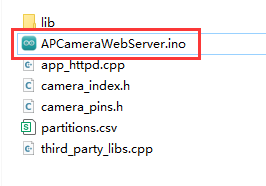

3. 选择**“ESP32S3 Dev Module”**开发板。


4. 点击菜单栏的**“工具”**，按照下图选择相应的ESP32S3的开发板配置。

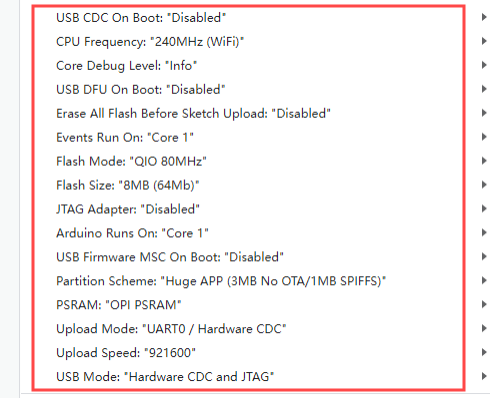

5. 最后点击将代码下载至WonderLLM内，等待烧录完成即可。


### 9.2.3 图像回传实现

1. 程序下载完成后，连接并找到WonderLLM模块产生的热点：**HW_ESP32S3CAM** 。

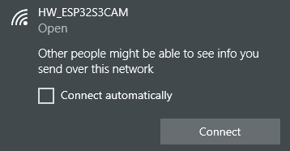

2. 在浏览器网址栏（手机、PC端浏览器皆可，我们以PC端为例子）中输入**“192.168.5.1”**后回车，在打开的页面里，点击按钮，即可进入到摄像头回传界面。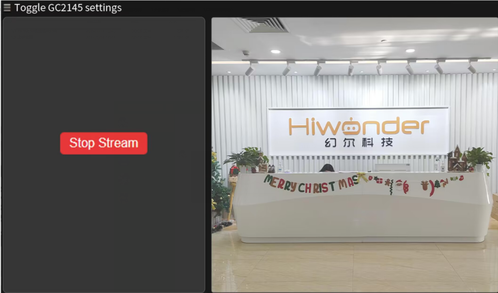

### 9.2.4 实现效果

通过连接WonderLLM视觉模块产生的热点，登录固定网址可查看摄像头实时回传画面。

### 9.2.5 程序分析

* **导入头文件**

```c
#include "camera_pins.h"
#include "lib/adafruit/Adafruit_GFX.h"
#include "lib/adafruit/Adafruit_ST7789.h"
#include <SPI.h>
```

引入了必要的头文件，包括摄像头驱动、WiFi、摄像头引脚定义、TFT屏幕驱动和SPI库。

* **宏定义**

```
#define TFT_CS   2
#define TFT_DC   1
#define TFT_RST -1   // 如果绑3.3V，就写 -1
#define TFT_BL  14
```

定义了TFT屏幕的引脚：片选（CS）、数据/命令（DC）、复位（RST）和背光（BL）

* **函数声明和全局变量**

```c
void tft_show_rgb565(const uint16_t *rgb565_buf, int width, int height);
void startCameraServer();

static Adafruit_ST7789 tft = Adafruit_ST7789(TFT_CS, TFT_DC, TFT_RST);
```

1. 声明了TFT显示函数和启动相机服务器的函数。

2. 创建了一个`Adafruit_ST7789`对象用于控制TFT屏幕。

* **WIFI配置**

```
const char* ssid = "HW_ESP32S3CAM";
const char* password = "";
IPAddress local_ip(192, 168, 5, 1);       // 设置自定义 IP 地址
IPAddress gateway(192, 168, 1, 1);        // 网关地址
IPAddress subnet(255, 255, 255, 0);       // 子网掩码
```

设置了WiFi AP的SSID和密码（密码为空），以及AP的IP地址、网关和子网掩码。

* **初始化设置**

1. 初始化串口,设置通信波特率为115200。

```c
void setup() 
{
  Serial.begin(115200);
  Serial.println();

```

2. 配置摄像头参数（引脚、时钟频率、分辨率、像素格式等）。

```c
  camera_config_t config;
  config.ledc_channel = LEDC_CHANNEL_0;
  config.ledc_timer = LEDC_TIMER_0;
  config.pin_d0 = Y2_GPIO_NUM;
  config.pin_d1 = Y3_GPIO_NUM;
  config.pin_d2 = Y4_GPIO_NUM;
  config.pin_d3 = Y5_GPIO_NUM;
  config.pin_d4 = Y6_GPIO_NUM;
  config.pin_d5 = Y7_GPIO_NUM;
  config.pin_d6 = Y8_GPIO_NUM;
  config.pin_d7 = Y9_GPIO_NUM;
  config.pin_xclk = XCLK_GPIO_NUM;
  config.pin_pclk = PCLK_GPIO_NUM;
  config.pin_vsync = VSYNC_GPIO_NUM;
  config.pin_href = HREF_GPIO_NUM;
  config.pin_sccb_sda = SIOD_GPIO_NUM;
  config.pin_sccb_scl = SIOC_GPIO_NUM;
  config.pin_pwdn = PWDN_GPIO_NUM;
  config.pin_reset = RESET_GPIO_NUM;
  config.xclk_freq_hz = 15000000;
  config.frame_size = FRAMESIZE_QVGA;
  config.pixel_format = PIXFORMAT_RGB565; // for streaming
  //config.pixel_format = PIXFORMAT_RGB565; // for face detection/recognition
  config.grab_mode = CAMERA_GRAB_WHEN_EMPTY;
  config.fb_location = CAMERA_FB_IN_PSRAM;
  config.jpeg_quality = 12;
  config.fb_count = 2;
```

3. 初始化摄像头。

```c
  // camera init
  esp_err_t err = esp_camera_init(&config);
  if (err != ESP_OK) {
    Serial.printf("Camera init failed with error 0x%x", err);
    return;
  }

  sensor_t * s = esp_camera_sensor_get();
#if defined(CAMERA_MODEL_ESP32S3_EYE)
  // s->set_vflip(s, 1);
#endif
  pinMode(TFT_BL, OUTPUT);
  digitalWrite(TFT_BL, HIGH);
```

4. 初始化SPI以及TFT屏幕。

```c
  // 初始化 SPI (必须指定SCK, MOSI引脚)
  SPI.begin(21, -1, 47);  // SCK=21, MISO=-1(不用), MOSI=47

  // 初始化屏幕（分辨率要填对）
  tft.init(240, 320);
  tft.setRotation(3);  // 旋转使坐标系为 320x240
  // 提升 SPI 时钟以提高刷新速度
  tft.setSPISpeed(80000000);
  tft.fillScreen(ST77XX_BLACK);  //填充黑色背景
```

5. 设置WiFi为AP模式，并启动AP，配置AP的IP地址。

```
  WiFi.mode(WIFI_AP);
  WiFi.softAP(ssid, password, 6, false, 4); // SSID, 密码, 信道6, 不隐藏SSID, 最大连接数4
  // WiFi.begin(ssid, password);
  WiFi.setSleep(false);
  // 配置 IP 地址
  if (!WiFi.softAPConfig(local_ip, gateway, subnet)) {
    Serial.println("Failed to configure IP");
  }
  Serial.println("WiFi AP Started");
  Serial.print("AP IP Address: ");
  Serial.println(WiFi.softAPIP()); // 输出 AP 的 IP 地址
```

* **TFT显示函数（tft_show_rgb565）**

这个函数负责将摄像头捕获的RGB565图像显示到TFT屏幕上。

1. 如果图像分辨率是240x320，而屏幕是320x240，则进行旋转和镜像处理。

```c
    if (width == 240 && height == 320 && screen_w == 320 && screen_h == 240) {
        static uint16_t *rotated = nullptr;
        static int rotated_capacity = 0;
        int rotated_pixels = screen_w * screen_h;
        if (rotated_capacity < rotated_pixels) {
            if (rotated) free(rotated);
            rotated = (uint16_t *)malloc(rotated_pixels * sizeof(uint16_t));
            rotated_capacity = rotated_pixels;
        }

        for (int y = 0; y < height; y++) {
            for (int x = 0; x < width; x++) {
                int dst_x = y;
                int dst_y = width - 1 - x;
                // **水平镜像修改**
                dst_y = screen_w - 1 - dst_y;
                rotated[dst_y * screen_w + dst_x] = work_buf[y * width + x];
            }
        }
        tft.drawRGBBitmap(0, 0, rotated, screen_w, screen_h);
        return;
    }
```

2. 如果图像分辨率与屏幕分辨率相同，则进行水平镜像后直接绘制。

```cpp
    if (width == screen_w && height == screen_h) {
        static uint16_t *mirror_buf = nullptr;
        static int mirror_capacity = 0;
        if (mirror_capacity < pixel_count) {
            if (mirror_buf) free(mirror_buf);
            mirror_buf = (uint16_t *)malloc(pixel_count * sizeof(uint16_t));
            mirror_capacity = pixel_count;
        }
        for (int y = 0; y < height; y++) {
            for (int x = 0; x < width; x++) {
                mirror_buf[y * width + x] = work_buf[y * width + (width - 1 - x)]; // 水平镜像
            }
        }
        tft.drawRGBBitmap(0, 0, mirror_buf, width, height);
        return;
    }
```

3. 其他情况则进行缩放处理（Cover模式），保持图像比例并填满屏幕，同时进行水平镜像。

```cpp
    static uint16_t *scaled = nullptr;
    static int scaled_capacity = 0;
    int scaled_pixels = screen_w * screen_h;
    if (scaled_capacity < scaled_pixels) {
        if (scaled) free(scaled);
        scaled = (uint16_t *)malloc(scaled_pixels * sizeof(uint16_t));
        scaled_capacity = scaled_pixels;
    }

    bool scale_by_width = ((int64_t)screen_w * height >= (int64_t)screen_h * width);
    if (scale_by_width) {
        int visible_src_h = (int)((int64_t)screen_h * width / screen_w);
        if (visible_src_h > height) visible_src_h = height;
        int src_y_offset = (height - visible_src_h) / 2;

        static int *y_map = nullptr;
        static int y_map_cap = 0;
        if (y_map_cap < screen_h) {
            if (y_map) free(y_map);
            y_map = (int *)malloc(screen_h * sizeof(int));
            y_map_cap = screen_h;
        }
        for (int dy = 0; dy < screen_h; dy++) {
            y_map[dy] = src_y_offset + (int)((int64_t)dy * visible_src_h / screen_h);
        }

        static int *x_map = nullptr;
        static int x_map_cap = 0;
        if (x_map_cap < screen_w) {
            if (x_map) free(x_map);
            x_map = (int *)malloc(screen_w * sizeof(int));
            x_map_cap = screen_w;
        }
        for (int dx = 0; dx < screen_w; dx++) {
            x_map[dx] = (int)((int64_t)dx * width / screen_w);
            // **水平镜像修改**
            x_map[dx] = width - 1 - x_map[dx];
        }

        for (int dy = 0; dy < screen_h; dy++) {
            int src_y = y_map[dy];
            const uint16_t *src_row = &work_buf[src_y * width];
            uint16_t *dst_row = &scaled[dy * screen_w];
            for (int dx = 0; dx < screen_w; dx++) {
                int src_x = x_map[dx];
                dst_row[dx] = src_row[src_x];
            }
        }
    } else {
        int visible_src_w = (int)((int64_t)screen_w * height / screen_h);
        if (visible_src_w > width) visible_src_w = width;
        int src_x_offset = (width - visible_src_w) / 2;

        static int *y_map = nullptr;
        static int y_map_cap = 0;
        if (y_map_cap < screen_h) {
            if (y_map) free(y_map);
            y_map = (int *)malloc(screen_h * sizeof(int));
            y_map_cap = screen_h;
        }
        for (int dy = 0; dy < screen_h; dy++) {
            y_map[dy] = (int)((int64_t)dy * height / screen_h);
        }

        static int *x_map = nullptr;
        static int x_map_cap = 0;
        if (x_map_cap < screen_w) {
            if (x_map) free(x_map);
            x_map = (int *)malloc(screen_w * sizeof(int));
            x_map_cap = screen_w;
        }
        for (int dx = 0; dx < screen_w; dx++) {
            x_map[dx] = src_x_offset + (int)((int64_t)dx * visible_src_w / screen_w);
            // **水平镜像修改**
            x_map[dx] = width - 1 - x_map[dx];
        }

        for (int dy = 0; dy < screen_h; dy++) {
            int src_y = y_map[dy];
            const uint16_t *src_row = &work_buf[src_y * width];
            uint16_t *dst_row = &scaled[dy * screen_w];
            for (int dx = 0; dx < screen_w; dx++) {
                int src_x = x_map[dx];
                dst_row[dx] = src_row[src_x];
            }
        }
    }
```

* **TFT任务（tft_task）**

在一个循环中，不断获取摄像头帧缓冲区，并调用`tft_show_rgb565()`函数将图像显示到TFT屏幕，随后释放帧缓冲区。

```
void tft_task(void *pvParameters) {
    camera_fb_t *fb = nullptr;

    while (true) {
        // 获取摄像头帧
        fb = esp_camera_fb_get();
        if (!fb) {
            Serial.println("Camera capture failed");
            vTaskDelay(100 / portTICK_PERIOD_MS);
            continue;
        }

        //显示画面
        tft_show_rgb565((const uint16_t *)fb->buf, fb->width, fb->height);

        // 释放摄像头帧
        esp_camera_fb_return(fb);

        vTaskDelay(33 / portTICK_PERIOD_MS);
    }
}
```


## 9.3 颜色识别

### 9.3.1 项目说明

本节讲解小车通过搭载的WonderLLM模块，实现识别红、蓝物块，同时控制RGB灯颜色、蜂鸣器鸣响及小车移动。

### 9.3.2 实现流程图

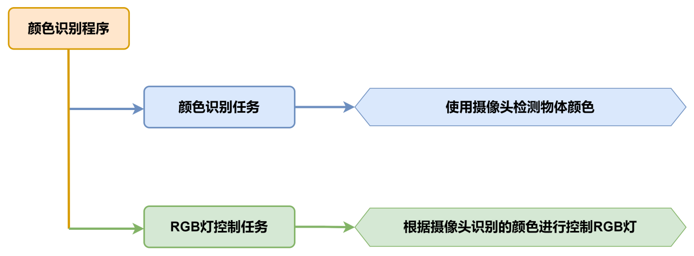

### 9.3.3 程序下载

<p id ="anther9.3.3.1"></p>

* **WonderLLM模块程序下载**

1. 使用Type-C线连接WonderLLM上方的Type-C接口。

   

2. 打开**“程序文件\WonderLLM程序\WonderLLM颜色识别程序\ColorDetection\ColorDetection.ino”**路径下的程序文件。

   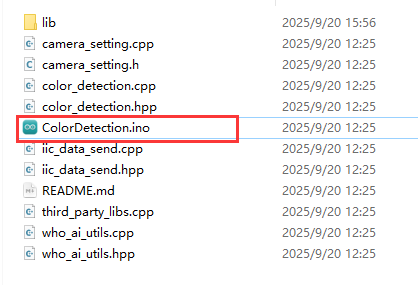

3. 选择**“ESP32S3 Dev Module”**开发板。


4. 点击菜单栏的**“工具”**，按照下图选择相应的ESP32S3的开发板配置。


5. 最后点击将代码下载至WonderLLM内，等待烧录完成即可。


* **Arduino UNO程序下载**

> [!NOTE]
>
> * **下载程序前需先将蓝牙模块取下，否则会因串口冲突导致程序下载失败。**
> * **接入Type-B下载线时请将电池盒开关拨到“OFF”挡，避免下载线误碰到扩展板的电源引脚，造成短路。**

1. 打开**“程序文件\Arduino程序\颜色识别Arduino程序\color_discrimination\color_discrimination.ino”**程序文件。


2. 将Arduino通过UNO数据线（Type-B）连接至电脑。

3. 点击**“选择开发板”**选项，软件会自动检测当前Arduino串口，点击进行连接。


4. 最后点击将代码下载至Arduino内，等待烧录完成即可。

   

   

### 9.3.4 实现效果

1. 小车识别到红色则扩展板上的RGB亮红灯，同时蜂鸣器鸣响1声，小车前后晃动。

2. 当识别到蓝色时，扩展板上的RGB亮蓝灯，同时蜂鸣器鸣响2声，小车左右晃动。 

3. 当未识别到设定的红、蓝色时，扩展板上的RGB亮白灯。

### 9.3.5 程序分析

**以下分析的程序路径为：02源码\Arduino程序\颜色识别Arduino例程\color_discrimination\color_discrimination.ino**

* **导入库函数**

导入玩法所需的RGB控制库、WonderLLM视觉模块的通信库文件。

```cpp
#include <Arduino.h>
#include "FastLED.h"
#include "hw_esp32s3cam_ctl.h"
```

* **定义引脚及创建对象**

1. 首先定义了用于一个RGB灯引脚和一个蜂鸣器引脚，定义了电机相关的引脚。

```cpp
const static uint8_t ledPin = 2;
const static uint8_t buzzerPin = 3;
const static uint8_t pwm_min = 50;
const static uint8_t motorpwmPin[4] = { 10, 9, 6, 11} ;
const static uint8_t motordirectionPin[4] = { 12, 8, 7, 13};
```

2. 然后创建了RGB灯对象用于控制RGB灯的颜色；WonderLLM视觉模块对象用于与WonderLLM视觉模块进行通讯。

```
static CRGB rgbs[1];
HW_ESP32S3CAM hw_cam;                              ///< 实例化ESP32-Cam摄像头类
```

* **初始化设置**

1. 在`setup()`函数中，主要是对相关的硬件设备进行初始化。首先是串口，将其通信的波特率设置为9600以及读取数据超时时间为500ms。

```cpp
void setup() {
  // put your setup code here, to run once:
  Serial.begin(9600);
  Serial.setTimeout(500); 
```

2. 初始化RGB灯并控制RGB灯显示白色，通过`Rgb_Show(255,255,255)`设置颜色为白色并显示设置的颜色。接着初始化了电机与WonderLLM视觉模块的通讯接口。

```cpp
  FastLED.addLeds<WS2812, ledPin, RGB>(rgbs, 1);
  Rgb_Show(255,255,255);
  Motor_Init();
  hw_cam.begin(); ///<初始化与ESP32Cam通讯接口
```

3. 设置蜂鸣器的引脚为输出模式，控制蜂鸣器短鸣一声后停止。

```cpp
  pinMode(buzzerPin,OUTPUT);
  tone(buzzerPin, 1200);                                          ///< 输出音调信号的函数,频率为1200
  delay(100);
  noTone(buzzerPin);
```

* **主函数**

1) 初始化完成后，进入loop主函数，通过循环调用`hw_cam.Color_ID_Detection()`函数获取WonderLLM视觉模块识别到的颜色。
2) `hw_cam.Color_ID_Detection()`函数会访问颜色识别寄存器中的0xc5的地址空间，在这里存储7个1字节长的数据，前5个数据有效，分别对应红-黄-绿-蓝-黑五种颜色的ID（从0到4）。
3) 如果模块识别到了某种颜色，记录对应颜色ID的数据取值等于该种颜色的ID，否则取值为255。
4) 所以我们只需要检查数组各个元素的取值，若数组头元素返回的值为1则表示识别到红色，控制RGB亮红灯，同时控制小车向前后移动；

```cpp
void loop() {
  // put your main code here, to run repeatedly:
  hw_cam.Color_ID_Detection(cam_buffer, sizeof(cam_buffer));
  delay(10);
  if(cam_buffer[0] == 1) {
    Rgb_Show(0,10,0);    ///< red
    tone(buzzerPin, 1000);
    delay(100);
    noTone(buzzerPin);
    delay(100);
    Velocity_Controller( 0, 40, 0, 0);
    delay(500);
    Velocity_Controller( 180, 40, 0, 0);
    delay(500);
    Velocity_Controller( 0, 0, 0, 0);
    delay(1000);
  }
```

5. 若数组第四个元素返回的值为3则表示识别到蓝色，控制RGB亮蓝灯，同时蜂鸣器鸣响两声，再控制小车左右移动。

```cpp
  else if(cam_buffer[2] == 3) {
    Rgb_Show(0,0,10); ///< blue
    for(int i=0; i<2; i++){
      tone(buzzerPin, 1000);
      delay(100);
      noTone(buzzerPin);
      delay(100);
    }
    Velocity_Controller( 90, 40, 0, 0);
    delay(500);
    Velocity_Controller( 270, 40, 0, 0);
    delay(500);
    Velocity_Controller( 0, 0, 0, 0);
    delay(1000);
  }
  
```

6. 若未识别到红色、蓝色则控制RGB亮白灯。

```cpp
  else{
    Rgb_Show(10,10,10);
  }
```

**以下分析的程序路径为：02源码\Arduino程序\颜色识别Arduino例程\color_discrimination\hw_esp32s3cam_ctl.cpp**

* **ESP32S3视觉模块通讯函数**

通过`Color_ID_Detection()`函数，综合颜色识别，返回颜色ID数组；主程序中对颜色的条件判断就是基于这个颜色ID数组的值来进行的。

```cpp
uint16_t HW_ESP32S3CAM::Color_ID_Detection(uint8_t *buf, uint8_t buf_len)
{
    return Wire_Read_Data_Array(COLOR_DETECTION_ID_REG, buf, buf_len);
}
```

### 9.3.6 功能延伸

这里以修改WonderLLM识别到的颜色来进行说明。具体修改内容可参考下面步骤：

1. 打开本文档同路径下的“**2.软件工具\颜色阈值调整工具\Color Threshold Tool.exe**”文件.


2. 点击选择图像，选择需要导入的图像文件。


3. 拉动滑动条，对图像进行HSV阈值分割，调整到合适的HSV阈值范围，可参考下面的颜色范围表格进行调整。

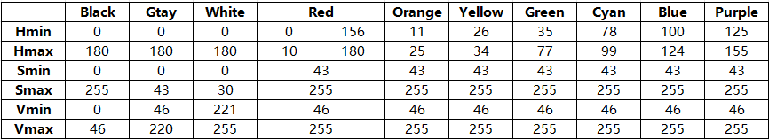

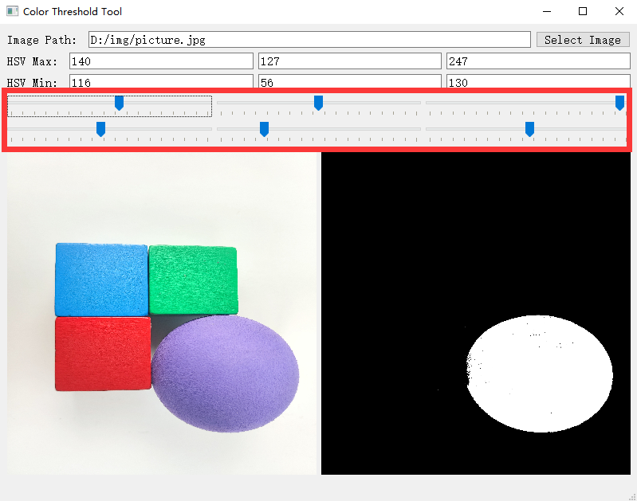

4. 然后将HSV阈值保存，打开本文档同路径下的“**程序文件\WonderLLM程序\WonderLLM颜色识别程序\ColorDetection\ColorDetection.ino**”文件，对颜色数据进行修改，更改为保存的HSV数组,最后参考“[WonderLLM模块程序下载](#_9-3-3-程序下载)”将修改好后的程序烧录进WonderLLM内。


> [!NOTE]
>
> **需要注意上述数组的元素格式与逗号分隔。**

5. 烧录完成后WonderLLM摄像头就能实现识别出其他颜色的物体。

### 9.3.7 常见问题解答

问1：摄像头识别到的颜色不准确或误识别。

答：请尽量减少背景杂色，可以使用单色背景或背景较为简单的环境。

问2：视觉模块烧录完固件后无法正确识别。

答：请检查在烧录时是否正确设置烧录地址。

## 9.4 颜色追踪

### 9.4.1 项目说明

本节通过小车搭载WonderLLM视觉模块，实现追踪红色小球，同时小车跟随小球移动方向原地转动。

### 9.4.2 实现流程图

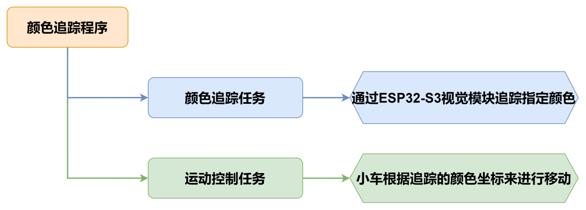

### 9.4.3 程序下载

* **WonderLLM模块程序下载**

1. 使用Type-C线连接WonderLLM上方的Type-C接口。

   

2. 打开**“程序文件\WonderLLM程序\WonderLLM颜色识别程序\ColorDetection\ColorDetection.ino”**路径下的程序文件。

   

3. 选择**“ESP32S3 Dev Module”**开发板。


4. 点击菜单栏的**“工具”**，按照下图选择相应的ESP32S3的开发板配置。


5. 最后点击将代码下载至WonderLLM内，等待烧录完成即可。


<p id ="anther11.5.3.2"></p>

* **Arduino UNO程序下载**

> [!NOTE]
>
> * **下载程序前需先将蓝牙模块取下，否则会因串口冲突导致程序下载失败。**
> * **接入Type-B下载线时请将电池盒开关拨到“OFF”挡，避免下载线误碰到扩展板的电源引脚，造成短路。**

1. 打开**“程序文件\Arduino程序\颜色追踪Arduino程序\color_tracking\color_tracking.ino”**程序文件。


2. 将Arduino通过UNO数据线（Type-B）连接至电脑。
3. 点击左侧的库管理，导入PID库文件（**如果已安装，可跳过此步骤**）。


4. 点击**“选择开发板”**选项，软件会自动检测当前Arduino串口，点击进行连接。


5. 最后点击将代码下载至Arduino内，等待烧录完成即可。


### 9.4.4 实现效果

当我们将红色小球放在WonderLLM视觉模块摄像头前移动时，小车会跟随小球移动。

### 9.4.5 程序分析

**以下分析的程序路径为：程序文件\Arduino程序\颜色追踪Arduino例程\color_tracking\color_tracking.ino**

* **导入库文件**

导入玩法所需的定时器、追踪动作、电机和视觉模块通信头文件。

```cpp
#include "MultiTimer.h"
#include "Motor.h"
#include "hw_esp32s3cam_ctl.h"
#include "track_processing.h"
```

* **定义引脚及创建对象**

首先定义了两个定时器（目前只用到了定时器1），一个视觉模块的对象实例，以及定义了两个用于控制机体运动速度、运动角度的变量、一个用于存放视觉模块视觉巡线功能寄存器的数组。

```cpp
Timers timer1;
Timers timer2;

HW_ESP32S3CAM hw_cam;

#define IMAGE_WIDTH 240
#define IMAGE_LENGTH 240


uint8_t set_speed;
uint16_t set_angle;

static uint8_t buffer[DATA_ARRAY_COUNT];
```

* **定时器回调函数timerPIDCalculateCallBack**

1) 该函数用于判断小车是否检查到目标颜色位置（通过`Red_Block_Detection`函数读取视觉模块视觉巡线功能寄存器数据），进而对小车姿态进行控制。
2) 如果检测到目标颜色，小车根据颜色中心位置与设定的目标跟踪点位置偏差进行调整自身姿态（运动角度），使得目标中心位置点落于设定目标跟踪点位置。
3) 最后开始定时器下一个周期的计时（定时器默认单次工作，通过嵌套调用timerStart的方法可以实现定时器的循环工作）。

```cpp
/* 每20ms进行位置坐标计算 */
void timerPIDCalculateCallBack(Timers *ptimer, const void *userdata)
{
  hw_cam.Red_Block_Detection(buffer, sizeof(buffer)); /* red */
  // printf("[%08ld] Timer:%p callback-> %s.\r\n", platformTicksGetFunc(), ptimer, (char*)userdata);
  Position_Controller( buffer[0], buffer[1], IMAGE_WIDTH_SIZE / 2, IMAGE_WIDTH_SIZE / 2, &set_angle, &set_speed);
  timerStart(ptimer, 20000, timerPIDCalculateCallBack, userdata);
  
}
```

* **初始化设置**

1. 在setup()函数中，主要是对相关的硬件设备进行初始化。首先是串口，将其通信的波特率设置为115200。

```cpp
void setup() {
  Serial.begin(115200);
```

2. `ticksFuncSet(ticksGetFunc)`：将系统预设的获取当前系统时间的函数ticksGetFunc绑定到platFormTicksFunction函数中，后续我们将以调用platFormTicksFunction函数的方式获取当前系统时间。

`Motors_Initialize()`：初始化电机

`hw_cam.Init()`：初始化ESP32-S3视觉模块

`Controller_Init()`：初始化机体运动控制参数的运算单元

`timerStart(&timer1, 20, timerPIDCalculateCallBack, "20ms cycle PID calculate")`：定时器1开始工作，20us后触发并调用回调函数timerPIDCalculateCallBack，将**"20ms cycle PID calculate"**作为参数传入回调函数。

```cpp
  ticksFuncSet(ticksGetFunc);
  Motors_Initialize();
  hw_cam.begin();
  Controller_Init();
  timerStart(&timer1, 20, timerPIDCalculateCallBack, "20ms cycle PID calculate");
}
```

* **循环调用子函数**

1. 初始化完成后，进入loop主函数，依次循环调用`timersTaskRunning`函数，遍历处理定时器列表中各个已经到达触发时间的定时器并执行中断函数；
2. 调用`Velocity_Controller(set_angle, set_speed, 0, SIMULATE_PWM_CONTROL)`函数控制机体运动速度。

```
void loop() {
   
  timersTaskRunning();
  Velocity_Controller(set_angle, set_speed, 0, SIMULATE_PWM_CONTROL);
}
```

**以下分析的程序路径为：程序文件\颜色追踪Arduino例程\color_tracking\MultiTimer.cpp**

* **定时器监视函数timersTaskRunning**

1) 定时器列表默认以链表的结构进行设计，我们只需要通过两个指针（pTimerList、entry），就可以实现对定时器列表的遍历和增删成员操作。
2) 可以看到，每一个定时器到达触发时间后，定时器列表就会将其视作失效，从列表中移除，因此，如果想要某个定时器反复工作，需要（在回调函数中）嵌套/多次 调用`timerStart`函数。

```cpp
int timersTaskRunning(void)
{
  //将定时器列表pTimerList（注：定时器列表内各个定时器按下一次触发时间的早晚顺序排布）的地址赋给entry   
  Timers *entry = pTimerList;
  //遍历访问定时器列表的每一个定时器
  for (; entry; entry = entry->next)
  {
    /*如果当前定时器的下一次触发时间晚于当前系统时间（排在后面的定时器
      自然也还没到下一次被触发的时间），则退出函数，结束遍历*/
    if (platFormTicksFunction() < entry->deadline)
    {
      return (int)(entry->deadline - platFormTicksFunction());
    }

    //如果当前定时器到点被触发，则先将该定时器从定时器列表中移除，再执行当前定时器的触发回调函数
    pTimerList = entry->next;
    if(entry->timersCallBack)
    {
      entry->timersCallBack(entry, entry->userdata);
    }
  }
  return 1;
}
```

**以下分析的程序路径为：程序文件\Arduino程序\颜色追踪Arduino例程\color_tracking\Motor.cpp**

* **电机初始化函数**

该函数用来初始化电机引脚,包括方向控制引脚和PWM控制引脚。并通过调用`Velocity_Controller`函数来设置小车为静止状态。

```cpp
void Motors_Initialize(void)
{
  for(uint8_t i = 0; i < 4; i++)
  {
    pinMode(motordirectionPin[i], OUTPUT);
    pinMode(motorpwmPin[i], OUTPUT);
  }
  Velocity_Controller( 0, 0, 0, SIMULATE_PWM_CONTROL);
}
```

* **机体速度控制函数**

该函数用于设置小车各轮速度，通过对小车麦克纳姆轮进行运动学分析来解算出各个轮子的速度，进而将解算后的速度变量作为`Motors_Set`函数的入口参数来设置电机转速对整体车身运动进行调整，运动学分析请参考相关资料进行学习。

```cpp
void Velocity_Controller(uint16_t angle, uint8_t velocity,int8_t rot, uint8_t mode)
{
  int16_t velocity_0, velocity_1, velocity_2, velocity_3;
  /* 速度因子 */
  float speed = 1;                                               
  /* 设定初始方向 */
  angle += 90;                                                 
  float rad = angle * PI / 180;
  if (rot == 0) speed = 1;
  else speed = 0.5; 
  velocity *= invSqrt(2);
  velocity_0 = (velocity * sin(rad) - velocity * cos(rad)) * speed + rot * speed;
  velocity_1 = (velocity * sin(rad) + velocity * cos(rad)) * speed - rot * speed;
  velocity_2 = (velocity * sin(rad) - velocity * cos(rad)) * speed - rot * speed;
  velocity_3 = (velocity * sin(rad) + velocity * cos(rad)) * speed + rot * speed;
  switch (mode)
  {
  case PWM_CONTROL:
    Motors_Set(velocity_0, velocity_1, velocity_2, velocity_3);
    break;

  case SIMULATE_PWM_CONTROL:
    _Motors_Set(velocity_0, velocity_1, velocity_2, velocity_3);
    break; 

  default:
    break;
  }
}
```

* **电机设置函数**

该函数根据传入参数的值来调整小车各个轮子的转速以及方向。在for循环中，首先根据解算后的结果对小车的转向进行调整，其次通过`map`函数将解算数值从0~100映射到pwm_min~255的范围，最后通过`digitalWrite和analogWrite`函数设置电机转向和转速。

```cpp
/* TImer1定时器PWM输出 */
static void Motors_Set(int16_t Motor_0, int16_t Motor_1, int16_t Motor_2, int16_t Motor_3)
{
  int16_t pwm_set[4];
  int16_t motors[4] = { Motor_0, Motor_1, Motor_2, Motor_3};
  /* 前进 左边轮子需置1 右边轮子需置0 */
  bool direction[4] = { 1, 0, 0, 1};                            
  for(uint8_t i; i < 4; ++i)
  {
    if(motors[i] < 0) direction[i] = !direction[i];
    else direction[i] = direction[i];

    if(motors[i] == 0) pwm_set[i] = 0;
    else pwm_set[i] = map(abs(motors[i]), 0, 100, 0, 255);

    digitalWrite(motordirectionPin[i], direction[i]); 
    analogWrite(motorpwmPin[i], pwm_set[i]); 
  }
}
```

### 9.4.6 功能延伸

1. 这里以修改ESP32-S3视觉模块识别到的颜色为例来进行说明，将原来追踪红色更改为其他颜色，这里修改为蓝色。找到代码中获取视觉模块信息的函数,将原来的`hw_cam.Red_Block_Detection()`修改为`hw_cam.Blue_Block_Detection()`，用于获取蓝色数据。

```cpp
/* 每20ms进行位置坐标计算 */
void timerPIDCalculateCallBack(Timers *ptimer, const void *userdata)
{
  hw_cam.Blue_Block_Detection(buffer, sizeof(buffer)); /* blue */
  // printf("[%08ld] Timer:%p callback-> %s.\r\n", platformTicksGetFunc(), ptimer, (char*)userdata);
  Position_Controller( buffer[0], buffer[1], IMAGE_WIDTH_SIZE / 2, IMAGE_WIDTH_SIZE / 2, &set_angle, &set_speed);
  timerStart(ptimer, 20000, timerPIDCalculateCallBack, userdata);
  
}
```

2. 修改完成后，参照“[Arduino UNO程序下载](#anther11.5.3.2)”重新下载程序，即可实现追踪蓝色。

### 9.4.7 常见问题解答

问1：摄像头识别到的颜色不准确或误识别。
答：请尽量减少背景杂色，可以使用单色背景或背景较为简单的环境。

## 9.5 视觉巡线

### 9.5.1 项目说明

本节通过小车搭载WonderLLM模块，实现识别各种颜色的宽线，随线段进行移动。

### 9.5.2 实现流程图

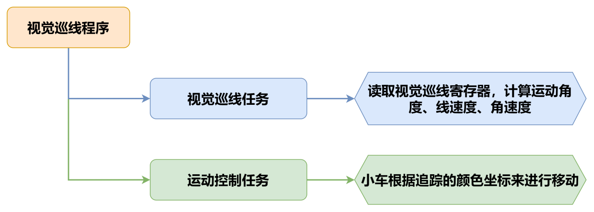


### 9.5.3 程序下载

* **WonderLLM模块程序下载**

1. 使用Type-C线连接WonderLLM上方的Type-C接口。

   

2. 打开**“程序文件\WonderLLM程序\WonderLLM视觉巡线程序\LineTracking\LineTracking.ino”**路径下的程序文件。

   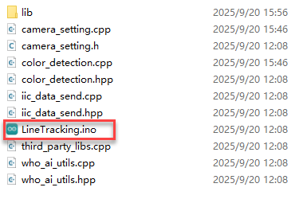

3. 选择**“ESP32S3 Dev Module”**开发板。


4. 点击菜单栏的**“工具”**，按照下图选择相应的ESP32S3的开发板配置。


5. 最后点击将代码下载至WonderLLM内，等待烧录完成即可。


<p id ="anther7.5.2.2"></p>

* **Arduino UNO程序下载**

> [!NOTE]
>
> * **下载程序前需先将蓝牙模块取下，否则会因串口冲突导致程序下载失败。**
> * **接入Type-B下载线时请将电池盒开关拨到“OFF”挡，避免下载线误碰到扩展板的电源引脚，造成短路。**

1. 打开**“程序文件\Arduino程序\视觉巡线Arduino程序\line_tracking\line_tracking.ino”**程序文件。

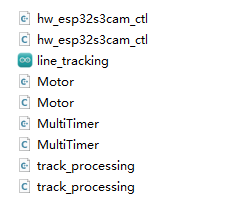

2. 将Arduino通过UNO数据线（Type-B）连接至电脑。
3. 点击左侧的库管理，导入PID库文件（**如果已安装，可跳过此步骤**）。


4. 点击**“选择开发板”**选项，软件会自动检测当前Arduino串口，点击进行连接。


5. 最后点击将代码下载至Arduino内，等待烧录完成即可。


### 9.5.4 实现效果

打开小车电源后，小车将会对各种颜色线条进行巡线移动。

### 9.5.5 程序分析

**以下分析的程序路径为：程序文件\Arduino程序\视觉巡线Arduino程序\line_tracking\line_tracking.ino**

* **导入库文件**

1. 导入玩法所需的定时器、追踪动作、电机和视觉模块通信头文件。
2. 请注意，本小节例程使用的追踪动作库文件“**9.4 颜色追踪**”的例程中使用的同名库文件，在函数实现方法上有所不同，请勿混用。

```cpp
#include "MultiTimer.h"
#include "Motor.h"
#include "hw_esp32s3cam_ctl.h"
#include "Tracking_Calculation.h"
```

* **定义引脚及创建对象**

1. 首先定义了定时器对象，舵机、视觉模块的对象实例，接着定义了坐标点变量和用于控制机体运动线速度、运动角速度、运动角度的变量。

```cpp
Timers timer1;
Timers timer2;
Timers timer3;
Timers timer4;

HW_ESP32S3CAM hw_cam;

const static uint8_t target_point = 80;

static uint16_t set_angle = 0;
static int8_t set_rot = 0;
static int8_t set_speed = 0;

static uint8_t time_count = 0;
```

2. 定义了丢线校准变量用于记录色块位置，以便在丢线时做判断处理，以及巡线坐标变量用于存储线路的坐标值。

```cpp
static uint8_t first_calibration_data;
static uint8_t second_calibration_data;
static uint8_t first_block_data[DATA_ARRAY_COUNT];
static uint8_t second_block_data[DATA_ARRAY_COUNT];
```

* **定时器回调函数timerPIDCalculateCallBack**

1) 该函数用于判断小车是否检查到目标颜色位置（通过`Region1_Red_Block_Detection()`、`Region1_Red_Block_Detection()`函数读取视觉模块视觉巡线功能寄存器数据），再对x轴的偏移量进行计算。

```cpp
/* 每20ms进行位置坐标计算 */
void timerPIDCalculateCallBack(Timers *ptimer, const void *userdata)
{
  int bias_average;
  /* 寻线坐标参数获取 */
  hw_cam.Region1_Red_Block_Detection(first_block_data, sizeof(first_block_data));
  hw_cam.Region2_Red_Block_Detection(second_block_data, sizeof(second_block_data));

  bias_average = (first_block_data[0] + second_block_data[0]) / 2;

```

2. 对识别到的颜色进行判断，若只识别到线路，那么就进行巡线，将巡线的坐标保存到变量内。

```cpp
  if(first_block_data[0] != 0 && second_block_data[0] != 0) 
  {
    set_speed = 50;
    Position_Control(&bias_average, &set_rot, &target_point);
    timerStart(ptimer, 60000, timerPIDCalculateCallBack, userdata);
    first_calibration_data = first_block_data[0];     /* 记录色块位置，丢线时做判断处理 */
    second_calibration_data = second_block_data[0];
  }
```

3. 若当前处于搬运状态下，会使小车偏离线路，此时就需要进行位置矫正，使小车回到线路上。

```cpp
  else if(first_block_data[0] == 0 || second_block_data[0] == 0)
  {
    first_calibration_data = first_block_data[0];
    second_calibration_data = second_block_data[0];
    set_speed = 0;
    set_rot = 0;
    timerStop(ptimer);
    timerStart(&timer2, 100000, timerPositionCalibrationCallBack, "60ms cycle position calibration");
  }
}
```

* **丢线回调函数timerPositionCalibrationCallBack**

1) 通过`Region1_Red_Block_Detection()`、`Region1_Red_Block_Detection()`函数获取视觉模块识别到的颜色信息。

```cpp
void timerPositionCalibrationCallBack(Timers *ptimer, const void *userdata)
{
  hw_cam.Region1_Red_Block_Detection(first_block_data, sizeof(first_block_data));
  hw_cam.Region2_Red_Block_Detection(second_block_data, sizeof(second_block_data));
```

2. 若识别到任意颜色，那么就重新启动定时器timer1,继续进行巡线。

```cpp
  if(first_block_data[0] != 0 && second_block_data[0] != 0)
  {
    timerStop(ptimer);
    timerStart(&timer1, 60000, timerPIDCalculateCallBack, userdata);
  }
```

3. 否则就执行丢线任务，对保存的色块位置进行判断，从而设置相应的线速度、角速度、运动角度，最后再重新启动丢线任务，直到重新识别到线路。

```cpp
  else
  {
    if(first_calibration_data >= 80 || second_calibration_data >= 80)
    {
      set_angle = 0;
      set_speed = 40;
      set_rot = -15;
    }
    else if(first_calibration_data < 80 || second_calibration_data < 80)
    {
      set_angle = 0;
      set_speed = 40;
      set_rot = 15;
    }
    timerStart(ptimer, 100000, timerPositionCalibrationCallBack, userdata);
  }
}
```

* **初始化设置**

1. 在`setup()`函数中，主要是对相关的硬件设备进行初始化。首先是串口，将其通信的波特率设置为115200。

```cpp
void setup() {
  Serial.begin(115200);
```

2. 对各个模块进行初始化操作，定时器`timer1`开始以20ms的时间单次计时。

(1)  `ticksFuncSet(ticksGetFunc)`：将系统预设的获取当前系统时间的函数`ticksGetFunc`绑定到`platFormTicksFunction`函数中，后续我们将以调用`platFormTicksFunction`函数的方式获取当前系统时间。

(2) `Motors_Initialize()`：初始化电机。

(3) `hw_cam.begin()`：初始化视觉模块。

(4) `Controller_Init()`：初始化机体运动控制参数的运算单元。

(5) `timerStart(&timer1, 60000, timerPIDCalculateCallBack, "60ms cycle PID calculate")`：定时器1开始工作，60ms后触发并调用回调函数`timerPIDCalculateCallBack`，将"60ms cycle PID calculate"作为参数传入回调函数。

```cpp
  ticksFuncSet(ticksGetFunc);
  Motors_Initialize();
  hw_cam.begin();
  Calculation_Init();
  timerStart(&timer1, 60000, timerPIDCalculateCallBack, "60ms cycle PID calculate");
}
```

* **循环调用子函数**

1) 初始化完成后，进入`loop`主函数，依次循环调用`timersTaskRunning`函数，遍历处理定时器列表中各个已经到达触发时间的定时器并执行中断函数；
2) 随后，调用`Velocity_Controller(set_angle, set_speed, set_rot, SIMULATE_PWM_CONTROL)`函数控制机体运动速度。

```cpp
void loop() {
  timersTaskRunning();
  Velocity_Controller(set_angle, set_speed, set_rot, SIMULATE_PWM_CONTROL);
}
```

**以下分析的程序路径为：程序文件\Arduino程序\视觉巡线Arduino程序\line_tracking\MultiTimer.cpp**

* **定时器监视函数timersTaskRunning**

1) 定时器列表默认以链表的结构进行设计，我们只需要通过两个指针（pTimerList、entry），就可以实现对定时器列表的遍历和增删成员操作。
2) 可以看到，每一个定时器到达触发时间后，定时器列表就会将其视作失效，从列表中移除，因此，如果想要某个定时器反复工作，需要（在回调函数中）嵌套/多次调用`timerStart`函数。

```cpp
int timersTaskRunning(void)
{
  Timers *entry = pTimerList;
  for (; entry; entry = entry->next)
  {
    if (platFormTicksFunction() < entry->deadline)
    {
      return (int)(entry->deadline - platFormTicksFunction());
    }
    pTimerList = entry->next;
    if(entry->timersCallBack)
    {
      entry->timersCallBack(entry, entry->userdata);
    }
  }
  return 1;
}
```

**以下分析的程序路径为：程序文件\Arduino程序\视觉巡线Arduino程序\line_tracking\Motor.cpp**

* **电机初始化函数**

该函数用来初始化电机引脚，通过在for循环来调用`pinMode`函数将电机IO口工作模式设置为输出模式。并通过调用`Velocity_Controller`函数来设置小车为静止状态。

```cpp
void Motors_Initialize(void)
{
  for(uint8_t i = 0; i < 4; i++)
  {
    pinMode(motordirectionPin[i], OUTPUT);
    pinMode(motorpwmPin[i], OUTPUT);
  }
  Velocity_Controller( 0, 0, 0, SIMULATE_PWM_CONTROL);
}
```

* **电机设置函数**

该函数根据传入参数的值来调整小车各个轮子的转速以及方向。在for循环中，首先根据解算后的结果对小车的转向进行调整，其次通过`map`函数将解算数值从0~100映射到pwm_min~255的范围，最后通过`digitalWrite`和`analogWrite`函数设置电机转向和转速。

```
static void _Motors_Set(int16_t Motor_0, int16_t Motor_1, int16_t Motor_2, int16_t Motor_3)
{
  int8_t pwm_set[4];
  int8_t motors[4] = { Motor_0, Motor_1, Motor_2, Motor_3};
  bool direction[4] = { 1, 0, 0, 1};///< 前进 左1 右0
  for(uint8_t i; i < 4; ++i) {
    if(motors[i] < 0) direction[i] = !direction[i];
    else direction[i] = direction[i];

    if(motors[i] == 0) pwm_set[i] = 0;
    else pwm_set[i] = abs(motors[i]);

    digitalWrite(motordirectionPin[i], direction[i]); 
    PWM_Out(motorpwmPin[i], pwm_set[i]);
  }
}
```

* **机体速度控制函数**

该函数用于设置小车各轮速度，通过对小车麦克纳姆轮进行运动学分析来解算出各个轮子的速度，进而将解算后的速度变量作为`Motors_Set`函数的入口参数来设置电机转速对整体车身运动进行调整，运动学分析请参考相关资料进行学习。

```
void Velocity_Controller(uint16_t angle, uint8_t velocity,int8_t rot, uint8_t mode)
{
  int16_t velocity_0, velocity_1, velocity_2, velocity_3;
  /* 速度因子 */
  float speed = 1;                                               
  /* 设定初始方向 */
  angle += 90;                                                 
  float rad = angle * PI / 180;
  if (rot == 0) speed = 1;
  else speed = 0.5; 
  velocity *= invSqrt(2);
  velocity_0 = (velocity * sin(rad) - velocity * cos(rad)) * speed + rot * speed;
  velocity_1 = (velocity * sin(rad) + velocity * cos(rad)) * speed - rot * speed;
  velocity_2 = (velocity * sin(rad) - velocity * cos(rad)) * speed - rot * speed;
  velocity_3 = (velocity * sin(rad) + velocity * cos(rad)) * speed + rot * speed;
  switch (mode)
  {
  case PWM_CONTROL:
    Motors_Set(velocity_0, velocity_1, velocity_2, velocity_3);
    break;

  case SIMULATE_PWM_CONTROL:
    _Motors_Set(velocity_0, velocity_1, velocity_2, velocity_3);
    break; 

  default:
    break;
  }
}
```

### 9.5.6 常见问题解答

问1：摄像头识别到的颜色不准确或误识别。

答：请尽量减少背景杂色，可以使用单色背景或背景较为简单的环境。

## 9.6 人脸识别

### 9.6.1 项目说明

本节通过WonderLLM视觉模块识别人脸，识别到人脸后小车晃动一下并亮绿灯表示打招呼。

### 9.6.2 实现流程图

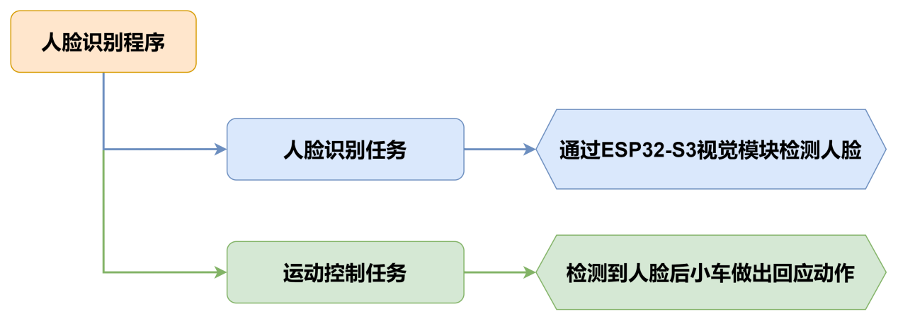

### 9.6.3 程序下载

* **WonderLLM模块程序下载**

1. 使用Type-C线连接WonderLLM上方的Type-C接口。

   

2. 打开**“程序文件\WonderLLM程序\WonderLLM人脸识别程序\FaceDetection\FaceDetection.ino”**路径下的程序文件。

   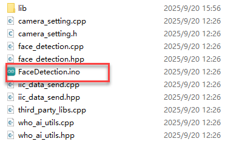

3. 选择**“ESP32S3 Dev Module”**开发板。


4. 点击菜单栏的**“工具”**，按照下图选择相应的ESP32S3的开发板配置。


5. 最后点击将代码下载至WonderLLM内，等待烧录完成即可。


<p id ="anther7.5.2.2"></p>

* **Arduino UNO程序下载**

> [!NOTE]
>
> * **下载程序前需先将蓝牙模块取下，否则会因串口冲突导致程序下载失败。**
> * **接入Type-B下载线时请将电池盒开关拨到“OFF”挡，避免下载线误碰到扩展板的电源引脚，造成短路。**

1. 打开**“程序文件\Arduino程序\人脸识别Arduino程序\esp32_face_recognition\esp32_face_recognition.ino”**程序文件。


2. 将Arduino通过UNO数据线（Type-B）连接至电脑。

3. 点击**“选择开发板”**选项，软件会自动检测当前Arduino串口，点击进行连接。


4. 最后点击将代码下载至Arduino内，等待烧录完成即可。


### 9.6.4 实现效果

打开小车电源后，扩展板上的RGB灯亮白色。当识别到人脸后，小车超声波和扩展板RGB亮绿色且车身晃动一下表示打招呼。

### 9.6.5 程序分析

* **导入库文件**

1) 导入玩法所需的定时器、追踪动作、电机和视觉模块通信头文件。
2) 请注意，本小节例程使用的追踪动作库文件与“**9.4 颜色追踪**”的例程中使用的同名库文件，在函数实现方法上有所不同，请勿混用。

```cpp
#include "FastLED.h"
#include "Ultrasound.h"
#include "hw_esp32s3cam_ctl.h"
```

* **定义引脚及创建对象**

1) 首先定义了用于连接硬件的Arduino引脚，从上到下依次为RGB引脚、蜂鸣器引脚、电机控制引脚。

```cpp
const static uint8_t ledPin = 2;
const static uint8_t buzzerPin = 3;
const static uint8_t motorpwmPin[4] = { 10, 9, 6, 11} ;
const static uint8_t motordirectionPin[4] = { 12, 8, 7, 13};
```

2. 然后定义了用于执行流程任务过程中需要的变量和常量，从上到下依次为PWM限幅常量、每个元素类型为CRGB的RGB灯静态数组、非阻塞延时函数记录变量、人脸检测开关和当前人脸检测结果。

```cpp
const static uint8_t pwm_min = 50;
static CRGB rgbs[1];
uint32_t previousTime = 0;
bool faceDetected = false;
bool detectionValue = false;
```

3. 接着实例化了WonderLLM视觉模块摄像头类和超声波类。

```cpp
HW_ESP32S3CAM hw_cam;                              ///< 实例化ESP32-Cam摄像头类
Ultrasound ultrasound;                           ///< 实例化超声波类
```

4. 最后声明了电机初始化函数、人脸检测任务函数、非延时阻塞函数、RGB灯设置函数、速度控制函数和电机控制函数。

```cpp
void Motor_Init(void);
void Facedetect_Task(void);
bool Check_Delay(uint32_t interval);
void Rgb_Show(uint8_t rValue,uint8_t gValue,uint8_t bValue);
void Velocity_Controller(uint16_t angle, uint8_t velocity,int8_t rot);
void Motors_Set(int8_t Motor_0, int8_t Motor_1, int8_t Motor_2, int8_t Motor_3);
```

* **初始化设置**

1. 在`setup()`函数中，主要是对相关的硬件设备进行初始化。首先是串口，将其通信的波特率设置为9600以及读取数据超时时间为500ms。

```cpp
void setup() {
  Serial.begin(9600);
  Serial.setTimeout(500);                        ///< 设置串行端口读取数据的超时时间
```

2. 使用`FastLED`库初始化扩展板上的RGB灯，并连接到`ledPin`引脚。通过调用`Rgb_Show`和`ultrasound.Color`函数设置灯的颜色为白色。

```cpp
  FastLED.addLeds<WS2812, ledPin, RGB>(rgbs, 1);
  Rgb_Show(10,10,10);
  ultrasound.Color( 10, 10, 10, 10, 10, 10);
```

3. 初始化与视觉模块的通信接口。

```cpp
  hw_cam.begin();  
```

4. 通过`Motor_Init`函数初始化电机工作引脚。

```cpp
  Motor_Init();
```

5. 设置蜂鸣器的引脚为输出模式，控制蜂鸣器短鸣一声后停止。

```cpp
  pinMode(buzzerPin,OUTPUT);
  tone(buzzerPin, 1200);                         ///< 输出音调信号的函数,频率为1200
  delay(100);
  noTone(buzzerPin);
}
```

* **循环调用子函数**

初始化完成后，进入`loop`主函数，依次循环调用`Facedetect_Task`函数，识别到人脸后小车晃动一下并亮绿灯表示打招呼。

```
void loop() {
  if (Check_Delay(10)) Facedetect_Task();
}
```

* **人脸识别函数Facedetect_Task**

该函数用于检测到人脸后小车执行一次响应行为，检测到人脸时，小车左右摇摆一下且RGB灯由白灯转成绿灯且将人脸检测开关打开，若没有检测到人脸时，小车RGB灯由绿灯转为白灯且将人脸检测开关关闭。

```cpp
 /* 人脸识别函数 */
void Facedetect_Task(void)
{

  hw_cam.Face_Data_Receive(cam_buffer, sizeof(cam_buffer));
  if (cam_buffer[0] != 0 || cam_buffer[1] != 0)
  {
    faceDetected = true;
  }
  else
  {
    faceDetected = false;
  }
  if (faceDetected == true)
  {
    Rgb_Show(10,0,0);  
    ultrasound.Color( 0, 10, 0, 0, 10, 0);
    Velocity_Controller(0, 0, 50); 
    delay(500);
    Velocity_Controller( 0, 0, -50);   
    delay(500); 
    Velocity_Controller( 0, 0, 0);
    faceDetected = false;                       ///< 设置标志为true，表示已经检测到人脸
  }
  else
  {
    Rgb_Show(10,10,10);  
    ultrasound.Color( 10, 10, 10, 10, 10, 10);
  }
  Serial.print(cam_buffer[0]);Serial.print(",");Serial.println(cam_buffer[1]);
}
```

* **RGB灯设置函数**

该函数用于设置扩展板上的RGB灯颜色。通过写入`rValue`、`gValue`和`bValue`至`rgbs`数组内，最后通过调用`FastLED.show()`函数来达到设置RGB灯颜色的效果。

```cpp
void Rgb_Show(uint8_t rValue,uint8_t gValue,uint8_t bValue) {
  rgbs[0].r = rValue;
  rgbs[0].g = gValue;
  rgbs[0].b = bValue;
  FastLED.show();
}
```

* **电机初始化函数**

该函数用来初始化电机引脚，通过在for循环来调用`pinMode`函数将电机IO口工作模式设置为输出模式。并通过调用`Velocity_Controller`函数来设置小车为静止状态。

```cpp
 /* 电机初始化函数 */
void Motor_Init(void){
  for(uint8_t i = 0; i < 4; i++){
    pinMode(motordirectionPin[i], OUTPUT);
  }
  Velocity_Controller( 0, 0, 0);
}
```

* **速度控制函数**

该函数用于设置小车各轮速度，通过对小车麦克纳姆轮进行运动学分析来解算出各个轮子的速度，进而将解算后的速度变量作为`Motors_Set`函数的入口参数来设置电机转速对整体车身运动进行调整，运动学分析请参考相关资料进行学习。

```cpp
void Velocity_Controller(uint16_t angle, uint8_t velocity,int8_t rot) {
  int8_t velocity_0, velocity_1, velocity_2, velocity_3;
  float speed = 1;                               ///< 速度因子
  angle += 90;                                   ///< 设定初始方向
  float rad = angle * PI / 180;
  if (rot == 0) speed = 1;
  else speed = 0.5; 
  velocity /= sqrt(2);
  velocity_0 = (velocity * sin(rad) - velocity * cos(rad)) * speed + rot * speed;
  velocity_1 = (velocity * sin(rad) + velocity * cos(rad)) * speed - rot * speed;
  velocity_2 = (velocity * sin(rad) - velocity * cos(rad)) * speed - rot * speed;
  velocity_3 = (velocity * sin(rad) + velocity * cos(rad)) * speed + rot * speed;
  Motors_Set(velocity_0, velocity_1, velocity_2, velocity_3);
}
```

* **电机设置函数**

该函数根据传入参数的值来调整小车各个轮子的转速以及方向。在for循环中，首先根据解算后的结果对小车的转向进行调整，其次通过`map`函数将解算数值从0~100映射到pwm_min~255的范围，最后通过`digitalWrite`和`analogWrite`函数设置电机转向和转速。

```cpp
void Motors_Set(int8_t Motor_0, int8_t Motor_1, int8_t Motor_2, int8_t Motor_3) {
  int8_t pwm_set[4];
  int8_t motors[4] = { Motor_0, Motor_1, Motor_2, Motor_3};
  bool direction[4] = { 1, 0, 0, 1};///< 前进 左1 右0
  for(uint8_t i; i < 4; ++i) {
    if(motors[i] < 0) direction[i] = !direction[i];
    else direction[i] = direction[i];

    if(motors[i] == 0) pwm_set[i] = 0;
    else pwm_set[i] = map(abs(motors[i]), 0, 100, pwm_min, 255);

    digitalWrite(motordirectionPin[i], direction[i]); 
    analogWrite(motorpwmPin[i], pwm_set[i]); 
  }
}
```

